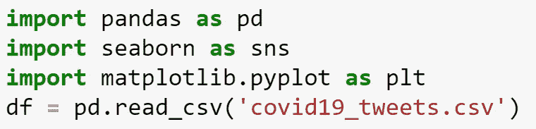
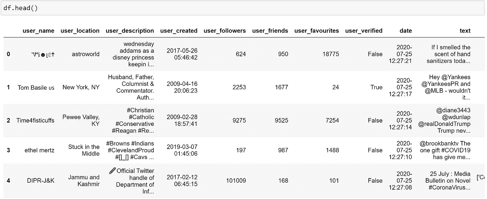
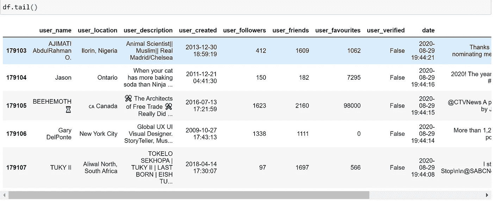
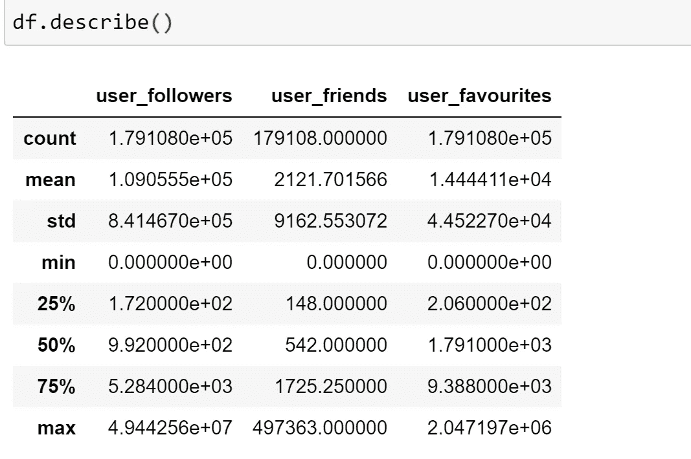
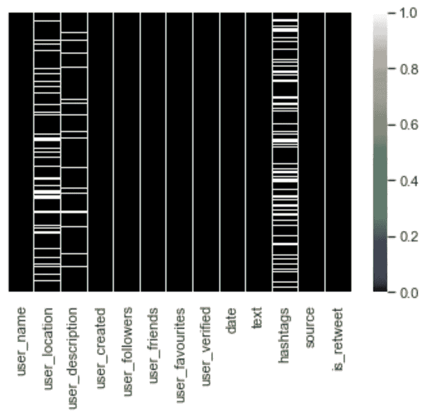
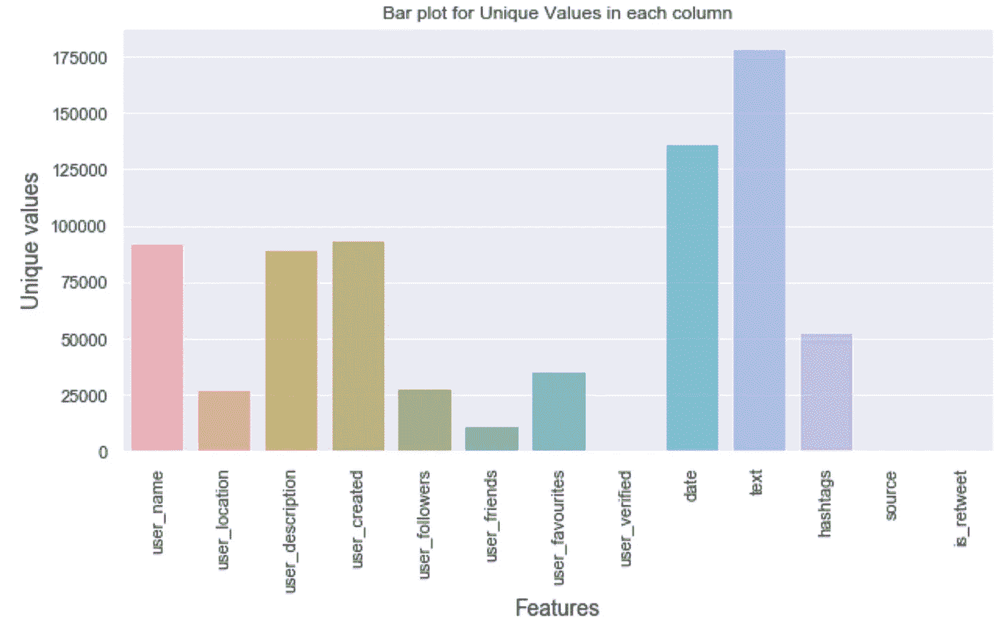
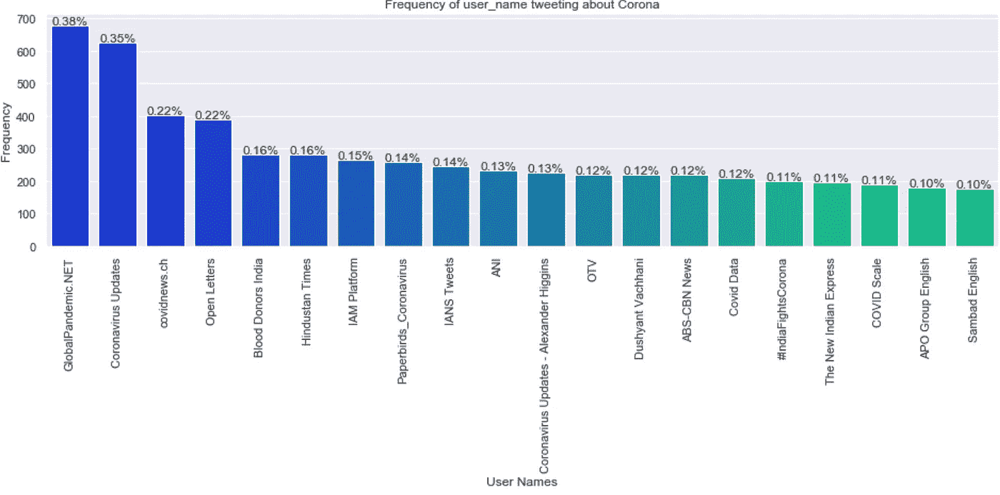
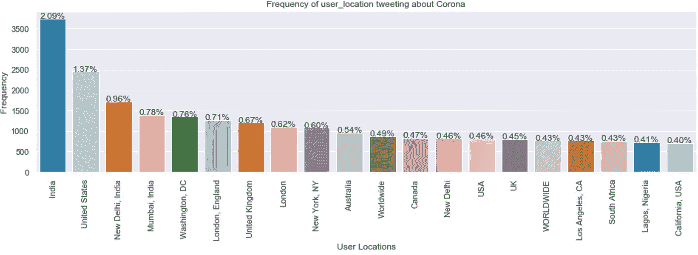
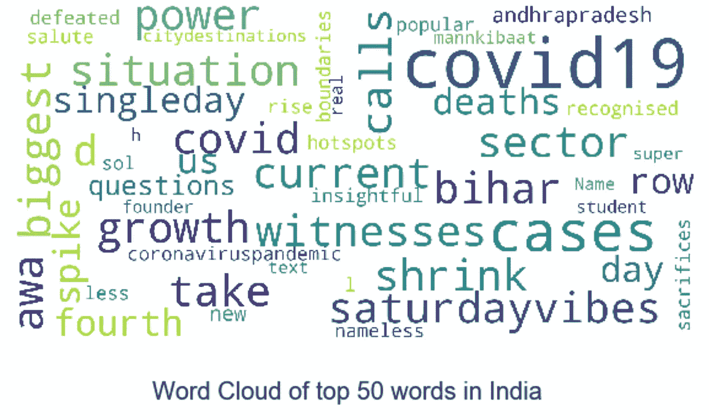

# 新冠肺炎推特上的探索性数据分析

> 原文：<https://medium.com/analytics-vidhya/exploratory-data-analysis-on-covid-19-tweets-721f94bae087?source=collection_archive---------10----------------------->

在疫情期间，社交媒体平台上充斥着大量与新冠肺炎相关的信息。今天在这篇文章中，我将向你展示一个关于 kaggle covid19-tweets 数据集的探索性数据分析。

疫情·新冠肺炎

为了执行 EDA，我使用了 kaggle 数据集- covid19_tweets.csv。

***EDA 是什么？***

EDA 代表探索性数据分析。探索性数据分析是指对数据进行初步调查的关键过程，以便发现模式，发现异常，测试假设，并借助汇总统计数据和图表检查假设。

简而言之，EDA 意味着在对数据集执行任何统计操作之前，试图弄清楚数据集的含义。EDA 就是在理解数据之前充分了解数据。

现在让我们在 covid19_tweets 数据集上执行 EDA

首先导入所有需要的库和数据集:

Python 库

通过使用 ***。头()*** 和 ***。tail()*** 函数我们可以分别查看数据集的前 5 行和后 5 行。

。head()函数

。tail()函数

要了解 DataFrame 列的统计汇总，我们使用 python 中的 ***describe()*** 函数。而要知道数据集的总行数和总列数，我们使用 ***。python 中的 shape*** 函数。

describe()函数

我们可以使用不同类型的图表，如 ***条形图、直方图、热图、散点图、箱线图*** 以及更多用于数据集可视化的图表。

对于这个数据集，我已经实现了可视化数据集中的 missing_values 和 unique_values 的代码。以下是情节:

缺失值的热图

唯一值条形图

现在我们将可视化发布与新冠肺炎相关的推文的 ***最频繁用户*** :

最频繁用户的条形图

其次，我们将可视化与新冠肺炎推文相关的*的最频繁位置:*

**

*最频繁位置的条形图*

*现在，为了真正理解人们发的推文的内容，我们需要知道这些推文中最常见的单词类型。为此，我们将不得不创建一个推文中使用最多的 50 个单词的 ***单词云*** 。我们将根据发布推文的位置制作单词云。我们将为每个地点创建一个单独的单词云。下面是一些印度热门词汇云的截图。*

**

*类似地，我们可以为数据集中提到的每个位置创建一个词云。*

*如果想在新冠肺炎推特上看看这个 EDA 的完整代码，参考有 github 库[**https://github.com/ShilpiParikh/EDA-on-COVID-19-tweets.git**](https://github.com/ShilpiParikh/EDA-on-COVID-19-tweets.git)**。***

*因此，通过使用 EDA 技术，我们可以完全了解数据集，我们可以从数据集中提取有意义的信息，还可以找出数据集中是否存在任何缺陷。*

****参考文献****

* [## 词云- COVID 19 Tweets - JMA

### 使用 Kaggle 笔记本探索和运行机器学习代码|使用 COVID19 推文中的数据

www.kaggle.com](https://www.kaggle.com/ukveteran/word-clouds-covid-19-tweets-jma)  [## COVID19 推文

### 标签为#covid19 的推文

www.kaggle.com](https://www.kaggle.com/gpreda/covid19-tweets)  [## 🦠COVID-19:情感分析和社交网络

### 使用 Kaggle 笔记本探索和运行机器学习代码|使用来自多个数据源的数据

www.kaggle.com](https://www.kaggle.com/andradaolteanu/covid-19-sentiment-analysis-social-networks)  [## 什么是探索性数据分析？

### 当我在考虑我应该开始写博客的第一个话题是什么的时候，EDA 突然出现了…

towardsdatascience.com](https://towardsdatascience.com/exploratory-data-analysis-8fc1cb20fd15)*