# 哈伯曼生存数据的探索性数据分析

> 原文：<https://medium.com/analytics-vidhya/exploratory-data-analysis-on-haberman-survival-data-78450fa0c418?source=collection_archive---------27----------------------->

# 介绍

我们将以探索的方式分析哈伯曼生存数据。在深入分析之前，理解数据是非常重要的。

该数据主要处理乳腺癌数据，并试图描述是否有任何患有癌症的患者存活超过 5 年或少于 5 年。

因此，我们将首先加载数据，并注意数据中存在的各种功能和类别，以及对数据的预期。

```
#Importing necessary packages for Analysisimport pandas as pdimport numpy as npimport matplotlib.pyplot as pltimport seaborn as snshaberman = pd.read_csv("haberman.csv")#For number of data points and featuresprint(haberman.shape)#To know about the featuresprint(haberman.columns)#To know if the datapoints is balanced or not and to segregate the patients which#Die at less than 5 years i.e denoted by "2" and who survive more than 5 years by "1"print(haberman['status'].value_counts())
```

输出:

```
(306, 4) Index([‘age’, ‘year’, ‘nodes’, ‘status’], dtype=’object’) 1 225 2 81 Name: status, dtype: int64
```

## 分析:

1.  Shape 告诉我们，数据中有 306 个数据点和 4 列
2.  此外，我们看到有四列，即年龄、年份、节点和状态，我们将简要讨论这些内容。
3.  我们还可以看到，我们需要根据我们将进一步讨论的状态对数据进行分类，可以看到状态 1 有 225 个数据点，状态 2 有 81 个数据点。因此，数据是不平衡的，因为两种状态的数据点数量相差很大。

# 特征

现在，我们将进一步讨论数据中存在的各种特征。

1.  **年龄**:这个特征告诉我们病人去做手术时的年龄。
2.  **年份**:患者接受癌症手术的年份。
3.  **淋巴结**:患者体内的淋巴结数量。我们知道淋巴结疼痛或肿胀是癌症的常见症状。
4.  **状态**:该功能将患者分为两类，存活 5 年以上的患者被归类为**状态 1** ，存活不到 5 年的患者被归类为**状态 2** 。

现在，我们将绘制年龄和节点之间的二维散点图，看看我们是否能获得任何见解。

```
haberman.plot(kind='scatter' ,x='age',y='nodes');plt.title('Scatter Plot Age vs Nodes')plt.legend("Points")plt.show()
```

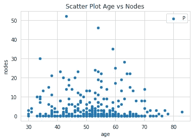

情节 1

## 分析

1.  我们可以看到年龄和节点之间的散点图很难解释并从中提取意义。
2.  因为点是重叠的，并且我们不能在状态 1 和状态 2 的患者之间分离，因为这两个点是相同的颜色。

因此，我们转向更好的图，即 SNS 图，因为 SNS 图给出了比上述 2-D 散点图更好、更生动的图。

我们再次绘制年龄和节点之间的数据，但这次我们使用 SNS 图。

# SNS(Seaborn)图

```
sns.set_style("whitegrid")sns.FacetGrid(haberman,hue="status",size=4).map(plt.scatter,"age","nodes").add_legend();plt.title('SNS Plot Age Vs Nodes')plt.legend()plt.show()
```

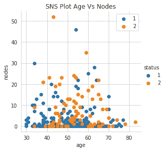

情节 2

## 分析

1.  在这里，我们可以看到图表正确地对状态 1 和状态 2 之间的数据进行了分类，但是这两个点仍然相互重叠。
2.  我们可以看到，这个图没有给出任何关于关系的具体想法，因为点是重叠和混合的，但看起来是一个很好的图。

因此，我们现在不能用这个图来模拟任何假设。

我们现在转向配对图，这将为我们提供每对特征之间的图，以进一步理解数据集并为我们的假设建模。

# 配对图

配对图给出了数据集所有特征对的图。

```
plt.close()sns.set_style("whitegrid")sns.pairplot(haberman,hue="status",height=4)plt.title('Pair Plots Between all the Features of the Data Set')plt.show()
```

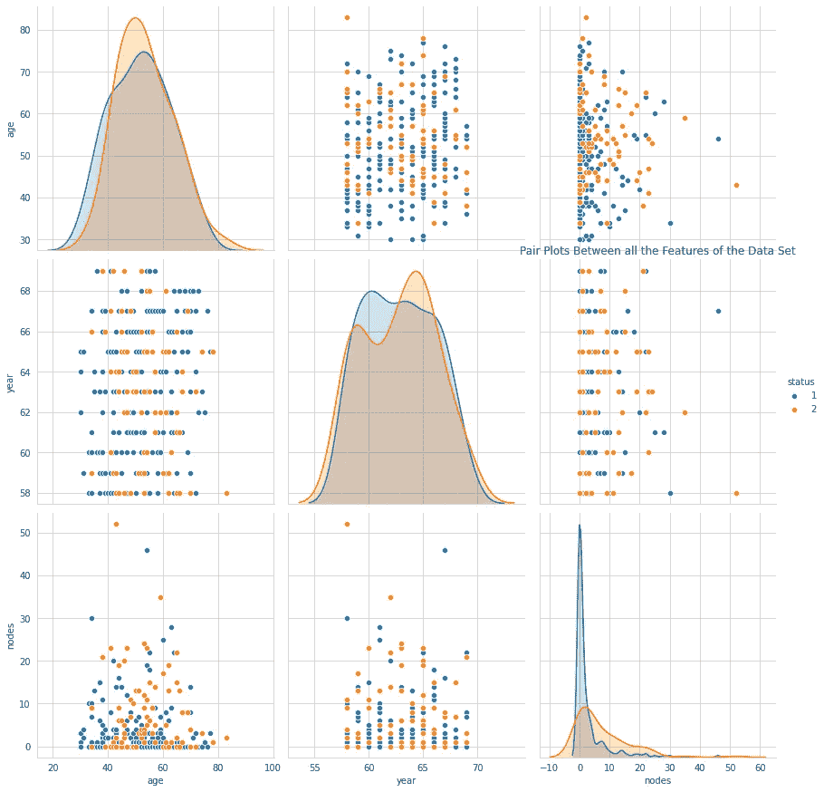

情节 3

## 分析

我们可以看到数据集中所有可能特征之间的配对图，现在我们将逐一查看所有图。

因为曲线 1、5 和 6 是曲线的直方图，我们现在不考虑它，而曲线 4、7、8 是曲线 2、3、6 的镜像(代替 x、y 轴),所以我们将只看曲线 2、3 和 6

1.  **剧情二**:我们可以看到剧情在年龄和年份之间。该图看起来重叠，状态 1 和状态 2 点相互混合，因此我们在进一步分析时不会考虑这种关系。
2.  **地块 3** :在其他两个地块 2、6 中，这个地块看起来比其他地块更好，因为在状态之间有一些隔离感。剧情在年龄和节点之间。因此，我们认为节点和年龄是我们进一步分析的重要方面。
3.  **图 6** :图 6 位于年份和节点之间，也是一个重叠图，点分散在两种状态的图形中。因此我们将不考虑这种关系。

# 一维散点图

接下来，我们将研究状态 1 和状态 2 的节点的一维散点图，并尝试推导任何假设。

```
#now plotting 1-D Scatter plots to visualize data in 1D and analyse#patienAbove = Patient who survived more than 5 years.#patientBelow = Patient who did not survive more than 5 years.patientAbove = haberman[haberman['status']==1]patientBelow = haberman[haberman['status']==2]plt.plot(patientAbove["nodes"], np.zeros_like(patientAbove['nodes']), 'o')plt.plot(patientBelow["nodes"], np.zeros_like(patientBelow['nodes']), 'r')plt.legend(['status 1','status 2'])plt.title('1-D Scatter Plot of Nodes for Status 1 and 2')plt.show()
```

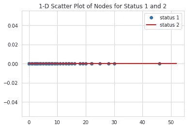

情节 4

## 分析

1.  我们可以看到，状态 1 和状态 2 的一维散点图是重叠的

很难从这个一维散点图中得出任何假设，因为这些点在很大程度上相互重叠。

此外，我们将研究与状态相关的所有三个特征的 PDF(概率分布函数)。

# 概率密度函数

以下是所有三个功能的状态的 PDF。

```
sns.FacetGrid(haberman,hue="status",height=5).map(sns.distplot,"nodes").add_legend()plt.title('DistPlot/PDF of Nodes Graph')sns.FacetGrid(haberman,hue="status",height=5).map(sns.distplot,"age").add_legend()plt.title('DistPlot/PDF of Age Graph')sns.FacetGrid(haberman,hue="status",height=5).map(sns.distplot,"year").add_legend()plt.title('DistPlot/PDF of Year Graph')
```

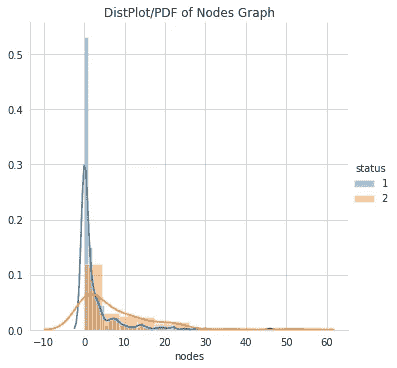

地块 5

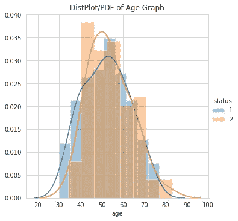

地块 6

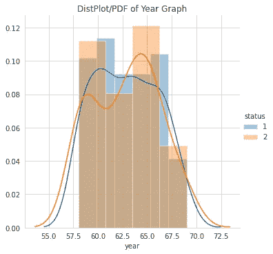

情节 7

## 分析

1.  节点图:我们可以看到，这是所有其他两个图中最好的，因为我们可以从 PDF 中观察到，节点较少的人往往会活 5 年以上，这意味着他们属于状态 1。
2.  年龄图:我们可以观察到，对于状态 1 和状态 2，35 岁和 65 岁之间的年龄几乎相互重叠，因此我们无法从 PDF 中获得任何信息。
3.  年图:我们可以看到，该图也在状态 1 和状态 2 之间重叠，我们无法从 PDF 中获得任何信息。

现在继续绘制节点图，我们将尝试推导出一个模型。

```
#Only a Model not a Codeif node<.5then(Patient Live Above 5 years)else(Patient Live Below 5 Years
```

我们可以看到，如果节点数较少，则 5 年以上存活率(状态 1)高于状态 2。

现在我们填充进一步分析 CDF(累积分布函数)并尝试推导假设。

# 累积分布函数

现在，我们将推导出在单个图中属于状态 1 和状态 2 的节点的 CDF，并推导出我们的分析。

```
counts, bin_edges = np.histogram(patientAbove["nodes"], bins=10, density = True)pdf = counts/sum(counts)print(pdf)print(bin_edges)cdf = np.cumsum(pdf)plt.title('CDF and PDF of Nodes for Status 1 and 2 Combined')plt.xlabel('Nodes')plt.ylabel('Quantity')plt.plot(bin_edges[1:],pdf)plt.plot(bin_edges[1:],cdf)counts, bin_edges = np.histogram(patientBelow["nodes"], bins=10, density = True)pdf = counts/sum(counts)print(pdf)print(bin_edges)cdf = np.cumsum(pdf)plt.plot(bin_edges[1:],pdf)plt.plot(bin_edges[1:],cdf)plt.legend(['PatientAbove_PDF', 'PatientAbove_CDF','PatientBelow_PDF', 'PatientBelow_CDF'])plt.show()
```

输出:

```
[0.83555556 0.08       0.02222222 0.02666667 0.01777778 0.00444444  0.00888889 0\.         0\.         0.00444444] [ 0\.   4.6  9.2 13.8 18.4 23\.  27.6 32.2 36.8 41.4 46\. ] [0.56790123 0.14814815 0.13580247 0.04938272 0.07407407 0\.  0.01234568 0\.         0\.         0.01234568] [ 0\.   5.2 10.4 15.6 20.8 26\.  31.2 36.4 41.6 46.8 52\. ]
```

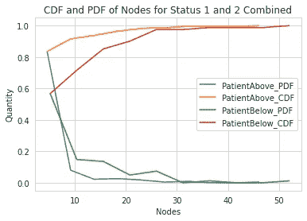

地块 8

## 分析

从图中我们可以看出

1.  82%淋巴结少于 3 个的患者存活超过 5 年。
2.  58%的淋巴结少于 3 个的患者不能存活超过 5 年
3.  我们还可以看到，如果淋巴结计数超过 35，存活时间不超过 5 年的患者百分比为 100%

由于存活患者的百分比较高，我们可以看到，如果淋巴结不太有耐心，患者往往会活得更长。

我们还可以得出结论，节点是分析哈伯曼数据的重要特征。

# 平均值、中间值和标准偏差

我们还可以计算状态 1 和状态 2 患者的节点的平均值、中值和标准差，并得出一些见解。

```
#Meanprint("Mean for the nodes are: ")print(np.mean(patientAbove["nodes"]))#print mean with an outlierprint(np.mean(np.append(patientAbove["nodes"],50)),"(with an outlier)")print(np.mean(patientBelow["nodes"]))#print Standard devitaion to know the spread of the dataprint("\nStd Dev for the nodes are: ")print(np.std(patientAbove["nodes"]))print(np.std(patientBelow["nodes"]))
```

输出:

```
Mean for the nodes are:  
2.7911111111111113 
3.0 (with an outlier) 
7.45679012345679 Std Dev for the nodes are:  
5.857258449412131 
9.128776076761632
```

## 分析

我们可以看到状态 1 患者的平均值为 2.79，状态 2 患者的平均值为 7.45

我们为状态 1 患者引入了一个高异常值，可以看到它对节点的平均值产生了很大的影响

状态 1 和状态 2 患者节点的标准偏差为 5.85 和 9.12。这告诉我们数据的分布。它显示状态 2 的患者节点比状态 1 的患者具有更高的数据分布。

我们可以说，具有 3 个或更少淋巴结患者可以存活 5 年以上，而具有 3 个以上淋巴结的患者很可能活不到 5 年。

# 中位数和 MAD(中位数绝对偏差)

我们计算相同数据的中位数和 MAD。

```
#now we go towards the medianprint("medians for the nodes are:")print(np.median(patientAbove["nodes"]))#with an outlierprint(np.median(np.append(patientAbove["nodes"],50)),"(with and outlier)")print(np.median(patientBelow["nodes"]))print("Median Absolute Deviation")from statsmodels import robustprint(robust.mad(patientAbove["nodes"]))print(robust.mad(patientBelow["nodes"]))
```

输出:

```
medians for the nodes are:
0.0 
0.0 (with and outlier) 
4.0 
Median Absolute Deviation: 
0.0 
5.930408874022408 
```

## 分析

我们可以看到，状态 1 和状态 2 的平均节点数分别为 0 和 4。

我们为状态 1 引入了一个异常值，但是仍然可以看到平均值没有改变，仍然为 0。

我们可以观察到，如果节点数为 0，则患者存活 5 年以上的可能性很高。

我们可以看到，状态 1 和状态 2 的 MAD 分别为 0 和 5.93，可以说状态 2 的传播大于状态 1。状态 2 患者节点密度高于状态 1 患者。

现在我们将计算百分位数和四分位数，以了解实际的数值。

# 百分位数和四分位数

现在，我们将计算百分位数和四分位数，以了解更多关于节点患者的信息，并根据百分位数进行一些分析。

```
print("Quantiles: ")print(np.percentile(patientAbove["nodes"],np.arange(0,100,25)))print(np.percentile(patientBelow["nodes"],np.arange(0,100,25)))print("90 Percentiles")print(np.percentile(patientAbove["nodes"],90))print(np.percentile(patientBelow["nodes"],90))
```

输出:

```
Quartiles:  
[0\. 0\. 0\. 3.] 
[ 0\.  1\.  4\. 11.] 
90 Percentiles 
8.0 
20.0
```

## 分析

我们可以得出以下分析:

1.  我们可以看到有 50%的 th 患者的状态 1 患者的淋巴结数目为 0，这意味着如果淋巴结数目为 0 或更少，则患者倾向于活 5 年以上。
2.  我们还可以看到，少于 3 个淋巴结的 75%患者也倾向于存活 3 年以上。
3.  我们也可以说，如果患者有 11 个或更多的淋巴结，75%的患者倾向于在 5 年前死亡。
4.  如果第 90 百分位患者具有少于 8 个淋巴结，则他们活得更长。
5.  如果第 90 百分位患者有超过 20 个淋巴结，则他们会早死。

第 90 百分位给了我们一个极端的例子，病人活得更长或者死得更早。

此外，我们将绘制箱线图，以查看四分位数和百分位数在图中的位置。

# 箱形图

箱线图是一种将数据的四分位数和百分位数以及晶须和异常值可视化的图。

节点的哈伯曼数据相对于状态的箱线图如下所述。

```
sns.boxplot(x="status",y="nodes",data=haberman)plt.title('Box Plot For Status 1 and Status 2')plt.show()
```

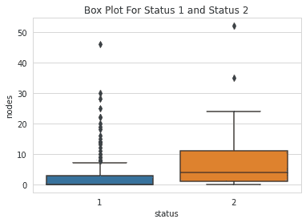

情节 9

## 分析

1.  我们可以观察到，对于状态 1 患者，第 25%和第 50%百分位相互重叠，并显示 0 个节点。
2.  我们还可以观察到，状态 1 患者节点计数的阈值为 0 到 7，而状态 2 的阈值为 0-24，这表明状态 2 患者具有更高的分布，并且状态 2 的阈值更高。
3.  我们还可以看到，状态 2 的第 50%几乎与状态 1 的第 75%重叠，这意味着有可能少数患者可能被错误地分类为状态 1 患者，而实际上他们是状态 2 患者。

# 小提琴情节

我们将绘制小提琴图，这将给我们两个世界最好的结果，即 PDF 和四分位数/百分位数。

我们可以在一个地方看到很多数据。

```
sns.violinplot(x="status",y="nodes",data=haberman)plt.title('Violin Plot for Status 1 and Status 2')plt.show()
```

## 分析

我们可以分析:

1.  首先，具有淋巴结的状态 2 患者的扩散高于状态 2 患者。
2.  我们还可以看到，如方框图所示，状态 1 患者的第 25%和第 50%重叠。
3.  我们可以看到，0 个或更少淋巴结的患者有更高的概率存活超过 5 年。
4.  我们还可以看到，状态 1 患者节点的第 50 百分位或中值为 0，状态 2 患者节点的第 50 百分位或中值为 3。
5.  状态 1 的相邻值范围为 0–7，状态 2 的相邻值范围为 0–24。

# 多元图

现在，我们将绘制一个多变量图，即等高线图，以显示年龄和节点之间的数据。

```
sns.jointplot(x="age",y="nodes",data=patientAbove,kind="kde")plt.title('Contour Plot For Status 1')sns.jointplot(x="age",y="nodes",data=patientBelow,kind="kde")plt.title('Contour Plot For Status 2')plt.show()
```

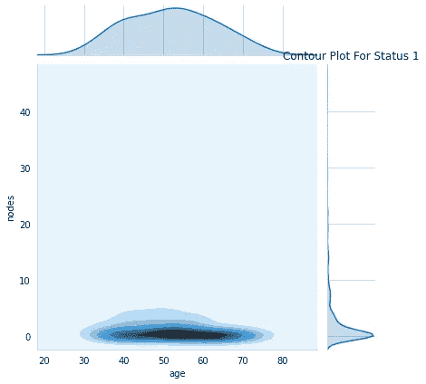

地块 11

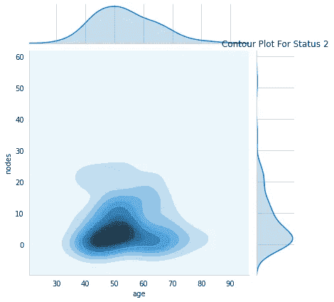

地块 12

分析:

我们可以看到对应于三维空间中山顶的黑点。

我们可以观察到暗点，对于状态 1 的患者，其节点数为 0 或更少，而状态 2 的患者的节点数略多于 3。

# 结论

我们可以得出结论，如果任何患者的节点数为 0 或小于 0，则该患者很可能会活 5 年以上，如果节点数大于 0，则该患者很可能会活不到 5 年。

# 信用

1.  applied ai([https://www.appliedaicourse.com/](https://www.appliedaicourse.com/))
2.  卡格尔(【https://www.kaggle.com/gilsousa/habermans-survival-data-set】T2
3.  谷歌(用于了解功能和情节)