# 探索性数据分析:Iris 数据集的单变量分析

> 原文：<https://medium.com/analytics-vidhya/exploratory-data-analysis-uni-variate-analysis-of-iris-data-set-690c87a5cd40?source=collection_archive---------2----------------------->

## *如何利用 Python 的 Pandas、Matplotlib、Seaborn 库对鸢尾花数据集进行数据分析和可视化。*

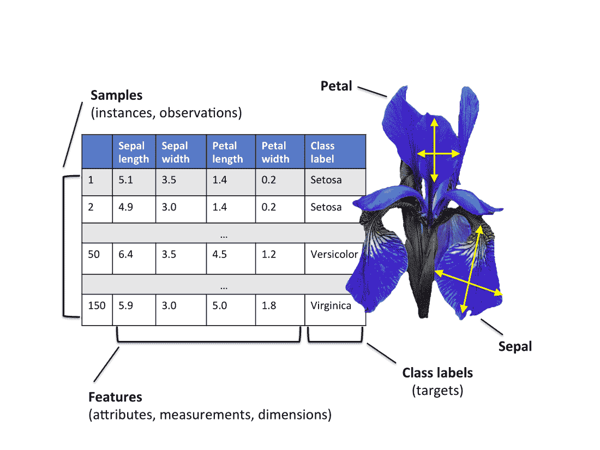

图片来源:[主成分分析](https://sebastianraschka.com/Articles/2015_pca_in_3_steps.html)作者:[塞巴斯蒂安·拉什卡](https://sebastianraschka.com/)

# **什么是探索性数据分析？**

探索性数据分析(EDA)是一种通过使用统计学和概率的简单概念来分析数据，并以易于理解的图形格式呈现结果的过程。
一句话——做数据的福尔摩斯！

## 关于虹膜数据集

鸢尾花数据集由三种鸢尾花(鸢尾、海滨鸢尾和杂色鸢尾)的 50 个样本组成。Iris flower 数据集是由英国统计学家和生物学家罗纳德·费雪在他 1936 年的论文[“分类问题中多重测量的使用”](https://rdcu.be/bQA6j)中引入的。

虹膜数据是一个多元数据集。从每个样品中测量的四个特征是——萼片长度、萼片宽度、花瓣长度和花瓣宽度，*以厘米为单位*。


鸢尾花种类

Iris 数据是公开可用的，并且是最广泛使用的数据集之一，主要由数据科学和机器学习领域的初学者使用。它由 5 个属性下的一组 150 个记录组成——萼片长度、萼片宽度、花瓣长度、花瓣宽度和类别标签(物种)。

在此下载 Iris 数据集— [加州大学欧文分校档案馆(开放资源)](https://archive.ics.uci.edu/ml/machine-learning-databases/iris/iris.data)

在机器学习术语中，观察到的特征如萼片长度、萼片宽度、花瓣长度和花瓣宽度被称为自变量，而待确定的类别标签被称为因变量。

# 我们的目标是什么？

根据萼片长度、萼片宽度、花瓣长度和花瓣宽度，将鸢尾花分为三种——刚毛鸢尾、海滨鸢尾和杂色鸢尾花。

## 基本统计分析—数据的集中趋势和分布

导入所有必要的 Python 库—

```
import pandas as pd
import seaborn as sns
import matplotlib.pyplot as plt
import numpy as np
```

虹膜数据集存储在。csv 格式。。“csv”代表逗号分隔值。更容易装载。csv 文件存储在 Pandas 数据框中，并对其执行各种分析操作。

将 Iris.csv 加载到熊猫数据框中——

```
iris = pd.read_csv(“iris.csv”)
```

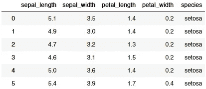

这是典型的熊猫数据框的样子

确定数据集中不同物种的平均值和中值——

```
iris.groupby('species').agg(['mean', 'median'])
```

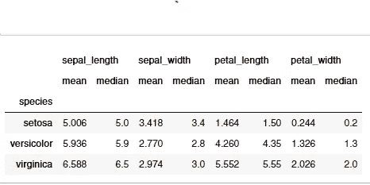

对于所有物种，其特征的平均值和中值都非常接近。这表明数据几乎是对称分布的，很少出现异常值。箱线图(稍后解释)是用于数据中异常值检测的最佳统计工具之一。

计算标准偏差—

```
iris.groupby('species').std()
```

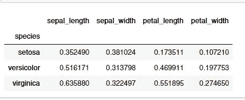

标准差(或方差)是数据围绕平均值分布有多广的指示。

# **盒子情节和小提琴情节**

## 箱形图

[箱线图](https://www.wellbeingatschool.org.nz/information-sheet/understanding-and-interpreting-box-plots)，也称为盒须图，以五个数字显示大量数据的汇总——最小值、下四分位数(第 25 个百分点)、中值(第 50 个百分点)、上四分位数(第 75 个百分点)和最大数据值。

使用 Seaborn 库绘制箱线图——

```
sns.set(style="ticks") 
plt.figure(figsize=(12,10))
plt.subplot(2,2,1)
sns.boxplot(x='species',y='sepal_length',data=iris)
plt.subplot(2,2,2)
sns.boxplot(x='species',y='sepal_width',data=iris)
plt.subplot(2,2,3)
sns.boxplot(x='species',y='petal_length',data=iris)
plt.subplot(2,2,4)
sns.boxplot(x='species',y='petal_width',data=iris)
plt.show()
```

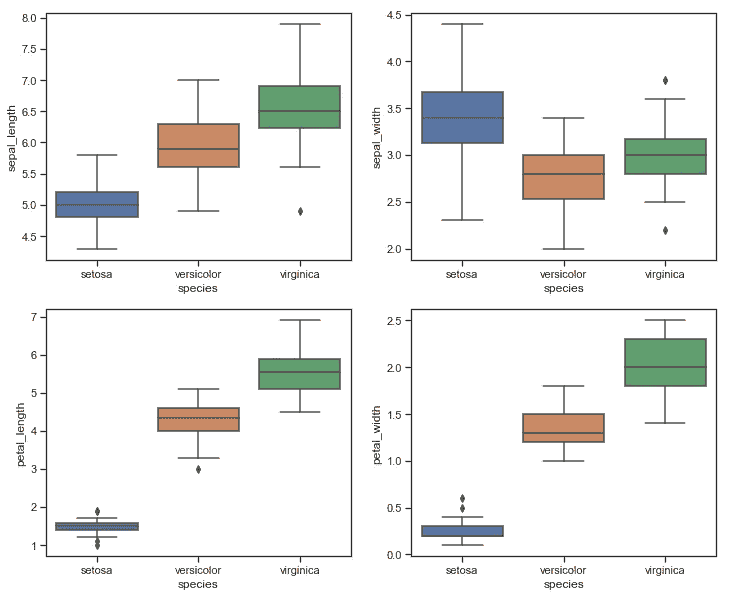

在上面的箱线图中可以看到的孤立点是数据中的异常值。因为这些数量很少，所以不会对我们的分析有任何重大影响。

## 小提琴情节

一个[小提琴剧情](https://mode.com/blog/violin-plot-examples)扮演了一个类似于盒须剧情的角色。它显示了数据在一个(或多个)分类变量(在我们的例子中是花卉物种)的几个水平上的分布，以便可以比较这些分布。与箱线图不同，在箱线图中，所有图的组成部分都对应于实际数据点，violin 图还显示了基础分布的核密度估计。

绘制小提琴图—

```
sns.set(style=”whitegrid”)
plt.figure(figsize=(12,10))
plt.subplot(2,2,1)
sns.violinplot(x=’species’,y=’sepal_length’,data=iris)
plt.subplot(2,2,2)
sns.violinplot(x=’species’,y=’sepal_width’,data=iris)
plt.subplot(2,2,3)
sns.violinplot(x=’species’,y=’petal_length’,data=iris)
plt.subplot(2,2,4)
sns.violinplot(x=’species’,y=’petal_width’,data=iris)
plt.show()
```

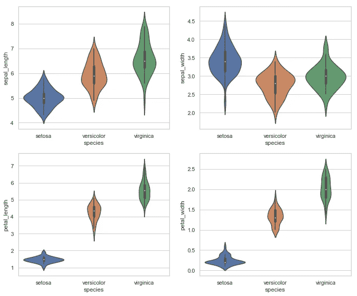

与箱线图相比，Violin 图通常信息量更大，因为 violin 图除了表示统计汇总外，还表示数据的基本分布。

# **概率密度函数(PDF) &累积分布函数(CDF)**

单变量顾名思义就是一元分析。我们的最终目标是能够根据鸢尾花的特征——萼片长度、萼片宽度、花瓣长度和花瓣宽度，正确识别鸢尾花的种类。为了区分鸢尾花的种类，四个特征中哪一个比其他变量更有用？为了回答这个问题，我们将绘制概率密度函数(PDF ),在 X 轴上将每个特征作为一个变量，在 Y 轴上绘制直方图和相应的核密度图。

在我们开始进一步分析之前，我们需要根据 3 个不同的类别标签(Setosa、Versicolor 和 Virginica)来分割数据帧。

```
iris_setosa = iris[iris[“species”] == “setosa”]

iris_versicolor = iris[iris[“species”] == “versicolor”]iris_virginica = iris[iris[“species”] == “virginica”]
```

使用 Seaborn FacetGrid 对象绘制直方图和 PDF

```
# sepal length
sns.FacetGrid(iris, hue="species", height=5) \
   .map(sns.distplot, "sepal_length") \
   .add_legend();# sepal width
sns.FacetGrid(iris, hue="species", height=5) \
   .map(sns.distplot, "sepal_width") \
   .add_legend();# petal length
sns.FacetGrid(iris, hue="species", height=5) \
   .map(sns.distplot, "petal_length") \
   .add_legend();# petal width
sns.FacetGrid(iris, hue="species", height=5) \
   .map(sns.distplot, "petal_width") \
   .add_legend();plt.show()
```

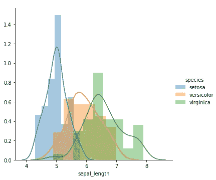

图 1 |分类特征:萼片长度

* *所有长度均以厘米为单位*。

旁边的密度图(图 1)显示，在萼片长度上，物种之间有大量的重叠，因此在我们的单变量分析中，将萼片长度作为一个独特的特征不是一个好主意。

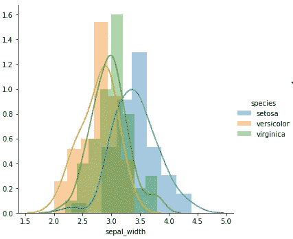

图 2 |分类特征:萼片宽度

以萼片宽度作为分类特征(图 2)，重叠甚至大于萼片长度，如上面图 1 所示。数据的传播也很高。所以，再一次，我们不能对这种花的种类做任何评论，因为它只有萼片宽度。

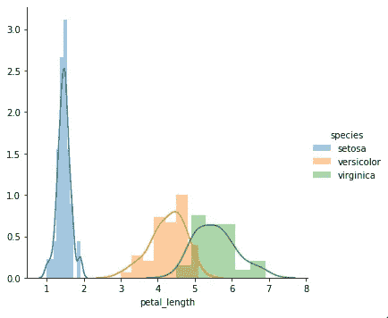

地块 3 |分类特征:花瓣长度

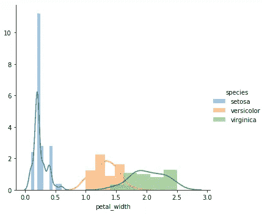

地块 4 |分类特征:花瓣宽度

从单变量分类的角度来看，花瓣长度的密度图(图 3)看起来很有希望。Setosa 物种与 Versicolor 和 Virginica 有很好的区分，虽然 Versicolor 和 Virginica 之间有一些重叠，但不像上述两个地块那样糟糕。

花瓣宽度的密度图(图 4)看起来也不错。Setosa 和 Versicolor 物种之间有轻微的交叉，而 Versicolor 和 Virginica 之间的重叠有点类似于花瓣长度的重叠(图 3)。

总之，如果我们必须选择一个特征进行分类，我们将选择花瓣长度(图 3) 来区分物种。如果我们必须选择两个特征，那么我们将选择花瓣宽度作为第二个特征，但是再一次，查看配对图(双变量和多变量分析)来确定哪两个特征在分类中最有用将是更明智的。

我们已经在上面建立了花瓣长度是如何成为区分鸢尾花种类的有用指标的。根据我们的初步调查，可以构建以下伪码—
( *注意，该估计基于从直方图*获得的核密度平滑概率分布图

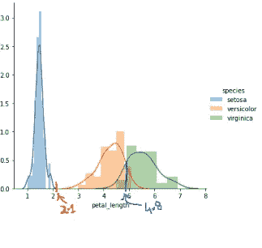

花瓣长度密度图

*如果 petal_length < 2.1
那么 SPECT = ' Setosa '*

*否则，如果花瓣长度>为 2.1，花瓣长度<为 4.8
，则 SPECT = ' Versicolor '*

*否则如果花瓣 _ 长度> 4.8
那么 SPECT =‘Virginica’*

* *所有长度单位均为厘米。*

虽然刚毛藻被清楚地分开，但是在云芝和海滨锦鸡儿物种之间有一小部分重叠。我们之所以直观地认为 4.8 分是为了区分海滨锦鸡儿和杂色花，是因为从密度图中我们可以清楚地看到，虽然不是所有的，但大多数杂色花的花瓣长度小于 4.8，而大多数海滨锦鸡儿花的花瓣长度大于 4.8。

根据这个初步分析，很有可能一些花瓣长度大于 4.8 的杂色花会被错误地归类为海滨锦鸡儿。类似地，一些花瓣长度碰巧小于 4.8 的海滨锦鸡儿花会被错误地归类为杂色花。有没有什么方法可以测量出上述分析中有多少比例或百分比的杂色花和海滨花会被错误地分类？这就是累积分布图发挥作用的地方！

## 使用累积分布函数(CDF)图来量化上述分析中错误分类的花的比例

在一个区间内，PDF 图下的面积代表随机变量在该区间内出现的概率。在我们的分析中，花瓣长度是随机变量。

数学上，CDF 是 PDF 在连续随机变量取值范围内的积分。在任意点' *x'* 评估的随机变量的 CDF 给出了随机变量取值小于或等于 *'x '的概率。*

绘制鸢尾、杂色鸢尾和海滨鸢尾花的 CDF 和 PDF，用于花瓣长度的比较分析

```
plt.figure(figsize = (15,10))# setosa
counts, bin_edges = np.histogram(iris_setosa['petal_length'],
                                 bins = 10, density = True)
pdf = counts/sum(counts)
cdf = np.cumsum(pdf)
plt.plot(bin_edges[1:], pdf, label = 'Setosa PDF')
plt.plot(bin_edges[1:], cdf, label = 'Setosa CDF')# versicolor
counts, bin_edges = np.histogram(iris_versicolor['petal_length'],
                                 bins = 10, density = True)
pdf = counts/sum(counts)
cdf = np.cumsum(pdf)
plt.plot(bin_edges[1:], pdf, label = 'Versicolor PDF')
plt.plot(bin_edges[1:], cdf, label = 'Versicolor CDF')# virginica
counts, bin_edges = np.histogram(iris_virginica['petal_length'],
                                 bins = 10, density = True)
pdf = counts/sum(counts)
cdf = np.cumsum(pdf)
plt.plot(bin_edges[1:], pdf, label = 'Virginica PDF')
plt.plot(bin_edges[1:], cdf, label = 'Virginica CDF')plt.legend()
plt.show()
```

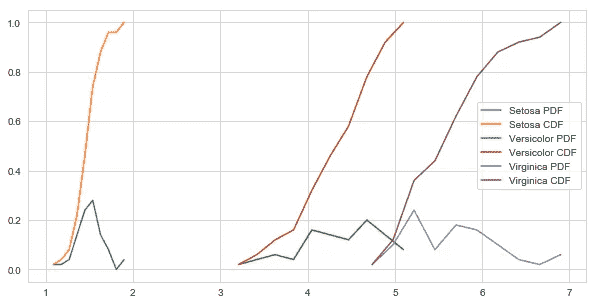

图 5 |鸢尾属花卉的 PDF 和 CDF

从上面的 CDF 图可以看出，100 %的 Setosa 花卉物种的花瓣长度小于 1.9。大约 95 %的杂色花的花瓣长度小于 5，而大约 10%的海滨锦葵的花瓣长度小于 5。因此，我们将把我们新发现的见解整合到我们以前编写的伪代码中，以构建一个简单的单变量“分类模型”。

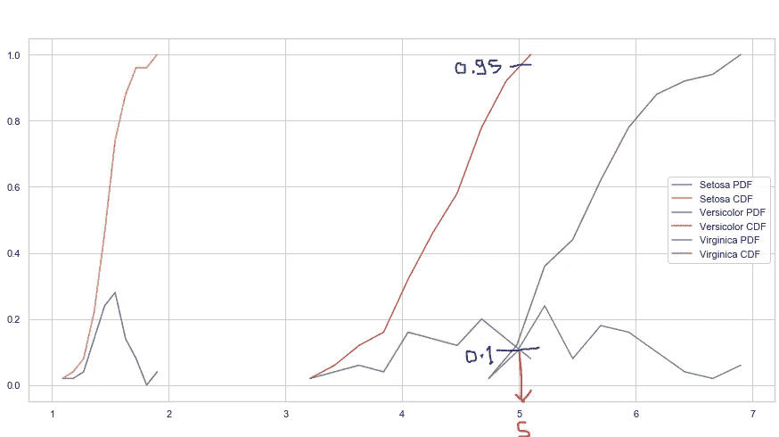

不同物种花瓣长度的累积分布图

If petal_length < 1.9
则 SPECT = ' Setosa '
(准确度= 100%)

否则，如果花瓣长度> 3.2 且花瓣长度< 5
，则 SPECT = ' Versicolor '
(准确度= 95%)…

…否则，如果花瓣长度> 5
，那么 SPECT = ' Virginica '
(准确度= 90%)

因此，通过使用累积分布图，我们对分布有了更好的了解和更强的理解，从而形成了简单的单变量分类模型。

*这都是关于单变量分析。在我随后的文章中，我对哈伯曼的生存数据集进行了全面的探索性数据分析——单变量、双变量和多变量探索性数据分析。*

[](/analytics-vidhya/exploratory-data-analysis-dissecting-habermans-breast-cancer-survival-data-set-eaca165a98cc) [## 探索性数据分析——剖析哈伯曼的乳腺癌生存数据集

### 在本文中，我们将对哈伯曼的癌症生存数据集进行全面的探索性数据分析，并得出…

medium.com](/analytics-vidhya/exploratory-data-analysis-dissecting-habermans-breast-cancer-survival-data-set-eaca165a98cc)