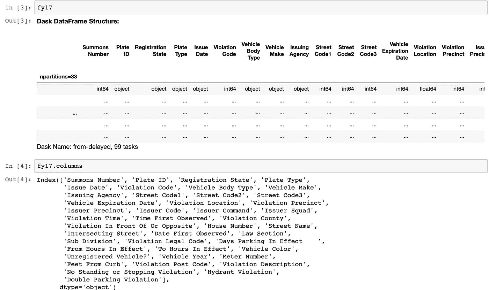
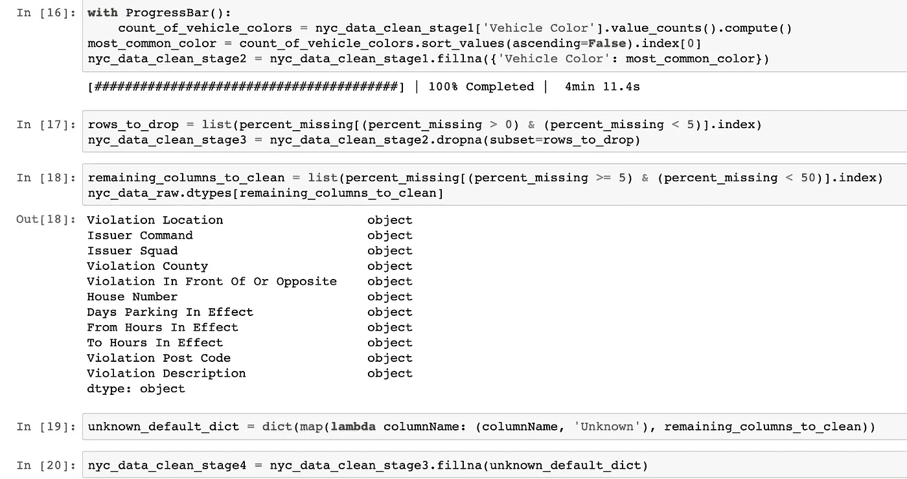

# 使用 Dask 的探索性数据分析

> 原文：<https://medium.com/analytics-vidhya/exploratory-data-analysis-using-dask-b145417c029a?source=collection_archive---------10----------------------->

第一步是下载数据集。你可以从 Kaggle 选择一个数据集，或者使用我在这篇博客中使用的数据集，它来自给定的链接[https://www.kaggle.com/new-york-city/nyc-parking-tickets](https://www.kaggle.com/new-york-city/nyc-parking-tickets)。

让我们从导入所需的库开始。

在浏览 NYC 停车罚单 zip 文件时，我们看到文件夹中有 4 个 CSV 文件。让我们一个一个地阅读它们。

让我们打印 2017 财年的前几行，并检查其列名。

在这里，我们可以看到，尽管已经打印了 2017 财年，但这些值尚未更新。数据类型是通过快速浏览每一列中的值来指定的，以后可以修改。

下一步是在单个数据帧中一起读取所有文件。这就是达斯克的妙处。

为了实现这一点，我们必须匹配不同文件中相同的列名。

当您运行它时，您将获得数据集中所有公共列的列表。

让我们在 2017 财年文件中应用这组公共列名，并检查其标题。

虽然不是必需的，但是检查每个列名的数据类型是一个很好的做法。

现在让我们在单个数据帧中读取所有 CSV 文件。

我们现在可以从 EDA 开始。

我将在这个博客中讨论 3 个难度不断增加的问题以及它们的答案。

Q1。数据集中的车辆在 2014 年购买的唯一年份总数是多少？

A1。让我们使用常见的列再次阅读 2014 年的文件，这次是为了得到答案。我们还将在这里使用进度条来计时提取过程。

如我们所见，2014 年的数据集中有 155 个独特的年份。

Q2。有多少缺失值？

我们计算缺失值占整个数据集的百分比。

上面的代码应该给出以下输出:

因此，我们可以看到该数据集中列方向缺失值的百分比。

问题已经得到了回答，但是我正在运行几行可选的额外代码来清理我们的数据。

这里，我们将删除缺失值超过 50%的列，以清理我们的数据。

最后，所有缺失的值都被删除了。

Q3。独特板块类型出现的频率是多少？

因为我们已经移除了所有缺失的值，所以我们可以获得板类型的准确频率。上面的代码产生以下输出。

我们可以在这里看到每个独特的孔板类型编号的数量。

现在，您可以尝试使用不同的变量和 Dask 操作来探索数据集。

编码快乐！:)