# 使用 Python 进行探索性数据分析

> 原文：<https://medium.com/analytics-vidhya/exploratory-data-analysis-using-python-a591beb8c027?source=collection_archive---------6----------------------->

这是机器学习问题的另一个初步步骤。探索性数据分析(EDA)不仅用于机器学习，还用于数据分析商业案例。

# 为什么选择探索性数据分析(EDA)？

👉总结数据的主要特征

👉更好地理解数据

👉揭示变量之间的关系

👉提取重要变量

假设我们想回答下面给出的问题。

*“对车价影响最大的特征是什么？”*

EDA 将帮助回答这些问题。

# 描述统计学

它描述数据集的基本特征，并获得样本和数据度量的简短摘要。

**总结分类特征** —使用 value_counts()

**可视化并比较连续变量特征和分类特征** —使用箱线图。使用箱线图，您可以很容易地发现异常值，还可以看到数据的分布和偏斜度。在下图中，我们看到后轮驱动(rwd)的价格与其他类别有很大不同。而前轮驱动(fwd)和四轮驱动(4wd)的价格几乎相同。

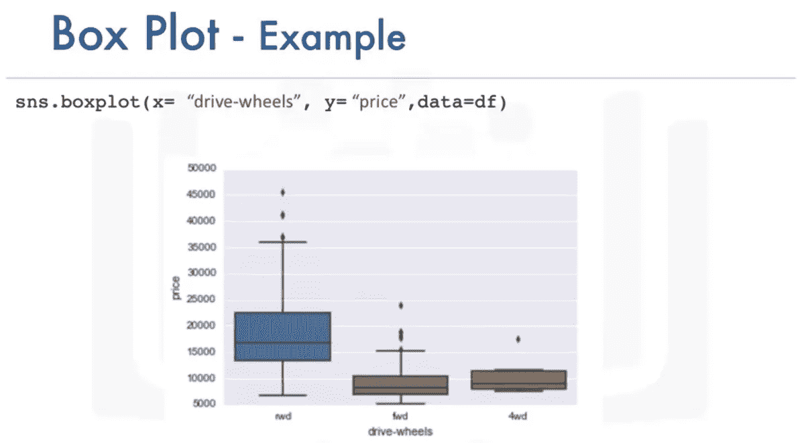

**可视化连续变量特征并与另一个连续变量特征进行比较**——使用散点图。散点图中的每个观察值都是一个点。它显示了两个变量之间的关系，通常是目标/因变量和预测值/自变量之间的关系。在下图中，我们看到 y 轴上的“价格”变量是目标变量，x 轴上的“发动机尺寸”是预测变量。随着发动机尺寸的增加，价格也会上涨，这表明这两个变量之间存在正相关关系。

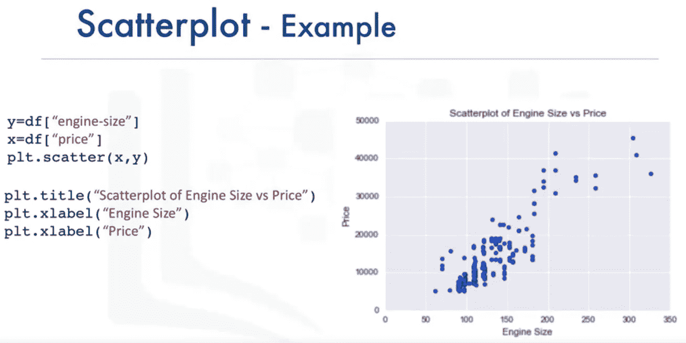

# 分组依据

它用于按不同的特征对数据进行分组，因此，它根据数据与数值特征的关系发现重要的分类特征。

1.  可以应用于分类变量
2.  将数据分类
3.  可以应用于单个或多个变量

在下图中，汽车按照它们的驱动轮和车身风格进行分组。我们看到“后轮驱动，敞篷车”和“后轮驱动，硬顶”的价格最高，而“四轮驱动，掀背车”的价格最低。

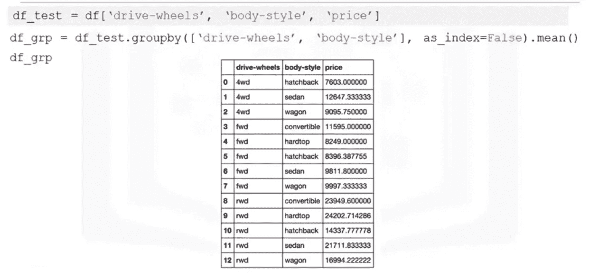

## 数据透视表

可以在数据透视表中排列数据，以获得更好的可读性。它通过在列上排列一个变量和在行上排列另一个变量来实现这一点，如下所示。

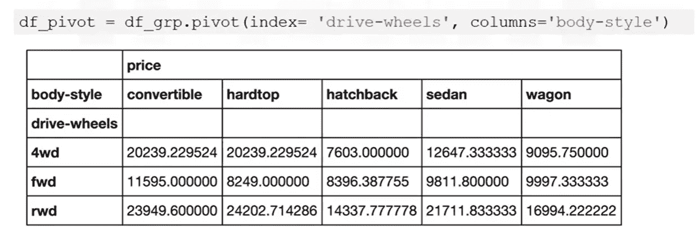

## Hea **tm** ap

它是显示多个变量之间关系的非常重要的可视化技术。

下图显示了红蓝配色方案中的前一个数据透视表。我们可以清楚地看到，“后轮驱动，敞篷车”和“后轮驱动，硬顶”的价格最高，以深蓝色显示，而“四轮驱动，掀背车”的价格最低，以深红色显示。

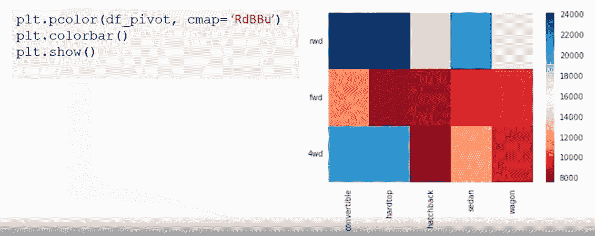

# 相互关系

这是一个统计指标，用来衡量不同变量相互依赖的程度。简而言之，如果一个变量发生变化，它如何影响其他变量。

示例:

1.  吸烟和肺癌之间有关联。吸烟越多，患肺癌的几率就越高。
2.  下雨和打伞有关联。雨下得越多，人们用伞的可能性就越大。

**正相关**:在下图中，我们看到一条沿着数据点的直线回归线，显示了两个变量发动机尺寸和价格之间的正相关关系。随着发动机尺寸的增加，价格也会上涨。我们可以说发动机的大小是价格的一个很好的预测因素。

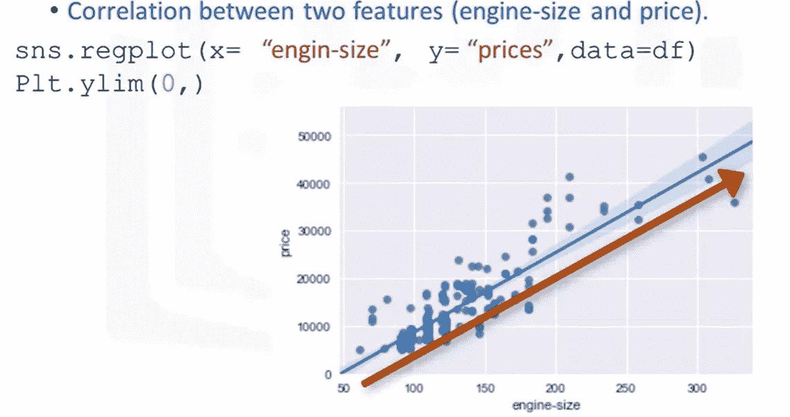

**负相关**:在下图中，我们看到一条沿着数据点的直线回归线，显示了两个变量每加仑汽油的公路里程和价格之间的负相关关系。随着公路英里数的增加，价格下降。我们可以说公路行驶里程是价格的一个很好的预测指标。

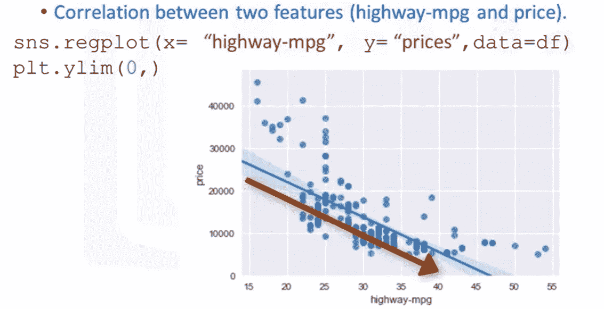

**弱相关**:有时既没有正相关，也没有负相关。在下图中，我们看到低和高峰值转速值都有高价格，它们也有低价格。我们可以说每分钟峰值转速并不是价格的一个很好的预测指标。

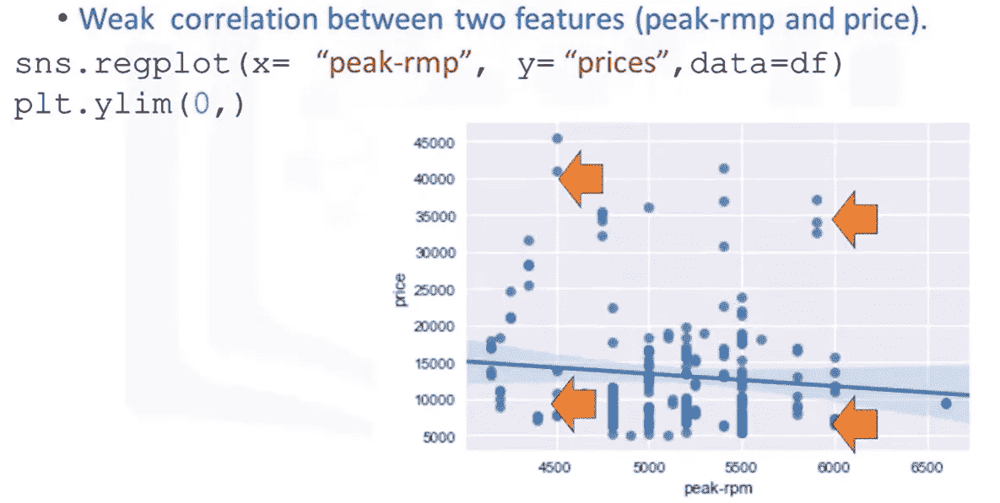

👉**相关性并不意味着因果关系**

即使吸烟和肺癌相关，我们也不能说肺癌仅仅是由吸烟引起的。或者雨伞只是因为下雨才被使用。

# **相关系数和 P 值**

建立变量之间关系的两个最常用的统计检验是相关系数和 p 值。相关系数是测试两个变量之间关系有多强的一种方法，而 p 值则告诉我们实验结果是否具有统计学意义。

1.  **相关系数**:相关系数有几种类型(如皮尔逊、肯德尔、斯皮尔曼)，但最常用的是皮尔逊相关系数。将值-1 赋给+1。接近或等于+1 的值表示两个特征之间的强正相关。接近或等于-1 的值表示两个特征之间的强负相关。而接近或等于 0 值表示非常弱或根本没有关系。
2.  P 值:它告诉我们对我们计算的相关性有多确定。p 值评估您的数据在多大程度上拒绝了[零假设](http://www.statisticshowto.com/probability-and-statistics/null-hypothesis/)，即两个比较组之间没有关系。成功地拒绝这个假设告诉你，你的结果可能具有统计学意义。这是通过指定一个显著性截止值来实现的，称为 [alpha 值](http://blog.minitab.com/blog/michelle-paret/alphas-p-values-confidence-intervals-oh-my)。Alpha 通常设置为 0.05，这意味着假设零假设为 5%，获得相同或更极端结果的概率。如果 p 值小于指定的 alpha 值，那么我们拒绝零假设。

*   值< 0.001 implies **结果中非常强的**确定性
*   重视结果中强有力的确定性
*   结果中的值< 0.1 implies **弱**确定性
*   值> 0.1 意味着**结果中完全没有**确定性

下图显示了不同相关系数的数据点。

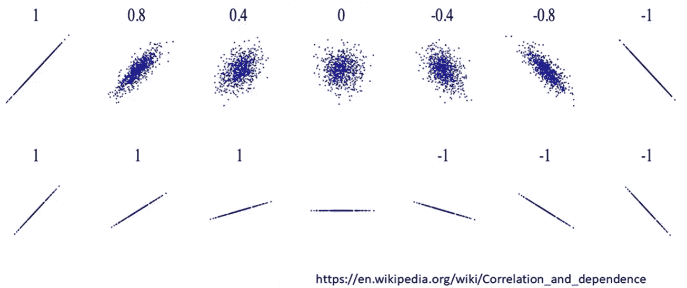

在下面的例子中，我们看到皮尔逊相关系数为 0.8，接近于 1，p 值远小于 0.001。因此，我们可以说汽车的马力和价格是密切相关的，其结果在统计学上是显著的。

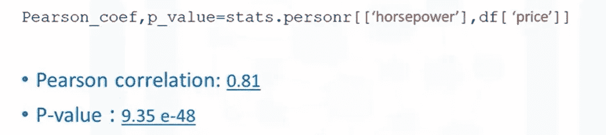

**关联热图**

我们可以使用关联热图直观显示数据帧的所有特征之间的关联。颜色方案指示皮尔逊相关系数，该系数指示两个特征之间的关系强度。我们可以忽略对角块，因为它表示一个特征与其自身的关系，默认情况下，它将是 1。

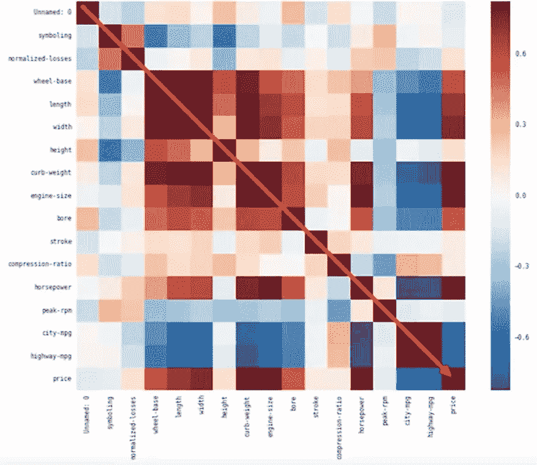

# ANOVA——方差分析

一种统计方法，将一组观察值的变化分成不同的部分

**F 检验得分**:样本组均值/平均值之间的差异除以每个样本组内的差异。

下图显示了第 1 组和第 2 组之间的差异远大于组均值之间的差异。因此，F 值将非常低，这意味着变量类别(第 1 组和第 2 组)与目标变量之间的相关性很差。

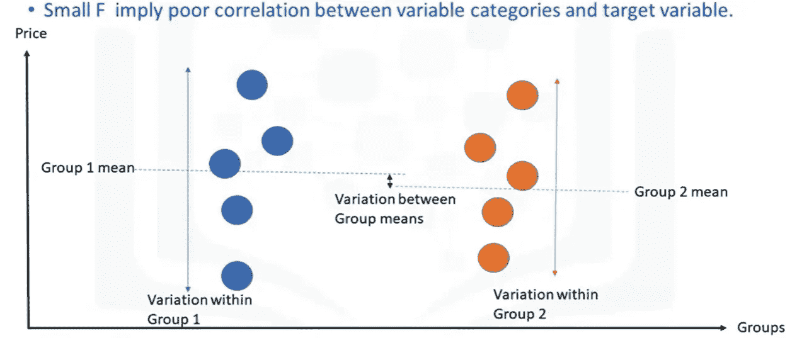

下图显示第 1 组和第 2 组的差异小于组间平均值的差异。因此，F 值将非常高，这意味着变量类别(第 1 组和第 2 组)与目标变量之间有很强的相关性。

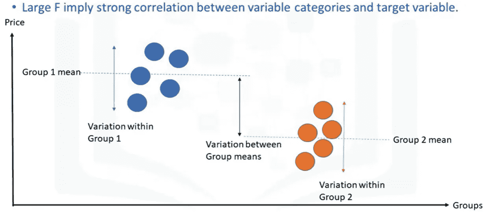

让我们看看下面的例子，其中组 1 是“本田”汽车制造商，组 2 是“斯巴鲁”。这里，F 值为 0.19，相当低，p 值也大于 0.5。

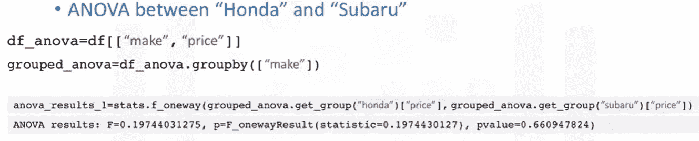

然而，在下面的例子中，组 1 是“本田”汽车制造商，组 2 是“捷豹”。这里，F 值为 0.19，相当高，p 值也小于 0.001。

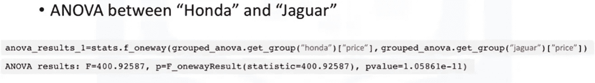

因此，ANOVA 测试预测，如果汽车型号从“本田”变为“捷豹”，价格会有巨大差异，反之亦然。然而，如果车型从“本田”换成“斯巴鲁”，价格不会有足够的变化，反之亦然。

# 参考资料:

*   Coursera 的 IBM 数据科学专业版
*   [https://data school . com/fundamentals-of-analysis/correlation-and-p-value/](https://dataschool.com/fundamentals-of-analysis/correlation-and-p-value/)