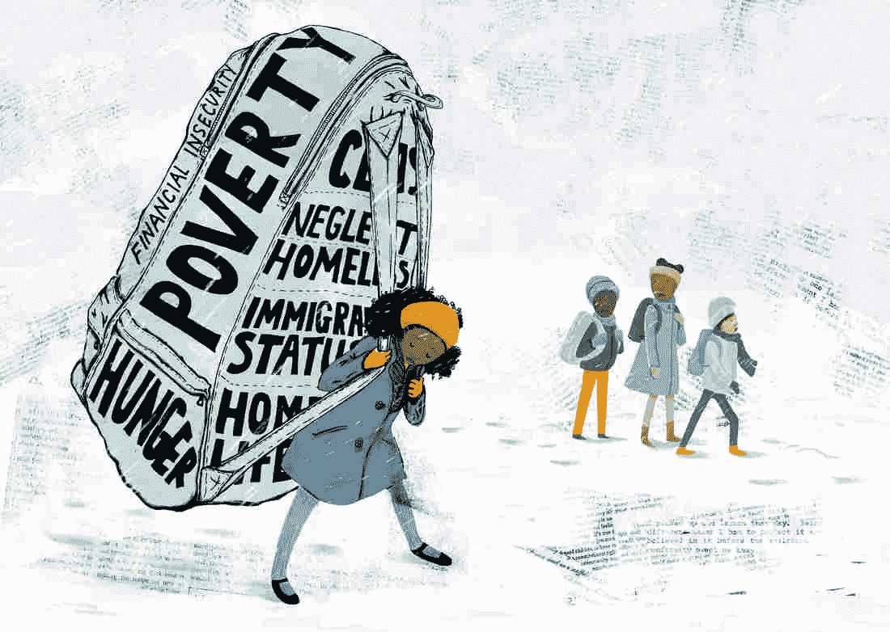

# 使用 Python 进行贫困预测的探索性数据分析

> 原文：<https://medium.com/analytics-vidhya/exploratory-data-analysis-using-python-for-poverty-predictions-5c5eb58a0940?source=collection_archive---------6----------------------->



数据分析(EDA)是一种数据分析方法，它使用各种技术(主要是可视化技术)来最大限度地提高洞察力，揭示底层结构，检查异常值，测试关于数据的假设。通俗地说，就是让数据自己说话。这就是数据科学的美妙之处，人们可以让另一个人理解复杂的东西，而不必深究技术细节。

数据集可以在[https://www.kaggle.com/johnnyyiu/predicting-poverty](https://www.kaggle.com/johnnyyiu/predicting-poverty)找到

**项目使用的工具和技能:**

**编程语言** : Python

使用的库: Matplotlib，Seaborn，Pandas，Numpy，SkLearn

**使用的模型**:集中趋势测量，多元线性回归

该项目的目标是预测七个不同国家的个人贫困概率状况。对于给定的一套社会和经济指标，贫困线被定为每天 2.50 美元。该数据基于贫困概率指数，该指数使用家庭特征、他们持有的资产以及来自 InterMedia 调查的其他金融指标来预测个人处于贫困线以下的概率。在这里，我们的前进方向是理解贫困概率和归因于贫困的因素。

使用了源文件中的两个 CSV 文件。贫困概率在第二份文件中单独给出。这与经济和社会指标文件合并在一起。接下来，我将数据集分为两部分——处于贫困线以下的概率大于或等于 0.5 的部分，以及低于贫困线的部分。对于我们的分析，它们可以被命名为可能性较小的组和可能性较大的组。

项目的第一部分是根据某些变量将其分组。其中一个来源于上一段关于个人贫困概率的预测。另一个分组是根据研究对象的年龄进行的。在对变量进行了必要的删除操作后，开始使用 Python Notebook 对其进行分析。最初，seaborn 库是为分析的图表而导入的。

该项目追踪满足特定标准的个体数量，并从数量差异中进行推断。有必要了解造成贫困概率的各种因素之间的关系，然后回答这些问题。我们希望回答一些关于样本特征的具体问题，以及他们陷入贫困的可能性有多大。一旦处理了具有空值的列，布尔值就被转换成整数以便于计算。之后，使用描述性统计和可视化构建。

回答了以下问题:

1.农村-城市/男性-女性中谁更有可能贫困？

2.文盲会导致更多的贫困吗？

3.前一年的哪一类就业导致了今年更多的预计贫困？

4.哪种职业更有可能有储蓄？

5.存钱的人哪种教育/文化水平更突出？

6.借贷导致贫困的概率更大吗？

7.年龄和贫穷有什么关系吗？

8.金融活动和贫困概率有关系吗？

Python 中的方法如下。

**导入必要的库:**

```
import pandas as pd, numpy as np
import seaborn as sns
import matplotlib.pyplot as plt
%matplotlib inline
```

**合并数据集分析贫困概率与其他因素:**

```
df1 = pd.read_csv(“train_values.csv”)
df2 = pd.read_csv(“train_labels.csv”)df = df1.merge(df2, on=’row_id’)
```

**删除包含许多空值的变量:**

```
df.isnull().sum()df.drop([‘bank_interest_rate’, ‘mm_interest_rate’, ‘mfi_interest_rate’, ‘other_fsp_interest_rate’], axis = 1)
```

**将变量类型从布尔值更改为整数:**

```
def df_converted(df, convert_from, convert_to):
 cols = df.select_dtypes(include=[convert_from]).columns
 for col in cols:
 df[col] = df[col].values.astype(convert_to)
 return dfdf = df_converted(df, np.bool, np.int64)
```

**如果概率大于或等于 0.5，则创建取值为 1 的贫困条件，否则取值为 0:**

```
df[‘Poverty_conditional’] = [1 if poverty_probability>=0.5 
 else 0 for poverty_probability in df[‘poverty_probability’]]
```

**根据定义创建年龄组:**

```
def age_grouping(data):
 age_condition = [
 (data[‘age’] < 30 ),
 (data[‘age’] >= 30) & (data[‘age’] < 45),
 (data[‘age’] >= 45) & (data[‘age’] < 60),
 (data[‘age’] >= 60)
 ]
 age_bins = [‘< 30’, ’30 to 44', ’45 to 60', ‘> 60’]
 data[‘age_group’] = np.select(age_condition, age_bins)age_grouping(df)
```

**比较农村和城市空间的个人数量:**

```
x = sns.countplot(x=”is_urban”, hue=”female”, data=df)
```

**看看农村-城市/男性-女性中谁更有可能处于贫困状态:**

```
g = sns.catplot(x=”is_urban”, hue=”female”, col=”Poverty_conditional”, data = df, kind=”count”, height=4, aspect=.7)
```

**找出识字率和贫困概率之间的数字:**

```
g = sns.countplot(x=”is_urban”, hue=”literacy”, data=df)g = sns.catplot(x=”is_urban”, hue=”literacy”, col=”Poverty_conditional”, data = df, kind=”count”, height=8, aspect=1)
```

**对个人进行分组，如果他们有任何正式或非正式的储蓄:**

```
def f(row):
if row[‘formal_savings’] == 1:
sav = 1
elif row[‘informal_savings’] == 1:
sav = 1
else:
sav = 0
return savdf[‘sav’] = df.apply(f, axis=1)
```

**找出以前的就业类别中谁更有可能陷入贫困(储蓄不同):**

```
g = sns.catplot(x=”is_urban”, hue=”employment_category_last_year”, col=”Poverty_conditional”, data = df, kind=”count”, height=10, aspect=1)g = sns.catplot(x=”is_urban”, hue=”employment_category_last_year”, col=”sav”, data = df, kind=”count”, height=10, aspect=1)
```

**教育与贫困的关系:**

```
g = sns.catplot(x=”is_urban”, hue=”education_level”, col=”sav”, data = df, kind=”count”, height=10, aspect=1)
```

**为他们是否以任何形式借款创建变量:**

```
def d(row):if row[‘borrowed_for_emergency_last_year’] == 1:
borrowed = 1
elif row[‘borrowed_for_daily_expenses_last_year’] == 1:
borrowed = 1
elif row[‘borrowed_for_home_or_biz_last_year’] == 1:
borrowed = 1
else:
borrowed = 0return borroweddf[‘borrowed’] = df.apply(d, axis=1)g = sns.catplot(x=”is_urban”, hue=”borrowed”, col=”Poverty_conditional”, data = df, kind=”count”, height=10, aspect=1)
```

**年龄与贫困的关系:**

```
g = sns.catplot(x=”is_urban”, hue=”age_group”, col=”Poverty_conditional”, data = df, kind=”count”, height=10, aspect=1)
```

**发现年龄对贫困概率的影响:**

```
from statsmodels.formula.api import olsmodel = ols(‘poverty_probability ~ age + C(female)’, data=df)
fitted_model = model.fit()
fitted_model.summary()
```

**金融活动与贫困概率的关系:**

```
num_cols = [‘age’, ‘num_financial_activities_last_year’, ‘poverty_probability’]sns.set(style=”darkgrid”)
sns.pairplot(df[num_cols])
```

**绘制关联热图:**

```
plt.figure(figsize=(15,12))
sns.heatmap(df[num_cols].corr(),annot=True,cmap=’RdBu_r’)
plt.title(“Correlation”)plt.show()
```

**以往金融活动与贫困概率的关系:**

```
num_cols = [‘age’, ‘num_financial_activities_last_year’, ‘poverty_probability’]sns.set(style=”darkgrid”)
sns.pairplot(df[num_cols])plt.figure(figsize=(5,2))
sns.heatmap(df[num_cols].corr(),annot=True,cmap=’RdBu_r’)
plt.title(“Correlation”)
plt.show()
```

作为研究的总结，我们讨论了这些陈述的答案:在数据集中，城市个体的数量几乎是农村个体的两倍。农村居民比城市居民更容易陷入贫困。对于那些不太可能陷入贫困的人来说，农村和城市的数字是相当的。在农村和城市地区，不识字的人更有可能陷入贫困。根据数据集，去年就业的个人更有可能处于贫困状态。退休人员和残疾人不太可能陷入贫困。农村家庭比城市个人更有可能拥有任何形式的正式或非正式储蓄。在储蓄者中，1.0 和 2.0 的教育水平比其他人更突出。农村文盲非常容易陷入贫困。借了款的个人，穷的概率更小。女性比男性更容易陷入贫困。年轻人更有可能处于贫困状态。此外，随着年龄的增长，金融活动的数量会减少。

对于这项研究的进一步前景，可以采用梯度推进和交叉验证的回归模型。可以部署特征工程来建立一个模型，正确预测贫困概率。当贫困预测正确时，政府和决策者可以很容易地确定目标群体。可以在他们的教育、金融工具和能力的可获得性、创收活动以及他们的社会经济意识和可能性等领域采取适当措施。