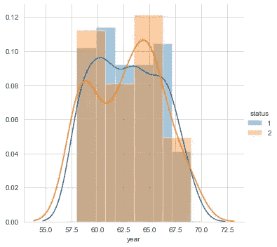

# 使用 Seaborn 进行探索性数据分析

> 原文：<https://medium.com/analytics-vidhya/exploratory-data-analysis-using-seaborn-99fec7d0bc4?source=collection_archive---------11----------------------->

Seaborn 可以是支持 matplotlib 的 Python 数据可视化库。它提供了一个高层次的界面来绘制有吸引力的和信息丰富的统计图形。

# 数据分析的目标:

根据患者的年龄、治疗年份以及阳性淋巴结的数量来预测患者是否会在 5 年后存活。

# 属性信息:

```
1\. Age of patient at time of operation (numerical)
2\. Patient's year of operation (year - 1900, numerical)
3\. Number of positive axillary nodes detected (numerical)
4\. Survival status (class attribute) 1 = the patient survived 5 years or longer 2 = the patient died within 5 years
```

# 数据描述:

```
The Haberman's survival dataset contains cases from a study that was conducted between 1958 and 1970 at the University of Chicago's Billings Hospital on the survival of patients who had undergone surgery for breast cancer.
```

# 关键特征

*   Seaborn 也是一个统计绘图库
*   它有漂亮的默认风格
*   它还被设计用于熊猫数据框对象。

# 安装和入门

要安装 seaborn 的最新版本，您可以使用 pip:

**pip 安装 seaborn**

也可以使用 conda:
将发布版本放入 conda install seaborn

**康达安装海博**

或者，您可以使用 pip 直接从 GitHub 放入事件版本:

**pip 安装 git+https://github . com/mwaskom/seaborn . git**

另一种选择是克隆 Github 库，并从您的本地副本进行安装:

pip 安装。依赖 Python 2.7 或 3.5 以上版本

# 强制依赖项

NumPy(> = 1 . 9 . 3)
scipy(>= 0 . 14 . 0)
matplotlib(>= 1 . 4 . 3)
熊猫(> = 0.15.2)

# 推荐的依赖项

统计模型(> = 0.5.0)

在[1]中:

分析所需的库

在[2]中:

使用 pandas 加载数据集

```
<bound method NDFrame.head of      age  year  nodes  status
0     30    64      1       1
1     30    62      3       1
2     30    65      0       1
3     31    59      2       1
4     31    65      4       1
..   ...   ...    ...     ...
301   75    62      1       1
302   76    67      0       1
303   77    65      3       1
304   78    65      1       2
305   83    58      2       2
```

```
[306 rows x 4 columns]>
```

# 数据准备:

```
print(cancer.info())<class 'pandas.core.frame.DataFrame'>
RangeIndex: 306 entries, 0 to 305
Data columns (total 4 columns):
 #   Column  Non-Null Count  Dtype
---  ------  --------------  -----
 0   age     306 non-null    int64
 1   year    306 non-null    int64
 2   nodes   306 non-null    int64
 3   status  306 non-null    int64
dtypes: int64(4)
memory usage: 9.7 KB
None
```

# 观察结果:

*   数据集中没有缺失值。所以不需要数据插补
*   数据类型“状态”列是一个整数。它必须被转换成绝对的

# 高级统计

```
age        year       nodes      status
count  306.000000  306.000000  306.000000  306.000000
mean    52.457516   62.852941    4.026144    1.264706
std     10.803452    3.249405    7.189654    0.441899
min     30.000000   58.000000    0.000000    1.000000
25%     44.000000   60.000000    0.000000    1.000000
50%     52.000000   63.000000    1.000000    1.000000
75%     60.750000   65.750000    4.000000    2.000000
max     83.000000   69.000000   52.000000    2.000000
```

```
target variable distribution
1    225
2     81
Name: status, dtype: int64
1    0.735294
2    0.264706
Name: status, dtype: float64
```

# 观察结果:

*   患者的年龄范围从 30 岁(最小)到 83 岁(最大),中位数为 52 岁
*   尽管观察到的最大淋巴结数目为 52，但近 75%的患者具有少于 5 个淋巴结，近 25%的患者具有 0 个淋巴结
*   数据集只包含少量数据(306 行)
*   状态栏偏向 73%的值为是，即(1)

# 二维散点图


二维散点图的输出

# 观察结果:

*   使用散点图，我们不能在这里区分太多

# 多变量分析

```
'\nPair plot in seaborn plots the scatter plot between every two data columns in a given dataframe.\nIt is used to visualize the relationship between two variables\n'
```

# 配对图


配对图的输出

# 观察结果:

*   通过散布治疗年份和阳性淋巴结之间的数据点，我们可以看到这两类之间比其他散布图更好的分离。

# 单变量分析:


> #5.1 分布图
> """
> *分布图用于直观评估数据点相对于其频率的分布情况。
> *通常情况下，数据点被分组到仓中，代表每个组的条形高度随着该组内数据点
> 数量的增加而增加。(直方图)
> *概率密度函数(PDF)是变量取值为 x 的概率。(直方图的平滑版本)
> *此处条形的高度表示相应组下数据点的百分比
> " " "



# 累积分布函数（Cumulative Distribution Function 的缩写）

# 累积分布函数（Cumulative Distribution Function 的缩写）

```
[30\.  35.3 40.6 45.9 51.2 56.5 61.8 67.1 72.4 77.7 83\. ]
[0.05228758 0.08823529 0.1503268  0.17320261 0.17973856 0.13398693
 0.13398693 0.05882353 0.02287582 0.00653595]
[58\.  59.1 60.2 61.3 62.4 63.5 64.6 65.7 66.8 67.9 69\. ]
[0.20588235 0.09150327 0.08496732 0.0751634  0.09803922 0.10130719
 0.09150327 0.09150327 0.08169935 0.07843137]
[ 0\.   5.2 10.4 15.6 20.8 26\.  31.2 36.4 41.6 46.8 52\. ]
[0.77124183 0.09803922 0.05882353 0.02614379 0.02941176 0.00653595
 0.00326797 0\.         0.00326797 0.00326797]
```


# 箱线图


# 小提琴情节


# 观察:

*   存活者的阳性淋巴结数目从 0 到 5 是高度密集的。
*   几乎 80%的患者具有少于或等于 5 个阳性淋巴结。
*   1966 年后接受治疗的病人比其他人存活的几率稍高。1959 年前接受治疗的病人比其他人存活的机会稍低。

# 结论

*   通过将数据点分散在年份和节点之间，我们可以看到这两个类别之间的分离比其他散点图更好。