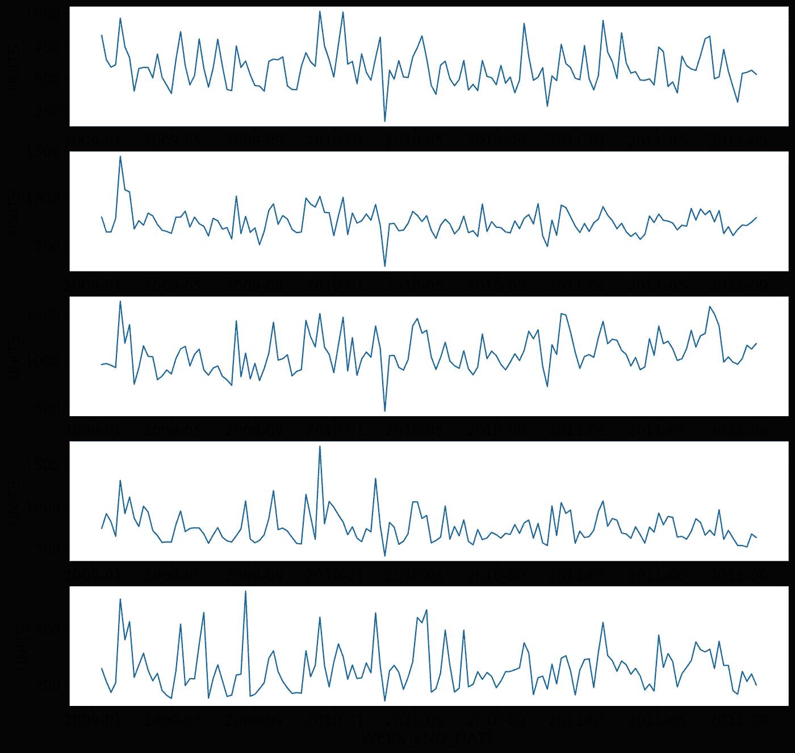
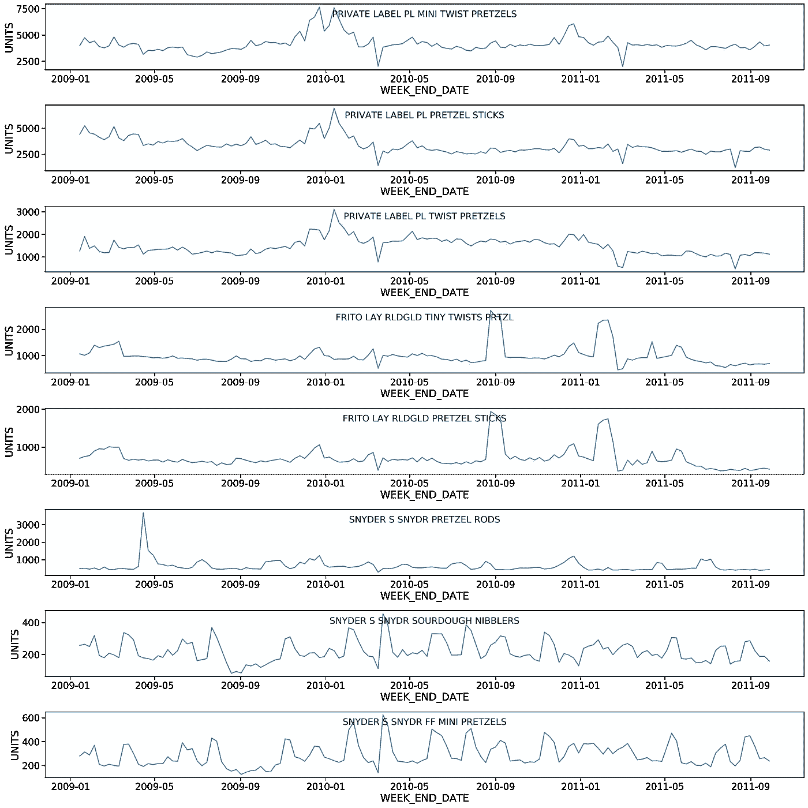
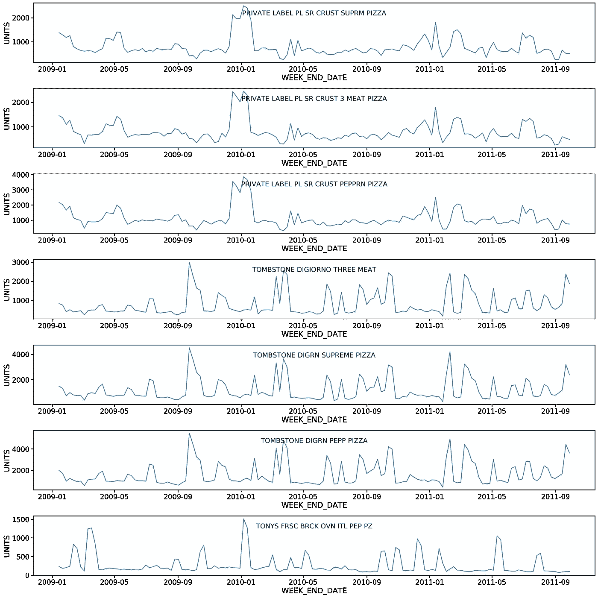
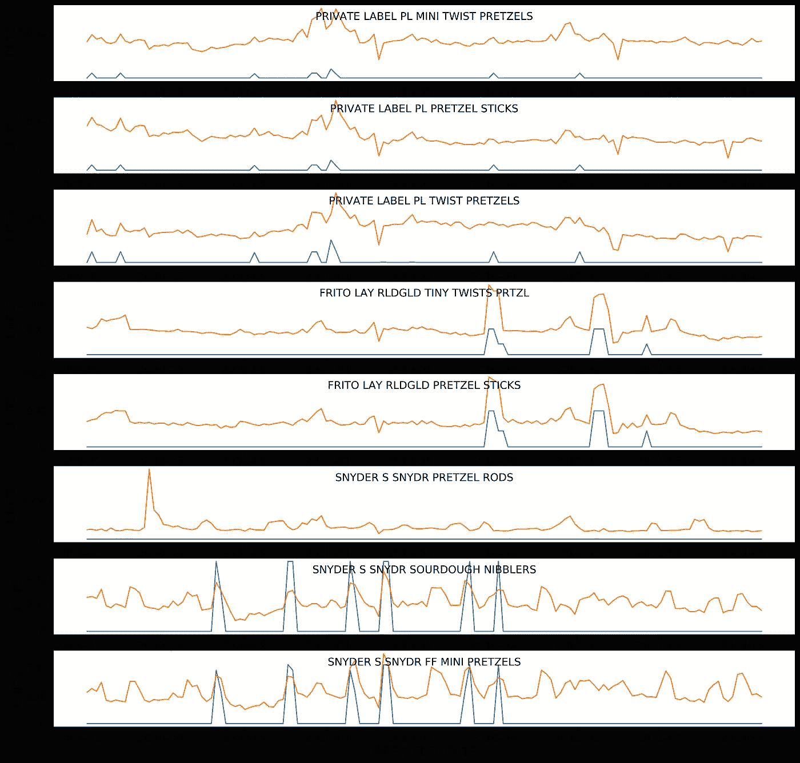
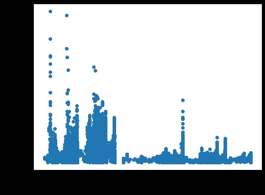
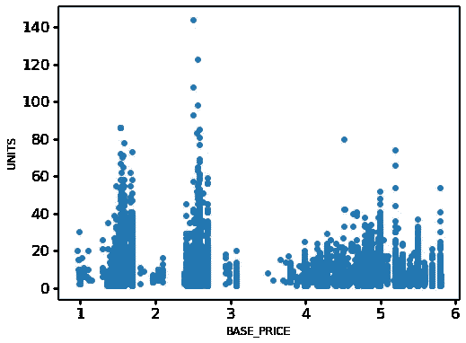
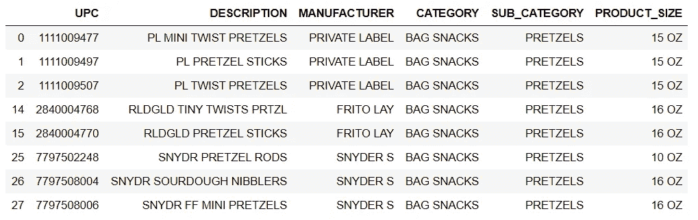
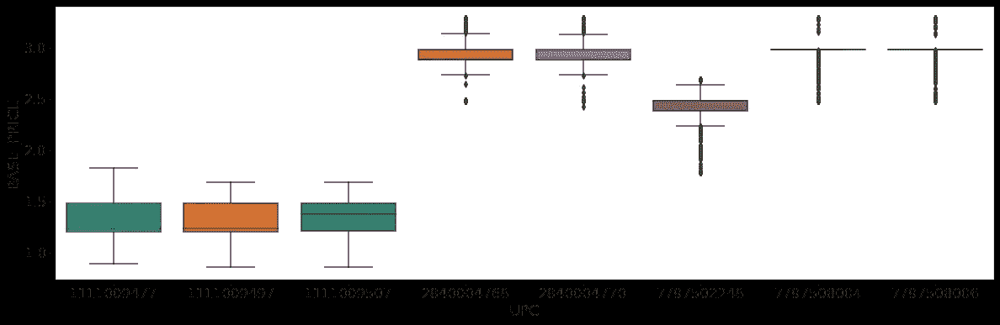
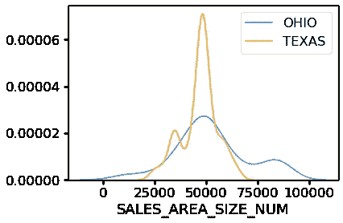
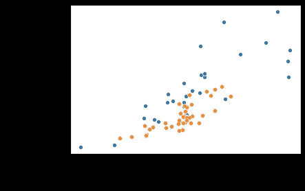

# 探索性数据分析-验证假设(附真实项目)

> 原文：<https://medium.com/analytics-vidhya/exploratory-data-analysis-validating-hypothesis-real-life-project-attached-1ec46bff85bd?source=collection_archive---------24----------------------->


迪伦·吉利斯在 [Unsplash](https://unsplash.com/s/photos/group-thinking?utm_source=unsplash&utm_medium=referral&utm_content=creditCopyText) 上的照片

当人们开始从事数据科学项目时，首先要做的是定义问题陈述。然后我们需要产生一些假设。**什么是假设**？假设是数据科学家对他或她正在研究的问题的可能观点或断言。这可能是真的，也可能不是。为问题陈述列出可能的假设称为假设生成。在这里，我将使用零售需求预测项目作为一个例子，展示如何验证我们在 python 中生成的假设。

这是我为这个项目列出的所有假设。如果你对数据集感兴趣，请查看我的[前一篇文章](/analytics-vidhya/whats-the-first-step-when-a-data-scientist-getting-data-understanding-and-validating-data-with-524a2041d559)。

**假设 1:不同的产品类别可能有显著不同的趋势/模式**

**假设 2:特色产品或展示产品的销售额更高**

**假设 3:价格较低的产品销量较高**

**假设 4:知名品牌的销售额会更高**

**假设 5:店铺面积越大，销售额越高**

# 合并商店和产品数据集

```
store_product_data = train.merge(product_data, how = 'left', on='UPC')
store_product_data.merge(store_data, how='left', left_on ='STORE_NUM', right_on = 'STORE_ID')
```

# 假设 1:不同的产品类别可能有显著不同的趋势/模式

## **每周售出的数量**

```
#sum of unites sold per week
weekly_demand = store_product_data.groupby(['WEEK_END_DATE'])['UNITS'].sum()plt.figure(figsize=(30,10))
sns.lineplot(x=weekly_demand.index, y=weekly_demand)
```


*   显示零售商售出的总数量(包括所有产品和所有商店)
*   最高数字接近 80，000，最低接近 20，000 单位
*   情节中没有明显的模式或趋势
*   尖峰可以在任一方向上看到，并且间隔不恒定

## 每周销售量——在商店层面

```
# Randomly selecting 5 store ID
stores_plot = random.sample(list(store_data['STORE_ID']), 5)#creating dictionary with store number as keys
# for each store, calculate sum of units sold per week
d = {store: train[train['STORE_NUM'] == store].groupby(['WEEK_END_DATE'])['UNITS'].sum() for store in stores_plot}plt.figure(figsize=(30,10))fig, axs = plt.subplots(5, 1, figsize = (15, 15), dpi=300)
j = 0
for store in d.keys():
    sns.lineplot(x = d[store].index, y = d[store],ax = axs[j])
    j = j+1
```



对于随机选取的店铺号，我们可以看到，图中没有任何模式。许多商店也出现了同样的情况，数据显示没有增加或减少的趋势或季节性。

## 产品级别的每周销售量

```
# function to plot weekly sales of products
def product_plots(product_list):
    # dictionary storing UPC and weekly sales
    d = {product: store_product_data[store_product_data['UPC'] ==       product].groupby(['WEEK_END_DATE'])['UNITS'].sum() for product in    product_list}
    fig, axs = plt.subplots(len(product_list), 1, figsize = (20, 20), dpi=300)
    j = 0

    for product in d.keys():
        # adding manufacturer and descritption in title
        manu = product_data[product_data['UPC'] == product]['MANUFACTURER'].values[0]
        desc = product_data[product_data['UPC'] == product]['DESCRIPTION'].values[0]            
        # creating the plot
        sns.lineplot(x = d[product].index, y = d[product],ax = axs[j]).set_title(str(manu)+str(" ")+str(desc), y=0.75, fontsize = 16)
        j = j+1

# creating list of products based on category
pretzels = list(product_data[product_data['CATEGORY'] == 'BAG SNACKS']['UPC'])
frozen_pizza = list(product_data[product_data['CATEGORY'] == 'FROZEN PIZZA']['UPC'])
oral_hygiene = list(product_data[product_data['CATEGORY'] == 'ORAL HYGIENE PRODUCTS']['UPC'])
cold_cereal = list(product_data[product_data['CATEGORY'] == 'COLD CEREAL']['UPC'])product_plots(pretzels)
```



```
product_plots(frozen_pizza)
```



*   随着时间的推移，产品销售没有增加/减少的趋势
*   单个产品销售没有季节性模式
*   同一制造商生产的产品具有相似的模式(尖峰和下降)。

# 假设 2:特色产品或展示产品有更高的销售额

*   优惠适用:优惠有吸引力的特色产品将有更高的销售额
*   产品促销:店内促销的产品销量会更多

```
def featured_plots(product_list):
    #dictionary storing UPC and 'Featured' variable
    d_f = {product: 1000*train[train['UPC'] == product].groupby(['WEEK_END_DATE'])['FEATURE'].mean() for product in product_list}
    #dictionary storing UPC and Product Sales
    d = {product: train[train['UPC'] == product].groupby(['WEEK_END_DATE'])['UNITS'].sum() for product in product_list}

    fig, axs = plt.subplots(len(product_list), 1, figsize = (20, 20), dpi=300)
    j = 0
    for product in d.keys():
        # Manufacturer name and Descritption in title
        manu = product_data[product_data['UPC'] == product]['MANUFACTURER'].values[0]
        desc = product_data[product_data['UPC'] == product]['DESCRIPTION'].values[0]

        # plotting featured and sales values
        sns.lineplot(x = d_f[product].index, y = d_f[product],ax = axs[j]).set_title(str(manu)+str(" ")+str(desc), y=0.75, fontsize = 16)
        sns.lineplot(x = d[product].index, y = d[product],ax = axs[j]).set_title(str(manu)+str(" ")+str(desc), y=0.75, fontsize = 16)
        j = j+1product_list_f = list(product_data[product_data['CATEGORY'] == 'BAG SNACKS']['UPC'])featured_plots(product_list_f)
```



当产品有特色时，销售就会增加。

## 店内陈列是否也有类似效果？

```
def display_plots(product_list):
    d_d = {product: 1000*train[train['UPC'] == product].groupby(['WEEK_END_DATE'])['DISPLAY'].mean() for product in product_list}
    d = {product: train[train['UPC'] == product].groupby(['WEEK_END_DATE'])['UNITS'].sum() for product in product_list}
    fig, axs = plt.subplots(len(product_list), 1, figsize = (20, 20), dpi=300)
    j = 0
    for product in d.keys():
        manu = product_data[product_data['UPC'] == product]['MANUFACTURER'].values[0]
        desc = product_data[product_data['UPC'] == product]['DESCRIPTION'].values[0]
        sns.lineplot(x = d[product].index, y = d[product],ax = axs[j]).set_title(str(manu)+str(" ")+str(desc), y=0.75, fontsize = 16)
        sns.lineplot(x = d_d[product].index, y = d_d[product],ax = axs[j]).set_title(str(manu)+str(" ")+str(desc), y=0.75, fontsize = 16)
        j = j+1display_plots(product_list_f)
```


*   显而易见，产品销售受展示的影响很大。
*   对于展出的产品，销售额更高。

# 假设 3:价格较低的产品销量较高

**产品价格:同类产品价格越低，销量越大**

```
product_size_coldcereal = store_product_data.loc[store_product_data['CATEGORY']=='COLD CEREAL']
product_size_bagsnacks  = store_product_data.loc[store_product_data['CATEGORY']=='BAG SNACKS']
product_size_frozenpizza = store_product_data.loc[store_product_data['CATEGORY']=='FROZEN PIZZA']
product_size_oralhyiegne = store_product_data.loc[store_product_data['CATEGORY']=='ORAL HYGIENE PRODUCTS']# scatter plot for base price and sales
plt.figure(figsize=(8,6))
plt.scatter(x = (product_size_bagsnacks['BASE_PRICE']), y = (product_size_bagsnacks['UNITS']))
plt.xlabel('BASE_PRICE', fontsize=12)
plt.ylabel('UNITS', fontsize=12)
plt.show()
```



```
# scatter plot for base price and sales
plt.figure(figsize=(8,6))
plt.scatter(x = (product_size_oralhyiegne['BASE_PRICE']), y = (product_size_oralhyiegne['UNITS']))
plt.xlabel('BASE_PRICE', fontsize=12)
plt.ylabel('UNITS', fontsize=12)
plt.show()
```



```
# scatter plot for base price and sales
plt.figure(figsize=(8,6))
plt.scatter(x = (product_size_frozenpizza['BASE_PRICE']), y = (product_size_frozenpizza['UNITS']))
plt.xlabel('BASE_PRICE', fontsize=12)
plt.ylabel('UNITS', fontsize=12)
plt.show()
```


*   对于袋装零食和口腔卫生品类，价格较低商品的销售额较高。
*   价格较高的项目，冷冻比萨饼项目的销售额较高。

# 假设 4:知名品牌会有更高的销售额

```
pretzels = list(product_data[product_data['CATEGORY'] == 'BAG SNACKS']['UPC'])
frozen_pizza = list(product_data[product_data['CATEGORY'] == 'FROZEN PIZZA']['UPC'])
oral_hygiene = list(product_data[product_data['CATEGORY'] == 'ORAL HYGIENE PRODUCTS']['UPC'])
cold_cereal = list(product_data[product_data['CATEGORY'] == 'COLD CEREAL']['UPC'])plt.figure(figsize=(20,6))
ax = sns.boxplot(x="UPC", y="BASE_PRICE", data=train[train['UPC'].isin(pretzels)])
product_data[product_data['UPC'].isin(pretzels)]
```



*   所有自有品牌的零食都有更低的价格。
*   尺寸较小的 Snyder S 袋装零食价格较低。

# 假设 5:面积越大的商店销售越多

```
store_agg_data = train.groupby(['STORE_NUM'])['UNITS'].sum().reset_index()
merged_store_data = store_data.merge(store_agg_data, how = 'left', left_on = 'STORE_ID', right_on = 'STORE_NUM')state_oh = merged_store_data.loc[merged_store_data['ADDRESS_STATE_PROV_CODE'] == 'OH']
state_tx = merged_store_data.loc[merged_store_data['ADDRESS_STATE_PROV_CODE'] == 'TX']sns.distplot(state_oh['SALES_AREA_SIZE_NUM'], hist=False,color= 'dodgerblue', label= 'OHIO')
sns.distplot(state_tx['SALES_AREA_SIZE_NUM'], hist=False,  color= 'orange', label= 'TEXAS')
```



```
sns.scatterplot(x = (state_oh['SALES_AREA_SIZE_NUM']), y = (state_oh['UNITS']))
sns.scatterplot(x = (state_tx['SALES_AREA_SIZE_NUM']), y = (state_tx['UNITS']))
```

