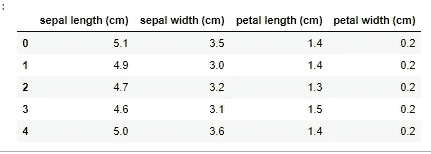
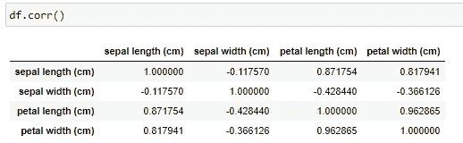
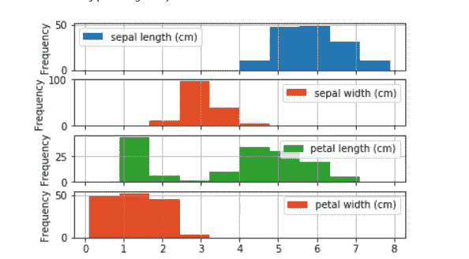
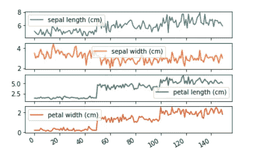

# 使用 Python 进行探索性数据分析

> 原文：<https://medium.com/analytics-vidhya/exploratory-data-analysis-with-python-589a002989f8?source=collection_archive---------8----------------------->

今天的世界正朝着在所有领域使用人工智能和机器学习的方向快速前进。这其中最重要的关键是数据。数据是一切的关键。如果作为一名机器学习工程师，我们能够理解并根据我们的需要重组数据，我们就已经完成了一半的任务。

让我们试着学习对数据进行 EDA(探索性数据分析)。

我们将在本教程中学到的内容:

1.  为我们的应用程序收集数据。
2.  我们需要的数据结构。
3.  将数据可视化。

让我们开始吧。我们将尝试获取一些样本数据 IRIS 数据集，这是一个非常常见的数据集，当您想要开始机器学习和深度学习时会用到。

1.  **数据收集**:任何申请的日期都可以在 Kaggle、UCI 等几个网站上找到，或者必须针对某个申请。例如，如果我们想要在狗和猫之间进行分类，我们不需要通过收集狗和猫的图像来构建数据集，因为有几个数据集可用。在这里，让我们尝试检查虹膜数据集。

让我们获取数据:

```
from sklearn.datasets import load_iris
import pandas as pddata = load_iris() #3
df = pd.DataFrame(data.data, columns=data.feature_names)#4
```

这(#3)将获取 sklearn 默认拥有的数据集。第 4 行将数据集转换成 pandas 数据框，该数据框通常用于研究具有行列属性的数据集。

可以使用以下方式查看前 5 行数据:

```
df.head()
```



虹膜数据集

数据集的行数和列数以及列名可以通过以下方式检查:

```
print(df.shape)
print(df.columns)(150, 4)#Output 
Index(['sepal length (cm)', 'sepal width (cm)', 'petal length (cm)',
       'petal width (cm)'],
      dtype='object')#Output
```

我们甚至可以直接从 UCI 的[这里](https://archive.ics.uci.edu/ml/datasets/iris)下载数据集。下载的 CSV 文件可以加载到 df 中，如下所示:

```
df = pd.read_csv("path to csv file")
```

2.**结构化数据**:数据集通常会有几个不直接影响我们输出的特性。使用这些特性是没有用的，因为它会导致不必要的内存限制，有时还会出错。

通过检查输出列与输入的相关性，我们可以检查哪些列是重要的或者对输出列的影响更大。让我们尝试一下:

```
df.corr()
```



相关矩阵

很明显，你可以看到上面的关联矩阵帮助我们理解所有特征是如何相互影响的。有关相关矩阵的更多信息，请点击[此处](https://pandas.pydata.org/pandas-docs/stable/reference/api/pandas.DataFrame.corr.html)。

因此，如果我们的输出列是假设的萼片长度(cm)，我的输出 y 将是“萼片长度(cm)”，我的输入 X 将是“花瓣长度(cm)，
“花瓣宽度(cm)”，因为它们与 y 有更高的相关性。

注意:如果“萼片宽度(cm)”的相关系数为-0.8，我们也将把它作为相关值，尽管它是负的，但对输出 y 有很大的影响(成反比)。

注意:相关矩阵中的相关值可以在-1(反比)和+1(正比)之间变化。

3.**可视化数据**:这是一个非常重要的步骤，因为它可以在两个方面提供帮助:

1.  帮助你理解要点，如数据是如何分割的，即它是否接近一个小范围的值或更高。
2.  有助于理解决策界限。
3.  向人们展示，让他们理解你的数据，而不是展示一些表格。

有几个用来绘制和显示数据，如直方图、条形图、配对图等。

让我们看看如何绘制虹膜数据集的直方图。

```
df.plot.hist( subplots = True, grid = True)
```



直方图

通过查看直方图，我们更容易理解每个特性的取值范围。

现在让我们简单地绘制数据。

```
df.plot(subplots=True)
```



除此之外，根据应用的不同，还可以很容易地绘制出其他一些图形。

# *因此，我们可以通过陈述一个简单的事实来得出结论:一个结构良好的数据集是一个良好而有效的机器学习模型的初始关键。*