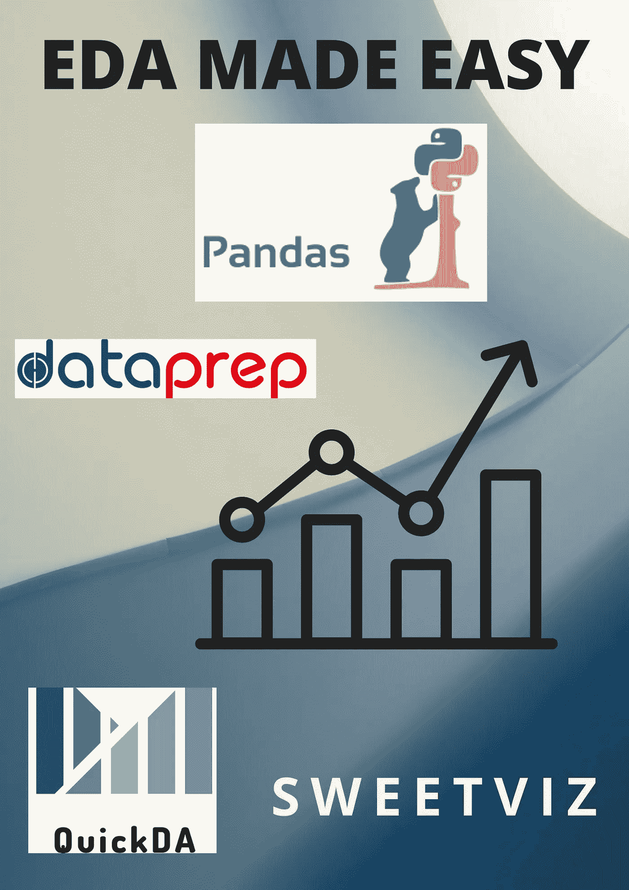

# 探索性数据分析:用几行代码从零到英雄

> 原文：<https://medium.com/analytics-vidhya/exploratory-data-analysis-zero-to-hero-with-just-a-few-lines-of-code-98bec9a6cf2e?source=collection_archive---------5----------------------->

## 用简单而强大的库执行 EDA 的各种方法的详细概述！

使用 canva 设计(图片由作者提供)

任何主要依赖数据的商业案例在发布特定产品之前都必须经历 4 个阶段的数据分析，如下所示: