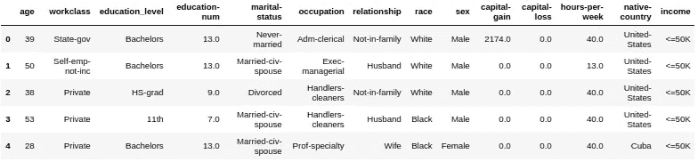
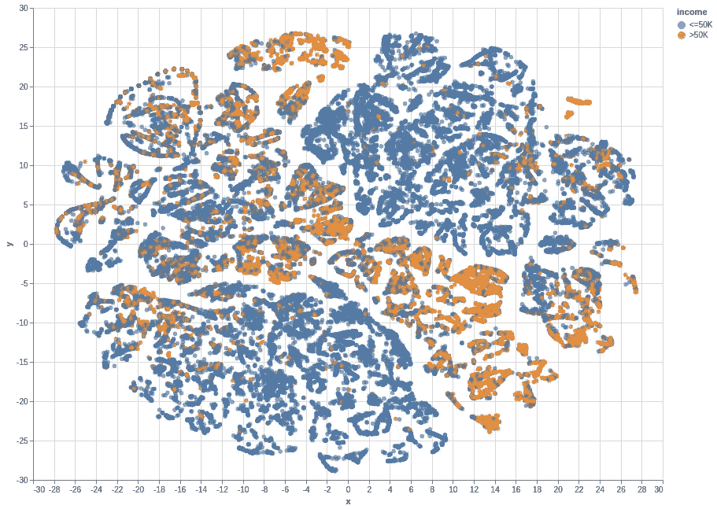
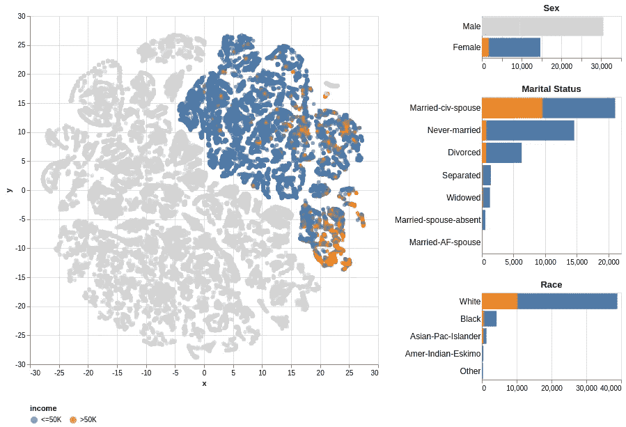
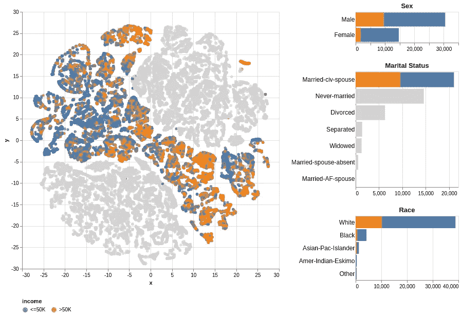
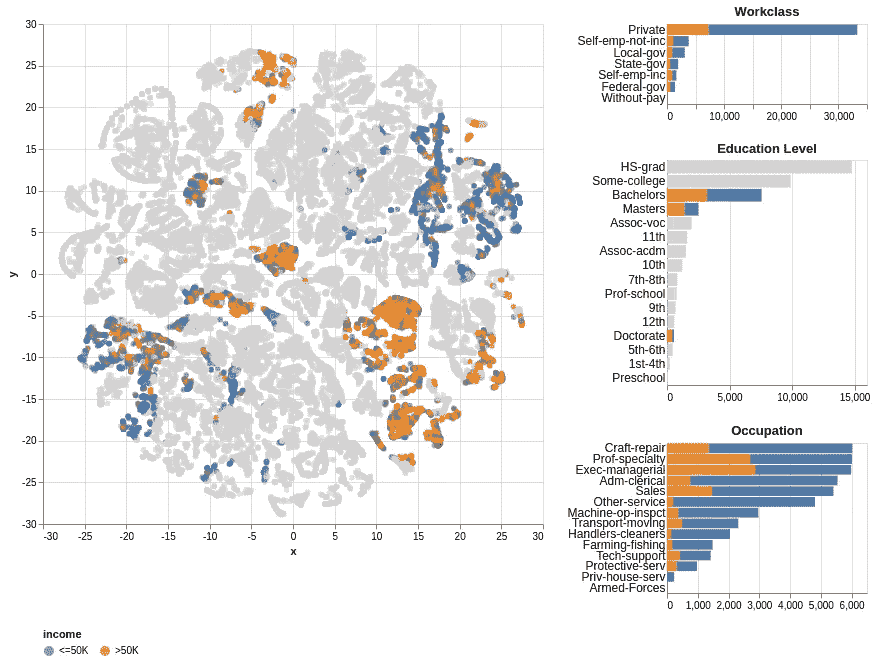

# 具有分类变量的数据的探索性可视化

> 原文：<https://medium.com/analytics-vidhya/exploratory-data-visualization-with-categorical-features-c3c372987421?source=collection_archive---------15----------------------->

探索性数据可视化允许我们在开始任何建模之前对数据有一个概念。通常散点图是用数字特征可视化数据的好选择，它允许我们看到数据中的关系/模式。

当数据集包含分类变量(例如，国家、性别、种族)时，挑战就开始了。我们如何可视化这样的数据集来理解模式？

答案在于嵌入，它是文本数据的向量表示。我们可以使用`keras`或`gensim` [Word2Vec](https://radimrehurek.com/gensim/models/word2vec.html) 模块中的[嵌入层](https://keras.io/api/layers/core_layers/embedding/#embedding-class)来获得嵌入。在这篇文章中，我在 Jupyter notebook 中使用 Altair 库可视化了一组多维分类数据。

数据集可以从 [UCI 机器学习库](https://archive.ics.uci.edu/ml/datasets/Census+Income)下载。它是由 Ron Kohavi 和 Barry Becker 捐赠的，发表在文章*“提高朴素贝叶斯分类器的准确性:决策树的混合体”*中。下面提供的数据是一个清除了`'fnlwgt'`特征和缺失或格式错误的记录的干净版本。下面是数据集的前几行。

图 1:数据集的顶行

数据集中有 8 个分类特征— **工作阶级、教育水平、婚姻状况、职业、关系、种族、性别、祖国**。为了创建 Word2Vec 的训练数据，我创建了一个新列，它包含记录的所有分类值的数组。例如，上面第 0 行的新列将保存`[‘State-gov’, ‘Bachelors’, ‘Never-married’, ‘Adm-clerical’, ‘Not-in-family’, ‘White’, ‘Male’, ‘United-States’]`。然后，我创建了一个 32 维分类嵌入，将新创建的列的值作为训练数据传递给 Word2Vec 模型。我将数字特征添加到嵌入中，然后使用 t-SNE 降低维数。所有代码和指令都可以在我的 [GitHub 库](https://github.com/shahzeb-akhtar/Categorical_Embedding)中访问。

在执行了上面提到的步骤之后，我能够在散点图中可视化带有 8 个分类变量的数据集。将鼠标悬停在数据点上，不同要素的值会显示为工具提示。

图 2:数据集的散点图。参见[互动版](https://shahzeb-akhtar.github.io/Categorical_Embedding/interactive_charts/scatter_chart.html)

此外，我可视化了散点图以及分类变量的条形图。通过单击条形，散点图中的数据会更新，以帮助理解变量之间的关系。

图 3:散点图中突出显示性别为“女性”的数据点。参见[互动版](https://shahzeb-akhtar.github.io/Categorical_Embedding/interactive_charts/gender_marital_race_chart.html)

图 4:散点图中突出显示的婚姻状态为“已婚-未婚-配偶”的数据点。参见[互动版](https://shahzeb-akhtar.github.io/Categorical_Embedding/interactive_charts/gender_marital_race_chart.html)

图 5:散点图中突出显示了教育水平“学士”、“硕士”或“博士”的数据点。参见[互动版](https://shahzeb-akhtar.github.io/Categorical_Embedding/interactive_charts/workclass_education_occupation_chart.html)

我创建了一个[仪表盘](https://shahzeb-akhtar.github.io/Categorical_Embedding/interactive_charts/dashboard.html)来过滤散点图中所有变量的数据点，并创建了另一个仪表盘[用户可以在散点图中选择数据点，所有变量的条形图会根据选择进行更新。](https://shahzeb-akhtar.github.io/Categorical_Embedding/interactive_charts/alternate_dashboard.html)

受到可视化结果的鼓舞，我决定使用分类嵌入而不是一次性编码作为特征，使用随机森林分类器预测收入范围(高于/低于 50k ),以便比较两者之间的性能。

我的期望是，随着分类嵌入的使用，性能将会提高。然而，我使用分类嵌入实现了 0.7290 的 f 值和 0.8605 的准确度，并且我使用 one-hot 编码实现了几乎相似的性能，f 值为 0.7337，准确度为 0.8608。此外，当使用分类嵌入而不是一次性编码时，训练和预测所用的时间更长(5.1834 秒对 3.9037 秒)。

根据上面的观察，我推断由于这个数据集的基数(分类特征的唯一值的数量)不是很高(97 个唯一值)，使用一次性编码或分类嵌入对性能没有太大影响。然而，在一个基数较高的数据集上比较两者的性能会很有趣，我将在以后的文章中讨论这一点。