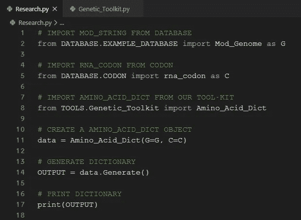
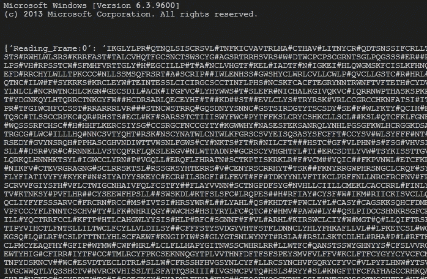

# 用 Python 探索新冠肺炎基因

> 原文：<https://medium.com/analytics-vidhya/explore-covid-19-genes-with-python-1bb6ae9eb288?source=collection_archive---------28----------------------->

> 从前有一个学生，一个非常聪明的学生。
> 
> **他想研究基因，他想研究病毒……但是他厌倦了阅读枯燥的教科书。**
> 
> **他渴望自己动手做些工作，而不仅仅是阅读无聊的东西和看视频。**
> 
> **如果那个学生在你内心撒谎，那么** **这篇文章是给你的**。

# 理解文章所需的知识

> 您应该对以下主题有所了解。
> 
> 如果你缺乏关于以下主题的知识，这里有我关于这些主题的其他文章的链接。

**(1)**[**RNA 翻译的基础知识**](/@iamakshay099/95054b818bb6?source=friends_link&sk=1163e9403a6beda55b8bd1058e1ba548)

**(2)Python 编程语言基础知识(很少)**

**( 3 )** [**关于 GitHub 的基础知识**](/@iamakshay099/downloading-files-from-github-39e31612fe49?sk=3ce2080bb637d005e2575f2465b44823)

你需要在你的电脑上安装 Python(这是免费的)。

如果没有安装，只需 [***点击此链接***](https://www.python.org/) (会重定向到 Python 主页)。

# 让我们创建我们的秘密研究工作空间

深呼吸，感受你身体里的科学家或研究人员的灵魂。

点击 [***GitHub 链接***](https://github.com/AkshayPandya/Genetic_Toolkit) 并下载 ZIP(随意解压该文件并删除“ *delete-me.txt* ”文件)。

如果你不知道怎么做，这个 [***链接***](/@iamakshay099/downloading-files-from-github-39e31612fe49?sk=3ce2080bb637d005e2575f2465b44823) 会教你。

您的文件夹树应该是这样的，

**文件夹模式**

***MAIN*** ~主目录(从我的 GitHub-link 下载的话应该命名为“Genetic_Toolkit-master”)。

***日志文件*** ~将创建日志文件的目录。

***工具*** ~目录包含“ *log.py* ”和“ *Genetic_Toolkit.py* ”。

***__init__。py*** ~这些只是初始化文件，忽略它们。

# 浏览我们的文件

> 只需打开所有文件并浏览一遍…

**1。CODON.py** ~它包含一个包含密码子:氨基酸对的字典。

**氨基酸及其缩写列表(在我们的密码子词典中使用)**

**2。** **TEMPLATE.py** ~包含创建数据库文件模板的文件。

**TEMPLATE.py**

**3。****EXAMPLE _ Database . py**~你的数据库文件应该是这样的文件(包含在中国患者身上发现的 SARS-COV-2 病毒的基因数据)。

**EXAMPLE_DATABASE.py**

**4。** **log.py** ~只是为了创建日志文件，我们将在后面讨论日志文件。

**log.py**

**5。****Genetic _ toolkit . py**~这个文件包含了我做的算法，在 GitHub 上有完整的文档(我认为是这样的)。

**Genetic_Toolkit.py**

6。 **research.py** ~我们所有的工作都会在这个文件里面完成。

**research.py**

# 是时候在我们的秘密实验室里玩致命病毒了

> "如果你从未失败过，那你就从未尝试过任何新事物。"

**~阿尔伯特·爱因斯坦**

# [ 1 ]从 NCBI 网站(NCBI 数据库)获取数据

> NCBI 代表 **N** 国家 **C** 回车代表 **B** 信息技术 **I** 信息。

点击下面的 [***链接***](https://www.st-va.ncbi.nlm.nih.gov/genbank/sars-cov-2-seqs/) ，它会将你重定向到 NCBI-核苷酸-序列数据库。

**NCBI 核苷酸序列数据库**

打开其中一个或者 [***点击这里***](https://www.ncbi.nlm.nih.gov/nuccore/MT358637) 打开我用过的那个。

**数据库页面**

在页面上找到“*原点*”。

**数据库**中的“原点”

“*起点*旁边的序列是病毒的完整核苷酸序列。

复制那个序列。

# [ 2 ]创建数据库文件

> 保持数据整洁。

现在打开你选择的 Python 编辑器(我用的是我认为最好的[***vs code***](https://code.visualstudio.com/))。

在“*数据库*”文件夹中新建一个文件，并将“ *TEMPLATE.py* ”的内容复制到该文件中。

现在把我们的序列(从 NCBI 复制的)作为一个多行字符串粘贴到基因组中。

**串“基因组”。**

现在删除所有的制表符和数字，并在 Mod_Genome 中创建一个单行字符串。

**字符串“Mod_Genome”。**

现在，将所有的***t***替换为***u***(因为我们正在处理 RNA)，并交换 Mod_Genome 的情况。

您的代码应该是这样的，

## 设置样本信息:

**样本信息**

你可以在 NCBI 数据库页面找到所有这些。

如果网站上缺少信息，请键入任何内容，但**不要将这些字段留空**。

**NCBI 数据库页面上的样本信息**

# [ 3 ]产生氨基酸序列

**在这一步中，我使用了“ *EXAMPLE_DATABASE.py* ”，但是您可以自由使用您新创建的数据库文件。**

> 我们将使用工具箱中的一个名为“**氨基酸字典**的工具，这个工具将创建一个包含氨基酸序列及其阅读框架的字典。

是时候从我们的基因组序列中生成氨基酸序列了。

打开“ *research.py* ”并键入以下代码，

**生成氨基酸序列的脚本**

这段代码的输出如下所示，

**上述脚本的输出**

在输出中，创建了包含与每个阅读框架(0、1 和 2)相关的氨基酸串的字典。

复制整个输出并将其粘贴到我们的氨基酸数据库文件中(在“EXAMPLE_DATABASE.py”中的*，它已经在那里了*)。

我们已经成功地在数据库文件中创建了一个包含与阅读框架相关的氨基酸序列的字典。

## 从这里开始，我将使用“EXAMPLE_DATABASE.py”(不是新的数据库文件)，但是您可以自由地将下面的所有步骤应用到您新创建的数据库文件。

# [ 4 ]创建蛋白质序列

> 这里，我们将使用一个名为**翻译**的工具来从氨基酸序列生成蛋白质序列。

首先，回到 NCBI·佩奇去寻找“基因”。

[***链接举例 _DATABASE.py 的网页***](https://www.ncbi.nlm.nih.gov/nuccore/MN908947) **。**

**【基因】数据库页面**

记下该基因的名称和索引，并再次打开“ *research.py* ”。

键入以下代码，

**在“m”和“n”中键入您的索引。**

作为输出，将生成一个氨基酸串。

**上述脚本的输出**

干得好，我们已经成功提取了我们的第一种蛋白质(“S”-蛋白质，如果你是逐字逐句地遵循这篇文章的话)。

现在，如果您愿意，可以将该序列添加到“蛋白质”字典中的数据库文件中(在“EXAMPLE_DATABASE.py”中的*，它已经在那里了*)。

***【EXAMPLE _ database . py】***中的“S”——蛋白质

# [ 5 ]扫描我们的数据库寻找蛋白质

> 假设你的朋友发给你一些蛋白质的氨基酸序列列表，并问你这些蛋白质是否存在于 SARS-COV-2(冠状病毒)中，现在你有责任进行检查。
> 
> 在这种情况下，让我告诉你如何扫描我们的数据库中的那些蛋白质。
> 
> 为了扫描我们数据库中的蛋白质，我们将使用“ **Scan_DataBase** ”工具。

打开“ *research.py* ”，导入以下内容:

**代码**

现在，创建一个包含所有这些蛋白质的字典，

**我把它命名为“P”**

创建字典后，键入以下代码。

**代码**

在这个阶段，如果您运行这段代码，您将得到类似这样的输出。

**上述脚本的输出**

[x/y] ~这里，x 是输出索引，y 是目前处理的总对数。

时间~它显示了进程花费的总时间。

1.  如果任何蛋白质与数据库中的任何编码区(氨基酸序列)完全匹配，它将打印“找到完全匹配”，然后读取找到完全匹配序列的 _frame，并在其后打印“蛋白质:(匹配的蛋白质的名称)”。
2.  如果任何蛋白质作为你的数据库(氨基酸序列)的任何编码区的一部分匹配，它将打印“找到匹配”，然后在找到精确序列的 Reading_Frame 和“蛋白质:(匹配的蛋白质的名称)”之后。

## 但是

如果在脚本中打印“输出”对象:

**代码**

然后你会得到一个包含蛋白质的字典，这些蛋白质根据阅读框架进行匹配和分类。

**上述脚本的输出**

祝贺您，您已经成功扫描了您的蛋白质数据库。

# [ 6 ]比较两个数据库

## (1)比较两个相同的数据库

> 假设您创建了两种相似病毒的数据库文件(例如，一个文件包含从居住在 Rajkot 的患者身上发现的冠状病毒样本的数据，另一个文件包含从居住在武汉的患者身上发现的冠状病毒样本的数据)，您的工作是找出这两种病毒的基因组之间的差异。
> 
> 对于此任务，我们将使用“**相同 _ 扫描**”工具。
> 
> 就这么办吧。

打开 research.py 并导入两个要比较的相同数据库。

然后导入 ***【相同 _ 扫描】*** 工具并键入以下内容:

**代码**

因此，每个不相同的对都将被打印。

**上述脚本的输出**

不要对两个高度不相同的基因组使用这个工具。

## (2)比较两个不同的数据库

> 在一个超级无聊的日子里，在一个下午，一个想法击中了你的大脑，一些天使在你空荡荡的大脑中说话~“嘿，将 SARS COV-2 的基因组与艾滋病毒和其他病毒进行比较，并尝试找到相似的蛋白质。如果你成功了，那么你就有可能预测出一些对 SARS COV-2 有效的药物，你想碰碰运气。
> 
> 为此，我制作了一个名为“ **Compare_DataBase** ”的工具。
> 
> 现在，让我们看看如何做到这一点。

打开“ *research.py* ”文件，编写以下代码。

**代号**

这段代码的输出将在“LogFiles”文件夹中创建一个新的日志文件。

**日志文件**

该日志文件的内容如下所示，

**日志文件的内容**

在日志文件中，相同的索引号代表一对相同的氨基酸(编码区)序列。

**这篇文章就到这里，希望你喜欢。**

**再见&保持创意。**