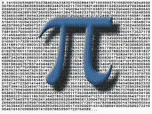
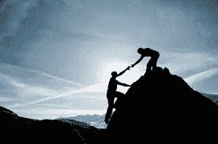
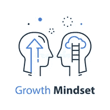
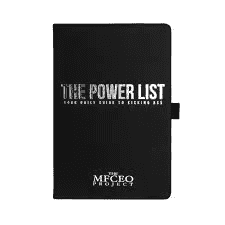
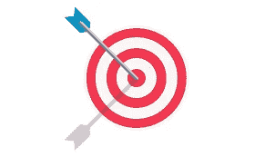
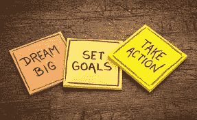
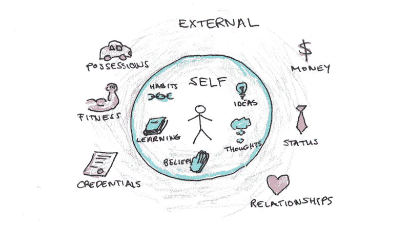
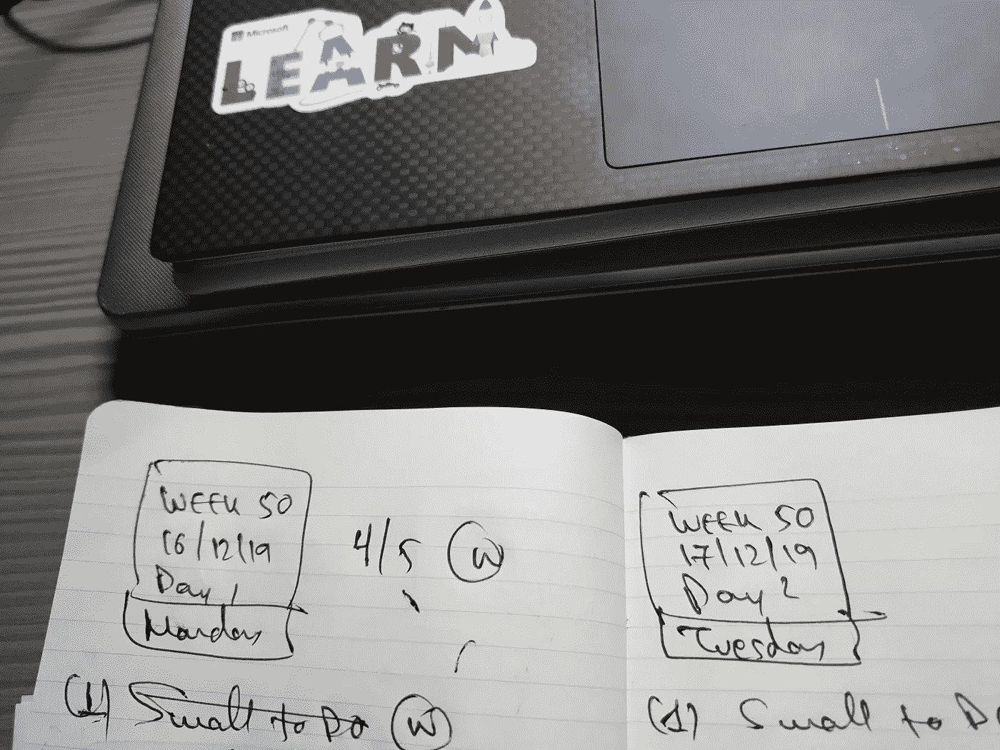

# 使用权力清单无限探索——我的第一个 52 周数据科学和更多！

> 原文：<https://medium.com/analytics-vidhya/explore-infinitely-using-the-power-list-my-first-52-weeks-of-data-science-and-more-e75b0da467b8?source=collection_archive---------18----------------------->

# 放弃

不，这不是关于我在未来 52 周要做什么的承诺，也不是我 2020 年的新年决心…

不，我不会每周或每两周更新我的进展，我的感受，我做了什么，我错过了什么等等，让你厌烦

不，我不是想卖给你什么东西…

我希望这将是一个简短的故事，每个人都可以通过我的镜头看到自己，改变非常小的事情，具体到你的情况！

哦，也许给你一点提示，让你自己试试！

# 权力清单是什么？

你可能遇到过不同名称、形式和变体的这种情况；本质上，它是一个小小的无价的工具，如果你下定决心，它可以改变你的生活…

我第一次遇到这种情况是在我寻求为个人发展做一些学习的时候，我注册了凯尔的[“数据科学梦想工作”](https://www.datasciencedreamjob.com/)平台，以深入研究数据科学，清除我的数学&概率遗忘技能，并测试我自己学习一种新的编码语言(Python)。

令我惊讶的是，课程的一部分不是关于数据科学和我准备做的所有令人讨厌的事情，而是一些关于成长心态、勇气、新习惯等“奇特”的概念……正如我后来发现的那样，我已经处于[“成长心态”](https://www.youtube.com/watch?v=hiiEeMN7vbQ)模式，接受新的想法和事物，这些想法和事物将成为真正进入数据科学咨询这样的技术领域的职业转变的催化剂！

其中一个视频讲座是关于 [MFCEO 项目](https://andyfrisella.com/blogs/mfceo-project-podcast)，这是一个由安迪·弗里塞拉运营的播客，解释了权力清单，我很想了解更多。因此，我从数据科学转向阅读关于思维模式的书籍，听关于个人转变的 MFCEO 播客，当然还有权力清单。

这是一个非常简单的概念:

*   每天，你计划你的一天，记下 5 项任务，这些任务将推动你在职业目标、个人目标或任何你需要实现的目标上前进
*   你可以用笔记本和笔
*   是的，你没听错，你需要开始写下来
*   5 项任务。不是 3，不是 7，只是 5。坚持 5
*   如果你在任何一天至少执行了 3 次，你就赢了。你记事本上的大“W”！
*   如果你在任何一周赢得 4 天或更多，你就赢得了这一周
*   如果你在任何一个月中赢了 3 周或更多，你就赢了这个月
*   诸如此类…

# 不包括什么

这应该是关于个人发展的:

*   不是你觉得舒服的事情
*   反正不是你需要做的日常任务
*   不是你已经有能力去做的事情

# 包括什么

所有有助于个人发展的事情:

*   你想养成的新习惯
*   对你认为需要继续发展的新技能进行培训
*   围绕自信和自我意识的支持系统帮助你度过困难时期

此外，不要害怕尝试可能会失败的事情，一开始你可能会失败。

# 目标

设定你自己的目标，确定你未来的目标，是这个过程中重要的一部分。我不打算在这里讨论这一部分，因为它与个人目标和抱负有关，这应该是你内在发现和旅程的一部分。权力清单可以成为一个工具，帮助你跟踪这个过程，让自己在执行过程中保持诚实，所以这只是一个工具，而不是目标本身。

例如，你可以将你的目标设定为以下任何一项…

*   打入数据科学咨询领域(我的目标)
*   减肥
*   成为一名演员
*   跑马拉松
*   学习一门新语言
*   学习跳舞/唱歌/等…

真的，当你在幻想你的未来和所有你想做的伟大的事情时…这就是了。不要低估你的未来，大胆梦想，追随你的激情！停下来，放下你在做的白日梦。

> *为什么？因为你可以！*

我是谁或任何人告诉你，否则😊。梦想要大，行动要大，不要给自己定下平庸的目标。

# 但是怎么做呢？

振作起来，专注于将你当前的状态与你的最终目标联系起来的行动。

你猜怎么着！这不是通过思考或拖延，而是让你的 a*s 每天执行你选择的与这个目标相关的 5 项任务。然后周末再测，重新开始。日复一日。一周又一周。月复一月。直到你在那里。

你会惊讶于一段时间内持续努力的累积效果以及它是如何建立起来的。不要让你的感觉或你自然想出的任何借口使你偏离任务。其中很多可能是正确的。每个人都忙于工作、家庭和个人的困难，为了腾出时间做这些事情，这些困难似乎是不可能克服的。

> *有志者事竟成*

如果你正在寻找增强意志和信心的方法，这里有一些建议:

*   迈出第一步。完成第一天的任务。执行。
*   你永远不会通过深思熟虑和计划说服自己，只是执行。做那该死的任务。
*   然后呢？你猜对了。完成第二天的任务！😊
*   不要去想一两个月后会是什么样子，也不要去想你会多快到达那里——换句话说，不要去想！
*   专注于当天。赢得胜利。那一天的每一天。
*   不要担心你错过的那一天。我们都错过了日子。
*   每天你都可以点击重置按钮并获胜。
*   第二天，不要想昨天的胜利。做你必须做的去赢得新的一天。
*   不要花太多时间去做加法和跟踪你的进展，除了在你的权力清单笔记本上记下当天的 W 或 L。你赢了还是输了？
*   然后继续第二天！

这是一个数字游戏，坚持不懈会让你赢得更多的胜利。你输过一次？赢两次才能扭转局面。就这么简单。你掌控自己的命运、目标，最终掌控自己的生活！

# 自我提升的工具

有没有什么工具可以帮助你坚持工具(权力清单)？

有几件事都与你的自我提升有关:

*   你的目标——我想达到什么目标？
*   **你实现目标的决心**——你真的决心这么做吗？
*   **你的信仰体系**——你相信你能做到吗？
*   你的自我形象与你认为自己是谁有关吗？
*   你的习惯——我目前的习惯支持我努力实现目标吗？

你现在可能在想…“哇，我们已经陷得很深了”。但我们是吗？

例如，你应该如何成为一名舞者(目标)，如果你以前从未跳过舞(信仰体系)，在过去 5 年中从未适当地伸展或锻炼(习惯)，如果你认为自己不是艺术(自我形象)，所有这些都可能会弯曲你这样做的意愿(决心)？

我知道我是在帮倒忙，但简单的回答是你不必马上解决所有这些问题。为什么？因为你有权力清单来分解它，并开始在这些上面工作。一次一个:

*   从你的目标开始，向后追溯
*   把事情分解成能让你实现目标的步骤，你缺少的技能，或者你需要学习的东西
*   听关于这个话题的播客
*   阅读有助于你开阔视野、更好地了解自己的书籍
*   找一个导师:以前做过这方面工作的人，可以提供有价值的建议
*   找一个伙伴让你在执行的时候负起责任
*   一直以来:使用权力清单，花时间做这些任务，提高你的执行力

# 我的第一个 52 周

我已经使用这个权力清单超过 50 周了，很快就要结束一整年我在工作和家庭生活之外，仅仅通过每天使用这个简单的工具所做的这么多事情。

# 目标

虽然我很乐意，但这篇文章不是关于我的个人目标，每个人都有自己的目标，而不是旅程本身。你可能已经猜到了，对我来说，它是关于将数据科学和咨询结合在一起的。

也许我要说的一件事是，在你前进的过程中更新你的目标并理解你想做得更好是可以的。

*   基于一些虚拟的时间线或错误的自我信念降低标准是不可以的
*   没有大的成功或大的失败，不要因为这个阻碍你的目标而陷入困境。
*   如果这让事情变得简单，你可能会处于“失败”模式，直到你到达那里😊
*   坦然面对失败，并想办法回到失败中去。
*   快速失败，这样你可以更快地学习和解决问题。

# 习惯

到目前为止，这一直是我旅程的基石，它可以归结为我已经建立的以下关键习惯:

*   **早起(早上 4:30)**—这让我每天能腾出 1.5 小时的时间，专注于我的目标和需要做的事情。这是一个巨大的数字，因为如果你成功地赢得了一周 5 天的工作，这相当于一周多了整整 8 小时的工作时间
*   **看书**——我一年中从来没有读过超过一本书，如果是的话，那很可能是一本关于假期的小说等等。在过去的一年里，我已经读了 5 本书，并且在我们说话的时候已经读了一半。除了从上次我放书的地方拿起我的书之外，我从来没有期待过坐上那列火车去上班:)
*   **学习**——我没有量化的学习量，但我已经设法将它嵌入到我的每周例行工作中，因为这有助于为进入数据科学领域建立强大的技术背景。因此，大量的技术书籍阅读，论文，教程等…这已经在上面的“阅读书籍”部分
*   锻炼——我已经建立了一个每天 15-20 分钟的锻炼计划，让我保持身心健康。一点点浓缩咖啡，但是你知道，不一样的！

# 技能

上面的习惯让我发展了一些全新的技能或者提高了一些现有的技能，以至于我现在可以自信地认为它们是我的一部分😉

*   **用 Python 编码和编程**——虽然我不是编程新手，但我已经有超过 15 年没有这样做过了，Python 对我来说是一门新的语言。我仍在学习和优化我的技术，但我可以轻松地(通过必要的谷歌搜索)扭转 python 中的算法，包括加载、处理和可视化数据
*   **数据科学的机器学习和建模** —曾经用于学术项目，现在已经能够使用线性&逻辑回归和神经网络将自己带回基本的 ML 建模
*   数学和统计——我的武器库中不再有生锈的文物，而是不断发展的新工具
*   **音乐**——回到钢琴和吉他演奏中，享受一些放松的时刻和白日梦
*   写博客——写作一直是我的弱项，但尽管如此，我还是强迫自己动笔，开始在 LinkedIn 和 Medium 上写博客。今年我写了 5-6 篇文章，并且还在改进我的风格。

# 信仰体系

我将把这作为一个开放的问题，但是根据我到目前为止所做的事情，你认为我的信仰体系在过去的一年里有什么变化？😊

# 决心

谈到变化，我们都从同一个点开始，即零点。而你所拥有的只是一个肩膀里的小天使告诉你“你能行”，另一个肩膀里的另一个(堕落的)天使告诉你“放弃吧，这不适合你”(小恶魔)。

旅程很长，他们都一直在咬你的耳朵，所以不管你一开始有多坚定，在你的旅程中经历了多少起起落落，重要的是你选择听谁的。

> 到目前为止，你听过谁的歌？

# 自我形象

重新发现你的自我形象听起来像是旅程的终点，但实际上是发现你的目标是什么以及如何达到目标的催化剂。一开始，这就像是鸡和蛋的问题。哪个先来？

我目前找到的唯一答案是，无论如何你都要突破你现在的自我形象，即使你不知道你的目标自我形象是什么。

自我探索和持续的好奇心是解开这些问题的关键，你会在这个过程中找到它。继续问问题，继续寻找，继续执行你的日常工作。积累知识、技能和心态，为正确的时刻做好准备。

没有单一的答案，你必须继续用茶匙挖掘那堵墙，就像安迪·杜弗兰在《肖申克的救赎》中所做的那样！

# 我的下一步是什么？

你可能已经猜到了，这还不止于此。在过去的一年里，我的目标与我一起发展，所以我正在相应地调整它们，并通过将数据科学融入我的职业和个人生活来不断提高标准！

也许，作为我唯一的新年决心，我会犒劳自己，用一把新的锋利的茶匙继续挖那堵墙。

现在交给你了！

# power list # 52 weeks # goals # disclaimer # explore infinitely # data science # try yourself

*最初发表于*[T5【https://www.linkedin.com】](https://www.linkedin.com/pulse/explore-infinitely-using-power-list-my-first-52-data-tzimopoulos/)*。*