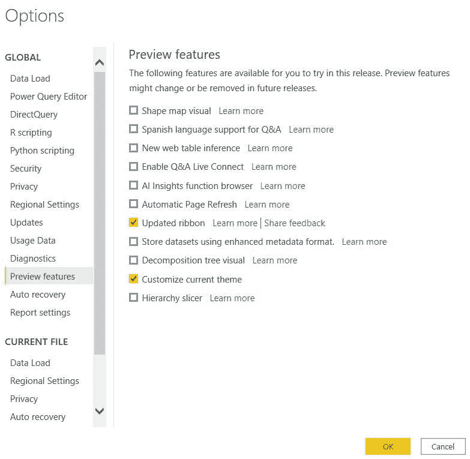
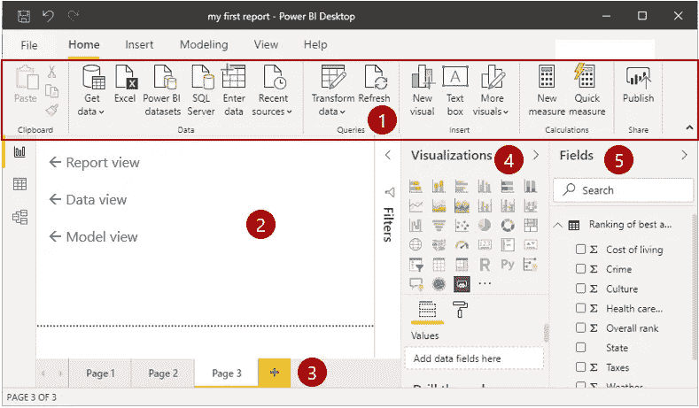
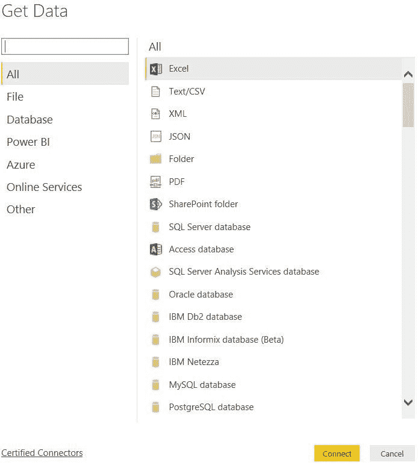
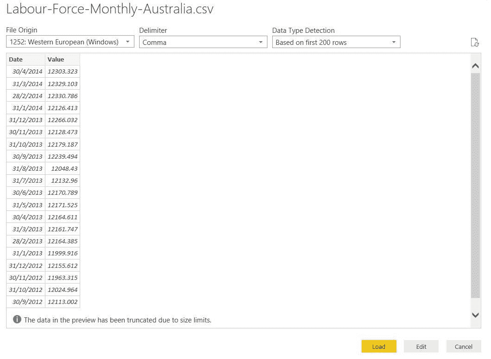
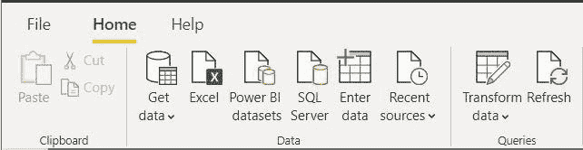
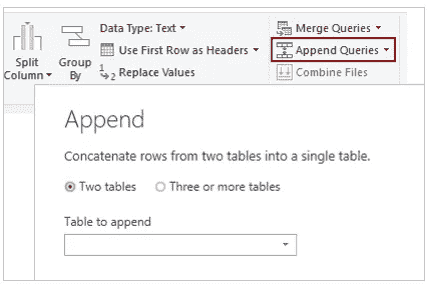
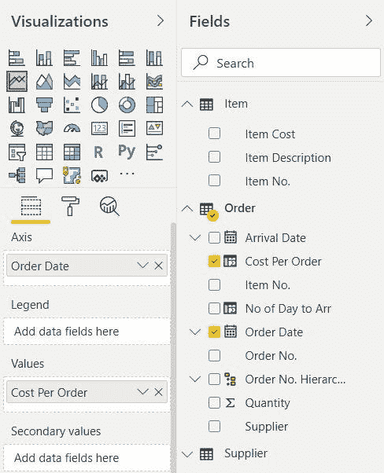
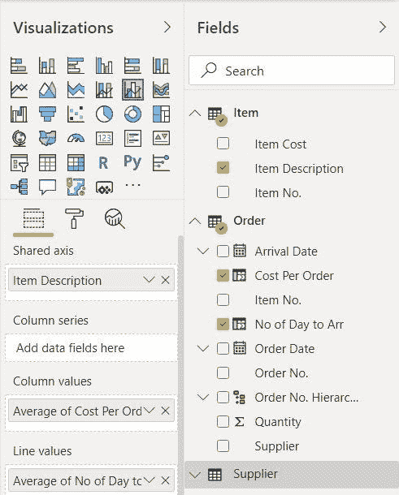

# 探索超级商务智能桌面

> 原文：<https://medium.com/analytics-vidhya/explore-power-bi-desktop-15e14228beb3?source=collection_archive---------30----------------------->

我最近通过 Windows 应用商店更新了我当前的 Power BI 桌面版本，现在是在安装后分享 Power BI 的新用户界面(UI)的好时机。在 2019 年，在我的专业文凭学习期间，Power BI 桌面皮肤处于黑暗模式。我不确定微软团队何时将 Power BI 桌面的皮肤更改为白色模式，并在右侧显示滤镜窗格。

我注意到的另一个新特性是 Power BI 为仪表板和报告提供了主题选项。这个主题并不是指 Power BI 桌面的皮肤。您必须从 Power BI 设置中启用此功能，它允许您更改主题以适合您的仪表板和报告演示。

为此，导航到文件菜单，选择选项和设置，然后选择选项。接下来，在预览功能部分，选择自定义当前主题。

单击“确定”按钮继续。它可能会提示您重新启动机器，以便它生效并启用主题功能。Power BI 桌面中有一个内置主题列表，你可以参考这个[链接](https://docs.microsoft.com/en-us/power-bi/desktop-report-themes)了解更多细节。此外，您可以选择导出主题的 JSON 文件。您可以通过手动修改该文件中的设置来进行修改。您可以重命名这个经过微调的 JSON 文件，然后导入它。它为用户提供了更多的控制来根据他们的仪表板和报告定制主题。

# 熟悉界面

在微软网站上，它分享了下面每个窗格的详细信息。我摘录了图片及其说明。

1.  **功能区** —显示与报告和可视化相关的常见任务。
2.  **报告视图，或画布** —这是创建和安排可视化的地方。您可以通过选择左栏中的图标在**报告**、**数据**和**模型**视图之间切换。
3.  **页面选项卡** —此区域是您选择或添加报告页面的地方。
4.  **可视化窗格** —在该窗格中，您可以更改可视化、自定义颜色或轴、应用过滤器、拖动字段等。
5.  字段窗格—在该窗格中，可以将查询元素和过滤器拖到可视化窗格的**报告**视图或**过滤器**区域。

> *通过选择小箭头，您可以折叠可视化和字段窗格，以便在* ***报告*** *视图中提供更多空间。*

上面的屏幕截图显示了筛选器窗格的可折叠窗格的示例。它也适用于可视化和字段窗格。

# 连接到数据源

Power BI Desktop 连接到许多类型的数据源，您可以从本地数据库、excel 表格或云上的数据中进行选择。大约有 70 种不同类型的数据源可用。从**主页**选项卡上的功能区转到**获取数据**，开始访问数据。然后，选择一个信号源来建立连接。对于某些数据源连接，您可能需要输入用户凭证来认证和访问数据。以下是 Power BI 的获取数据功能中可用的数据连接器列表。

它会将您带到显示数据源实体(表)的导航窗口。它为您提供了所选数据的预览。在同一窗口中，您可以选择加载或转换数据。如果您没有进行任何更改、格式化和数据转换，那么您可以单击“加载”按钮，else Transform Data 允许您在将数据导入 Power BI Desktop 之前执行数据清理和转换。您也可以在导入后编辑数据。

# 转换要包含在报告中的数据

Power BI Desktop 包括 **Power Query Editor** 工具，可以帮助您塑造和转换数据，以便为您的可视化做好准备。要启动超级查询编辑器工具，有两种方法可以打开此窗口:

1.  使用主页功能区上的**转换数据**按钮。[适用于 2020 年 4 月版]
2.  使用**主页**功能区上的**编辑查询**按钮。[对于旧版本]

如果点击主页功能区上的**输入数据**按钮(如上所示)，会弹出一个**创建表格**窗口。在该窗口中，点击**编辑**按钮，弹出功率查询编辑器工具。还记得我之前提到的**加载**和**转换数据**按钮，当我们从**获取数据**按钮加载数据时？“转换数据”按钮也可以打开超级查询编辑器，其功能与“创建表”窗口的“编辑”按钮类似。我不打算在这篇博客中讨论任何数据转换。这是一个需要讨论的大话题，所以我认为在下一篇文章中与一些好的例子和数据集分享是很好的。

# 从多个来源连接

大多数情况下，我们在构建报表时会处理多个数据源。您可以使用超级查询编辑器工具将多个来源的数据合并到一个报告中。它是如何组合成一张桌子的呢？在 Power BI Desktop 中，它有一个名为**Append query**的特性，可以将新表中的数据添加到现有的查询中。

# 创造视觉效果

如果我没记错的话，在 Tableau 中，当选择字段时，Tableau 会向用户建议合适的可视化方式，以便在仪表板或报告中使用。我不确定 Power BI 是否有类似的功能。在报告视图中，将一个字段拖到报告视图画布上，Power BI Desktop 会自动创建一个表视图作为默认视图。这看起来像一个报告列表，因为它以表格形式列出了选定的字段。如果您愿意，可以选择不同的视觉效果，如条形图或折线图。

要创建可视化效果，请从“字段”窗格中选择一个字段，您可以将该字段拖到可视化效果窗格中的数据字段(值)中，也可以单击复选框。屏幕上将显示一个表格可视化，您可以从可视化窗格中选择另一种类型的可视化。创建可视对象没有先后顺序，您可以在选择字段之前选择一个可视对象。每个视觉效果都有一个不同的可视化窗格，例如，如果您选择双图表，下面的屏幕截图显示了共享的轴、列和行值。当您选择饼图时，它会显示图例和值。

# 发表报告

在对仪表板或报告进行了所有艰苦的工作之后，您想要发布它并与其他人共享。您可以在 Power BI Desktop 中通过单击主页菜单中的发布按钮来完成此操作。系统将提示您登录 Power BI，按照步骤操作，然后您将看到发布的报告。

在撰写本文时，我没有任何已发表的报告可以展示。因此，我不能在这里展示这些步骤，也不能展示如何**将一个视图固定到仪表板**。此功能允许您选择是将可视内容固定到现有仪表板还是创建新仪表板。

# 结论

本文是 Power BI 桌面的高级演练，解释了如何使用它来创建视觉效果和发布仪表板和报告。我在这篇文章中不涉及可视化和发布的解释，我将在以后的下一篇文章中介绍它们。

我希望这篇文章能给 Power BI Desktop 的特性留下一个好印象，并让您对这个工具有所了解。此外，Power BI Desktop 的按钮一目了然，因此您在使用和导航时应该不会有任何问题或麻烦。除此之外，一直使用 Microsoft Excel 和 Tableau 进行数据分析的人可能会发现 Power BI Desktop 也有一些类似的功能，因为 Power BI Desktop 也是另一种数据可视化工具。

参考:microsoft.com

*原载于 2020 年 5 月 16 日***。**