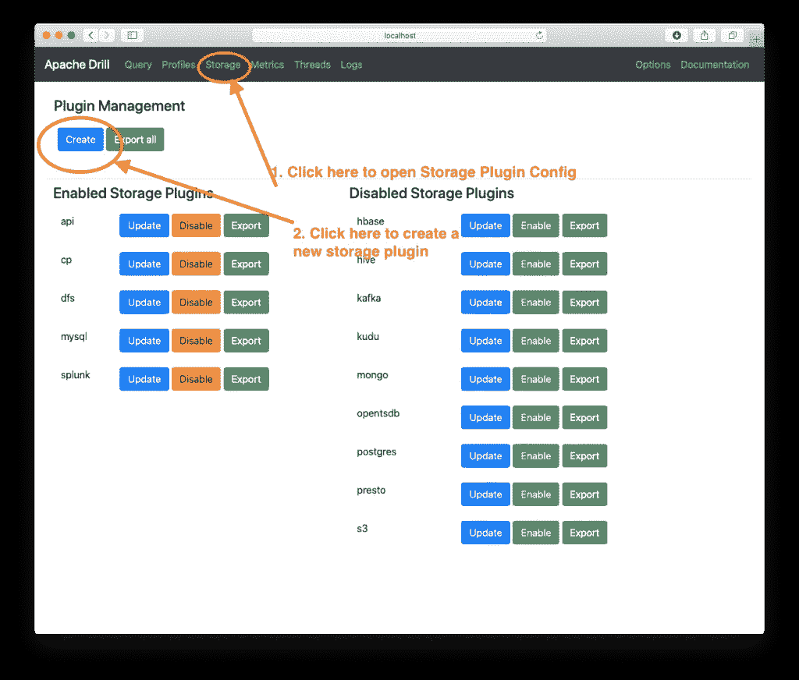
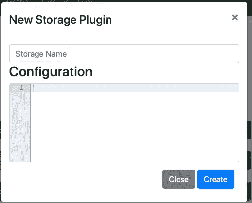

# 无需编码即可探索 REST APIs

> 原文：<https://medium.com/analytics-vidhya/explore-rest-apis-without-coding-abc9a94ec879?source=collection_archive---------14----------------------->


数据科学家面临的最大挑战之一是大量数据格式不方便。REST APIs 就是这样一种格式。在大型企业中，由于几个原因，这些尤其成问题。通常大量的参考数据只能通过 REST API 访问，这意味着要访问这些数据，用户需要学习足够的 Python 或 R 来访问这些数据。但是如果你不想编码呢？

我见过的处理这种情况的典型方法是在 Splunk 或 Elasticsearch 等分析系统中创建参考数据的副本。这种方法的问题是多方面的。首先，是建立数据流的工程工作(耗费时间和金钱)。最重要的是，您现在有了重复的存储成本，而且您现在维护着同一信息的多个版本。

我看到的另一种方式是每个 API 所有者为他们的 API 提供一个图形界面，这很好，但问题是现在数据是烟囱式的，不能与其他数据结合，这完全违背了它的目的。一定有更好的方法…

看看下面的视频教程，看看一个演示！

# 更简单的方法

如果您可以直接从 API 中查询数据，而不必提取数据、编写代码或做任何其他事情，那会怎么样？事实证明，有了最新版本的 Apache Drill，你完全可以做到这一点！Drill now 使您能够查询 REST APIs，就像它们是本地数据库表一样。

# 你是怎么做到的？

您需要做的第一件事是获得一些关于您要查询的 API 的信息。具体来说，您需要知道:

*   数据的 URL 路径，以及需要传递给 API 的任何其他参数
*   API 如何处理认证
*   任何连接信息，如代理

一旦有了这些信息，就可以配置 Drill 来连接到您的 API。

# 创建连接

首先，您需要创建一个新的*存储插件*来连接 API。点击屏幕顶部的**存储**，然后点击左上角的**创建**按钮。



接下来，您将看到一个带有空白窗口的弹出窗口。



您可以在这里输入 API 的配置细节。在存储名称区域，给它起一个名字，比如 ***api*** ，或者 ***http*** 之类的，这样你就知道你在查询什么样的数据了。该名称仅供参考，对查询执行没有影响，但它是您将在查询中使用的名称。

下面的代码片段显示了 Drill 中所有可用的全局配置选项。其中大多数应该是不言自明的。([这里有完整的文档](https://github.com/apache/drill/tree/master/contrib/storage-http))唯一必须设置的是**类型** ，它们应该设置为“http”和**启用**设置，它们应该设置为“true”。

```
{"type": "http","cacheResults": **false**,"connections": {},"timeout": 0,"proxyHost": **null**,"proxyPort": 0,"proxyType": **null**,"proxyUsername": **null**,"proxyPassword": **null**,"enabled": **true**}
```

在 API 存储插件中，Drill 允许您定义多个连接。例如，假设您有一个天气 API 和一个股票价格 API。您可以为它们中的每一个定义单独的连接，这样当您执行查询时，您就可以分别查询每一个，如下所示:

```
**SELECT** ***FROM** api.stock.`AAPL`-- or**SELECT** ***FROM** api.weather.`baltimore`
```

# 配置连接

接下来，您必须建立实际的连接。要使用教程中显示的 COVID 跟踪 API 示例，只需将下面的代码片段剪切并粘贴到**连接**旁边的花括号中。

```
"covid": {"url": "[https://covidtracking.com/api/v1/](https://covidtracking.com/api/v1/)","method": "GET","headers": **null**,"authType": "none","userName": **null**,"password": **null**,"postBody": **null**,"params": **null**,"dataPath": **null**,"requireTail": **true**}
```

如您所见，这些参数中的大部分可以留空。关键参数是 URL 参数，它显然是正在讨论的 API 的 URL。

演示中使用的完整配置如下所示:

```
{"type": "http","cacheResults": **false**,"connections": {"covid": {"url": "[https://covidtracking.com/api/v1/](https://covidtracking.com/api/v1/)","method": "GET","headers": **null**,"authType": "none","userName": **null**,"password": **null**,"postBody": **null**,"params": **null**,"dataPath": **null**,"requireTail": **true**}},"timeout": 0,"proxyHost": **null**,"proxyPort": 0,"proxyType": "direct","proxyUsername": **null**,"proxyPassword": **null**,"enabled": **true**}
```

连接配置中的其他选项使您能够连接到需要身份验证的 API，以及启用各种优化，但是现在，我们可以将它们保留为空。你当然可以在上面链接的文档中读到它们。

# 查询 API

现在您已经完成了配置设置，可以开始查询了。查询 API 和查询常规数据库表之间的唯一区别是 FROM 子句。在下面的例子中，您可以看到我用来查询 COVID tracker API 的基本查询。在这种情况下，FROM 子句由用点分隔的三部分组成:

1.  存储插件，在我们的例子中应该是 api 或者其他你称之为插件的东西
2.  连接名称。这是您在配置中指定的实际 API 连接的名称。
3.  最后一个组件是任何表，或者您需要传递给 API 以获取数据的其他 URL 参数。COVID 站点实际上有几个 API，因此您可以为每个 API 创建单独的连接，或者将它包含在 FROM 子句中，如下所示。结果是这个文本被附加到 URL，因此检索到的完整 URL 是:[https://covidtracking.com/api/v1/states/daily.json.](https://covidtracking.com/api/v1/states/daily.json.)

```
**SELECT** ***FROM** api.covid.`states/daily.json`
```

一旦你完成了，你就可以执行查询，你应该得到结果！我已经用简单的 API(如 COVID tracker)和非常复杂的 API(如 JIRA)对此进行了测试，它在所有这些情况下都工作得很好。

# 结论

总之，这个简短的教程演示了如何使用 Drill 从 REST API 中查询数据。当您将其与可视化工具(如 Superset)结合使用时，您可以快速构建交互式仪表板。正如你从教程中看到的，这花了我大约 15 分钟的时间。我没有工程支持，只有钻机和超集的工作安装。如果你有任何问题，请在下面的评论中发表，或者发邮件给我。