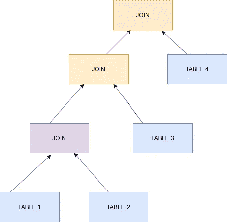

# 探索您的 SQL 查询执行

> 原文：<https://medium.com/analytics-vidhya/explore-your-recursive-sql-query-f15b120e518e?source=collection_archive---------7----------------------->

西蒙·米加吉在 [Unsplash](https://unsplash.com/s/photos/plan?utm_source=unsplash&utm_medium=referral&utm_content=creditCopyText) 上的照片

有了从[以前写的关于递归 cte 的文章](/@isharamadhavi1/sql-recursive-queries-2aa670906ec1)中获得的基本理解，是时候探索这些查询背后的执行世界了。尽管递归查询的概念相对较新，但执行计划通过识别查询中可能存在的缺陷，在优化查询性能方面发挥了重要作用。

对优化如何发生的基本理解是有价值的。MySQL 使用客户端-服务器协议。下面简要列出了该方案的步骤。

1.  一旦客户端点击查询的*执行*，服务器首先分析查询的语法。*语法* *分析*验证语言成分是否正确形成以构建有效语句。
2.  接下来，评估语法上合法的查询的含义，这被称为*语义* *分析*。在此阶段，将检查所有引用数据库对象和主机变量的准确用法。
3.  一旦编写的 SQL 查询通过了这两项检查，它将被服务器授予一个 SQL ID 和(MD5)散列值。哈希值基于语句的几百个字符，所以可能会发生哈希冲突，尤其是对于长语句。
4.  下一步是将查询解析成解析树。记住这个目标，查询被暴露给一个共享内存区域(*共享池*)，其中包含我们已经执行的 SQL 查询的解析树和执行计划。每个唯一的 SQL 查询将拥有一个唯一的共享 SQL 区域。之后，解析可以通过两种主要方式进行。

我*。软解析*

如果从共享池中为 SQL 查询生成的哈希值找到匹配的哈希值，将使用相同的解析树和执行计划。

二。*硬解析*

如果没有找到匹配的哈希值，查询将被交给*查询优化器*来选择最佳执行计划和解析树。MySQL 使用一个*基于成本的优化器*，这意味着它试图预测各种执行计划的成本，并选择最便宜的。

## 执行计划

MySQL 不像许多其他数据库产品那样生成字节码来执行查询。相反，查询执行计划充当查询执行引擎为了产生查询结果而必须遵循的指令树。执行计划中最重要的优化之一是连接优化。下面的概念图说明了多表查询是如何以 4 个表的连接形式在我们的脑海中形成的。

然而，MySQL 查询执行计划总是以*左深树*的形式完成这项工作，如下所示。

5.下一个阶段是查询执行阶段。与优化阶段相比，执行阶段通常没有那么复杂:MySQL 只是遵循查询执行计划中给出的指令。

6.查询执行的最后一个阶段是将结果集发送到客户端，即出现空结果集时的事件。

下图简要说明了查询的执行阶段。

记住这个简单的概念，让我们用[上一篇关于递归查询的文章](/@isharamadhavi1/sql-recursive-queries-2aa670906ec1)中的一个例子来阐明查询执行计划的想法。

我们创建了一个具有父子关系的皇室成员示例表，并提高了我们编写简单递归查询的技能。现在，我们可以通过从 SQL 编辑器执行我们的查询，然后在 MySQL Workbench 的**查询**结果选项卡中选择**执行计划**选项卡，来检查服务器是如何创建其执行计划的。默认计划以**可视**格式显示，我们也可以将其更改为**表格**。或者，如果我们只需要表格解释，在任何查询的最开始使用 **EXPLAIN** 关键字。下面的递归查询将按照数据库表输出伊丽莎白女王的后代(包括她自己)。

查询的执行计划如下。

来自 MySQL 工作台的查询执行计划

## **需要快速浏览的内容:**

*   这个执行计划也采用了*左深树*的形式。
*   每个 **query_block#** 表示查询中的一个 SELECT 语句。

query_block#1:最外层的 SELECT 语句

query _ block # 2:UNION 操作的一个输入(定位点成员)

query _ block # 3:UNION 操作的下一个输入。(递归成员)

*   自底向上的执行树逐步构造最终的结果集。
*   框右上角的数字:过滤后表中预期使用的行数
*   方框左上角的数字:访问该表的相对成本
*   代表查询的锚部分的 query_block#2 被估计为全表扫描的结果。即使我们要执行查询，我们也必须遍历整个表，以便找出包含姓名“ELIZABETH”的行。因此，我们可以观察到服务器做出了正确的选择。区块用红框表示，表示运营成本相对较高。紧靠块下方的文本是所使用的*表/别名*。
*   左边的菱形操作符代表一个嵌套循环，换句话说，是表上的一个**连接**。名称*嵌套循环*暗示嵌套循环的*。原因是，在执行连接操作时，我们从一个表中获取一条记录，并从下一个表中检索所有匹配的记录，就像执行嵌套的 for 循环一样。这里嵌套循环的一个输入是用红框表示的 *top_down_cte* (递归查询本身)记录。匹配成员表中的记录是另一个输入。为了从成员表中获取匹配结果，需要读取 *top_down_cte* 的所有记录。因此， *top_down_cte* 在查询执行计划中也被标记为**全表扫描**，在*红色*框内。嵌套循环的另一个输入，在*绿色*框中，使用非唯一键查找，并指示开销为中低。如果行数很多，操作成本可能会很高。突出显示的文本行给出了用于连接操作的外键约束或任何使用的索引的名称。PARENT_ID 列不是唯一的，但是它通过外键约束引用 ID 列，该列是同一表的主键。由于这个原因，给定一个来自 *top_down_cte，*的 ID，查找其 PARENT_ID 与来自 MEMBERS 表的给定 ID 相似并不困难。因此，该块显示为绿色。*

这些信息集合一起给出了改进我们的查询的可能方法。已经看到 query_block#2 是红色的，并且相对来说包含一个开销很大的操作，也许我们可以尝试索引表中的 NAME 列，这样它就不会完全扫描表。相反，它可以使用 NAME 列上的索引来筛选出名称为“ELIZABETH”的行。下面的执行计划证明了这一点，如我们所料，用绿色表示 query_block#2。另外，块#2 的查询成本减少了三分之一。

在成员表中索引名称列之后，从 MySQL Workbench 执行查询计划

我希望您喜欢学习 SQL 执行背后的真实世界。从这篇文章中得到的启示是，*永远不要在没有优化的情况下实现查询！*

**参考文献**

 [## 执行计划-面向开发人员的 Oracle SQL & PL/SQL 优化 2.3.1 文档

### 当您点击执行时，您的 SQL 语句会发生什么变化？首先，Oracle 检查您的语句是否有明显的错误。的…

oracle.readthedocs.io](https://oracle.readthedocs.io/en/latest/sql/plans/index.html)