# 在员工晋升数据集上探索 Azure ML Studio

> 原文：<https://medium.com/analytics-vidhya/exploring-azure-ml-studio-on-employee-promotion-dataset-e68af13e524?source=collection_archive---------21----------------------->

我当时正在探索 Azure ML Studio Classic，并想到处理一个数据集。在这篇文章中，我将解释我用于这个员工晋升数据集的方法。

此数据集可在此处获得[:https://data hack . analyticsvidhya . com/contest/wns-analytics-hackathon-2018-1/](http://:https://datahack.analyticsvidhya.com/contest/wns-analytics-hackathon-2018-1/)

# **数据可视化**

一旦数据集被拖到设计器中，我们就可以将它可视化。

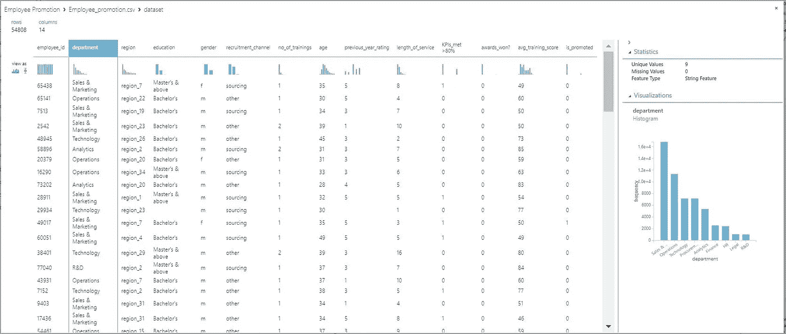

可视化员工晋升数据集

当我们观察产出变量的分布时，即**被提升了**，我们看到只有 8.5%的员工得到了提升。这是一个不平衡的分类问题，一个阶级占多数，另一个阶级占少数。

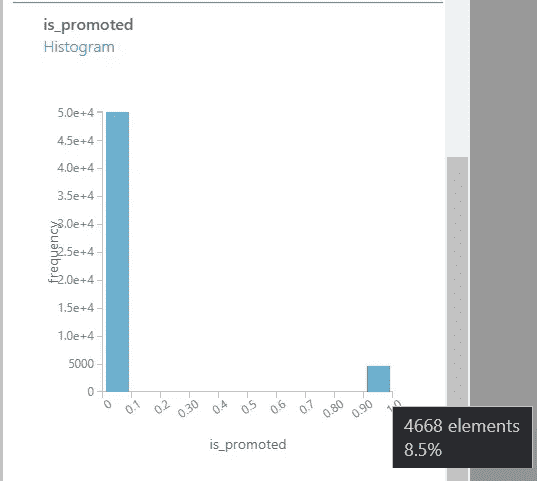

晋升员工的不平衡等级

通过查看数据我们了解到有 **7 个分类特征**:部门、地区、学历、性别、招聘渠道、KPI _ met>80%、获奖情况？我们有 **5 个数字特征**:训练次数、年龄、上一年评级、服务年限、平均训练分数。

现在我们**从数据集中删除 employee_id 列**，因为每个雇员都有一个唯一的 id，这对我们的预测没有用。之后，我们使用分割数据模块将数据分割成训练和测试部分。

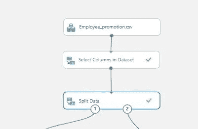

将数据分为训练和测试部分

我们将数据分成 70%用于训练，30%用于测试，为了能够重复我们的预测，使用了 0 的随机种子。

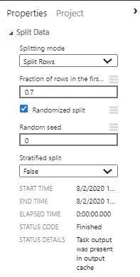

# **数据清理和特征工程**

数字数据列“上年评级”缺少值，因此使用 [**鼠标算法**](https://docs.microsoft.com/en-us/azure/machine-learning/studio-module-reference/clean-missing-data) 对其进行了清理。

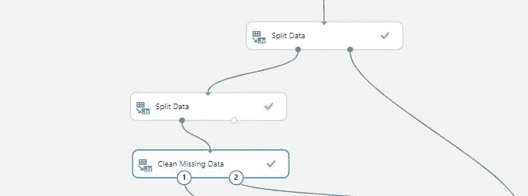

使用鼠标清理数字特征。

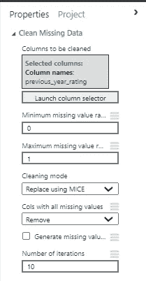

用于清洗的属性

我们可以使用选定的色谱柱选择要清洗的色谱柱。**最小缺失值比率**表示特征列中缺失值开始清理过程所需的最小行数。类似地，**最大缺失值比率**意味着开始清洗过程时缺失的最大行数。只有在这两者之间具有缺失值行计数的要素列才会被清理。我们有不同的方法来清理丢失的数据，如下所示。

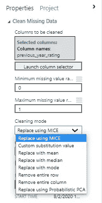

不同的清洁方法

现在我创建了两个新的专栏，分别由**宁滨的年龄和工龄特写**。尝试了两种不同的边缘，但下面的效果更好。

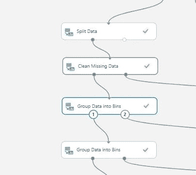

对数据进行分组以获取新功能

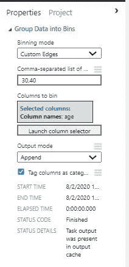

年龄列宁滨的边缘

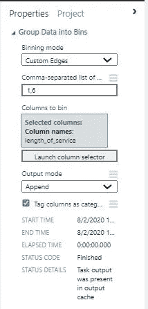

服务年限列宁滨的边缘

年龄栏被分成 3 组，一组从小于 30 岁的**，另一组从 31 岁到 40 岁的**，最后一组是大于 40 岁的**。同样，对于服务年限一栏，我们有小于 1 年的**、 **2 至 6 年的**和大于 6 年的**。**********

****现在，我使用 MICE 清理了分类列 education，并使用编辑元数据模块将新入库的列 age 和 length_of_service 标记为分类数据。****

****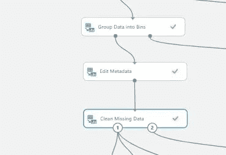********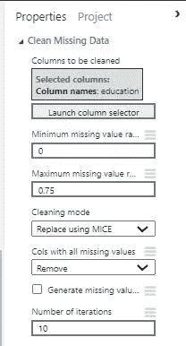****

****现在，在此之后，我根据 avg_training_score 和 previous_year_rating 创建了 **2 个新功能，因为被提升的员工将**高于平均水平**。******

**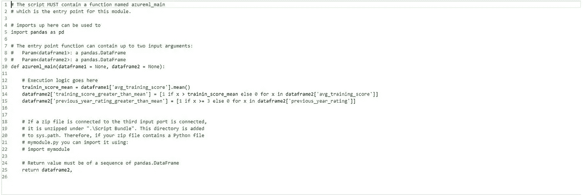**

**用于获取 2 个新要素的 Python 脚本**

**在此之后，使用 **Z 分数转换，即标准化**对数值数据进行标准化，这意味着数据点被转换为平均值为 0，标准偏差为 1。**

**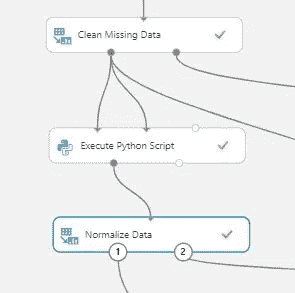****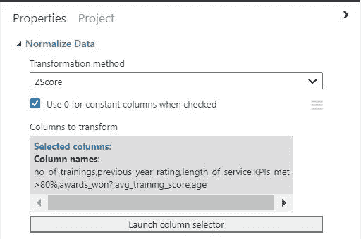**

**选择转换方法和要转换的列**

**因为这是一个不平衡的分类问题，所以我尝试使用 [**击打**](https://docs.microsoft.com/en-us/azure/machine-learning/studio-module-reference/smote) 。在使用 SMOTE 后，培训数据中积极班级(即获得晋升的员工)的百分比从 8.6%增加到 22%。**

**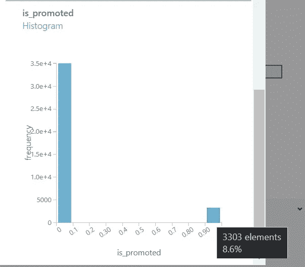**

**应用 SMOTE 前的分布**

**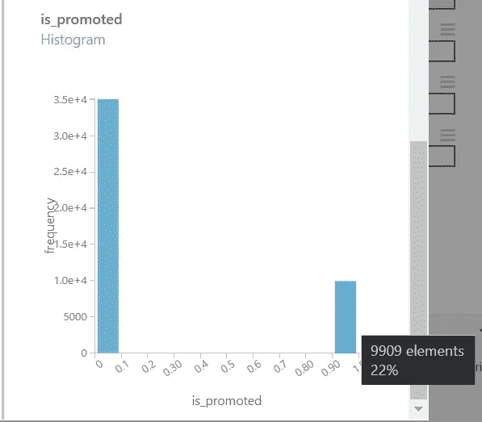**

**应用 SMOTE 后的分布**

**最后一步是**对分类值进行热编码**，这是使用转换为指标值模块完成的。转换后，年龄列被转换为 2 列，无论雇员是男性还是女性，因此这 2 列是高度相关的**，因此我们使用数据集模块中的选择列删除这些列中的任何一列。****

# ******模特培训******

****在尝试了微软 azure ml studio 中可用的不同模型后， [**两类提升决策树**](https://docs.microsoft.com/en-us/azure/machine-learning/studio-module-reference/two-class-boosted-decision-tree) 得出了最高的 F1 分数。****

****训练模型、评分模型和评估模型用于检验模型的评分。****

****为了使用测试数据，可使用**应用转换模块**将对列车数据进行的转换应用于测试数据。****

****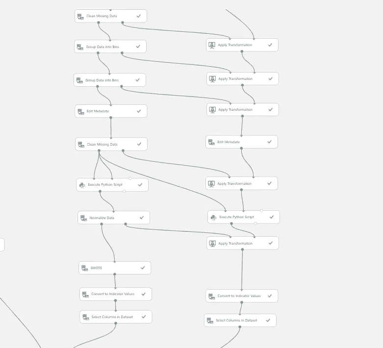****

****对测试数据应用转换****

****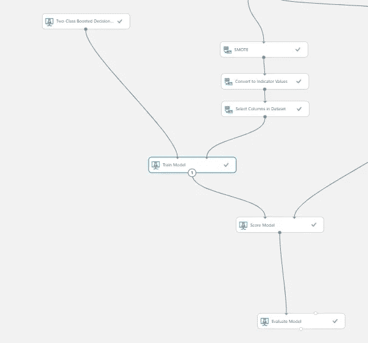****

****模型训练和评估****

****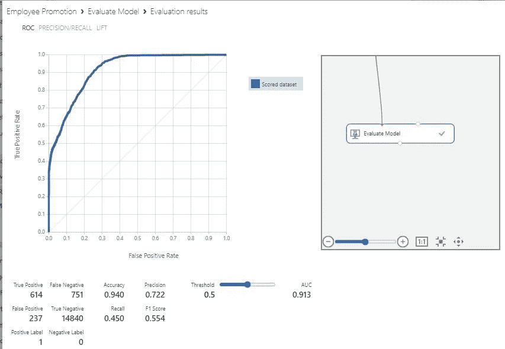****

****模型度量****

****该模型在测试数据分割上给出了 0.554 的 **F1 分数，该测试数据分割是从数据集开始进行的。******

****以下是 Azure ML Studio Classic 中完整实验的链接:[**https://gallery . cortana intelligence . com/Experiment/Employee-Promotion**](https://gallery.cortanaintelligence.com/Experiment/Employee-Promotion)****