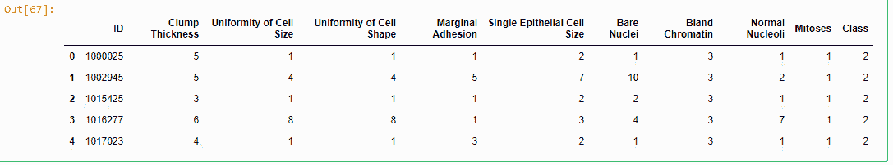
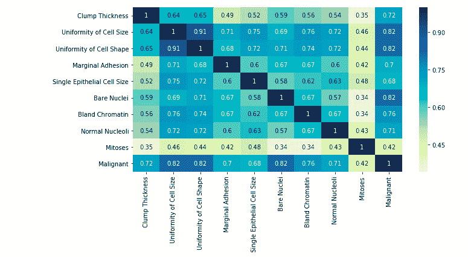
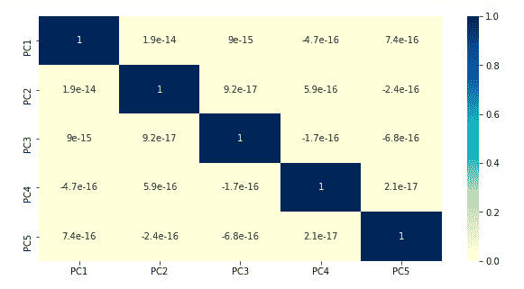
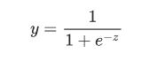
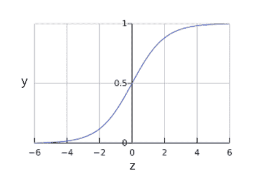
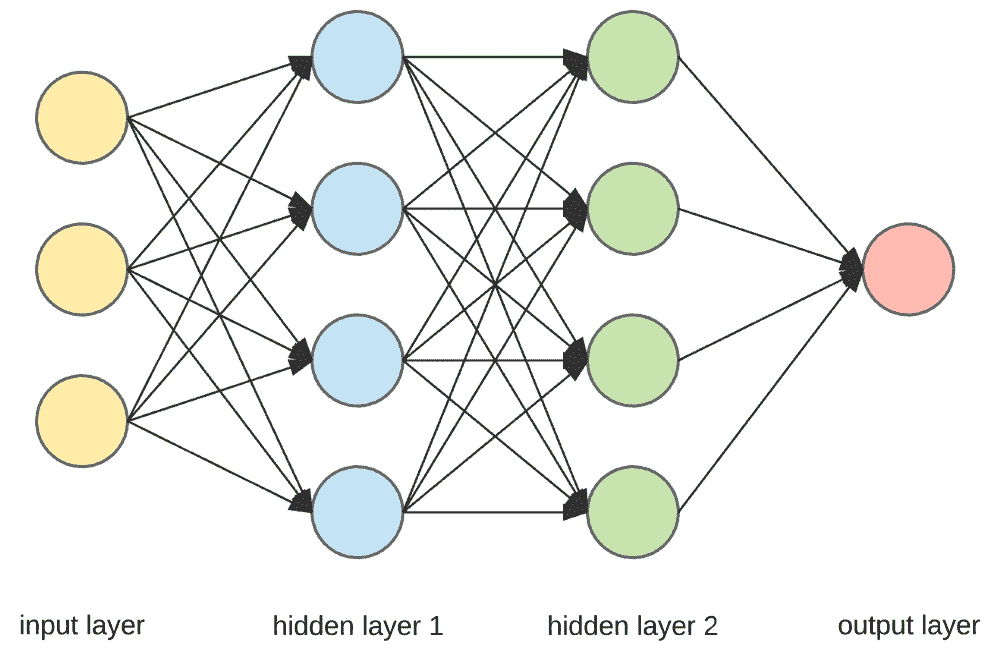

# 探索癌症数据

> 原文：<https://medium.com/analytics-vidhya/exploring-cancer-data-d57f2d72975c?source=collection_archive---------23----------------------->


[国家癌症研究所](https://unsplash.com/@nci?utm_source=medium&utm_medium=referral)在 [Unsplash](https://unsplash.com?utm_source=medium&utm_medium=referral) 上拍摄的照片

乳腺癌是一种非常严重的癌症，死亡率仅次于肺癌。

作为这篇文章的一部分，我想使用机器学习算法来探索统计模型如何从数据中学习并做出预测。这是一个[监督学习](https://en.wikipedia.org/wiki/Supervised_learning)的例子，其中我们已经确定了响应变量。

这个数据集取自[加州大学欧文分校机器学习图书馆](https://archive.ics.uci.edu/ml/datasets/Breast+Cancer+Wisconsin+%28Diagnostic%29)。

虽然医学研究人员肯定会从医学领域的角度来看这个数据集和问题，但我的意图是看数据科学的应用，并演示机器如何通过查看过去的历史数据来学习和预测。本练习缺少一些活动，如[特征工程](https://en.wikipedia.org/wiki/Feature_engineering)，这些活动可以丰富模型。

我使用 Python 作为语言，并使用 [Scikit Learn](https://scikit-learn.org/stable/index.html) 、 [XGBoost](https://xgboost.readthedocs.io/en/latest/) 和 [Keras](https://keras.io/) 库来构建统计模型。同样的情况也可以在 R 和 SAS 和 SPSS 以及其他很多机器学习工具中实现。

# 导入所需的库

```
# Import Basic libraries for Data-frames and manipulation
import pandas as pd
import numpy as np# Import libraries for visualization
import matplotlib.pyplot as plt
import seaborn as sns
%matplotlib inline# Import libraries for transformation
from sklearn.decomposition import PCA
from sklearn.impute import SimpleImputer# Import Statistical Modelling libraries
from sklearn.linear_model import LogisticRegressionCV
from sklearn.model_selection import train_test_split
from sklearn.tree import DecisionTreeClassifier
from sklearn.ensemble import RandomForestClassifier, 
from sklearn.ensemble import GradientBoostingClassifier
from sklearn.svm import SVC
import xgboost as xgb# Import Deep Learning libraries
from keras.models import Sequential
from keras.layers import Dense
from keras.wrappers.scikit_learn import KerasClassifier# Import library to compute performance metrics
from sklearn.metrics import accuracy_score, precision_score, recall_score, confusion_matriximport warnings
warnings.filterwarnings("ignore")
```

Pandas 和 Numpy 是标准的数据框架和数值程序库。Matplotlib 和 Seaborn 是用于可视化的。Scikit 学习库中的各种类已被导入(线性模型、决策树、随机森林等)。此外，还引入了极端梯度增强(XGBOOST)。

# 导入数据集

数据集由威斯康星大学欧文分校图书馆提供。Pandas 用于将数据导入到数据框中。数据帧是加载到内存中的简单(行、列)数据结构。

```
# Define the column names
column_names = ['ID','Clump Thickness','Uniformity of Cell Size','Uniformity of Cell Shape','Marginal Adhesion','Single Epithelial Cell Size','Bare Nuclei','Bland Chromatin','Normal Nucleoli','Mitoses','Class']
# Import the data
data = pd.read_csv("breast-cancer-wisconsin.data", header=None, names=column_names)
# Display the top 5 rows
data.head()
```

由于数据文件没有列标题，我们可以在导入数据集时定义列名。默认情况下，data.head()给出导入数据的前 5 行。

数据导入的输出如下所示。



这里的因变量或响应变量是具有值的**类**

2 —良性(无害)[66%的数据]

4 —恶性[数据的 34%]

除了 ID 之外，其余所有变量都被假定为连续变量，取值范围为 1-10。

# 数据转换

数据转换是数据科学过程中非常重要的一步，因为如果没有这一步，几乎不可能构建出**有意义的**统计模型。在我们进入模型构建过程之前，我们需要查看丢失的值，或者我们是否需要转换任何列。在观察数据时，我们发现“裸核”列有一个缺失值(用“？”标识)).我们可以考虑用均值或中值策略来代替它。我已经决定把中位数作为我的首选策略。

```
# ID column is converted to String
data['ID'] = data['ID'].astype(str)# Replace the ? with NaN value
data.replace(to_replace=['?'],value=pd.np.NaN, inplace=True)# Use the SimpleImputer to replace NaN with median
imputer = SimpleImputer(strategy='median', missing_values=pd.np.NaN)
data['Bare Nuclei'] = imputer.fit_transform(data['Bare Nuclei'].values.reshape(-1,1))# Create a new column - Malignant 
# 0- cancer is benign
# 1- cancer is malignant
data['Malignant'] = data['Class'].map({2:0,4:1})# Drop the column 'Class' as this is no longer required.
data.drop(['Class'], axis=1, inplace=True)
```

# 数据可视化

为了查看数据集中的数据元素以及它们是如何关联的，最好的图是[热图](https://en.wikipedia.org/wiki/Heat_map)。

我们使用 Seaborn 库来绘制热图。

```
plt.figure(figsize=(10,5))
sns.heatmap(data.corr(),annot=True, cmap = "YlGnBu")
```

热图如下所示



从热图中，我们可以看到，除了有丝分裂，其他所有属性都与恶性肿瘤呈高度正相关。此外，从热图中可以清楚地看出，各个属性之间也具有非常高的相关性(例如，细胞大小的不均匀性和细胞形状的均匀性)。

这表明存在多重共线性，我们需要执行[主成分分析](https://en.wikipedia.org/wiki/Principal_component_analysis)来消除这种情况。

# [主成分分析](https://en.wikipedia.org/wiki/Principal_component_analysis)

主成分分析是去除多重共线性和去除维度的标准方法(每当模型中有大量维度时)。这里，我们使用 PCA 创建了 5 个主成分。

```
X = data.drop(['Malignant','ID'],axis=1)
y = data[['Malignant']]
pca = PCA(n_components = 5)
pca.fit(X)
X = pca.transform(X)
```

上面的代码从 9 个变量中创建了 5 个主成分。

主成分分析后，5 个主成分的热图如下所示



很明显，各种主成分之间没有相关性，多重共线性已从我们的数据集中删除。

# 模型开发

现在我们进入开发统计模型的有趣部分。

为此，首先我们必须将数据集分为训练和测试两部分。当在训练数据集上训练模型时，使用测试数据集来测试统计模型的性能。

我们使用 scikit learn library 提供的 train_test_split 函数将数据拆分为训练和测试。75%的数据用于训练，25%用于测试。

```
np.random.seed(100)
X_train, X_test, y_train, y_test = train_test_split(X,
                                                    y,
                                                    test_size=0.25, 
                                                    random_state=100)
```

我们将种子设置为 100 以确保结果是可重复的。“test_size”参数决定了测试数据集的大小(在我们的例子中是 25%)。

统计模型的性能由[精度分数](https://developers.google.com/machine-learning/crash-course/classification/accuracy)、[精度和召回](https://developers.google.com/machine-learning/crash-course/classification/precision-and-recall)和 [F1 分数](https://en.wikipedia.org/wiki/F1_score)决定。混淆矩阵决定了模型如何进行实际分类和预测分类。

现在，为了衡量各种模型的结果，我们定义了一个用户定义的函数来打印指标得分。

```
# Function to print the accuracy, precision, recall and confusion matrix
# Inputs - predicted value (y_pred), actual value (y_true)
# Output - prints the various metrics in a % form
def printmetrics(y_pred, y_true):
    acc = np.round(accuracy_score(y_pred=y_pred, y_true=y_true)*100,0)
    prec = np.round(precision_score(y_pred=y_pred, y_true=y_true)*100,0)
    recall = np.round(recall_score(y_pred=y_pred,y_true=y_true)*100,0)
    f1score = np.round(f1_score(y_pred=y_pred, y_true=y_true)*100,0)
    print("Accuracy Score "+ str(acc)+"%")
    print("Precision Score "+ str(prec)+"%")
    print("Recall Score "+ str(recall)+"%")
    print("F1 Score "+ str(f1score)+"%")
    print("*** Confusion Matrix ***")
    print(confusion_matrix(y_pred=y_pred, y_true=y_true))
```

# [交叉验证的逻辑回归模型](https://en.wikipedia.org/wiki/Logistic_regression)

逻辑回归是我们将尝试拟合该数据的第一个模型(在 PCA 之后)。逻辑回归使用 Sigmoid 函数来拟合线性模型。sigmoid 函数由下式给出



其中 z = *b + w1x1 + w2x2 + … wNxN*

sigmoid 函数的曲线如下所示



来源:[关于机器学习的谷歌课堂](https://developers.google.com/machine-learning/crash-course/logistic-regression/calculating-a-probability)

[交叉验证](https://en.wikipedia.org/wiki/Cross-validation_(statistics))是一种对数据进行采样以创建 k 倍的技术。模型在 k-1 折叠上训练，并在 1 折叠上测试。这对提高模型的准确性特别有用。

```
logmodel = LogisticRegressionCV(cv=5)
logmodel.fit(X_train, y_train)
pred = logmodel.predict(X_train)
print("#### Training Set Prediction ####")
printmetrics(pred,y_train)
print("#### Testing Set Prediction ####")
printmetrics(logmodel.predict(X_test),y_test)
```

模型的输出如下所示

```
Training Set Prediction ####
Accuracy Score 98.0%
Precision Score 97.0%
Recall Score 97.0%
F1 Score 97.0%
*** Confusion Matrix ***
[[347   6]
 [  5 166]]
#### Testing Set Prediction ####
Accuracy Score 94.0%
Precision Score 92.0%
Recall Score 94.0%
F1 Score 93.0%
*** Confusion Matrix ***
[[99  6]
 [ 4 66]]
```

从上面给出的输出来看，准确率相当高，甚至精度和召回率也很高。该模型仅错误分类了训练集中 524 个数据点中的 11 个数据点和 175 个数据点中的 10 个数据点。

# [决策树](https://en.wikipedia.org/wiki/Decision_tree)

决策树可用于分类和回归，并使用树状结构来做出决策。

```
dtreemodel = DecisionTreeClassifier()
dtreemodel.fit(X_train, y_train)
pred = dtreemodel.predict(X_train)
print("#### Training Set Prediction ####")
printmetrics(pred,y_train)
print("#### Testing Set Prediction")
printmetrics(dtreemodel.predict(X_test),y_test
```

上述代码的输出结果如下

```
#### Training Set Prediction ####
Accuracy Score 100.0%
Precision Score 100.0%
Recall Score 100.0%
F1 Score 100.0%
*** Confusion Matrix ***
[[353   0]
 [  0 171]]
#### Testing Set Prediction
Accuracy Score 94.0%
Precision Score 92.0%
Recall Score 93.0%
F1 Score 92.0%
*** Confusion Matrix ***
[[99  6]
 [ 5 65]]
```

在训练数据集上，基于决策树的分类器能够以 100%的准确度进行分类，这是非常显著的。然而，在测试集上，它错误地分类了 11 个数据点。

无论如何，这仍然是精彩的表演。

# [随机森林](https://en.wikipedia.org/wiki/Random_forest)

随机森林是决策树的集合，使用[bagging(Bootstrap Aggregating)](https://en.wikipedia.org/wiki/Bootstrap_aggregating)算法进行最终预测。

```
rfmodel = RandomForestClassifier()
rfmodel.fit(X_train,y_train)
print("#### Training Set Prediction ####")
printmetrics(rfmodel.predict(X_train),y_train)
print("#### Testing Set Prediction")
printmetrics(rfmodel.predict(X_test),y_test)
```

下面给出了随机森林模型的输出。

```
#### Training Set Prediction ####
Accuracy Score 100.0%
Precision Score 100.0%
Recall Score 100.0%
#### Confusion Matrix ####
[[353   0]
 [  0 171]]
#### Testing Set Prediction
Accuracy Score 94.0%
Precision Score 92.0%
Recall Score 94.0%
#### Confusion Matrix ####
[[99  6]
 [ 4 66]]
```

同样，该模型能够以 100%的准确度拟合训练数据(零错误分类的数据点)。然而，在测试集上，它错误地分类了 10 个数据点。它与决策树非常相似。

# [支持向量机](https://en.wikipedia.org/wiki/Support-vector_machine)

支持向量机是另一类可用于分类和回归的机器学习算法。我将 SVM 应用于数据集，结果非常相似。

```
#### Training Set Prediction ####
Accuracy Score 100.0%
Precision Score 99.0%
Recall Score 100.0%
#### Confusion Matrix ####
[[351   2]
 [  0 171]]
#### Testing Set Prediction
Accuracy Score 94.0%
Precision Score 89.0%
Recall Score 97.0%
#### Confusion Matrix ####
[[97  8]
 [ 2 68]]
```

测试集和训练集的准确率都很高。这里，精确度很低，但是召回率很高。总的来说，这个算法仅仅错误分类了 10 个点。

除了上面提到的，我还运行了 [XGBoost](https://xgboost.readthedocs.io/en/latest/) 算法，它给出了与决策树和随机森林相似的性能。

# [神经网络](https://en.wikipedia.org/wiki/Artificial_neural_network)

神经网络或人工神经网络是另一类试图模仿人脑中神经元的深度学习算法。

典型神经网络具有输入层(数据)、隐藏层和输出层。神经网络的架构如下所示。



在乳腺癌数据集上，我运行了一个具有 6 个隐藏层的神经网络，每层至少有 30 个节点。使用的激活函数是隐藏层的 RELU。

```
Training Set Prediction ####
Accuracy Score 98.0%
Precision Score 96.0%
Recall Score 99.0%
#### Confusion Matrix ####
[[346   7]
 [  1 170]]
#### Testing Set Prediction
Accuracy Score 95.0%
Precision Score 92.0%
Recall Score 96.0%
#### Confusion Matrix ####
[[99  6]
 [ 3 67]]
```

准确性和其他性能测量与逻辑回归或决策树/随机森林算法没有太大不同。这表明当有多个数据变量和大量行时，神经网络工作得最好。对于更小的数据集(就像在这种情况下)，精度和性能与常规算法没有什么不同。

# 结论

从上面的应用来看，很明显，机器学习肯定会在生物学和复杂的癌症检测以及可能的治疗领域找到自己的路。利用有限的数据集，机器学习算法能够从训练数据集学习，并在测试数据集上以很高的准确度进行预测。

机器学习在许多领域都有应用，随着计算机的改进(更便宜的存储、内存、处理能力)，机器学习对于检测乳腺癌等复杂疾病非常有用。