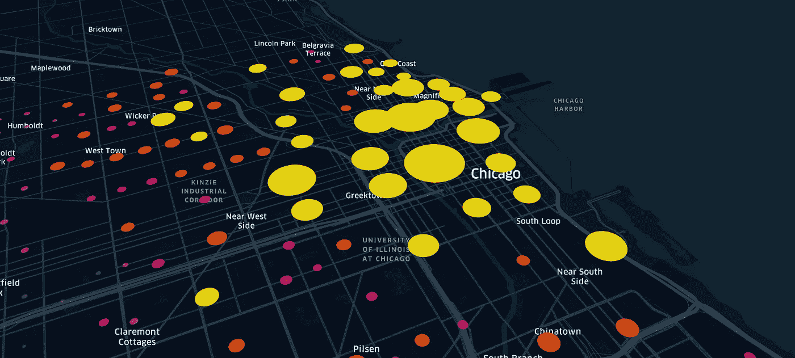
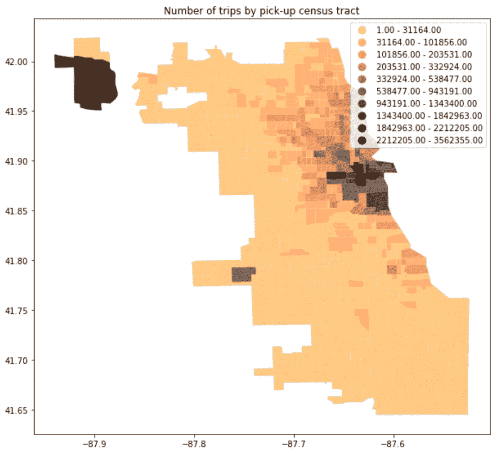
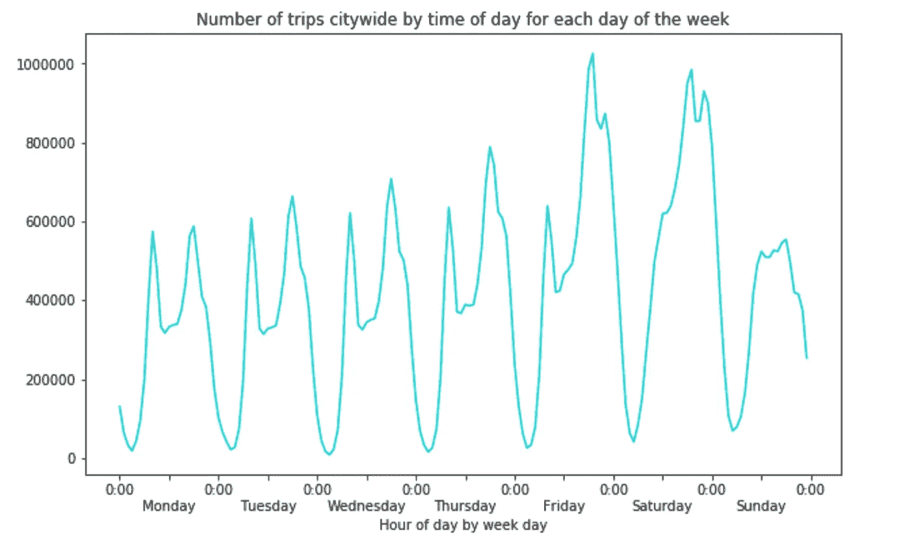
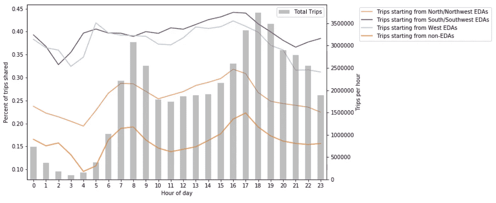
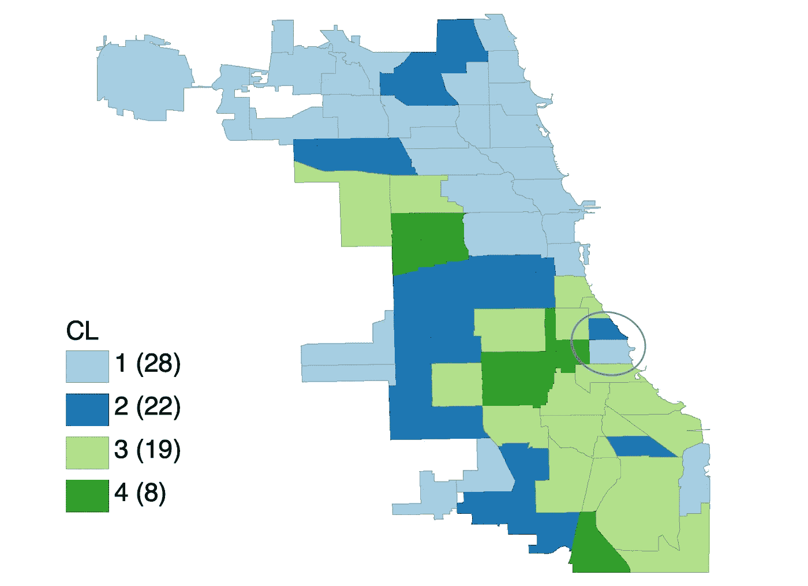

# 探索芝加哥对优步& Lyft 的需求

> 原文：<https://medium.com/analytics-vidhya/exploring-chicago-uber-lyft-demand-geospatial-analysis-in-python-and-geoda-af30f45e830?source=collection_archive---------12----------------------->

## Python 和 GeoDa 中的地理空间分析

芝加哥的乘车需求(使用[https://kepler.gl/](https://kepler.gl/)绘制的图表)

优步和 Lyft 等私人交通网络公司(TNC)的快速增长从根本上改变了人们在城市地区的通勤方式。不断增长的需求有几个影响，包括但不限于个体效率的提高和整体拥堵的增加。我觉得深入挖掘这个话题会很有趣。我主要想回答以下几个问题:

*   *需求在哪里？*
*   *什么时候需求量最大？*
*   哪些因素会影响我们与陌生人共乘的决定？

芝加哥数据门户网站发布了自 2018 年 11 月以来芝加哥市所有跨国公司提供的[数据](https://data.cityofchicago.org/Transportation/Transportation-Network-Providers-Trips/m6dm-c72p)。虽然一些敏感信息已被删除(例如，上车地点和下车地点被四舍五入到最近的人口普查区域)，但这些数据仍然为我们提供了大量信息来探讨所提出的问题。

大多数分析都是用 python 完成的。鉴于数据的巨大规模(我使用了 2018 年 11 月至 2019 年 10 月的数据，其中包括约 1 亿次旅行)，Dask 被用于执行并行计算。最终的 k-means 分析是在名为 GeoDa 的开源软件工具中进行的。对于任何对探索地理空间分析感兴趣的人来说，这可能是一个有趣的项目！

**需求在哪里？**

简单的计数图:按人口普查区域划分的出行次数

使用 Python 中的“geopandas”包，我绘制了一个计数地图，以可视化芝加哥的乘车需求。我们可以看到芝加哥市中心的需求最高。两个异常值:一个在左上角，一个在芝加哥西侧，分别代表奥黑尔国际机场和中途国际机场。

**什么时候需求量最高？**

按日期和时间划分的乘车需求

然后，我按照一天中的小时，然后是一周中的天，绘制了打车服务的平均需求。从上图中我们可以看到，需求遵循一个良好的循环模式:在工作日(周一至周四)，出行数量在高峰时段(早上 8:00 和下午 6:00)达到峰值。

周五和周六的打车需求最高，周日最低。在周五和周六，出行数量在下午 6:00 左右达到高峰，然后在晚上 10:00 左右再次达到高峰。

**是什么影响了我们拼车的决定？**

虽然打车对应用程序用户来说是一个方便且可能节省成本的选择，但它也可能带来一些问题。例如，研究表明，跨国公司增加了旧金山的拥挤程度和纽约车辆行驶的总距离。这个问题的一个潜在解决方案是与他人共乘，这就是为什么我想研究一下可能影响我们共乘决定的因素。

根据 CMAP(芝加哥都市规划局)的说法，经济隔离区是“低收入居民集中的地区”。将这些数据添加到我的分析中，我绘制了下图。

按地理区域和一天中的小时划分的拼车平均需求。

该图以灰色条显示每小时的平均需求(由右侧 y 轴标记)。同时，它显示了 EDAs 共享出行的百分比(由左侧 y 轴标记)。在我的分析中，共享乘车被定义为一种授权的共享乘车，最终可能会或可能不会成为实际的共享乘车。从上图我们可以看出:

1.  平均不到 1/3 的出行是授权共享乘车。
2.  在所有四个类别中，非 EDA 的共享乘车授权比例最低。
3.  北部 EDA 的共乘比例倒数第二，考虑到芝加哥的收入分布，这是合理的(北部的平均收入普遍较高)。
4.  南方和北方之间的差异相当大:授权共享乘车的百分比差异超过 10%。

上述结果似乎表明，社会经济因素可以显著影响一个人与陌生人共乘的决定。这在直觉上是合理的，因为共享乘车比普通乘车便宜。为了进一步验证这一结论，我将 TNC 数据与[困苦数据](https://data.cityofchicago.org/Health-Human-Services/hardship-index/792q-4jtu)和[犯罪数据](https://data.cityofchicago.org/Public-Safety/Crimes-2020/qzdf-xmn8)(也可以从芝加哥数据门户获得)合并，然后使用 GeoDa 进行了 [k 均值分析](https://geodacenter.github.io/workbook/7b_clusters_2/lab7b.html#:~:text=K%2Dmeans%20is%20a%20so,groups%2C%20with%20k%20determined%20beforehand.&text=GeoDa%20implements%20the%20cluster%20algorithms,Arthur%20and%20Vassilvitskii%20(2007).)。

k-均值聚类图基于犯罪、困难和授权共享乘车的百分比

正如所料，上面的 k-means 聚类图显示了一个明显的南北分界线。我在这个分析中没有应用空间约束，这解释了为什么一些蓝色区域被绿色区域包围。有趣的是，上图中圈出的两个蓝色区域代表海德公园，这也是芝加哥大学的所在地。这个地区的居民大多是教授、医生和学生，这可能解释了它与周围街区在犯罪率和艰苦程度方面的差异。

*结论*:

从上述分析中我们看到，市中心和两个机场的乘车需求最高。高峰时段以及周五和周六也是需求高峰。

推广拼车有可能减少因对打车服务的需求不断增长而造成的拥堵。上述分析还表明，收入仍然是影响我们拼车决定的主要因素之一。

这个项目很容易复制。数据可以在上述文章和下面的链接中找到。虽然原始数据可能太大，但是如果您感兴趣，您总是可以先下载一部分数据，然后从那里开始:)。

*参考文献:*

*   以上分析的代码可以在这里找到:【https://github.com/tianyueniu/urbanmobility】T4。
*   本项目的部分分析参考了 CMAP 的一份报告([*https://www . cmap . Illinois . gov/updates/all/-/asset _ publisher/uimfslnffmb 6/content/new-data-allows-an-initial-look-at-ride-hailing-in-Chicago*](https://www.cmap.illinois.gov/updates/all/-/asset_publisher/UIMfSLnFfMB6/content/new-data-allows-an-initial-look-at-ride-hailing-in-chicago)*)。CMAP 分析最初是在 R.* 中完成的
*   在这里可以找到一个用 Python 讲解地理空间分析的很棒的课程:[https://automating-gis-processes.github.io/site/](https://automating-gis-processes.github.io/site/)。
*   对于那些对地理空间分析感兴趣的人来说，地理数据是一个很好的入门工具。它的文档可以在这里找到:[https://geodacenter.github.io/](https://geodacenter.github.io/)。

欢迎任何问题和评论！谢谢！