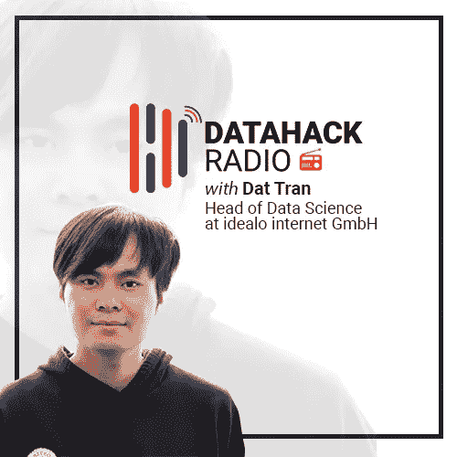
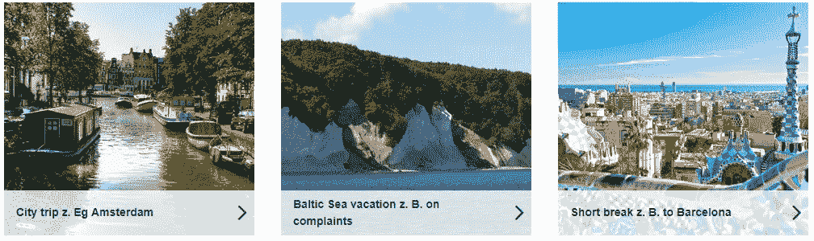

# 用 Dat Tran 探索计算机视觉和数据工程

> 原文：<https://medium.com/analytics-vidhya/exploring-computer-vision-and-data-engineering-with-dat-tran-682987137f78?source=collection_archive---------1----------------------->

# 介绍

计算机视觉技术如何在工业环境中工作？一个组织如何使用数据工程来扩大其运营规模？

这些是每个有抱负的数据科学家必须意识到的问题。idealo internet GmbH 的数据科学主管 Dat Tran 是阐明这些问题的最佳人选。

在来到 idealo 之前，Dat 已经从事过各种数据工程项目，现在他领导着一个数据科学家团队，研究非常酷的计算机视觉问题。这是自我们推出 DataHack Radio 以来我最喜欢的剧集之一——所涵盖主题的深度和广度，加上 Dat 令人难以置信的知识，使这成为一个必听的节目。

在这一集的 DataHack 广播播客中，Kunal 和 Dat 涵盖了多个主题，包括:

*   Dat 的数据科学之旅并不简单
*   他的团队如何在 idealo 使用计算机视觉
*   他在数据工程方面的丰富经验
*   实现模型和构建数据管道面临的挑战
*   给有抱负的数据科学家的建议，等等！

我写下了下面播客中的一些亮点。但是我强烈建议听完整段对话！Dat 带给这一集的能量是不可思议的。

*您可以在以下任何平台订阅 DataHack 广播播客:*

*   [**音云**](https://soundcloud.com/datahack-radio)
*   [**分析 Vidhya**](https://www.analyticsvidhya.com/blog/category/podcast/?utm_source=blog&utm_medium=datahack-radio-exploring-computer-vision-data-engineering-podcast-dat-tran)
*   [**iTunes**](https://itunes.apple.com/in/podcast/datahack-radio/id1397786677?mt=2)
*   [**谷歌播客**](https://www.google.com/podcasts?feed=aHR0cDovL2ZlZWRzLnNvdW5kY2xvdWQuY29tL3VzZXJzL3NvdW5kY2xvdWQ6dXNlcnM6NDU5MzM1NzYwL3NvdW5kcy5yc3M%3D)

# Dat Tran 的背景和数据科学之旅

Dat 的数据科学之旅不是一个普通的故事。他在大学期间甚至没有听说过“机器学习”，当时他的研究重点是投资银行。但是他很快意识到这个领域不适合他。那么接下来呢？

回到绘图板——硕士学位！在此期间，他的几个朋友开始从事机器学习，没过多久，Dat 就被引入了这个非常复杂的领域。

他在埃森哲的高级分析部门找到了一份工作。这是在“大数据”开始成为行业中的终极流行语时——进入这一领域的绝佳时机。一年后，Dat 跳槽到 Pivotal Inc .(以数据科学家的身份加入)，他认识到这是一个获得更多机器学习实践经验的绝佳机会。

在 Pivotal，Dat 参与了涵盖不同行业的各种项目，包括汽车和航空业。他在那里工作了两年多，并将他目前的知识和经验归功于他在 Pivotal 的工作。在此期间，他还在多个 PyData 会议上发表了演讲，这是一个真正令人印象深刻的成就。

Dat 现在担任 idealo internet GmbH 的数据科学主管，idealo internet GmbH 是一家成功的柏林初创公司，也是德国电子商务市场最大的门户网站之一。

# idealo 的数据科学——专注于计算机视觉

idealo 是一个价格比较网站(针对产品和酒店)，所以你可以想象该团队执行的众多数据科学功能——价格预测、索引、开发和使用推荐引擎等。然而，Dat 的团队专注于应用计算机视觉。

问一个合理的问题——计算机视觉在价格比较网站中有什么作用？idealo 有大量产品和酒店的图片:

Dat 用一个非常直观的例子解释了这一部分。idealo 列出了大约 200 万个酒店，每个酒店有 130 张图片(平均)。现在，有各种各样的酒店——小型、中型和大型酒店(豪华的五星级酒店)。

这些酒店房间的照片根据拍摄者的不同而不同。非豪华酒店通常有业主自己拍摄的图像，而五星级酒店则发送由专业人士拍摄的图像。这两类的画质差距相当大。

Dat 和他的团队使用一系列计算机视觉概念来分析和利用这些图像:

*   图像标记:该算法主要根据特征(卧室、浴室、接待处等)来标记图像。
*   图像排序:然后，这个算法以一种视觉上令人愉快的方式重新排序图像
*   Dat 团队的另一项任务是使用 CV 将图像从低分辨率提升到高分辨率

非常有趣的东西！很高兴看到计算机视觉在行业中取得进展，不是吗？

# 数据工程经验

我在 YouTube 上看到了 Dat 在 PyData 的演讲，很快我就意识到他是一位数据工程专家。他的演讲主题是“如何真正以酷的方式将数据科学模型投入生产！”您可以在下面查看:

在 idealo，有各种各样的工具用于数据工程，例如用于培训的 AWS 和用于将模型投入生产的 Kubernetes。

我个人认为数据工程是整个数据科学项目生命周期中非常容易被忽视的一个方面(被有抱负的数据科学家)。在你的数据科学家面试中，你肯定会遇到关于模型部署和软件工程其他方面的问题。播客的这一部分将为您提供一个行业就绪流程的鸟瞰图。

# 实施数据科学和数据工程面临的挑战

数据科学和数据工程是密不可分的——你不能把它们分开。Dat 用神经网络(准确地说是卷积神经网络(CNN))的例子解释了这一点。有相当多的 CNN 框架可供选择，如 RESNET、MobileNET、VGG 等。

这些 CNN 模型的挑战是它们有大量的超参数，因此使它们非常大。这带来了平衡准确性和速度的古老争论。你可以在研究中侥幸逃脱，但是当你在生产环境中工作时呢？这是一个重大障碍。

Dat 还提到了数据工程特定方面的一些常见挑战，包括:

> *“我们如何在 TensorFlow 后端使用经过 Keras 训练的模型？”*
> 
> *“我们需要把图像转换成某种格式吗？”*
> 
> *“我们如何对模型结果进行基准测试？”*

# 让自己了解最新的数据科学技术

> 当你自己做这些事情的时候，你最好了解一下这些事情

正如我们前面提到的，Dat 在工作中完成了大部分数据科学学习。没有什么比实际动手体验更能让概念根深蒂固。

除此之外，这些天有太多的选择可以学习(一切都是快速的谷歌搜索！):

这些平台的一个主要挑战是，我们没有一个结构化的路径或特定问题的答案。这也是数据科学中经验为王的原因。

# 给有抱负的数据科学专业人士的建议

软件工程是数据科学的一个关键方面，但大多数有抱负的专业人士都没有意识到。在一个行业角色中，你根本无法摆脱它。所以这是 Dat 给你的建议:

> “你需要某种工程背景。学习基础知识——如何编写干净的代码、版本控制、测试，然后继续学习数据科学。”\

这是非常非常重要的一点:

> *“机器学习方面是一个大软件项目的一小部分！”*

了解数学、统计学、机器学习算法甚至像 R 和 Python 这样的工具是很好的，但这些并不能让你在竞争中脱颖而出。其他人都在学同样的东西。那么还有什么呢？这又归结为一件事——软件工程。

# Dat 的数据科学招聘流程

Dat 使用一组直接的指针和回合来判断候选人的能力:

*   10 个基本的机器学习问题:大多数人在这个阶段就放弃了
*   机器学习作业
*   现场采访:这包括与 Dat 的数据科学团队成员一起解决问题
*   候选人编写和记录代码的能力如何？
*   研究能力及其背后的思维过程

# 机器学习的未来趋势

哪些机器学习功能将在未来几年得到重大改进和关注？

*   AutoML 将继续获得市场份额，成为机器学习工具家族中公认的一员
*   **可解释的人工智能:**建立可解释的深度学习模型的能力将变得更加重要
*   人们将会更加关注 T4 的安全和治理

# 结束注释

迄今为止我最喜欢的 DataHack 电台节目之一！Dat 为播客带来了大量的热情和知识，他解释了自己的角色，他的团队从数据科学和数据工程的角度面临的挑战，他对有抱负的数据科学家的建议，等等。

很高兴听他阐述相关的行业问题以及如何克服这些问题。这一集你最喜欢的部分是什么？请在下面的评论区告诉我们。

*原载于 2019 年 4 月 25 日*[*https://www.analyticsvidhya.com*](https://www.analyticsvidhya.com/blog/2019/04/datahack-radio-exploring-computer-vision-data-engineering-podcast-dat-tran/)*。*