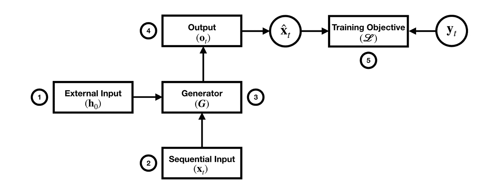

# 探索可控文本生成技术— 2020

> 原文：<https://medium.com/analytics-vidhya/exploring-controllable-text-generation-techniques-2020-3a68b34e87b1?source=collection_archive---------24----------------------->

## 总结:将控制生成文本的不同机制放入一个框架中。

原文(和更好的乳胶)位于:[https://atakanokan . com/paper summaries/2020-big-bird-transformers-for-longer-sequences/](https://atakanokan.com/papersummaries/2020-exploring-controllable-text-generation-techniques/)

# 信息

链接: [Arxiv](https://arxiv.org/abs/2005.01822)

论文来自:卡耐基梅隆大学(CMU)

这篇论文为什么重要？:将控制生成文本的不同机制放入一个框架中。

代码:NA

# 摘要

可控文本生成是生成其属性可以控制的文本的任务。这些属性包括但不限于风格、人口统计和内容。文体属性可以是礼貌、情感、正式；人口统计属性可以是性别和年龄；内容属性可以是信息、关键字、实体、信息排序、事件。可控文本生成可以被建模为条件语言生成任务，然而改变属性的方式可以有五种:

*   外部输入
*   顺序输入
*   发电机运行
*   输出
*   培训目标

所有这些都符合生成过程，如下所示:

# 外部输入

**标准(非受控)机构** : \(h_{0} = h_{e}\)其中\(h_0\)是发生器初始化，\(h_e\)是编码器对输入语句的表示。

**受控机构**:

## 算术或线性变换

1.  将控制向量连接到\(h _ { e } \):\([h _ { e }；s]\)。一些例子:

*   控制文本生成中的样式
*   使用来自外部来源的信息控制对话响应的生成
*   用从单独的语料库导出的个性控制向量来控制视觉故事。

1.  关于\(h_{e}\)的算术运算:关于视觉故事的论文也试验了算术运算，而不是连接。\(h_{0} = h_{e} — S + P\)，其中\(S\)是故事的平均表示，而\(P\)是个性表示。
2.  线性变换:\(h _ { 0 } = tanh(W _ { 1 } h _ { e }+W _ { 2 } s+b)\)。据报道，这种方法比前两种方法效果更好。

## 随机变化

从高斯分布中随机抽取一个潜在变量\(z\)，并以此为基础\(h_{0}\)。这已被用于指导文档主题的生成。也用于控制风格转换任务中的情绪。

## 分解

这种机制将\(h_{e}\)分解成多个子空间，其中每个子空间表示您希望控制的不同属性。一些例子:

*   文档的结构和语义信息。
*   强制第一个(n 个)维度捕捉意义，其余维度捕捉结构。
*   分解成一个形式向量(f)和一个意义向量(m)。鉴别器确保\(m\)没有任何形式信息，而另一个损失用来鼓励\(f\)携带形式信息。\(m = tanh(W_{m}h_{e} + b_{m})\)和\(f = tanh(W_{f}h_{e} + b_{f})\)。

## 外部反馈

改变潜在空间的对抗性损失。一些例子:

*   多层感知器用于预测风格标签
*   控制风格和内容的多重损失。

# 顺序输入

**标准(非受控)机制** : \(x_{t}\)是在时间\(t\)时解码器的输入，不改变:\(x_{t} = y_{t-1}\)其中\(y_{t-1}\)是在前一时间步生成的令牌。

**受控机构**:

## 算术或线性变换

在每个时间步将一个控制向量连接到生成器的输入:\(\ tilde { x _ { t } } =[x _ { t }；s]\)。一些例子:

*   以\(s\)形式连接到生成器输入的外部信息源的表示。
*   连接代表风格和个性的侧面约束
*   在每个时间步连接个性表示\(P \):(\ tilde { x _ { t } } = x _ { t }—S+P \)其中\(S\)是故事的平均表示。

# 发电机运行

这些是用作发电机的不同架构。

*   递归神经网络
*   变压器
*   预训练模型

# 输出

\(o_{t}\)是生成器在时间步长\(t\)的输出，它被投影到词汇空间以预测标记。

## 注意力

*   全局注意力:长序列的计算开销很大
*   局部注意力:因为是在窗口大小(D)上计算的，所以效率更高
*   自我关注:用于通过向源序列添加样式标记来控制样式。

## 外部反馈

输出潜在空间可以用对抗性损失来改变。

*   一篇论文通过尝试匹配句子和向量对的分布来鼓励现实的生成和属性兼容的句子\((x，s)\)
*   另一篇论文在强化学习环境中为风格、语义和流畅性提供了不同的奖励。

## 算术或线性变换

一些例子:

*   \(\tilde{o_{t}} = o_{t} + s\)其中\(o_{t}\)是 RNN 的输出。
*   \(\ tilde { o _ { t } } = tanh(W _ { o } o _ { t }+W _ { s } s+b _ { o } \)。
*   \(\颚化符{ o _ { t } } =[o _ { t }；s]\)。

# 培训目标

## 一般损失目标

这些目标不控制任何属性。

交叉熵损失

经典的分类交叉熵损失。

可能性损失

基于在每个时间步更新的重复记号或 n 元文法保留一组否定候选。这种损失使重复最小化，并用于增加最大似然目标。

目的是在给定相似输入的情况下生成不同的句子。最大互信息也试图减少通用响应。公式为\(\ hat { \ textbf { T } } = arg max _ { T } { log _ { p }(\ textbf { T } | \ textbf { S })—\ lambda logp(\ textbf { T })} \)

## KL 散度

量化一个概率分布与另一个概率分布的差异程度。对于 prob。分布\(P\)和\(Q\): \(KL(P||Q)\)。在文本领域中，KL 散度与证据下限(ELBO)相结合。

## 分类器损失

用于确保生成的标记与控件属性内联。这是在标记级别上操作的，当样式数量增加时，它就不那么有效了。

## 特定任务损失

战略损失

在对话中使用基本事实策略，以获得更好的回应。

覆盖损失

惩罚重复访问源文档的相同位置。

结构损失

结构压缩损失用于通过压缩来自特定源的几个句子来生成句子，用于抽象概括任务。结构覆盖用于覆盖原始文档中更突出的信息。

*原载于 2020 年 8 月 28 日*[*【https://atakanokan.com】*](https://atakanokan.com/papersummaries/2020-exploring-controllable-text-generation-techniques/)*。*