# 使用 Codeq NLP API 和语义角色探索 CORD-19

> 原文：<https://medium.com/analytics-vidhya/exploring-cord-19-with-codeq-nlp-api-and-semantic-roles-6860cf39d7a9?source=collection_archive---------18----------------------->

探索性分析显示了语义角色如何用于提取知识丰富的上下文。请看这里:

https://labs.codeq.com/semantic_roles_cord_19

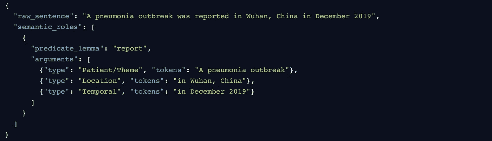

我们在 [Codeq NLP API](https://api.codeq.com/) 开发的最新模块之一是语义角色标签。本模块的目标是通过识别自然语言句子的主要*事件*和*参与者*，并对它们之间不同类型的关系进行分类，从而理解自然语言句子的基本语义(Davidson，1967；帕森斯，1990)。

在语义角色的提取中，*事件*通常被称为**谓词**，而*参与者*被称为给定谓词的**论元**。此外，论元可以表示特定类型的关系，例如，它们可以是与谓词相关的一个**代理人**、一个**病人**或一个**位置**。

让我们考虑下面的例子:

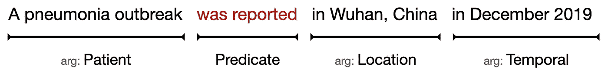

在这个句子中，谓语*报告*与论元**受事**、**位置**和**时间**相关联，总的来说，有助于理解**世卫组织**、 **WHERE** 和 **WHEN** 实体与那个具体谓语相关。

语义角色在许多自然语言处理任务中非常有用，包括信息抽取、文本摘要和问题回答。如今，新冠肺炎疫情已经揭示了 NLP 在生物医学中的重要性，以自动分析日益增长的关于冠状病毒研究的科学论文资源，并提取有用的信息来发现与该疾病相关的药物、症状或治疗方法。

在本帖中，我们想展示一个从开放研究数据集 CORD-19 中提取语义角色的探索性分析。艾尔。, 2020).具体来说，我们想描述语义角色如何用于自动提取知识丰富的上下文，即，用于描述概念的含义和它们之间的语义关系的句子。

# 知识丰富的上下文

在信息抽取领域中，抽取知识丰富的上下文是一项已知的任务。它旨在识别包含关于概念的属性、特征和语义关系的显式信息的文本片段，这些信息可以用作制定定义、挖掘语义关系和阐述专门词典、本体和知识库的起点。(赫斯特 1992；迈耶 2001；斯诺等人。艾尔。, 2005;Auger & Barrière 2008 年)。

> 在大型文本语料库中，知识丰富的上下文是句子的子集，包含对人类构建知识库有价值的信息(巴里埃，2004 年)

知识丰富的上下文通常通过循环的词汇句法模式来表达。其中一种模式是动词结构，它作为术语及其定义之间的连接器，也可以与特定种类的语义信息相联系(Alarcón et。艾尔。，2009a，2009b)。

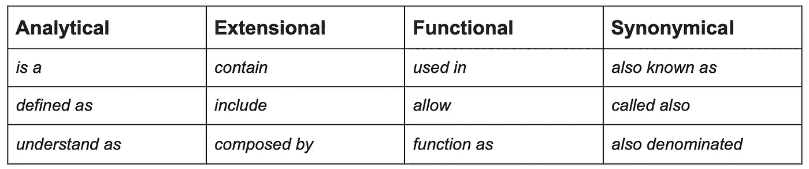

与特定类型定义相关的言语模式示例(Alarcón et。艾尔。，2009b)。

*是一个(*动词 *to be +* 冠词 *)* 是与分析性定义相关的最常见的词汇句法结构之一，它倾向于表明一种*上义词/下义词*的关系，并引入描述一个术语的最基本结构。通常，它们构成一种形式，例如:

> **X 是一个 Y，其中 Z**

其中 **X** 是被定义的术语， **Y** 是上位词，即 **X** 所属的概念类， **Z** 是将 **X** 与同一个类的其他成员区分开来的特征。一个简单的例子是:

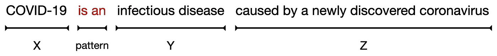

# 面向知识丰富上下文提取的语义角色

现在，语义角色如何用于提取知识丰富的上下文？让我们推断最后一个例子，并考虑由我们的 NLP API 的语义角色标注器生成的表示([你可以在我们的演示部分](https://api.codeq.com/demo-semantic-roles)亲自尝试一下):

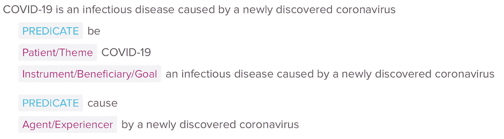

语义角色标签器的完整输出标签集可以在我们的 [NLP API 文档](https://api.codeq.com/api)中找到。

从这个例子中，我们可以观察到以下情况:

*   术语 **X** ( *新冠肺炎*)对应于论点**患者/主题**，
*   词汇模式 *be* 被识别为**谓词**，
*   类别 **Y** ( *传染病*)包含在参数**工具/受益人**中，
*   而具体特征 **Z** ( *由……*引起)则由**谓语** *原因*引入其对应的语义角色来识别

这种分割在总体上对应于分析定义的公共结构，这不仅简化了知识丰富的上下文的提取，而且简化了其成分的自动提取。此外，语义角色的提取对于正确分割具有更多风格变化的上下文非常有用。考虑以下假设的例子:

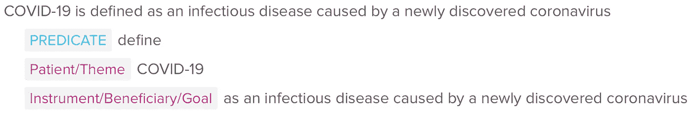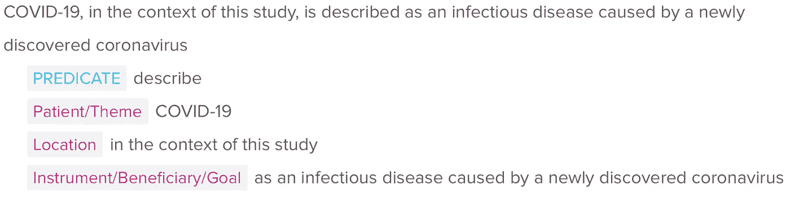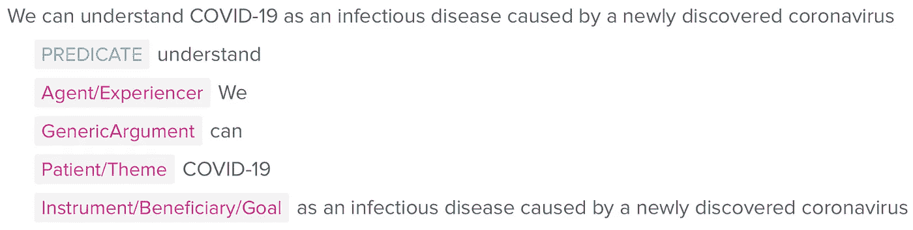

正如你所观察到的，语义角色标注器正确地将术语(*新冠肺炎*)和它的定义(*作为一种传染病……*)在具有不同言语模式的类似话语的变体中分割开来。此外，语义角色标签能够捕捉术语及其定义与谓词之间的下级关系:在所有情况下，它们都对应于论元**患者/主题**(术语)和**工具/受益人**(定义)。

# 从 CORD-19 中提取知识丰富的上下文

我们开发了一个非常简单的方法来对 [CORD-19 数据集](https://www.semanticscholar.org/cord19/)(2020–10–15 发布)的摘要进行探索性分析，并提取包含模式*是一个*的知识丰富的上下文的候选:

1.  我们编辑了一个语料库，其中包含了用我们的 [NLP API](https://api.codeq.com) 的[语义角色标注器](https://api.codeq.com/demo-semantic-roles)分析的所有摘要的所有句子。
2.  在提取的句子中，我们只保留那些包含谓语是动词*现在形式*的论元(*是，是*)并且包含至少一个语义角色的句子，这两个论元都是**受事/主位**和**工具/受益人**。
3.  我们应用了一些语法规则作为过滤器来避免误报，例如，如果参数 **Patient/Theme** 只是一个单一的标记，那么它应该被标记为名词；参数**票据/受益人**应该以任何一个记号开始:["a "、" an "、" the "、" one"]。

结果，我们分析了 79，958 个摘要，并能够提取 686，995 个包含语义角色的句子。从这些句子中，255，111 包含引理 *be 的出现。*最后，在应用上述过滤器之后，提取了 7728 个句子作为知识丰富上下文的候选。

# 探索结果

为了展示提取的知识丰富的候选上下文，我们使用 [Streamlit](https://www.streamlit.io) 开发了一个 web 应用程序，可在以下网址找到:

labs.codeq.com/semantic_roles_cord_19

在这里，我们想分享一些不同查询的有趣搜索结果。

1.  包含术语*【蛋白质】*作为**患者/主题**的句子(例如，被描述的蛋白质):

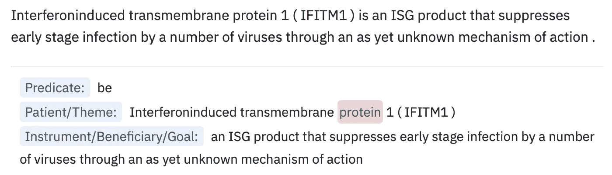

2.包含查询*“治疗”*作为**工具/受益人**的句子(例如，可能被描述为治疗的概念):

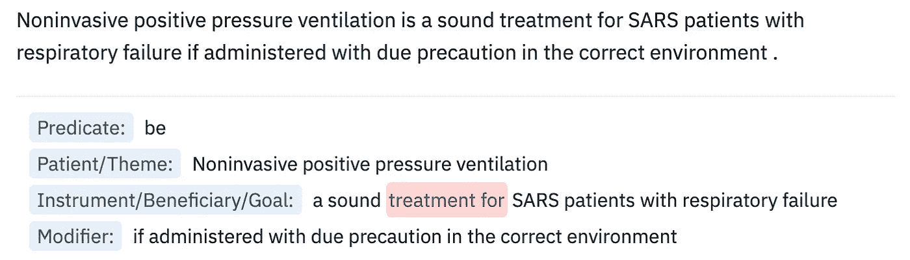

3.包含查询“*原因*”作为**工具/受益人**的句子(例如，描述因果关系中的概念的上下文):

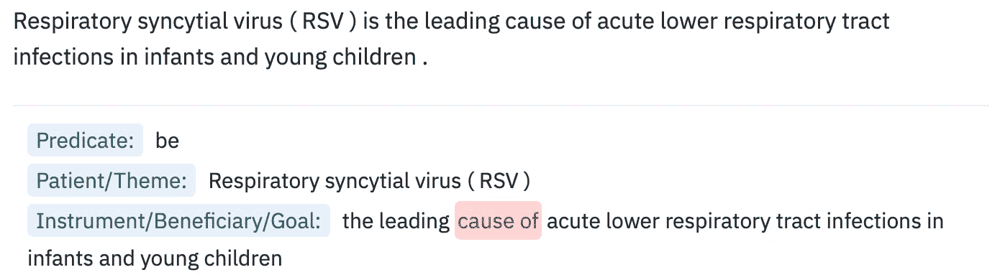

4.您还可以探索我们提取的包含语义角色的句子子集(不仅仅是知识丰富的候选上下文)。例如，将查询*“find”*的搜索实例作为**谓词**并包含一个自变量**目的**(也是一种固有的因果关系类型):

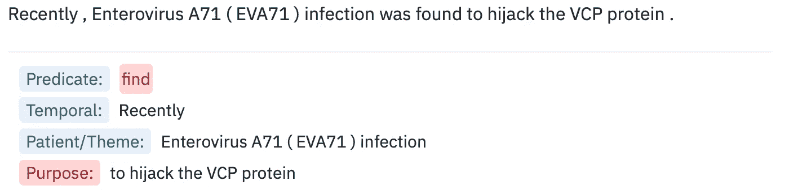

# 最后的话

语义角色是信息抽取的有力工具。我们可以在上述应用程序中找到的结果表明，在提取语义角色的基础上，一种简单的方法可以发现关于专业术语和它们之间的语义关系的有用信息。

我们的语义角色标注器基于我们在 Codeq 开发的其他强大的 NLP 模块，包括一个[位置标注器和一个依赖解析器](https://api.codeq.com/demo-text-processing)。这些模块可以很容易地结合起来，使用我们的 NLP API 来分析你自己的文本。如果你感兴趣，请[试一试](https://api.codeq.com)。

您是正在分析 CORD-19 研究论文的领域专家还是数据科学家，想要更深入地了解我们生成的结果吗？那么请联系我:rodrigo@codeq.com

旁注:如果您想展示您的 ML 模型或任何与数据相关的输出，您需要看一看 [streamlit.io](http://streamlit.io) 。这是一个展示你作品的神奇工具！

# 参考

Alarcón R .，Sierra，g .和 Bach，C. (2009a)。ECODE:一个定义抽取系统。人类语言技术。信息社会的挑战。韦图拉尼，Z. &。Uzkoreit，h .(编辑).计算机科学 5603 讲义。柏林-海德堡，施普林格出版社。382–391.

Alarcón R .，Sierra，g .和 Bach，c .(2009 年 b)。西班牙语定义提取系统的描述和评估。在*第一届定义提取国际研讨会上*。塞拉，g .，波齐，M. &托雷斯，J.M .(编辑).宾夕法尼亚州斯特劳斯堡计算语言学协会。7–13.

奥格和巴里埃(2008 年)。基于模式的语义关系抽取方法:一种先进的*术语*， *14* (1)，1。

巴里埃，C. (2004 年 5 月)。知识丰富的上下文发现。在*加拿大智能计算研究学会会议上*(第 187-201 页)。斯普林格，柏林，海德堡。

戴维森，D. (1967)，动作句的逻辑形式。在*中，决策和行动的逻辑。N. Rescher(编辑。).匹兹堡:匹兹堡大学出版社。*

赫斯特，硕士(1992 年)。大型文本语料库中下义词的自动获取。1992 年第 2 卷:第 15 届计算语言学国际会议。

Meyer，I. (2001 年)。为术语抽取知识丰富的上下文。*计算术语的最新进展*、 *2* ，279。

t .帕森斯(1990 年)。英语语义中的事件。麻省剑桥:麻省理工学院出版社。

斯诺，朱拉夫斯基，d .，& Ng，A. Y. (2005 年)。自动上位词发现的句法模式学习。在*神经信息处理系统的进展*(第 1297-1304 页)。

王，陆，陆，张，李，李，杨，杨，…和穆尼，(2020 年)。新冠肺炎开放研究数据集。 *ArXiv* 。