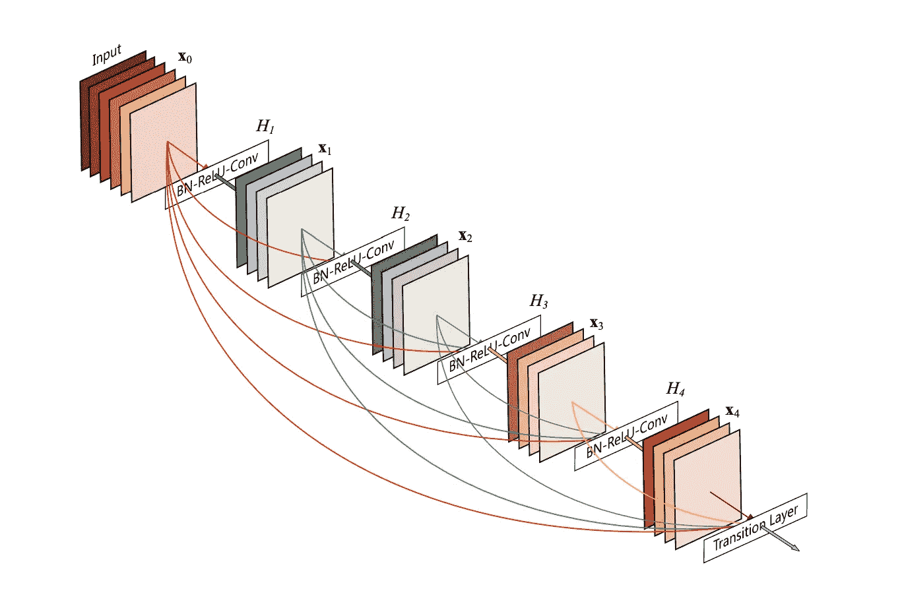
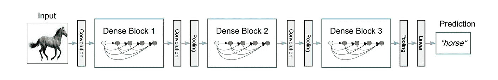

# 探索 DenseNets 并与其他深层架构进行比较

> 原文：<https://medium.com/analytics-vidhya/exploring-densenets-and-a-comparison-with-other-deep-architectures-85f02597400a?source=collection_archive---------11----------------------->

我们都知道卷积神经网络及其在学习非线性和复杂表示方面的效率。但是，学习这些表示的问题是，随着我们的问题变得越来越复杂，我们添加更多的层，使模型更深，然后我们看到多个问题浮出水面。这使得处理深度神经网络变得棘手。

在过去十年中，我们已经看到许多深度网络架构成功地解决了这些问题，但所有这些架构的一个共同点是，它们使用一些新奇的东西来抑制梯度消失、过拟合和参数爆炸的问题。我们将进一步探讨如何构建这些架构来解决这些问题，以及 DenseNet 的方法有多新颖。所有内容均基于黄高、刘庄、劳伦斯·范德马腾和基利安·q·温伯格发表的题为“*”的大量研究工作*

## *当前最先进的深度神经网络架构*

*ResNets 和高速公路网通过身份连接将信号从一层绕过到下一层，也就是说，它们将来自上一层的输入原样传递到下一层，这保持了将由每一层处理的输入要素的神圣性。随机深度通过在训练期间随机丢弃层来缩短结果，以允许更好的信息和梯度流动。*

*FractalNets 将几个平行层序列与不同数量的卷积块重复组合，以获得较大的标称深度，同时保持网络中的许多短路径。谷歌的 Inception 也使用了多种滤镜尺寸，并结合了这些特征图。尽管这些不同的方法在网络拓扑和训练过程上有所不同，但它们都有一个共同的关键特征:*

> *创建从早期层到后期层的短路径。*

## *这些致密层有多致密？*

*DenseNets 基于一种简单的连接模式:网络中的每一层都与其他层直接相连。是啊！你读对了，直接。为了保持前馈性质，每一层从所有前面的层获得输入，并将它自己的特征映射传递给所有后面的层。*

> *重申一下这个想法，在一个正常的“L”层的神经网络中，会有“L”个连接，每一层与其下一层之间有一个连接。但是，在 DenseNets 中将有“L(L+1)/2”个连接。*

**

*典型的密集区块:每一层都与其他层相连。*

## *让我们看看这个紧密相连的网络内部！*

*那么与其他架构相比，这些连接的用途是什么呢？*

**较小参数—* 耶！即使有额外的连接，这些网络的参数相对较少，因为有更多的输入连接，DenseNet 层非常窄(每层 12 个过滤器)，仅向网络添加一小部分特征映射，并保持其余特征映射不变，最终分类器基于网络中的所有特征映射做出决定。*

**更好的信息流—* 由于过滤器更小，输入得以保留，梯度和信息流可在网络中自由流动，最后一层也可访问输入和所有特征图，因此存在隐含的“深度监管”。*

**过度配合——这些连接也防止了过度配合，也使训练更加容易。**

***dense net 的新颖之处是什么让它脱颖而出？***

**特征重用*—densenet 没有从极深或极宽的架构中提取表示能力，而是通过特征重用来挖掘网络的潜力，将不同层学习到的特征映射连接起来，增加了后续层输入的变化，提高了效率。这是 DenseNets 和 ResNets 的主要区别。此外，与初始网络(也连接不同层的功能)相比，DenseNets 更简单、更高效。*

# *建筑*

**

*有三个致密块体的深致密网。两个相邻块之间的层被称为过渡层，并通过卷积和池化来改变特征地图的大小。*

*上图描述了典型 DenseNet 模型的架构。我不会详细讨论这个问题，因为这篇文章对此有更好的解释。在高层次上，我们有由这些互连层组成的密集块。每一层本身都是批标准化，然后是 ReLU 和卷积层。所有这些密集块通过一组过渡卷积和汇集层相互连接。
现在我们知道了层的这些基本元素，我们可以通过添加任意数量的密集块来构建自己的架构。我们还可以根据我们的问题，通过选择过滤器大小和特征地图的数量来定制每个层。*

## *DenseNets 的增长率*

*特征映射的初始数目决定了模型的参数数目和复杂性。这个超参数被称为“增长率”。*

*如果每个函数 H(L)产生 k 个特征图，那么第 L 层具有*

> *k0+k×(L1)输入特征映射，*

*其中，k0 是输入层的通道数，k 是增长率。这意味着每增加一层，我们就向特征地图的总数增加“k”个特征地图，从而增加参数的总数。所以这个数字“k”决定了滤波器的数量。即使在这里，k 值很小，为 12，这导致了相对较少的参数数量，这个网络产生了最先进的结果。增长率规定了每层对全局状态贡献多少新信息，因此决定了模型的信息流。*

# *绩效和结果*

*现在让我们来看看这种新方法的效率有多高！*

**准确性—* 该模型在 CIFAR、SVHN 和 Imagenets 等基准数据集上进行了训练。该模型优于所有当前最先进的模型，如在 CIFAR 和 SVHN 数据集上的 ResNets、FractalNets。令人印象深刻！*

**容量和参数效率—* DenseNet 模型是电容性的，也就是说，随着我们增加模型的层数和增长率，模型的效率和精度也会相应增加。这证明了该模型没有屈服于过度拟合，并且具有学习更复杂问题的能力。该模型也是参数高效的，一个 250 层模型只有 15.3M 个参数，但它始终优于其他模型，如 FractalNet 和 Wide ResNets，它们有超过 30M 个参数。*

## *最终总结*

*   *该模型在具有相同特征地图大小的任意两个层之间引入了直接连接。*
*   *DenseNets 可以自然扩展到数百层，而不会出现优化困难。*
*   *随着参数数量的增加，DenseNets 往往会不断提高精度，而不会出现任何性能下降或过度拟合的迹象。在多种设置下，它在几个竞争激烈的数据集上取得了最先进的结果。*
*   *此外，DenseNets 需要更少的参数和更少的计算来实现最先进的性能。*

*总的来说，由于作者正在训练与当前架构一致的模型以进行比较，这些 DenseNets 可以通过更详细地调整超参数和学习率计划来进一步优化，并且在深度学习中具有很高的未来前景！*

*所有的功劳归于黄高、刘庄、劳伦斯·范·德·马腾和基利安·q·温伯格。
原创论文—[*密集连接的卷积网络*](https://arxiv.org/pdf/1608.06993.pdf)*