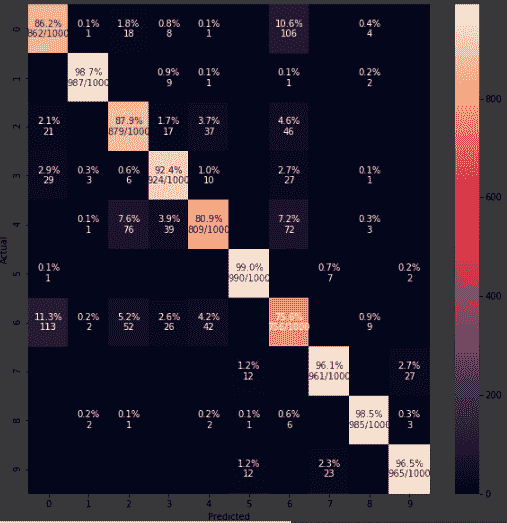

# 用 Tensorflow 探索时尚 MNIST

> 原文：<https://medium.com/analytics-vidhya/exploring-fashion-mnist-with-tensorflow-cnn-9283c4bcf0a?source=collection_archive---------16----------------------->


时尚 MNIST 数据集

图像分类是计算机视觉中最琐碎但又最具挑战性的问题之一。为了更好地理解，我们尝试在一个非常著名的基准数据集:时尚 MNIST 上进行图像分类。该数据集旨在取代 MNIST，因为:

*   MNIST 太容易了。
*   MNIST 被滥用了。
*   MNIST 不能代表现代 CV 任务。

# 预处理数据集

Kaggle 上的时尚 MNIST 数据集由两个文件组成:train.csv 和 test.csv。这两个文件都有 785 列，第一列是标签，后面的 784 列是 28x28 图像的像素值。来自我们训练数据集的 0.1 %的图像形成了验证数据集。

卷积神经网络需要输入形状(batch_size，28，28，1)。因此，一维数组被重塑为三维数组。

```
**def reshape_image** **(data, size):**
data=np.array(data)
data=data.reshape(size, 28, 28,1)
return data
```

> 由于我们使用 *'* **【分类交叉熵】'**作为我们的损失函数，我们需要将图像标签转换成多类向量用于训练目的。如果标签是数字，函数**' to _ categorial '**会直接把它们转换成向量。但是如果它们是字符串，就需要对它们进行标签编码，然后使用**' to _ categorial '***。*

```
**def preprocessY (lst):**
integer_encoded = label_encoder.fit_transform(np.array(lst))
trainY=to_categorical(integer_encoded)
return trainY
```

# 模型架构

卷积神经网络是图像分类的最佳选择。他们被训练提取相关的特征用于分类。

**输入形状:** (batch_size，28，28，1)
*(CNN 的输入应该是四维的。)*

**架构:** 使用两个卷积层*(核大小为 5×5)*，每个卷积层具有 128 个滤波器。 *MaxPooling* *(步幅为 2)* 用于下采样。 *ReLu* 激活用于确定每个神经元的输出。具有 *256 个输出神经元的全连接层*之后是具有 10 个输出的 *Softmax* 层。

```
model=Sequential()
model.add(Conv2D(128, kernel_size=(5, 5), activation=’relu’, input_shape=input_shape))
model.add(MaxPooling2D((2, 2)))
model.add(Conv2D(128, kernel_size=(5, 5), activation=’relu’))
model.add(MaxPooling2D(pool_size=(2, 2)))
model.add(Flatten())
model.add(Dense(256, activation=’relu’))
model.add(Dense(10, activation=’softmax’))
model.compile(loss=CategoricalCrossentropy(), optimizer=Adam(),
metrics=[‘accuracy’])
```


过滤器的数量越多，一次提取的特征就越多。MaxPooling 优于 average，因为感兴趣的对象可能会产生最高的像素值。

# 训练模型

时尚 MNIST 模型首先被训练 10 个时代，然后 50 个时代。这样做是为了观察精度对历元数的依赖程度。

Keras 的 ImageDataGenerator 用于执行数据扩充。

```
gen = ImageDataGenerator(rotation_range=8, width_shift_range=0.08, shear_range=0.3, height_shift_range=0.08, zoom_range=0.08)
```

## 十个时代

在批量为 128 的情况下，最终训练准确率达到 88.11%，验证准确率达到 87.50%。


**训练和验证准确性趋势**


**培训和验证损失趋势**

## 五十个时代

在批量为 128 的情况下，最终训练准确率达到 91.75%，验证准确率达到 90.32%。


**训练和验证准确性趋势**


**培训和验证损失趋势:**

# 结果

## 十个时代

**测试准确率:** 90.21%


**精准度和召回率:**6 级的表现似乎有所下降。


混淆矩阵

## 五十个时代

测试准确度: 91.59%


**精准度和召回率:**成绩再次骤降为 6 级。



**混淆矩阵**

尼基塔·萨克塞纳 [*(gihub 知识库在此)*](https://github.com/nikita-0209/image-classification/blob/master/GitHub_Fashion_MNIST.ipynb) 创造并开发了 10 个时代的代码。50 个时代的代码是由奈提克·汗德尔瓦尔 *(* [*gihub 库此处*](https://github.com/Naitik1502/Image-Classification/blob/master/Fashion_MNIST.ipynb) *)* 创造和开发的。