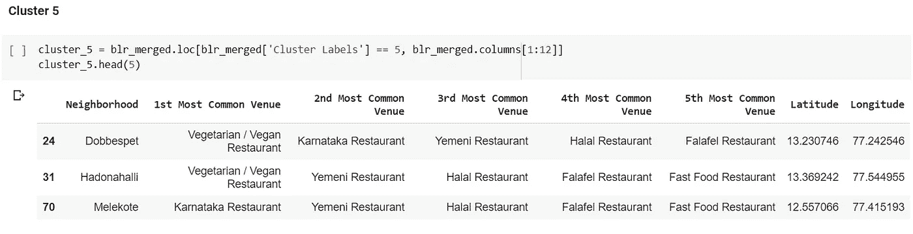

# 探索班加罗尔社区的食物口味相似性

> 原文：<https://medium.com/analytics-vidhya/exploring-food-taste-similarity-in-bangalore-neighborhoods-e81929f3d9bf?source=collection_archive---------25----------------------->

使用 k-means 聚类，我们试图找出班加罗尔的哪些社区有相似的食物口味。

# 问题

班加罗尔是印度第三大人口城市，也是许多科技公司的所在地。根据这篇文章的报道，班加罗尔 42%以上的人口是移民，这使得这个城市的人口非常多样化。

毫无疑问，当有如此大量的移民时，城里人吃的食物将会有很大的多样性。这个项目的想法是将班加罗尔的街区分类成几个主要的集群，并研究他们的烹饪。一个可取的意图是检查附近集群的饮食习惯和口味。进一步的研究可能会揭示食物是否与社区的多样性有任何关系。

利益相关者将有兴趣使用这种量化分析来了解不同文化和美食在印度最多样化的城市之一——班加罗尔的分布情况。这个项目也可以被一个新的愿意开餐馆的食品供应商所利用。或者由政府机构更好地检查和研究他们城市的文化多样性。

# 2.数据

以下数据来源用于实施我们的项目:

1.  班加罗尔社区:为我们提供班加罗尔市的地理编码数据。这个数据库的链接可以在[这里](https://www.kaggle.com/rmenon1998/bangalore-neighborhoods)找到
2.  Foursquare API:

链接:【https://developer.foursquare.com/docs 

描述:Foursquare API，一个位置数据提供者，将被用来进行 RESTful API 调用，以检索不同街区的场馆数据。这是 Foursquare 场地类别层次结构的链接。从所有邻近地区检索到的地点大致分为“艺术和娱乐”、“学院和大学”、“活动”、“美食”、“夜生活场所”、“户外和娱乐”等。API 调用的摘录如下:

类别':[{ ' id ': ' 4 BF 58 DD 8d 48988d 110941735 '，
'名称': '意大利餐厅'，
'复数名称': '意大利餐厅'，
'简称':'意大利'，
'图标':{ '前缀':'【https://ss3.4sqi.net/img/categories_v2/food/italian_'】，
'后缀':'。png'}，
'primary': True}]，
'verified': False，
'stats': {'tipCount': 17}，
' URL ':'[http://eccorestaurantny . com '](http://eccorestaurantny.com')，
'price': {'tier': 4，' message ':'非常昂贵'，'货币'

# 数据集:

我们的数据集包含班加罗尔市的地理位置数据。它给出了班加罗尔每个街区的纬度和经度。

我们的数据集放入数据框架后的样子

然后，通过创建班加罗尔地图，将精选的数据框架用于可视化，并在顶部叠加街区。以下描述是使用 python“folium”库生成的地图。

# 探索性数据分析

合并的数据帧“blr _ venues”具有所有需要的信息。

现在，重要的是要找出有多少独特的类别可以从所有返回的场馆策划。

在对数据进行了**特征工程**之后，我们对其进行了进一步分析，找到了班加罗尔餐馆的**前 15 类**。

然后，我们通过检查不同地区受欢迎的餐馆类型，进一步形象化了这一发现:

# 应用机器学习:K-means

现在，我们应用 k-means 机器学习算法(**我们设置 k=6** )根据我们的邻居的饮食习惯相似性对他们进行聚类。

我们通过使用**叶子** t **来显示不同的集群来进一步可视化。**

不同的社区根据食物的味道聚集在一起

# 结果

在对不同的集群运行 ML 算法后，我们发现了以下结果:

# 群集 0:

对于这个集群，我们发现 ***快餐店*是最受欢迎的**，其次是比萨饼店、也门餐馆和安德拉餐馆。

# 群组 1:

对于这个集群，我们发现 ***披萨店*是最受欢迎的**，其次是清真餐厅。

# 第二组:

对于这个聚类，我们发现 ***印度餐馆*是最受欢迎的**，其次是也门餐馆。

# 第三组:

对于这个聚类，我们发现 ***印度餐馆*是最受欢迎的**，其次是快餐店。

# 第 4 组:

对于这个集群，我们发现 ***快餐店*是最受欢迎的**其次是也门餐馆。

# 第 5 组:

对于这个集群，我们发现 ***素食/纯素餐馆*是最受欢迎的**，其次是卡纳塔克邦餐馆。

# 结论

将*聚类算法*、k-Means 或其他算法应用于多维数据集，可以得到非常有趣的结果，这有助于理解和可视化数据。班加罗尔的街区被非常简单地划分为 6 个集群，通过分析，可以根据街区内和周围的场馆类别对它们进行重命名。

在对数据进行特征工程后，使用数据可视化技术，我们发现不同社区的不同口味，以及尽管人口非常多样化，一些社区是如何非常相似的。

**Jupyter 笔记本的链接可以在** [**这里找到**](https://nbviewer.jupyter.org/github/manassinha09/Applied-DataScience-Capstone/blob/master/Final%20Capstone%20Project/Capstone_Project_.ipynb)

## 我的联系方式:

[领英](https://www.linkedin.com/in/manassinha09/)

注意:为了使文章更容易理解，将对文章做进一步的修改。