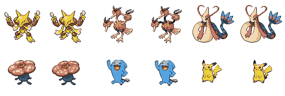
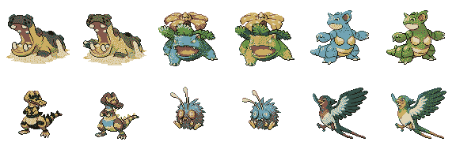
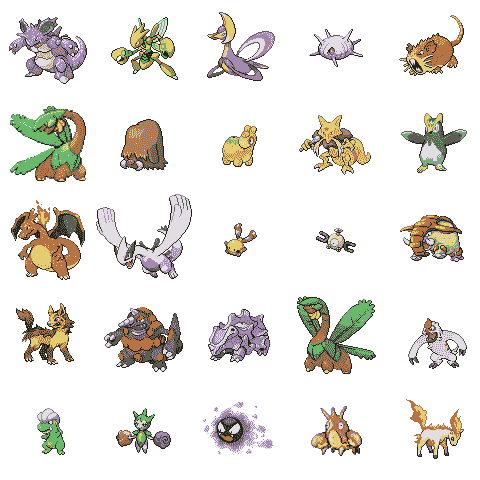
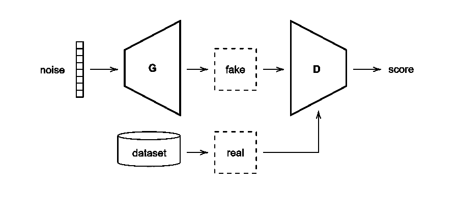
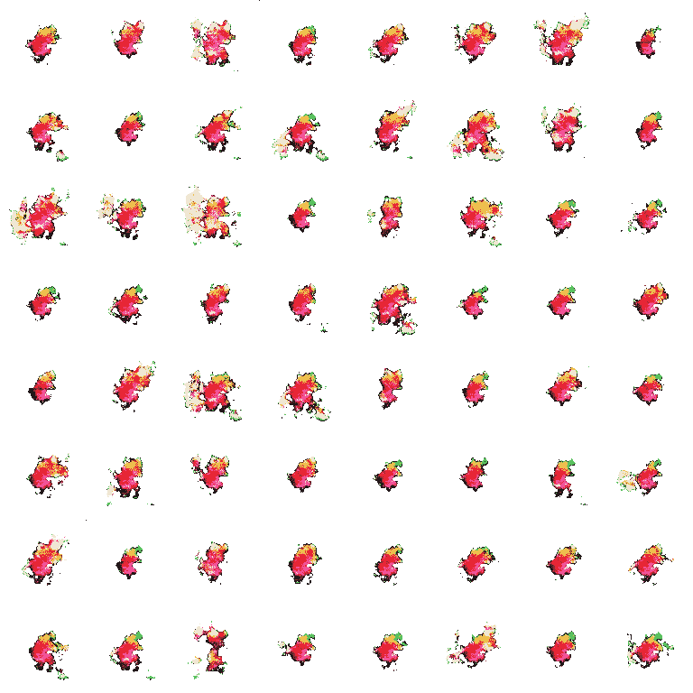
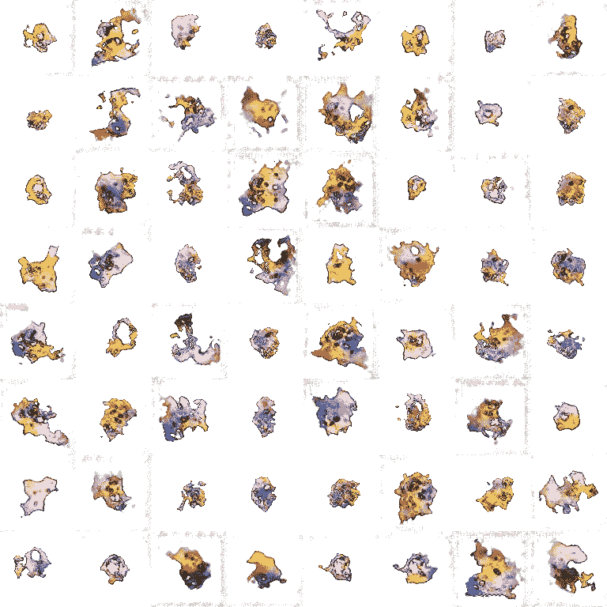

# 用神奇宝贝探索甘斯

> 原文：<https://medium.com/analytics-vidhya/exploring-gans-with-pok%C3%A9mon-7aeb3b4d86e?source=collection_archive---------16----------------------->

## 创造他们是我真正的考验，训练他们是我的事业

## 这个项目是关于什么的？

这篇文章的目标读者是不熟悉机器学习，尤其是不熟悉人工神经网络(ann)的读者。这是一次友好地介绍人工神经网络基础知识的尝试。我们将从基本的数学前提开始，然后继续深入更抽象和更复杂的概念，旨在对所谓的生成性对抗网络(GANs)进行直观理解的解释。我选择 GANs 作为一种更高级的人工神经网络的例子，因为它们强大而令人兴奋的概念可以生成好看的数字图像。这个项目的目标是自动生成全新的神奇宝贝精灵图像( [GitHub](https://github.com/jonasgrebe/pokemon-generation) )。

## 什么是机器学习？

机器学习(ML)是一门计算机科学学科，它利用可用数据中的模式和规律来解决特定的任务，而不需要任何显式的指令。在 ML 中，算法和统计模型用于例如检测数据中的异常，将数据点分类，识别数据集中的自然聚类，基于过去预测时间序列的未来值，或者寻找数据点的低维表示。通常，一般数学模型的权重和参数被优化，使得结果模型最好地或者至少足够好地解释了基础数据点。由于当今数据无处不在，ML 目前受到很多关注。

## **数学背景**

在我看来，为了直观地理解人工神经网络背后的强大思想，我们必须熟悉三个主要的数学概念:

1.  **向量空间:**向量是一个数学对象，由固定数量的可以采用不同数值的分量组成。分量的数量被称为各自向量的维数，显然永远不会是负数。然而，在另一个正方向上，这种矢量的大小实际上没有上限。因此，它可以是一维、二维、三维或一般的 n 维，其中 n 可以从所有正整数的范围内自由选择。如果组件的数值要么是连续的，要么来自一组无限的整数，那么就有无限多的值组合。这个由相同维数的不同向量组成的巨大空间称为 n 维向量空间。在这个空间中，每一个位置都指向另一个唯一的 n 维向量。如果现在对某些向量的集合有任何特别的兴趣，我们可以根据它们在底层向量空间中的接近度和结构来分析这些向量。除此之外，向量可以转换成相同的其他向量，甚至转换成全新向量空间的向量。例如，如果我们查看具有(0，0)或(23，42)等元素的二维向量空间，并对其向量(0+0=0 和 23+42=65)应用简单的求和变换，我们实际上找到了从二维空间到一维空间的映射。
2.  **数学函数:**函数是一个抽象的机器，它接收一些输入，对其进行处理并返回结果输出。可能输入的空间称为函数的定义域，而输出的目标空间称为共定义域。因此，数学函数是两个集合或向量空间的元素之间的关系。相同的集合可以有不同的函数，就其内部工作方式而言是不同的。这是一个非常普遍的概念。在数学符号中，一个函数通常用一个小写字母表示。函数可以被视为算法，反之亦然，因为两者都将明确定义的输入转换为明确定义的输出。如果这种内部转换是隐藏的或者极其复杂，以至于你不知道输入到底发生了什么，但是你可以观察输出，那么这个函数通常被称为黑盒。你在日常生活中会用到很多黑盒功能(或算法):你的电脑或笔记本电脑，你的视觉皮层，你的洗衣机，甚至你的人类同胞。计算机接收用户输入，用户期望计算机按照预期运行，但是几乎没有人知道计算机在最深的抽象层是如何工作的。
3.  **微分和梯度:**假设给你一个数学函数，它接受一个值，输出另一个单值，因而是向量在一维向量空间中的映射。现在要求您找出哪个输入值的输出值最小。您被迫从域中采样向量(在这种情况下是单个数字),以获得哪个输入导致哪个输出的感觉。然而，如果没有必要的假设，即相似的输入值导致相似的输出值，您几乎没有机会发现最小值。但是即使有了这个假设，这种天真的抽样方法在一定程度上依赖于纯粹的随机性。我们通过采样基本上想要实现的是识别数学函数在哪里上升，在哪里下降。幸运的是，我们可以通过一个叫做微分的过程，从函数定义的解析表达式中直接得到这个信息。所有上过高中或大学的读者，肯定都熟悉微积分程序，如链式法则或乘积法则。在将这些规则应用于目标函数以获得一阶导数之后，我们可以从域中采样一个输入值。这个起始点然后通过导数输入，导数告诉我们函数相对于空间中相应位置的输入上升或下降的强度。如果它在上升，我们就减少输入值。如果它在下降，我们就增加它。如果它上升得更强，我们就减少更多的输入值。如果它大幅下跌，我们会加大它的力度。否则，如果函数既不上升，也不下降，我们就到达了一个接近最小值的点。这种直观但强大的优化过程被称为梯度下降，因为在某一位置的导数的值被称为空间中相应点的函数梯度。这个概念不限于一维函数。它可以成功地应用于任何或多或少满足假设的函数。

## 什么是人工神经网络？

人工神经网络(ANN)是一种通用函数逼近器，它能够学习模仿仅提供有输入和输出示例对的黑盒函数的行为。因此，人工神经网络通常由一系列参数化的变换给出，这些变换通过几个不同的向量空间连续映射输入向量，直到达到最终的输出向量。这些变换的效果由 ANN 参数的值指定。通过改变和适应人工神经网络的这些权重，它能够获得几乎任何函数的行为。然而，人工神经网络本身是一个黑箱，我们通常无法从数百万个参数中找到任何意义。我们唯一能判断的是网络在面对某些输入时的行为。

为了训练这样的网络，我们需要两件事情:(1)输入-输出示例对的数据集，以及(2)优化 ANN 参数的过程，以便它随着时间的推移学习来模仿数据背后隐藏的黑盒函数。虽然后者通常由梯度下降算法的变体给出，但前者必须为 ANN 精心准备。人工神经网络只不过是具有大量参数的复杂函数。通过自动微分，我们可以确定如何调整这些权重，以使神经网络的行为越来越像输入-输出示例对所指示的那样。

## 数据集:为什么是神奇宝贝？

神奇宝贝塑造了我的整个童年，是我在寻找一个有趣的小图像数据集时想到的第一件事。我主要是通过玩各种不同的传统神奇宝贝电子游戏来发现和探索这个世界，最初从神奇宝贝蓝色(第 1 代)开始，最终到神奇宝贝黑色(第 5 代)结束。在第一代神奇宝贝中，有 151 个不同的神奇宝贝存在，这个数字在第五代中迅速增长到 649 个。对于这个项目，我从前五代的神奇宝贝精灵图像中编译了一个自定义数据集。我丢弃了前两代和最后几代的图片，因为它们与大部分图片相比风格不同。然而，由于通常以前的神奇宝贝版本中的所有神奇宝贝都出现在传统的神奇宝贝视频游戏中，我为前五代的 649 个神奇宝贝中的每一个都获得了几个不同的图像。这些来自同一个神奇宝贝物种的图像在性别、光泽和姿势方面有所不同。

**性别差异**:不同性别的神奇宝贝的例子(女性左，男性右)

**闪亮的神奇宝贝**:稀有闪亮神奇宝贝精灵的例子(正常的左，闪亮的右)

不同种类的鱼在颜色、形状和大小上明显不同。总的来说，该数据集由 11.779 个口袋妖怪精灵图像组成，这些图像已被调整为 96x96 RGBA 像素的常见大小。因此，每个图像像素都有一个红色(R)、一个绿色(G)、一个蓝色(B)和一个 alpha (A)透明度值，总共有 96×96×4 = 36864 个整数值来完整地描述一个图像。换句话说，每个图像可以被理解为来自 35864 维向量空间的向量，其中每个分量可以取 0 到 255 范围内的值。空间越大，我们就需要越多的数据点来为 ANN 参数提供一个好的估计。然而，所需数据点的数量随着基础向量空间的维数呈指数增长(维数灾难)。为了使 ANN 能够处理高维数字图像数据，开发了作为特殊 ANN 代表的所谓卷积神经网络(CNN)。在下一小段之后，我们将简要地看一下 CNN。

相同神奇宝贝的精灵示例(妙蛙种子，Pokedex #001)

相同神奇宝贝的精灵示例(Raikou，Pokedex #243)

虽然我们没有为这些图像使用任何标签，但所有神奇宝贝图像实际上都有可以从国家神奇宝贝索引中提取的自然标签，例如初级类型、次级类型或神奇宝贝的物种。

来自自定义神奇宝贝数据集的随机采样图像

## 数据扩充

尽管大约 12，000 个小神奇宝贝图像似乎是很多数据，但我决定在图像呈现给人工神经网络之前，采用两种额外的技术来更直接地增加多样性。这是动态完成的，不需要任何存储在文件中的中介。这两种技术由下式给出:

1.  **随机水平翻转**:尽管大多数原始神奇宝贝都指向左侧(由于它们在传统神奇宝贝视频游戏中的用法)，我还是以百分之五十的概率随机水平翻转了每个图像。
2.  **随机抖动**:除此之外，我还尝试了一些图像的随机抖动翻译，将图像尺寸稍微调整为 100x100 像素，然后随机裁剪回 96x96 像素。

## 什么是卷积神经网络？

由于两个不同的方面，数字图像对人工神经网络来说是一个非同寻常的挑战:(1)即使是小图像也很容易超过数万维，以及(2)需要特殊处理的二维空间性质。因此，所谓的卷积神经网络(CNN)已经被专门设计用于对数字图像数据进行操作。

CNN 是一种人工神经网络，它在大多数层中使用卷积算子来利用图像的空间结构，以便大大减少参数的数量。这些卷积层中的每一层都学习一组应用于整个层输入的卷积核。当链接在一起时，随着网络越深入，这些回旋有可能越来越类似于更抽象的概念。虽然早期层可能会学习检测直线或亮度等特征，但后期层可以根据先前层的特征掌握更复杂的图案和概念，如形状或纹理。

## 什么是生成性对抗网络？

记住我们的目标是根据自定义数据集中的模式和规律自动生成假的神奇宝贝图像。为了实现这一点，我们必须设计一个数学函数，它接受一些随机噪声(用于变化)并产生一个看似真实的神奇宝贝精灵图像。假设我们有这样一个生成器函数，我们可以简单地对随机噪声输入进行采样，并依靠生成器将其转换成逼真的假图像。这是一项极其艰巨的任务，可以说涉及到某种类型的创造力。通过坐下来摆弄将随机噪声映射到图像向量空间中的点上的函数的解析公式来解决这个问题是徒劳的，因为即使是直接写下一个公式来区分神奇宝贝和非神奇宝贝图像的任务也是不可能的。生成器是一个富有想象力的黑盒函数，没有任何特定的或现有的输入输出示例对。因此，我们甚至不能试图依靠人工神经网络来拯救我们，用它们来模仿想要的生殖行为。这就是所谓的生成性对抗网络(GANs)发挥作用的地方。

Goodfellow 等人于 2014 年提出了 GANs 的伟大概念，这是一个强大的框架，允许我们将人工神经网络应用于我们的问题，即使我们没有任何特定的输入输出示例对。当提供了某个可用输入时，训练神经网络产生某个输出被称为监督学习。如果没有合适的标签作为目标输出，则相应的学习问题被称为无监督的。Goodfellow 等人提出的第一种类型的 GAN 是无监督方法的一个例子，因此不需要关于我们要伪造的图像的任何附加标签信息。

在 GAN 中，两个经过对抗性训练的 ann 为了达到一个共同的目标而相互对抗:生成器和鉴别器。我们让两个人工神经网络在零和游戏中相互迭代，而不是直接手工设计一个完美的生成器或完美的鉴别器，其中一个人工神经网络被训练产生真实的假图像，另一个被训练从真实图像中区分假图像。这样，我们既不必为生成的图像的真实性提供任何特定的度量，也不必自己识别真实数据集中的模式和规律。每当生成器表现良好时，鉴别器的性能就有所欠缺，并且当鉴别器在区分两种类型的图像时没有问题时，生成器很难欺骗他。最初，两个神经网络的参数都是随机初始化的，因此导致发生器和鉴别器的性能不佳。鉴别器不知道神奇宝贝图像通常是什么样子，生成器到目前为止只产生随机垃圾。在训练期间，向鉴别器提供二进制标签，告诉他哪个输入图像是先前由生成器生成的赝品或者是真实数据集的样本。发生器从它从鉴别器得到的反馈中学习。这种训练过程经常遭受不稳定性。如果两个对手中的任何一个对对手来说太强，那么弱的一方就没有机会与强的一方竞争。必须通过仔细选择发生器和鉴别器神经网络以及几种不同的稳定技术来避免这些不稳定性。在迭代过程中，鉴别器有望引导发生器在图像空间中产生与真实图像位于同一流形上的点。如果读者想看看先进 GAN 架构的惊人成果，我强烈建议看看 NVIDIA 的研究人员从 2019 年开始开发的基于超现实[风格的人脸图像生成器](https://arxiv.org/pdf/1812.04948.pdf)。

**GAN 的基本结构**:发生器(G)接收一个随机噪声矢量作为输入，产生一个假图像来欺骗鉴别器(D)。这个鉴别器被训练来鉴别真假图像，而生成器试图智胜鉴别器。

## 基本网络架构

在这个项目中，我决定将我的实施基于一种基本的卷积型 GAN 和在[深度卷积 GAN (DCGAN)论文](https://arxiv.org/pdf/1511.06434.pdf)中描述的指南建议。我添加到架构中的唯一主要变化是在大多数上采样或下采样模块之后应用所谓的丢弃层，以防止过拟合。读者可以在我的 [GitHub](https://github.com/jonasgrebe/pokemon-generation) 上找到更多公开的技术细节和整个实现。除了 DCGAN 指南之外，我还试验了三种不同的技术，以帮助稳定训练并避免通常称为模式崩溃的常见问题，模式崩溃描述的是生成器专门产生一种精确类型的伪图像，几乎完全忽略所提供的输入噪声的结果。

## 稳定性和模式崩溃:补救技术

在我对这个项目的研究中，我遇到了以下三种常用的稳定技术，并决定利用它们。

1.  **单侧标签平滑**:我们不是告诉鉴别者对真实图像产生接近 1.0 的过度自信概率分数，而是通过将真实标签平滑一定量来惩罚过度自信。在我们的例子中，我选择了 0.1 的平滑度，因此真实图像的标签已经减少到 1.0 - 0.1 = 0.9。这防止了鉴别器将其预测仅仅基于几个明显的特征。
2.  **衰减实例噪声**:我们没有将(增强的)神奇宝贝图像或生成的图像直接提供给鉴别器，而是向每个输入添加一些高斯随机噪声，以增加鉴别器的难度，并扩大真实和合成数据分布的重叠。该实例噪声的标准偏差已经在迭代中衰减了某个衰减因子。想了解更多信息和理论，请看这篇出色的[博文](https://www.inference.vc/instance-noise-a-trick-for-stabilising-gan-training/)。
3.  **光谱归一化**:这种技术对生成的图像影响最大。神经网络层权重的光谱归一化确保了鉴别器网络类似的整个函数满足比我们在关于微分和梯度的段落中所做的假设更强的假设。频谱归一化鉴别器网络产生更平滑和更稳定的真实度判定。关于这个改变游戏规则但却简单的概念的更多信息，我可以参考这篇写得很好且形象化的[文章](https://christiancosgrove.com/blog/2018/01/04/spectral-normalization-explained.html)。

## 结果

在这一节中，我将展示基本 DCGAN 类实现的四种不同变体的结果。所有这些都利用了单侧标签平滑、衰减实例噪声和图像的随机翻转。这四种变体的不同之处在于它们是否应用了随机抖动或光谱归一化。

下面的动画展示了固定随机输入种子生成器的进度。每幅图像都是经过五次迭代后产生的。

DCGAN

具有随机抖动的 DCGAN

带频谱归一化的 DCGAN

具有频谱归一化和随机抖动的 DCGAN

为了查看这四个模型在 250 次迭代后生成的各种合成神奇宝贝图像，下面展示了所有这些模型的 64 个随机样本图像。没有光谱归一化但有额外随机抖动的模型似乎已经崩溃为单一模式。通过将光谱归一化应用于这个特定的模型有助于缓解这个问题。随机抖动是否会提高结果的质量，这个问题留给读者来决定。

DCGAN

具有随机抖动的 DCGAN:模式崩溃

带频谱归一化的 DCGAN

具有频谱归一化和随机抖动的 DCGAN

## 潜在空间遍历

准备好创建上述发生器函数后，我们现在可以尝试弄清楚所提供的随机输入噪声是如何影响所生成的输出的。在生成器魔术开始发生之前，128 维随机种子向量是从正态分布中随机采样的。我们可以将这个 128 维向量空间中的每一个点都看作是一个只是想被发现的伪神奇宝贝精灵。为了查看该空间中的相邻点在它们的合成图像方面是如何相关的，我们将沿着该输入空间中的某些轨迹遍历，并可视化所生成的输出如何变化。在高斯输入向量的上下文中，有两种类型的遍历是有意义的:[球形](https://arxiv.org/abs/1609.04468)和线性遍历。前者取任意向量，绕原点旋转，直到到达某个目标点，而后者是否沿直线从原点到某个目标位置。因此，球形遍历确定了向量的大小，而线性遍历确定了向量的方向。

**球形旋转遍历**

沿空间中随机采样的起点和目标点之间的球形轨迹生成采样的动画。四个动画分别属于上面提到的四种模式。

**按比例线性遍历**

沿原点和与球形遍历中相同的目标点之间的线性轨迹生成样本的动画。四个动画分别属于上面提到的四种模式。注意动画的开始，对应于原点(全零向量)产生海绵效果。

## 结论

*   神奇宝贝图像在颜色、形状、姿势和纹理方面有很大的差异。找到一个产生完美欺骗的连续神经功能不是一件容易的任务，因为不同神奇宝贝图像的数量对于这项任务的复杂性来说可能太小了。
*   然而，被提议的甘偶尔能够产生令人信服的尝试，在几个重要方面提醒真实的神奇宝贝图像:(1)强烈的黑色轮廓，(2)充满活力的颜色，和(3)清晰的轮廓。
*   尽管我们人类很容易区分这些假货和真实的神奇宝贝图像，但我们可能会把它们视为幸福的意外，并从中获得灵感，用我们想象中更丰富多彩的生物来填充神奇宝贝的精彩世界。

## 我学到了什么？

1.  **GPU vs CPU** :在这个项目工作期间，我花了无数时间在一个 CPU 上测试不同的超参数和架构。这让我疯狂，促使我投资一款廉价的 GPU，它彻底改变了游戏。我现在能够在以前所需时间的一小部分内测试出模型。例如，在我的 CPU 上，训练简单的类似 DCGAN 的模型每个时期至少花费我 40 分钟。请记住，我为每个模型训练了 250 个时期。只有我的新 GPU 能够在一个晚上完成这项工作，这才是可能的。
2.  **甘斯的神秘面纱**:在这个项目之前，甘斯对我来说通常是一个黑箱概念。它们似乎比其他类型的人工神经网络复杂得多，也更难训练。在这个项目中，我积累了一些经验，对 GANs 的行为有了一些了解。这鼓励我在未来进一步追求更高级的生成模型类型和方法:条件 gan、ACGANs、自我关注块、条件批处理规范化、风格 gan、自我调制块……

## 参考

*   【https://arxiv.org/abs/1406.2661】生成性对抗网络，古德菲勒等人，来源:
*   *深度卷积高斯无监督表示学习*，https://arxiv.org/pdf/1511.06434.pdf[拉德福德等，来源](https://arxiv.org/pdf/1511.06434.pdf)
*   *如何训练一个甘？让 GANs 发挥作用的技巧和诀窍*，钦塔拉等人，来源:[https://github.com/soumith/ganhacks](https://github.com/soumith/ganhacks#authors)
*   *Instance Noise:稳定甘训练的一招，* F. Huszár **，** *来源:*[https://www . inference . VC/Instance-Noise-A-trick-for-stabilizing-GAN-training/](https://www.inference.vc/instance-noise-a-trick-for-stabilising-gan-training/)
*   *光谱归一化解释*，c .科斯格罗维，来源:[https://christiancosgrove . com/blog/2018/01/04/Spectral-Normalization-Explained . html](https://christiancosgrove.com/blog/2018/01/04/spectral-normalization-explained.html)
*   *采样生成网络*，T. White，来源:[https://arxiv.org/abs/1609.04468](/@jhenry.grebe/exploring-gans-with-pokémon-7aeb3b4d86e)