# 探索 Python 中的积分

> 原文：<https://medium.com/analytics-vidhya/exploring-integrals-in-python-41592d356f50?source=collection_archive---------6----------------------->

## 想了解更多关于积分及其背后的数学知识吗？我们来探索一下。

进入数据科学世界最终会让你探索和了解背后的数学。有时候，理解数学是一件非常困难和具有挑战性的事情，因此在这篇文章中，我们将介绍使用 Python 时集成的基础知识。

事不宜迟，我们开始吧。


[安德鲁·尼尔](https://unsplash.com/@andrewtneel?utm_source=medium&utm_medium=referral)在 [Unsplash](https://unsplash.com?utm_source=medium&utm_medium=referral) 上拍照

为了更好地理解，我们将使用一个带有零点{-3，3 }-曲线与 x 轴相交处的点的简单二次函数。
**函数图**:

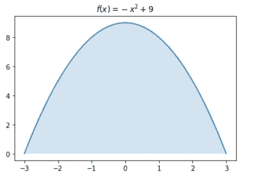

如您所见，这并不复杂，所以让我们进一步调查。我们可以问问自己，曲线下的**空白怎么办？在我们的方程式中，积分来了。它可以用来寻找体积、面积、中心点和许多其他有用的值，但它主要被称为**曲线下的面积(函数)**。**

如果你不明白，可以想象一下:

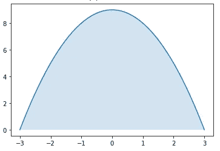

# 集成基础

理解了积分代表什么，我们就可以做一点微积分了。当求解积分时，我们要做以下事情——求函数，求导是积分前的函数。我知道这听起来有点混乱，相信我这并不难。

首先，让我们来看一个简单的常数函数:

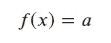

现在，积分很简单:

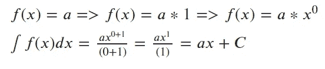

我想你已经明白背后的想法了。我们给变量 x 的指数加 1，然后用相同的指数值除它。

***注:*** *请不要被解迷惑。我不能只写 ax，因为我内心的小数学家会开始尖叫。常数 C 叫做积分常数，它代表所有能在解中的数。我们不知道我们的解是****(ax+2)****还是* ***(ax + 3)，以此类推****——因此，我们写+ C 来涵盖所有可能的变化。*

计算 x 的积分:

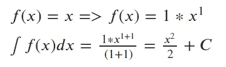

我们再次实现了与之前相同的方法——给指数加 1，然后用指数除整个值。

## 不定积分和定积分

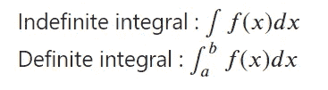

**不定积分**我们上面已经计算过了，它是一个回答“什么函数，求导后给出 f(x)”这个问题的函数。相比之下，**定积分**是表示从 **x=a** 到 **x=b** 的曲线下面积的数字。

计算是一样的，直到最后一步；这里有一个例子:

1.  对于不定积分，解决方案是计算函数:

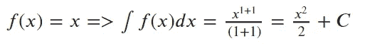

2.对于定积分-对于为积分[a，b]=[-2，2]设置的边界有额外的计算。您可以看到，在上面计算的解决方案中输入了边界。
首先我们把**中的上界 ***b*** 写下来。接下来，我们把下边界 ***a*** 放在*x .最后，我们减去第一个和最后一个表达式得到最终结果。***

***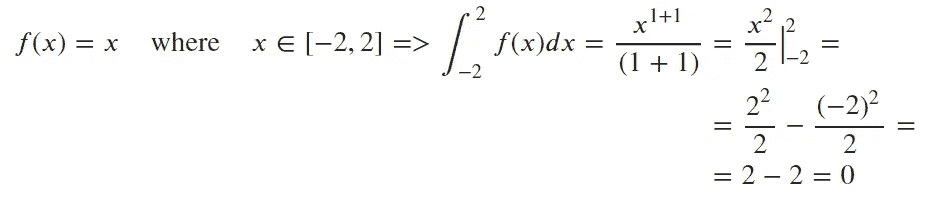***

***到目前为止你还好吗？**抓紧**。激动人心的部分来了。***

# ***用 Python 实现***

***稍微研究一下，就能发现很多用于积分计算的 Python 库。在这个“旅程”中，我们感兴趣的是集成后的功能，以及为相同功能实现边界的结果。是的，你可以从头开始做，但是会有很多工作。对我来说，最优雅的是 SymPy。它的安装很简单，只要在你的笔记本上写下下面的代码，安装就完成了。***

```
***!pip install sympy***
```

***现在，让我们玩得开心。还记得文章开头的第一个例子吗？让我提醒你:***

***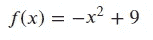***

***f(x)函数积分的简单代码:***

```
***import sympy as sm
x=sm.Symbol('x')
sm.integrate(-x**2+9,x)***
```

***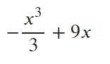***

***我是说没有比这更简单的了，对吧？
手动计算具有边界[-3，3]的函数 f(x)下的面积:***

```
***-(3)**3/3+(9*3)-(-(-3)**3/3+(-3*9))***
```

***输出: **36*****

***使用 SymPy 计算:***

```
***sm.integrate(-x**2+9,(x,-3,3))***
```

***输出: **36*****

***让我们试试更高级的。有两个函数，求它们之间的面积怎么样？至于所有，这个问题有一个公式，可以让我们轻松解决。***

***我们有两个功能:***

***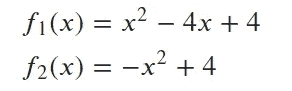***

***绘图时，它看起来像这样:***

***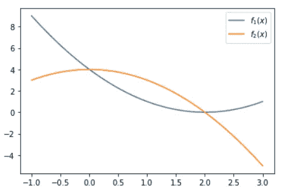***

***主旨:为了能够找到它们之间的面积，首先我们需要找到这些函数的交点——这些点将是我们计算面积时的边界。如果你对此感到困惑，没关系。***

***在图上，蓝色部分是我们要计算的面积，蓝色面积从点 x~0 开始，到点 x~2 结束:***

***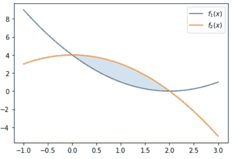***

***交叉点:***

***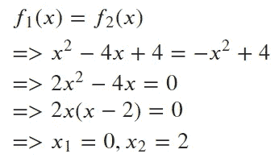***

***现在我们知道——我们的界限是 ***a=0*** ， ***b=2*** 。***

**最后，我们可以整合它们。得到两条曲线之间的面积就是——“上”曲线减去“下”曲线的定积分。换句话说，我们用蓝色曲线减去橙色曲线，并计算从 0 到 2 的边界上的积分结果，得到的数字就是所需的面积。**

**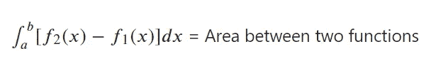**

**所有描述都很容易用代码解决:**

```
**# definig the functions
y1=lambda x:x**2-4*x+4
y2=lambda x:-x**2+4#getting substracted result
y3=lambda x:y2(x)-y1(x)#calculating integral
x=sm.Symbol('x')
sm.integrate(y3(x),x)**
```

**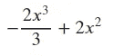**

**获取区域的最终数字:**

```
**sm.integrate(y3(x),(x,0,2))**
```

**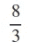**

# **结论**

**通过一些简单的转换，我们可以得到非常酷的结果。这篇文章只是“浅尝辄止”，所以如果你想知道在这个领域进一步探索的故事，请告诉我。**

**鉴于我的背景，你可以期待更多基于其背后的数学和 Python 实现的故事。**

**我希望你喜欢它，并感谢您的阅读。**

**直到下一个帖子，再见。**