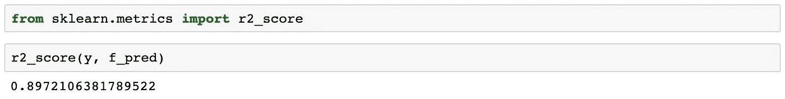

# 探索线性回归

> 原文：<https://medium.com/analytics-vidhya/exploring-linear-regression-474752ba1761?source=collection_archive---------14----------------------->


## 单一和多元

线性回归是一种统计模型，检查两个或多个变量之间的关系。感兴趣的变量是我们的因变量( **y** )、我们的目标和我们的自变量( **x** )，也称为我们的特征。值得注意的是，线性回归用于预测数值(连续)数据。

首先，我们来看一个线性回归模型。

线性关系可以是以下两种情况之一:

```
positive — spending more on advertising to increase sales
negative — increased surveillance decreases instances of theft
```

y 和 x 之间的关系由以下等式表示

```
**y** = **mx** + **b****b (alpha)
m (beta)**
```

其中，因变量 **y** 是我们试图预测的变量，自变量 **x** 是我们用来进行预测的变量。 **m** 是我们回归线的斜率(正或负)，代表 **x** 对 **y** 的影响。 **b** 是从我们的数据中创建的常数。

首先，让我们导入必要的库和我们将在示例中使用的 advertising.csv [数据集](http://faculty.marshall.usc.edu/gareth-james/ISL/data.html)，并快速浏览一下我们的数据集。


我们有三个独立变量可以用来预测销售额，但如前所述，我们将着眼于一个变量。电视。

接下来，我们将使用导入的“statsmodel”库初始化并拟合我们的线性回归模型。我们的第一个模型将包括根据电视广告的花费来预测销售额。


我将在这里花一点时间来谈论我们正在运行的线性回归模型的具体类型，因为您可能已经注意到 smf.ols，其中 smf 是我们的统计库，ols 代表[普通最小二乘法](https://www.encyclopedia.com/social-sciences/applied-and-social-sciences-magazines/ordinary-least-squares-regression)。这种方法“通过最小化配置为直线的因变量的观察值和预测值之差的平方和来估计关系。”

视觉上的 OLS 是这样的:


[普通最小二乘回归模型](http://setosa.io/ev/ordinary-least-squares-regression/)

请注意，测量每个彩色点(真实数据点)和红线(回归线)之间的距离，然后平方。OLS 试图找到最佳拟合线，使回归线产生的平方距离的面积最小。你的 OLS 结果越大，你的模型预测目标的效率就越高。

“还有许多其他比 OLS 复杂得多的预测技术，如逻辑回归、加权最小二乘回归、稳健回归和不断增长的非参数方法家族。”
— — [维克多·鲍威尔](http://twitter.com/vicapow)和[路易斯·乐和](http://twitter.com/lewislehe)

之后，我们将立即运行 model.params，以便方便地标记我们的 **b** 和 **m** 值。


回想 y = mx + b 我们现在有**销量**=**0.047 *电视** + **7.032。**

为了更深入地总结我们的模型，我们将运行 print model.summary()


结果中有很多信息，但目前的关键要点是位于截距和 TV 行末端的 R 平方(右上角)和[置信区间](https://towardsdatascience.com/a-very-friendly-introduction-to-confidence-intervals-9add126e714)。r 平方是一个. 612 并不可怕，但可以改善。我们还有两个变量可以添加(广播、报纸)。我们的置信区间很窄，但也可以使用改进。

```
R-squared is a statistical measure of how close the data are to the fitted regression line
```

此时，我们的回归模型已经拟合(训练)完毕，因此我们可以继续使用之前陈述的等式预测销售额，或者我们可以设置一个新变量等于 model.predict()并绘制我们的结果。


有了这个模型，我们现在可以预测在电视上花费的任何金额的销售额。


根据我们的模型，如果在电视广告上花费 400 英镑，销售额将增加 26 个单位。

继续多元线性回归就像在我们的模型中添加另一个变量一样简单。我们将使用相同的数据，但这次我们将使用不同的库。


接下来，我们将使用电视、广播和报纸作为预测器来构建线性回归模型。我们还将把数据分成预测值 X 和输出值 y，然后初始化和拟合(训练)我们的模型。


一旦我们对数据进行了训练，我们就可以继续查看我们的 alpha 和 beta 值。


最后，我们可以继续创建我们的预测，看看额外的变量是否加强了我们的模型。


因为我们使用了不同的初始库，所以我们将从 sklearn.metrics 导入 r2_score，以便查看我们训练模型的效果。



我们的最终分数是 0.897，比 0.612 有了显著的提高。添加更多的变量(特征)来训练我们的模型提高了我们的模型的效率。

在我们的[下一节](/analytics-vidhya/dealing-with-categorical-data-942a8c8fdbad)中，我们将讨论如何处理属于分类变量的预测器。