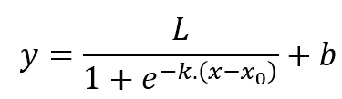
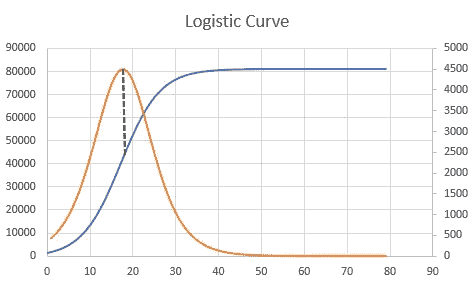
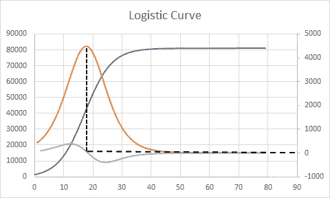
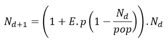
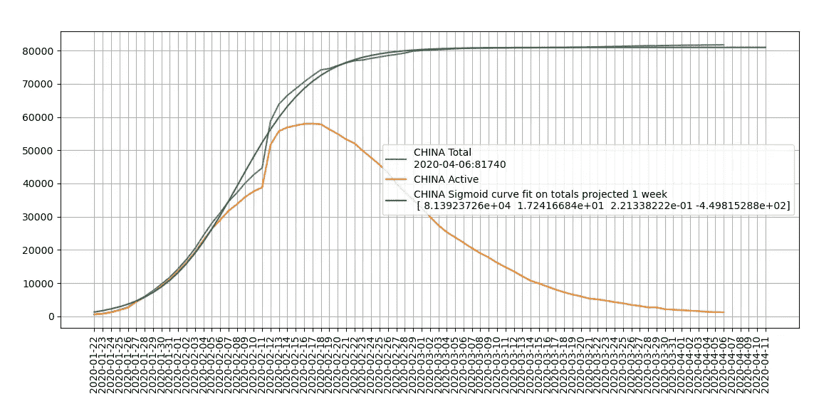
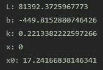

# 探索中国疾病传播的逻辑斯蒂曲线

> 原文：<https://medium.com/analytics-vidhya/exploring-logistic-curves-for-disease-spread-in-china-80c616382a9c?source=collection_archive---------24----------------------->

在帖子[的基础上，让我们看看通用的形式是否符合像中国这样的国家的数据。](/analytics-vidhya/modelling-disease-spread-using-a-logistic-model-in-python-c14e5755efc)

# 一般形式和曲线

逻辑曲线的一般形式被定义为以下形式的参数方程。



方程的四个决定参数是 *L* 、 *k* 、 *x0* 和 *b* 。使用一些适当的参数值，曲线如下所示:



蓝色的逻辑曲线，橙色的一阶微分

逻辑斯谛曲线有我们熟悉的 S 形曲线。另外需要注意的是**橙色的**曲线，它代表曲线的*变化率*，有一个熟悉的钟形。橙色曲线的峰值对应于逻辑曲线的 ***拐点*** ，在此处曲线开始向下弯曲。

> [从数学角度来看，二阶微分在峰值处为 0，然后变为负值，即下面的灰色曲线。



> ]

这基本上是扩散概率*‘p’*开始被一小部分人支配的点(斜率的变化作为拐点)



为了发现与特定数据集相关的参数，我们将使用类似于[新冠肺炎曲线拟合和未来预测](/analytics-vidhya/covid-19-curve-fitting-and-future-projections-a4ffdb2e17e7)中描述的方法。

```
def sigmoid(x, L ,x0, k, b):
    y = L / (1 + np.exp(-k*(x-x0)))+b
    return (y)countries = ['china']
for country in countries:
    data = requests.get("[https://www.worldometers.info/coronavirus/country/](https://www.worldometers.info/coronavirus/country/)"+ country)
    data = data.text
    active = data[data.find("data: [")+len("data: ["):data.find("]", data.find("data: [")+len("data: ["))]
    tot = data[data.find("data: [", data.find("name: \'Cases\'"))+len("data: ["):data.find("]", data.find("data: [", data.find("name: \'Cases\'"))+len("data: ["))]active = [int(i) for i in active.split(',')]
    tot = [int(i) for i in tot.split(',')]
    print(active)
    print(tot)dates = data [data.find("categories: [")+len("categories: [") : data.find("]" , data.find("categories: [")+len("categories: ["))]
    dates = [date for date in dates.split(",")]print(len(tot))#use only the exponential part to fit the curve, not the whole data
    finish = 40
    start = 0
    span = finish-start
    p0 = [max(tot[start:finish]), np.median(np.linspace(0, span-1, span)),1,min(tot[start:finish])]
    param, param_cov = curve_fit(sigmoid, np.linspace(0, span-1, span) , tot[start:finish], p0, method='dogbox')
    print(param)
    #param, param_cov = curve_fit(test, np.linspace(0, len(tot)-5, len(tot)-4) , tot[:-4])
    clean_dates = [datetime.strptime(str(date) + " 2020", '\"%b %d\" %Y') for date in dates]
    plt.plot(clean_dates, tot ,  label = country.upper() +" Total \n" + clean_dates[-1].strftime('%Y-%m-%d') + ":" + str(tot[-1]))
    plt.plot(clean_dates, active ,  label = country.upper() +" Active" )
    lobf = []
    cleandates_lobf = []for i in range(len(tot)+5):
        lobf.append(sigmoid(i, param[0], param[1], param[2], param[3]))
        cleandates_lobf.append(min(clean_dates)+ timedelta(days = i))print(lobf)
    plt.plot(cleandates_lobf, lobf, label = country.upper() + " Sigmoid curve fit on totals projected 1 week \n " + str(param))plt.legend()
plt.grid(which = "both")
plt.xticks(rotation=90)
plt.xticks(cleandates_lobf)
plt.show()
```

这是中国在 2020 年 4 月 7 日的曲线。这几乎是一个完美的契合。

需要注意的一个关键方面是，在 scipy 能够发现正确的参数之前，需要特别注意*初始化参数。使用这里的信息:[**https://stack overflow . com/questions/55725139/fit-sigmoid-function-s-shape-curve-to-data-using-python**](https://stackoverflow.com/questions/55725139/fit-sigmoid-function-s-shape-curve-to-data-using-python)*

```
p0 = [max(tot[start:finish]), np.median(np.linspace(0, span-1, span)),1,min(tot[start:finish])]
```



如您所见，这几乎是数据的完美拟合，拟合参数为



下面橙色曲线中的每日病例也类似于总病例曲线的一阶微分。