# 使用数据可视化探索 IPL 的比赛统计数据:第 1 部分

> 原文：<https://medium.com/analytics-vidhya/exploring-match-stats-for-ipl-using-data-visualization-part-1-1374bdabfb55?source=collection_archive---------16----------------------->

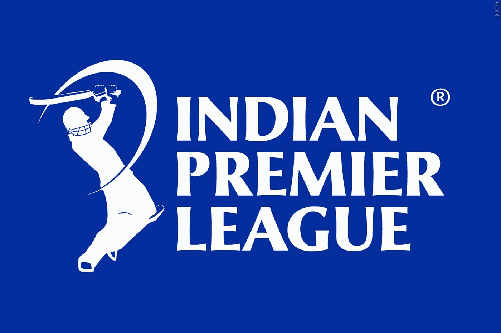

一种冠状病毒在世界范围内传播，取消了包括 IPL 在内的体育赛事，从而使我的 Hotstar 会员资格变得毫无意义。因此，作为一名初露头角的数据科学家，我决定用自己的数据可视化项目取代 IPL window。我在 [Kaggle](https://www.kaggle.com/nowke9/ipldata) 上找到了 2008-2019 年所有 IPL 游戏的数据集。

对于不了解板球的读者。这里是关于 IPL 和板球的 Y [outube](https://www.youtube.com/watch?v=NZGLHdcw2RM) 视频

**数据集包含两个 csv 文件**

**Matches.csv** :从 2008 年到 2019 年在 IPL 进行的所有比赛的信息，提供以下信息

> id
> 赛季
> 城市
> 日期
> team 1
> team 2
> toss _ winner
> toss _ decision
> 结果
> dl _ applied
> win _ by _ runs
> win _ by _ wickets
> player _ of _ match
> 场地
> 裁判 1
> 裁判 2
> 裁判 3

**Deliveries.csv :** 所有投球的信息和得分。这个数据集将在另一篇第 2 部分的文章中深入讨论。

数据作为一个整体是干净的，几乎没有问题。我已经在我的笔记本上记录了清洁部分。请随时访问或评论工作。

我研究了数据集，以获得以下问题的答案

```
 1\. Matches played across season 
  2\. Matches played by each team
  3.Matches played in each city 
  4.Matches played in each stadium 
  5.Percentage of toss won by each team 
  6.Decision after toss win Overall 
  7.Decision after toss season wise
  8.Decision after toss team wise 
  9.Percentage of wins for each team after winning the toss
  10.Most common umpire pair across 10 season 
  11.Most Man-of-Match Wins
  12.Function to compute head to head wins between each team 
  13.100 big wins batting first 
  14.100 big wins batting second
```

# **1。跨赛季比赛和各队比赛**

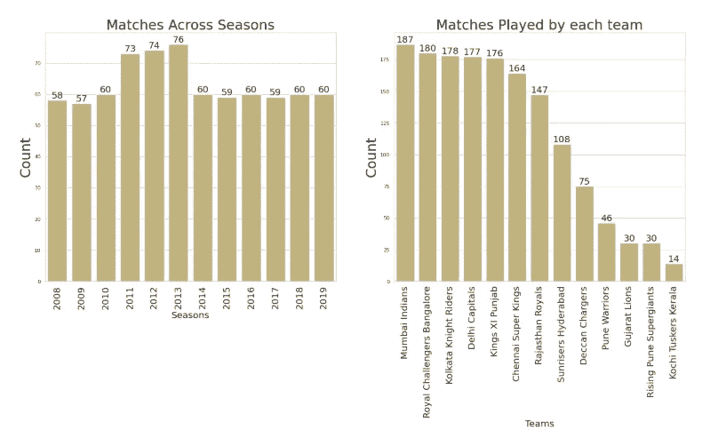

2011、2012 和 2013 赛季的比赛数量增加，因为比赛中增加了两支队伍

我们也看到孟买的印度人打了最多的比赛

# **2。在城市进行的比赛**

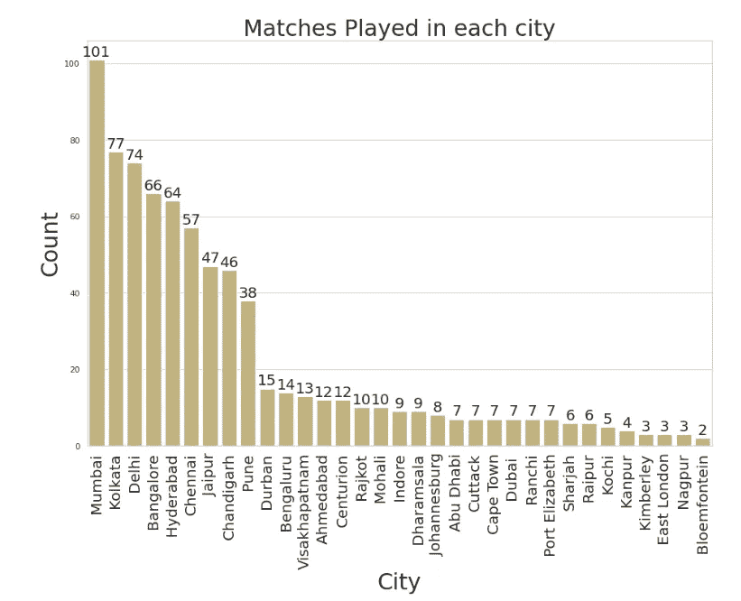

孟买在其他城市中独占鳌头的原因可能是因为某些赛季的半决赛和决赛都在孟买举行

此外，孟买队的所有比赛都在一个城市进行，不像其他球队那样将主场比赛重新分配到不同的城市

# **3。每个体育场的比赛**

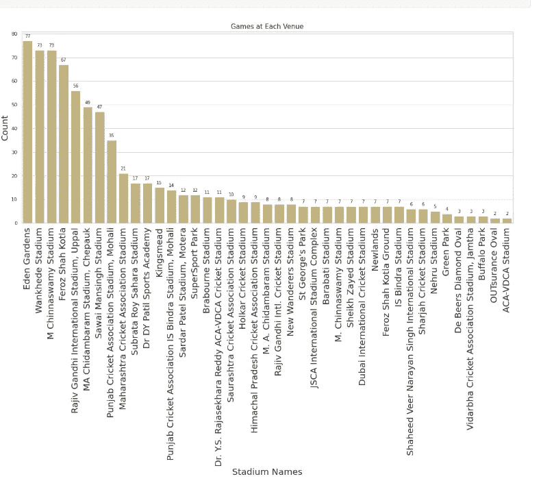

# 4.每队掷硬币获胜的百分比

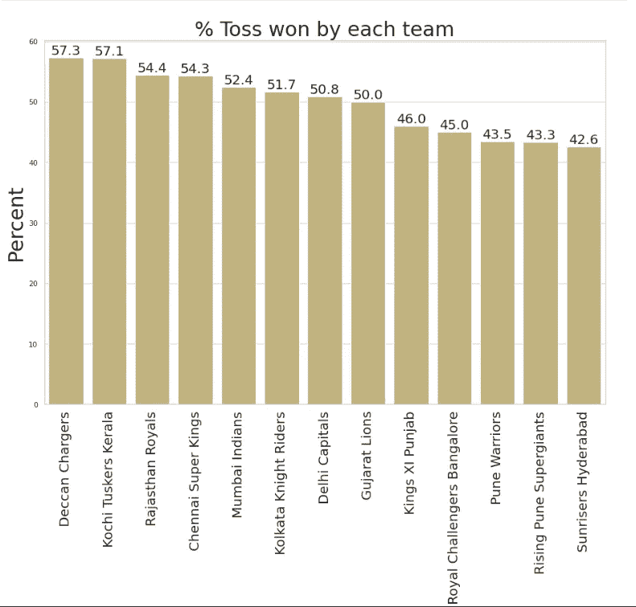

德干充电器在投掷方面相当幸运

# 5 掷硬币获胜后的分配决定

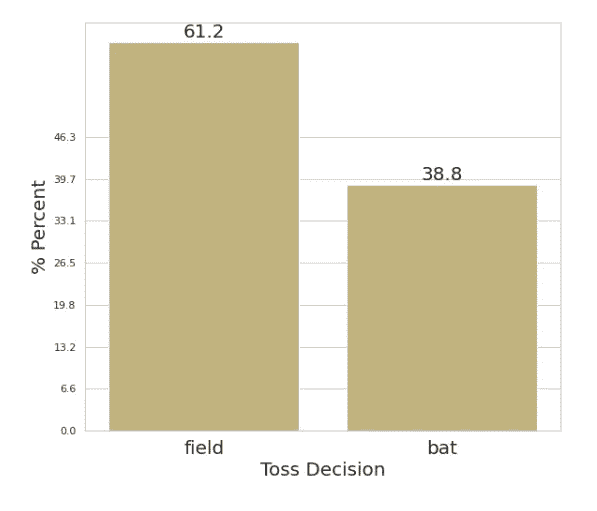

大多数队长都选择整体上场

# **6。掷硬币赢了之后的明智决定**

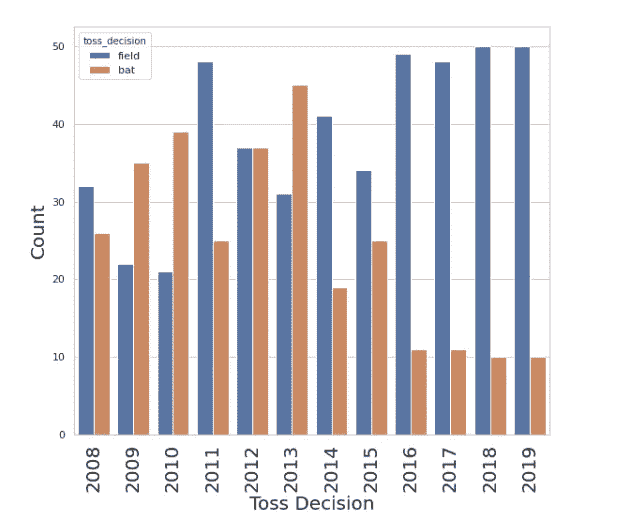

# **7。抛硬币后决定团队智慧**

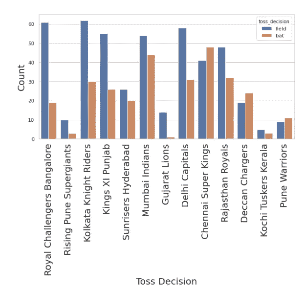

除了浦那勇士队、德干充电器队、钦奈超级国王队，大多数球队更喜欢追逐

# **8。掷硬币获胜后各队获胜的百分比**

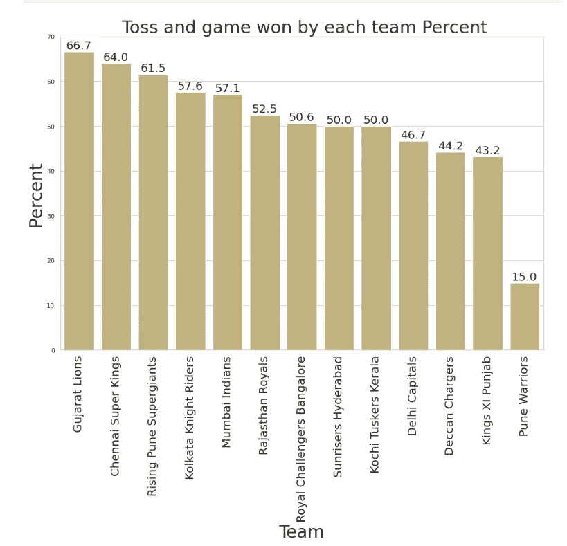

上面的图表显示，在掷硬币赢了之后，大多数球队继续赢得至少 50%的比赛。所以抛硬币赢其实是 IPL 的一个好习惯。

# **9。最常见的裁判组合**

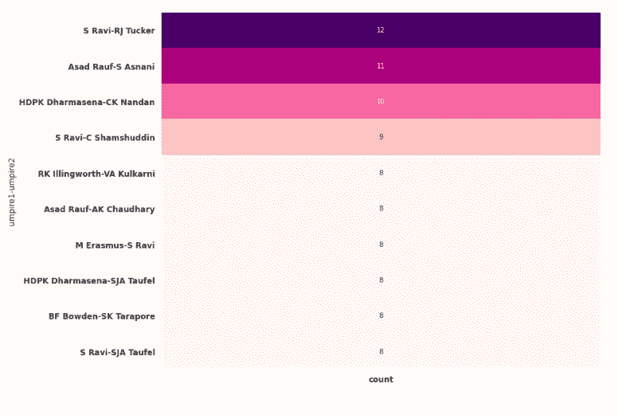

南拉维和 Rj 塔克是最常见的选择站在一起的 12 场比赛。

# 10.最佳球员

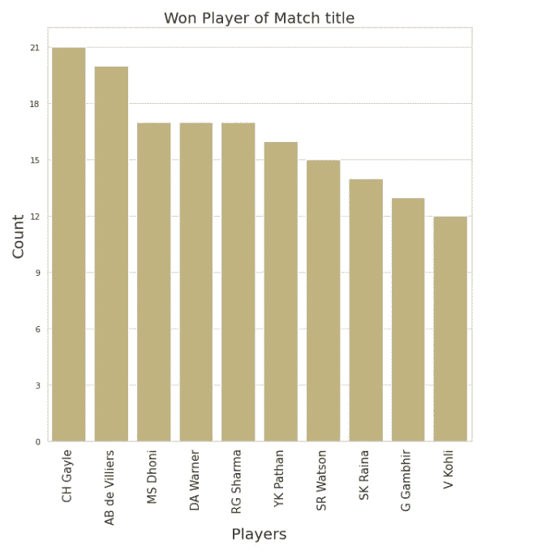

毫无疑问，宇宙老板(克里斯·盖尔)凌驾于其他人之上。

# 11.计算正面获胜的函数

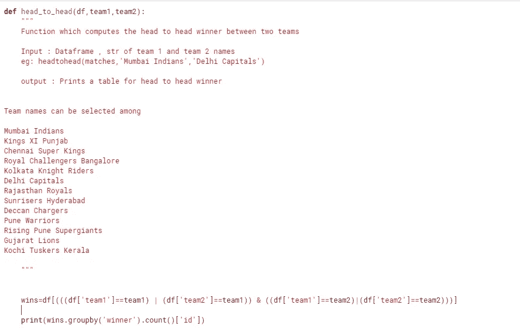

上面这段代码计算了两队之间的胜负。下面是该函数的输出

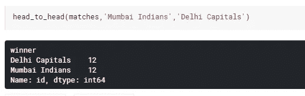

# 12.第一棒和第二棒的前 100 名获胜

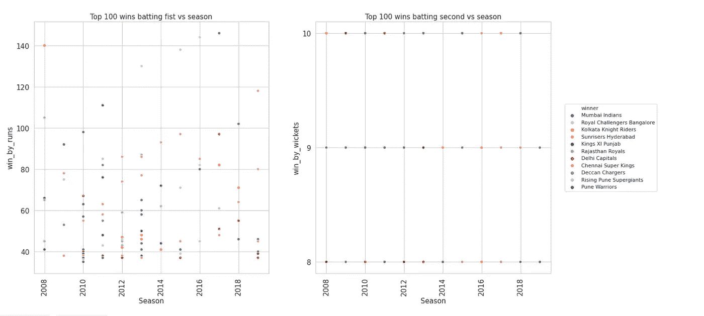

2010 年和 2013 年赛季显示了前 100 名中更高的击球成功率

没什么可说的，三柱门赢了，也就是击球第二

# 13.赢得两队之间的第二名

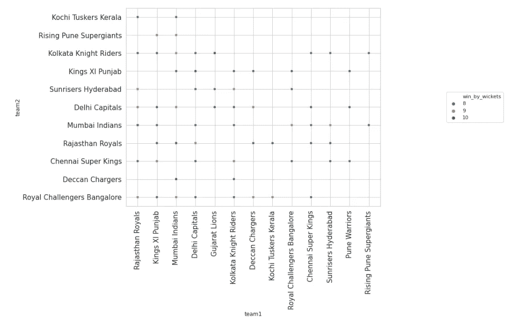

希望你们喜欢我的 IPL 可视化，并能够获得一些对锦标赛的见解。请继续关注 IPL 交付数据集的第 2 部分。

你可以**关注/评论**我在 [Kaggle](https://www.kaggle.com/sumeetsawant/ipl-data-visualization-2008-2019-part-1) 或 [LinkedIn](https://www.linkedin.com/in/sawantsumeet/) 上的工作