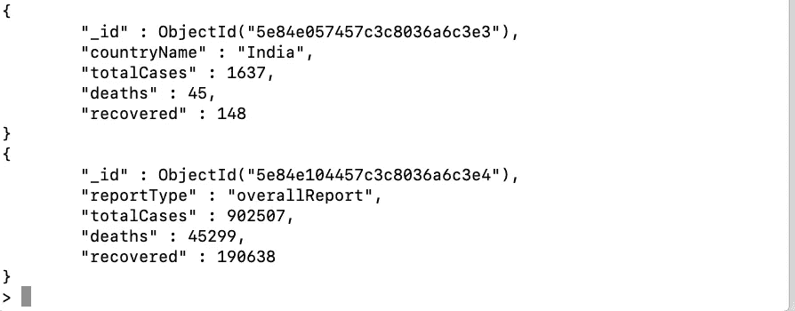

# 探索 MongoDB

> 原文：<https://medium.com/analytics-vidhya/exploring-mongodb-80635e2382a8?source=collection_archive---------18----------------------->

数据是新时代的燃料——如果我没错的话，你可能已经见证了数据的力量，以及我们在生活中遇到数据的频率。利用大范围数据、资源使用、从中收集的见解的需求以及联网的必要性推动我们采用各种各样的数据库解决方案。

我们今天遇到的数据最好是非结构化的。这导致了非 SQL 数据库解决方案的革命。现在，如果你尝试市场，你可能会遇到数百个这样的解决方案来适应你的问题。现在让我们打开 MongoDB 的大门，它是最流行和最广泛采用的非 SQL 解决方案之一。

> 作为一个程序员，你用对象来思考。现在您的数据库也是如此。

MongoDB 官方文档中的这个非常简单明了，值得注意。

深入到他们的主页你可以找到这个定义，

> MongoDB 是一个通用的、基于文档的分布式数据库，为现代应用程序开发人员和云时代而构建。

理论讲够了，让我们用一个用例直观地体验一下 MongoDB 的基础知识，

更有意义、更相关、更有趣的用例应该是我们正在目睹的现在的**新冠肺炎·疫情**。让我们使用 MongoDB 探索一些关于新冠肺炎的有用见解，并发现当我们处理大量非结构化数据时，这些解决方案是如何脱颖而出的。

**注意**:我确实假设你的机器上已经安装了 MongoDB，我们可以开始了。

我们将坚持绝对基础，因此我们将通过 Mongo shell 处理数据。我们不会与任何实际的后端交互，比如 node 或 python，我们可能会在即将发布的帖子中涉及到。

确保您的 MongoDB 服务器正在运行，并使用命令启动 shell，

> 蒙戈

如果您注意到一个类似这样的终端屏幕，您可以开始了，只要确保(>)箭头指向，

MongoDB 是一个文档数据库，这意味着它将数据存储在类似 JSON 的文档中。您更有可能经常遇到这种数据，MongoDB 社区认为这是考虑数据的最自然的方式，比传统的行/列模型更具表现力和功能。

让我们创建一个数据库(比方说，COVID19-dB)并创建一个新的集合(比方说，covidReports)并根据来自世卫组织的报告存储当前的数字。我们计划几乎每天持续更新收藏。

首先，让我们使用命令检查可用的数据库，

> 显示数据库

这将列出所有可用的数据库，

如果您注意到可以找到数据库名称以及每个数据库的存储信息，

现在让我们为自己创建一个，

> 使用 COVID19-db —将为我们完成这项工作。

现在，让我们为通用 COVID 全球统计数据创建一个新集合，并添加一些数据，

**注意** : MongoDB 检查集合是否可用，否则它会在 insert 上专门为我们创建一个。

假设我们的总体报告是这样的，

要将其添加到集合 covidReports 中，

您可以注意到数据被成功地插入和确认，以验证我们可以使用 find 和 inspect 所有可用的集合。

注意:那里的 pretty()只是修饰文档，使其可读性更好。还有一件事是你可以发现 MongoDB 会自动为文档创建一个唯一的 id。

现在，假设我们也需要国别报告。我们可以将它们插入到上一个报告之后的同一个集合中，

如果我们仔细观察，这是一个正在插入的数据数组，让我们看看集合是什么样子的，

如果我们仔细观察这个结果，您会发现在同一个集合中存在两种不同类型的数据(一种是具有不同键值对的总体报告和国别报告)。这被称为非结构化数据，MongoDB 完全接受这一点。但是我们应该避免这种用法。为什么？

> 因为想象一下，你正在与来自 Node.js 或 PHP 等后端的数据进行交互，如果你试图迭代这些数据，你会发现很困难。因此，即使 MongoDB 是一个无模式的数据库，拥有一个基于我们的用例的模式模型来促进这种检索也是很好的。

好了，现在我们有了所有需要的数据。

出于某种原因，让我们说印度计划保持一个单独的集合，以便他们可以独立操作和计划。因此，我们应该从这个集合中删除它们。

世界各国领导人也希望知道危重病例的数量，以便他们能够更多地关注他们的福利，并据此开展工作。要更新，

现在让我们验证事情是否按要求进行，

因此，如果您注意到这里，我们会看到印度已被删除，关于关键病例的新的附加信息也已更新。万岁！

现在，假设我们需要将所有满足死亡人数大于 2000 这一条件的国家和总体报告状态标记为关键，我们如何实现这一点？

在我们的例子中，所有四个文档都满足条件，因此都得到更新。

> MongoDB 的一个独特特性是嵌入式文档。这是任何其他数据库都找不到的。因此 MongoDB 如此受欢迎和广泛使用。

这意味着您可以在其他文档中嵌入任何级别的文档。

> MongoDB 最多支持 100 层嵌套(但是最好不要超过 2、3 层)
> 
> 它方便我们存储最大 16MB，这是相当合理的，因为我们将只存储键值对，没有那么重。

现在让我们来看看它的运行情况。每个国家在不同的地方都有自己的检测和治疗中心。它应该包括诸如他们可以容纳的病人总数、帮助热线号码、地址信息等信息。我们如何嵌入这样的数据，

为了简单起见，让我们只嵌入美国的数据，因为他们处于最危急的状态，因此对他们非常有帮助。

我们可以更新类似的东西，

如果您执行 find 并查看数据现在的样子，

这样，如果需要，您可以嵌入任何级别的数据。

除此之外，我只是希望触及一些事情，但肯定不是深入的，因为我们决定坚持最基本的，对不对？所以让我看一下它们，

在使用 MongoDB 时，可以有这么多种数据类型，

> text
> boolean
> number——整数、长整型、十进制
> objectId——将包含对象创建时的时间戳
> iso date——用于在 MongoDB
> 嵌入式文档中存储日期和时间的日期格式——可以针对一个键
> 数组存储一个完整的文档——可以为一个键存储多个文档或多个嵌套文档

您还可以像任何其他数据库一样在数据之间建立某种关系，

*   一对一
*   一对多
*   多对多

还有更多的内容要介绍，让我们把这些实验转移到其他未来的帖子中吧。我希望您在使用 MongoDB 的过程中获得了一些乐趣，如果有什么地方可以做得更好，请告诉我😄

问候，
玛利亚潘 S，
电子邮件:**mariappangameo@gmail.com**