# 探索在纽约市开一家印度餐馆

> 原文：<https://medium.com/analytics-vidhya/exploring-new-york-city-to-open-an-indian-restaurant-dbc1b33ec866?source=collection_archive---------26----------------------->

这篇文章讨论了在 Coursera 上主持的 IBM 应用数据科学顶点课程的顶点项目。该项目利用从专业课之前的课程中获得的知识，并将其应用于解决现实世界中的数据驱动问题。

## **1。简介**

我用一个假想的场景来描述一个想在纽约市开一家印度餐馆的印度企业家。对于一个已经住在纽约市并且非常熟悉这些地方和社区的印第安美国人人来说，这可能是一个很好的机会。由于印度菜很受美国人和印度裔美国人人的欢迎，已经有许多餐馆，其中大部分是特许经营或家族企业。

> **为什么是纽约市？**
> 
> 纽约市是各大都市中印第安美国人人口最多的地区，也是亚洲以外和纽约市内第二大的亚裔散居城市(来源——维基百科)。

纽约市是众多民族的家园

**酒店业**

在进入酒店行业之前，氛围、菜单、卫生，当然还有味道都是需要记住的重要因素，但这些问题都可以由负责人在内部解决。不管生意的历史或食物的味道如何，餐馆的位置也是至关重要的。如果人们不进来吃饭，那么所有的准备工作都不重要。这就是我在这个项目中要解决的问题。

## 2.问题陈述

目标是在美国纽约市找到一个合适的地点开一家印度餐馆。该项目利用各种数据科学和机器学习方法( [k 均值聚类](https://towardsdatascience.com/understanding-k-means-clustering-in-machine-learning-6a6e67336aa1))为客户提供解决方案。该项目旨在为以下问题提供解决方案:**‘在纽约市，你应该考虑在哪里开一家印度餐馆？’**

## 3.数据

我使用了以下数据来完成项目:

*   纽约市的行政区和社区列表——这给出了所有社区的坐标，用于调用 Foursquare API。
*   纽约市的地点和场馆列表-包含所有附近场馆的数据，如餐厅、酒吧、健身房等。
*   纽约市美国印第安人的人口统计数据——对了解纽约市目标受众的分布至关重要。
*   邻域的纬度和经度数据-用于绘制和可视化我们的数据。

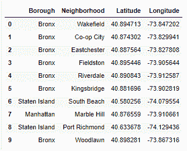

*纽约市的行政区和街区*

> 数据来源在文章的末尾有链接。

## 4.方法学

**A)行政区**

上面的数据部分清楚地描述了我们的纽约市数据由行政区(一个城镇或行政区)和这些行政区中的社区组成。该数据包含 5 个区——皇后区、布鲁克林区、布朗克斯区、曼哈顿区和斯塔滕岛区，以及总共 300 多个社区。因此，在我们开始分析社区之前，我们选择一个合适的行政区。这包括调查全部 5 个。为每个区过滤数据，并用于调用 Foursquare API。

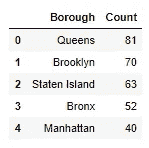

行政区的居民区数量

Foursquare API

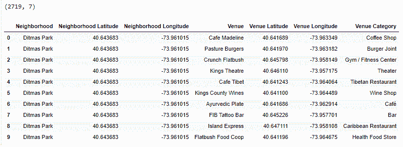

*布鲁克林 API 返回的数据*

这个项目的中心部分涉及到使用 [**Foursquare API**](https://foursquare.com/developers/apps) 来获取附近场馆的各种细节，比如——类别(披萨店、纪念碑等)、地点坐标(经度和纬度)以及场馆名称。我们需要声明我们的 Foursquare 凭证，比如客户端 ID 和客户端秘密。我们假设半径值为 500，这将返回半径为半公里的地点。为了防止函数调用返回太多记录，设置了 100 的限制。

url 是用我们声明的凭证构造的，并对 API 进行请求调用。返回的数据是 json 有效负载的形式。然后通过读取该数据的一部分来构建熊猫数据帧。**因此，制作了 5 个数据帧，每个区一个**

既然已经为预处理构建了数据，我们要为分析决定一个区，因此我们要考虑两个方面

1.  先前存在的印度餐馆
2.  印第安美国人人口统计

**C)先前存在的印度餐馆**

因为我们想开一家新的印度餐馆，所以考察一下现有的餐馆会有帮助。因此，我们获得了每个行政区中印度餐馆的数量(来自地点类别),并将它们合并在一起，以了解它们的分布或集中程度。从逻辑上讲，为了避免竞争，选择一个印度餐馆很少的行政区是有意义的。

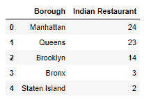

*印度餐馆的数量*

可以看出，曼哈顿和皇后区的餐馆数量最多，斯塔滕岛最少。

**D)印第安美国人人口的统计数据**

一家印度餐馆将主要迎合印第安美国人人和印度游客。所以我们调查了纽约的印第安美国人人口。同样的数据是从维基百科搜集的，来自 2014 年美国社区调查(收集包括种族在内的人口普查数据)。这有助于我们缩小目标人群的范围。

抓取的原始数据包含一些维基百科格式和不必要的列，需要清理后才能使用。一旦完成，它看起来像这样-

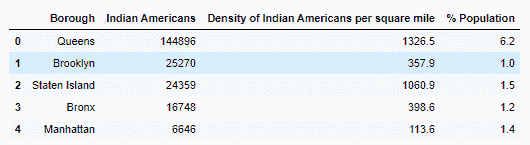

*行政区的印度人口*

**E)初步分析**

> 虽然**皇后区**拥有印度裔美国人最高的人口和最高的人口百分比，但我们**不认为它是，因为那里已经有许多预先存在的餐馆。**
> 
> 曼哈顿的印度裔美国人很少，而且拥有最多的印度餐馆，所以我们排除了它。
> 
> **布鲁克林**似乎是我们开始分析的一个不错的第一选择，因为它没有太多拥有体面印度人口的餐馆。
> 
> **斯塔滕岛**接下来也可以去看看(人口密度高，地方很少)。

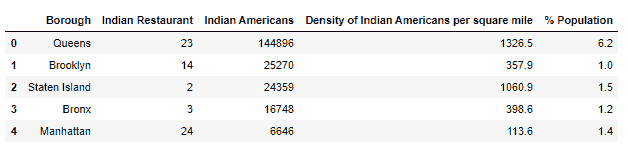

*显示人口和印度餐馆的合并数据表*

**F)预处理**

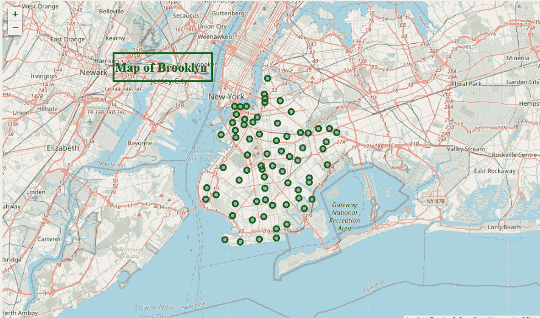

布鲁克林街区地图

1.  **一键编码**

上面提到的数据包含了附近场馆的详细信息——位置、类别等。在聚类之前，需要将这些数据转换成合适的格式。首先对**【场馆类别】**属性进行一次热编码。这是使用 pandas [get_dummies()](https://pandas.pydata.org/pandas-docs/stable/reference/api/pandas.get_dummies.html) 函数完成的。编码为我们的分类数据分配一个名义值，因此模型不会将任何数字解释为重要性或权重。

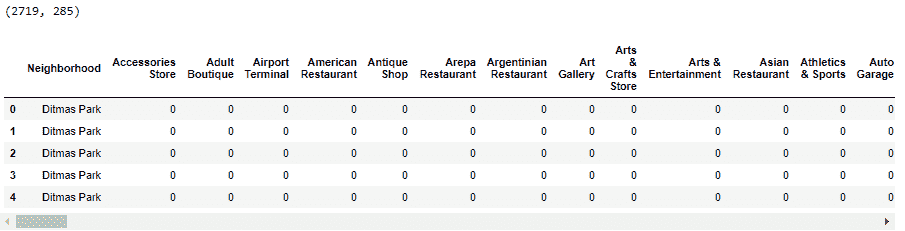

一个热编码的类别

**2。对类别进行分组**

新数据框现在按邻域分组，并取每个类别的平均值。这给出了邻域中每个类别的平均估计值。

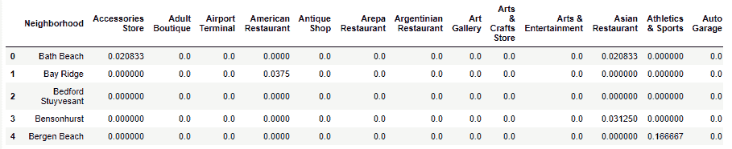

*按邻域对类别进行分组*

完成后，我们只选择印度餐馆和街区，其他属性我们不关心。该数据框用于对数据点进行聚类。

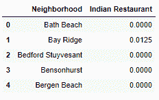

*仅过滤印度餐馆*

**G)聚类**

1.  **选择 k 值**

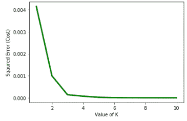

成本与 k 的关系图

“k”代表簇的数量，或者更具体地说是质心的数量。它在 k-means 聚类中的值由[“肘法”](https://www.geeksforgeeks.org/elbow-method-for-optimal-value-of-k-in-kmeans/)选择。肘法包括绘制成本与 k 值的关系图；其中 k 是整数> 1。曲线进行过渡的点通常被选作 k 值。我在分析中使用的 k 值为 3，虽然在 k=2 时有一个过渡，但在 k=3 时成本进一步降低，这将为我们提供更多不同的聚类进行检查。

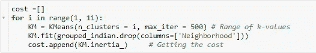

计算 WCSS 以找到 k 值

> 目的是通过使用 sklearn 库中的**惯性**标准来最小化**类内平方和**成本。

接下来执行聚类，并保存聚类标签。

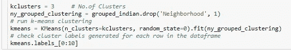

使聚集

**2。集群标签**

聚类标签与之前仅包含印度餐馆的数据框合并。

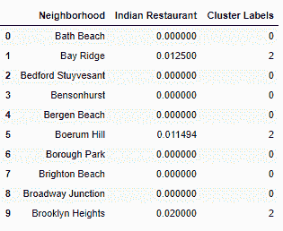

*邻域的聚类标签*

该数据帧然后与布鲁克林场馆数据帧相结合。

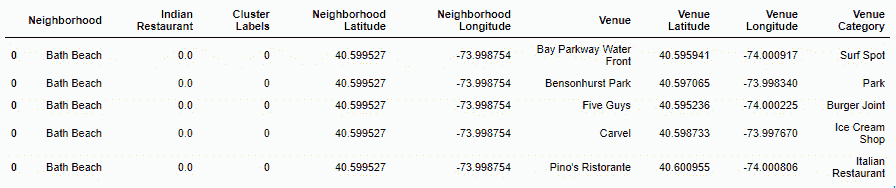

*带标签的合并场馆数据框*

**H)集群**

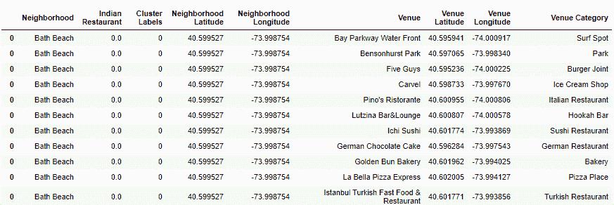

群集 0

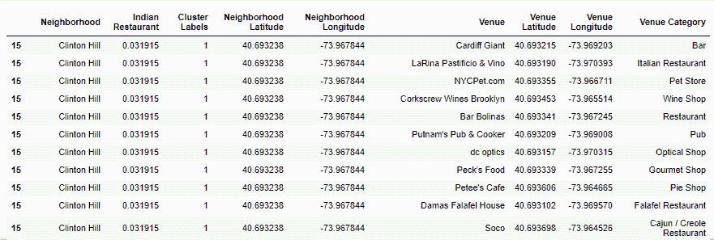

群组 1

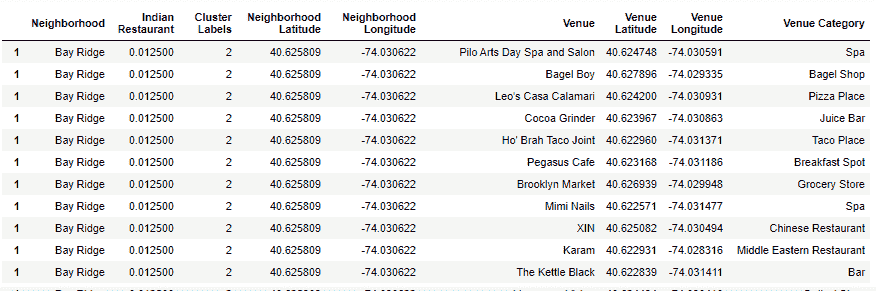

群组 2

## 5.结果

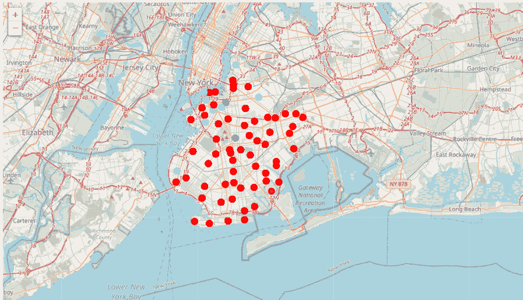

聚类图

基于该聚类，

**集群 2** :拥有最多的印度餐馆，因此未被考虑。

**集群 1** :拥有中等数量的餐厅。

**集群 0** :理想状态，因为没有餐馆。因此，我们可以查看这个集群中的位置。

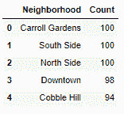

*集群中最常见的邻居*

看看附近的场地，看起来集群 0 可能是一个好位置，因为在这些地区没有太多的印度餐馆。集群中有 60 个奇怪的社区，最常见的是**卡罗尔花园、南区、北区、市中心**和**布鲁克林**的鹅卵石山。

> 因此，我们的印度餐厅可以开在任何一个社区，几乎没有竞争。尽管如此，如果食物是负担得起的，正宗的，味道好的，我相信它会在任何地方都有很大的追随者。

## 6.讨论

根据分析，卡罗尔花园、南区、北区、市中心和科布尔山是考虑开设我们餐厅的一些街区。我也调查了斯塔滕岛，因为它和布鲁克林有相似的印度人口。因为只有两家餐馆，竞争很小。斯塔滕岛每平方英里的印度裔美国人密度也很高，所以步行交通应该不是问题，但印度餐馆的缺乏也可能暗示着各种其他问题，如许可，严格的社区规范等，这些都应该在做出决定之前进行调查。曼哈顿有最多的印度餐馆，但最少的印度裔美国人餐馆，这可能是一个有趣的调查。

这种分析的一些缺点是——聚类完全只基于从 Foursquare API 获得的数据，而每个街区的印度人口分布数据也是基于 2014 年的人口普查，而不是最新的。因此，人口分布数据存在巨大差距。尽管有很多地方可以改进，但这一分析无疑为我们提供了一些很好的见解，关于可能性的初步信息&通过正确地设置垫脚石来开始这个业务问题。

## 7.结论

我们解决了一个商业问题，就像一个真正的数据科学家会做的那样。我们使用 python 库来获取数据(json、请求等)、操作内容(pandas)以及分析和可视化(matplotlib、Folium)这些数据集。我们利用 Foursquare API 来探索纽约附近的场馆，然后从维基百科获取数据，这些数据是我们利用熊猫图书馆搜集来的。我们还应用机器学习技术(聚类)来预测给定数据的输出，并使用 follow 将其可视化在地图上。

通过使用更近的数据和利用更复杂的机器学习算法，可以进一步改进分析。然而，这一过程可以作为一个基线，并可以在其他菜系或健身房中复制。

## 8.引文

[1][https://geo.nyu.edu/catalog/nyu_2451_34572](https://geo.nyu.edu/catalog/nyu_2451_34572)

[2]https://foursquare.com/developers/apps

[3][https://en . Wikipedia . org/wiki/Indians _ in _ the _ New _ York _ City _ metropolitan _ region](https://en.wikipedia.org/wiki/Indians_in_the_New_York_City_metropolitan_region)

整个项目可以在我的 [Github](https://github.com/abhim-12/Coursera_Capstone) 上找到，还有课程内容作业和相关数据。希望这是有见地的或对你有帮助！