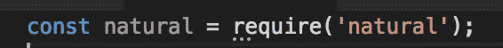
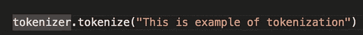
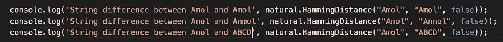
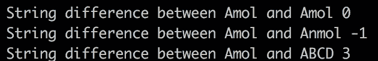
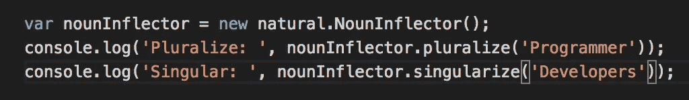
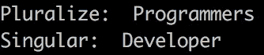
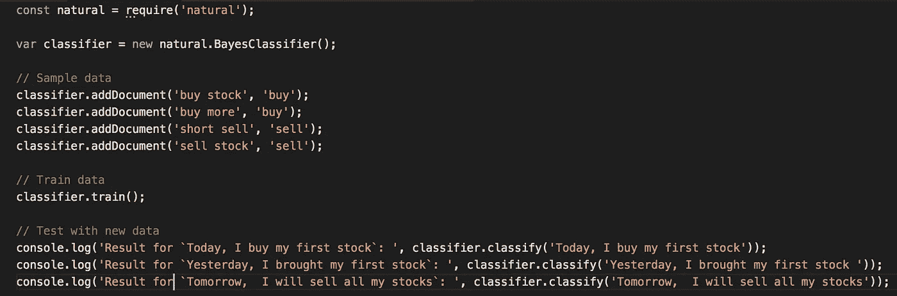
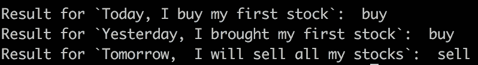

# 探索 JavaScript 中的 NLP

> 原文：<https://medium.com/analytics-vidhya/exploring-nlp-in-javascript-dbbadc9aab3a?source=collection_archive---------5----------------------->

**NLP** 是**自然语言处理**的简称，是**人工智能**的一个领域，广泛用于解释、理解和处理人类/自然语言。它通常用于语音识别和 **NLG** (自然语言生成)。

一个比较常见的 **NLP** 的能力如下:
**1。内容分类
2。上下文提取
3。感性分析
4。语音转文本和文本转语音
5。文件摘要**

今天，在这篇博文中，我将使用 Javascript 探索 NLP。我们在 JS 中有许多可用的 NLP 库，在那里我们有大部分的 NLP 特性/任务。在这篇文章中，我们将更多地关注 [***自然***](https://www.npmjs.com/package/natural) npm 库，但是您可以检查其他库，如 [***折衷***](https://www.npmjs.com/package/compromise)*[***node-NPL***](https://www.npmjs.com/package/node-nlp)。
在这里，我们将看到它的一些核心功能，如**标记化、字符串操作和分类器。***

*首先，我们必须安装并导入自然库*

****

*安装和导入库*

1.  *术语**记号化**的意思是将字符串分解成数组，比如*

****

*简单的标记化示例*

*我们可以使用 JS 字符串方法来实现这一点，但除了这个简单的标记化之外，它还为我们提供了基于**大小写、正则表达式、句子和标点符号**的任何语言的标记化。*

*2.一个**字符串距离，**统计不同字符的个数。*

****

*字符串距离示例*

*在上面的例子中，它只是返回不匹配字符的数量。它忽略大小写，因为我们将标志设置为 false，如果字符串长度不同，也返回-1。
还支持字符串匹配**。***

*3)一个**屈折器，**为单词的单数或复数形式，*

***

拐点示例* 

*4)现在，我们将看到最精彩的部分，**分类器**，我们将使用样本数据训练分类器，并从中获得结果。(这里，我们只是演示分类器在我们的例子中是如何工作的，而不是它的实现。)*

**

*图 1 分类器示例*

**

*图 2 分类器输出*

*在图 1 中，简而言之，我们用样本数据训练分类器，我们提供输入和输出，所以将来如果分类器得到相似上下文，它将返回期望的输出。在上面的例子中，我们在一些输入样本数据上设置了输出买入/卖出，因此在训练后，当我们检查不同的数据时，它根据训练数据输出买入/卖出。*

*在这篇博客文章中，我更多地关注于探索 Javascript 中的 NLP，以获得一些关于 NLP 的上下文，它的特性和实现。*

*一个 [***自然***](https://www.npmjs.com/package/natural) 库给了我们比我们迄今所见更多的便利。同样一个 [***妥协***](https://www.npmjs.com/package/compromise)*也是不错的一个，用几乎类似的设施，你可以在上运行 [***妥协***](https://www.npmjs.com/package/compromise)*NodeJS 和浏览器本身。***

***谢谢你。***