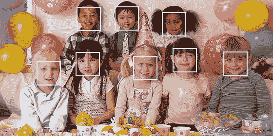
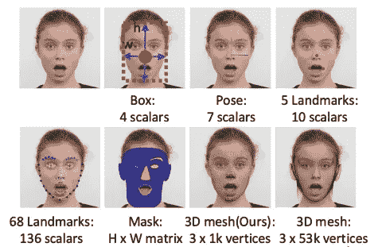
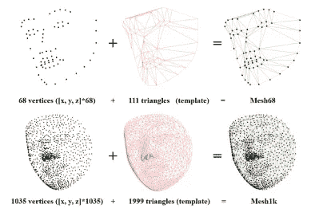
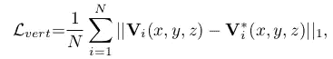
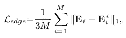
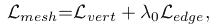
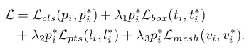
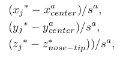
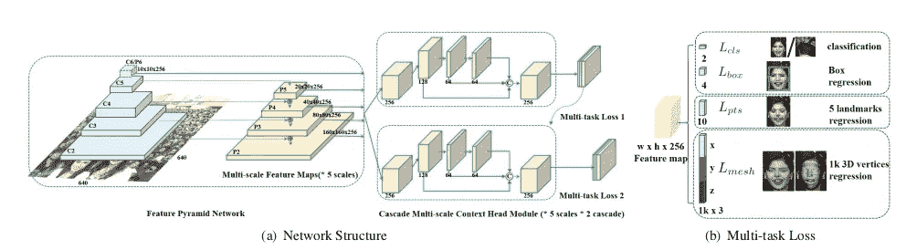

# 探索其他人脸检测方法(第一部分)——视网膜脸

> 原文：<https://medium.com/analytics-vidhya/exploring-other-face-detection-approaches-part-1-retinaface-9b00f453fd15?source=collection_archive---------3----------------------->

每当我们致力于解决任何与人脸相关的问题，如人脸识别系统(FRS)、人脸活动性检测、面部属性、性别检测甚至年龄估计，解决方案的第一步总是检测人脸。目前，我在开源社区中看到的人脸检测要么是通过级联检测人脸，要么是通过 [MTCNN](https://arxiv.org/abs/1604.02878) 。这些方法都很棒，但是仍然有许多其他算法可以帮助检测人脸，可能比 MTCNN 更好。这些文章将帮助您探索其他面部检测算法，这些算法可用于您的特定使用案例和环境条件。在第一部分中，我们将覆盖视网膜。

我们将涵盖四种不同类型的人脸检测架构:
**1 .视网膜脸**2。 [SSH:单级无头人脸检测器](/analytics-vidhya/exploring-other-face-detection-approaches-part-2-ssh-7c85179cd98d)
3。 [PCN:渐进校准网络](/analytics-vidhya/exploring-other-face-detection-approaches-part-3-pcn-395d3b07d62a)
4。[微型人脸检测器](/analytics-vidhya/exploring-other-face-detection-approaches-part-4-tiny-face-684c8cba5b01)

# 视网膜脸:野外单镜头多层次人脸定位

RetineFace 同时执行三种不同的人脸定位任务，即人脸检测、2D 人脸对齐和基于单镜头框架的 3D 人脸重建。所有三个目标被求解，记住只有一个共同的目标，即对于上述三个任务回归的所有点应该位于图像平面上。

## **接近**

1.  **3D 人脸重建**

为了从 2D 图像创建一个 3D 面，他们使用了一个预定义的具有 N 个顶点的三角形面，如上图所示。顶点在不同的面上共享相同的语义含义，并且利用固定的三角形拓扑，每个面像素可以通过[重心](https://mathworld.wolfram.com/BarycentricCoordinates.html)坐标来索引，并且三角形索引与 3D 面进行像素方面的对应。

为了回归 2D 图像平面上的 3D 顶点，他们使用 2 个损失函数:

这里，N 是总顶点，即 1103(68+1035)，V 是预测点，V*是地面真实点。

这是边长损失，因为它是三角形拓扑。这里，M 是三角形的数量，即 2110(111+1999)，E 是预测边长，E*是地面真实边长。

因此，回归 3D 点的总损失损失变为:

**2。多层次人脸定位**

一个[锚](/@andersasac/anchor-boxes-the-key-to-quality-object-detection-ddf9d612d4f9) i 的完整损失函数变成:

多任务损失

损失函数有 4 个部分:
a) [Softmax](https://en.wikipedia.org/wiki/Softmax_function) 二元类(脸/非脸)的损失，其中，p 是锚 I 是脸的预测概率，p*是地面真实。
b)包围盒的回归损失。
c)五个标志的回归损失
d)如上所述的 3D 点的回归损失。

所有坐标都归一化为:

这里，x*和 y*是面部框角的地面真实坐标，五个面部标志和(x*，y*，z*)是图像空间中的 3D 地面真实顶点。所有 3D 地面真实顶点被平移，使得鼻尖的 z 坐标为零。x^a、y^a 是面边界框的中心坐标，s^a 是比例。盒子的宽度和高度也被归一化为 log(w*/s^a)和 log(h*/s^a)，其中 w*和 h*是面盒的实际尺寸。
损失函数的所有部分被赋予相等的权重-年龄，并通过 L1 范数进行平滑。

**3。** **单镜头多层次人脸定位**

整体方法概述

该模型由三个主要组件组成:
a)特征金字塔网络
b)上下文头模块
c)级联多任务丢失

**特征金字塔网络**

它获取输入图像并输出不同比例的五个特征图。上图中的前四个特征图是使用在 imagenet-11k 数据集上预先训练的 [ResNet](https://arxiv.org/abs/1512.03385) 计算的。最上面的特征图是通过 C5 上的 3×3 与步幅 2 的卷积。

**语境模块**

为了加强上下文建模能力[变形卷积网络(DCN)](https://towardsdatascience.com/review-dcn-deformable-convolutional-networks-2nd-runner-up-in-2017-coco-detection-object-14e488efce44) 在该模块中用于除正常 3×3 卷积之外的特征映射。

**级联多任务损失**

为了改善面部定位，如上所述，级联回归与多任务丢失一起使用。第一上下文模块使用常规锚点预测边界框，然后后续模块使用回归锚点预测更准确的边界框。

**匹配策略**

从第一上下文头模块，如果锚的 IoU 大于 0.7，则锚匹配到基础事实框，如果其小于 0.3，则锚匹配到背景，对于第二上下文头模块，如果锚的 IoU 大于 0.5，则锚匹配到基础事实框，如果其小于 0.4，则锚匹配到背景。正面和负面的培训示例是使用 [OHEM](https://nextjournal.com/tempdata73/dealing-with-class-imbalances) 的天平。

## 结论

我们学习了一种新的人脸检测算法，该算法在单次拍摄中获得所有三种信息，即人脸框、人脸标志和三维人脸结构。在下一部分，我们将再次学习新的人脸检测算法。

## 代码和参考

代码:-[https://github . com/deep insight/insight face/tree/master/retina face](https://github.com/deepinsight/insightface/tree/master/RetinaFace)

论文:-[https://arxiv.org/pdf/1905.00641.pdf](https://arxiv.org/pdf/1905.00641.pdf)