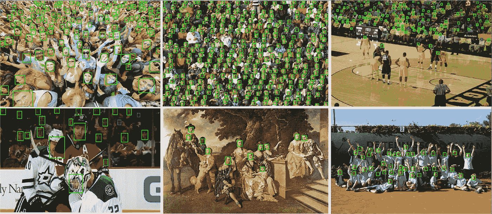
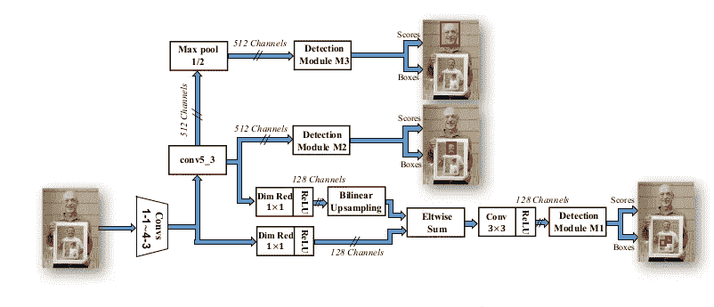
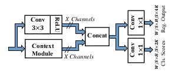
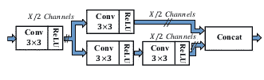
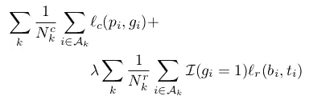

# 探索其他人脸检测方法(第 2 部分)——SSH

> 原文：<https://medium.com/analytics-vidhya/exploring-other-face-detection-approaches-part-2-ssh-7c85179cd98d?source=collection_archive---------11----------------------->

在这一系列的文章中，我们将探索不同于普通方法的各种其他人脸检测方法。在上一篇文章(第 1 部分)中，我们讨论了关于 [RetinaFace](/analytics-vidhya/exploring-other-face-detection-approaches-part-1-retinaface-9b00f453fd15) 。
在这一部分我们将讨论 *SSH:单级无头人脸检测器*。

我们将讨论四种不同类型的人脸检测架构。 [RetinaFace](/analytics-vidhya/exploring-other-face-detection-approaches-part-1-retinaface-9b00f453fd15)
**2。SSH:单级无头人脸检测器**
3。 [PCN:渐进校准网络](/analytics-vidhya/exploring-other-face-detection-approaches-part-3-pcn-395d3b07d62a)
4。[微型人脸检测器](/analytics-vidhya/exploring-other-face-detection-approaches-part-4-tiny-face-684c8cba5b01)

SSH 的输出

# SSH:单级无头人脸检测器

大多数基于 CNN 的检测器，无论是检测对象还是仅检测人脸，都将分类网络转换成两阶段检测系统。在第一阶段，卷积层为对象提出一组边界框，然后分类网络的剩余层被称为“头”用于对提议进行分类。分类网络的头部在计算上可能非常昂贵，并且必须对每个提议的边界框执行。

SSH 的作用来了，因为它是无头的，即它不需要任何完全连接的层来执行建议的分类，而是可以通过仅使用卷积在单个阶段中执行检测和分类，从而减少推理时间。SSH 在设计上也是规模不变的。它不是依赖外部多尺度金字塔作为输入来检测各种尺度的人脸，而是从网络的不同深度检测人脸。

## 体系结构

SSH 架构

在这里，为了更好的理解，我将整个架构分成 3 个部分。
1。检测模块，用于检测人脸。
2。上下文模块，检测模块的一部分。
3。训练和损失函数。

1.  **检测模块**

正如您所看到的，这是一个完全卷积的网络，后面是 3 个检测模块(M1、M2 和 M3)，位于跨距为 8、16 和 32 的功能图之上。检测模块由二元分类器和回归器组成，用于检测和定位人脸。

为了解决定位问题，他们以密集重叠滑动窗口的方式定义了[锚](/@andersasac/anchor-boxes-the-key-to-quality-object-detection-ddf9d612d4f9)集。在每个滑动窗口位置，定义 K 个锚，其具有与窗口相同的中心和不同的尺度，但是仅考虑纵横比为 1 的锚，以减少锚的数量。如果连接到 M *i* 的特征地图具有尺寸
(W *i* x H *i)* ，那么将会有(W*I*x H*I*x K*I*纵横比为 1 且比例为{S，S，… }的锚点

检测模块:用于检测和定位人脸的一组 conv 图层

它包括一个有效感受野的上下文模块[讨论如下]。对于 M1，输出通道的数量 X 设置为 128，对于 M2 和 M3，设置为 256。

在 M *i* 中的每个卷积层，分类器决定锚是否包含人脸。带有 2xK 输出通道的 1x1 conv 层充当人脸/非人脸的分类器，另外还有 1x！具有 4xK 输出通道的 conv 图层会回归边界框。

所有 3 个检测模块有 3 个不同的步幅，分别有助于检测小，中，大脸{使其比例不变}。总体架构中定义的所有卷积层都来自 VGG-16 网络。对于 M1，为了减少存储器消耗，通道数量从 512 个减少到 128 个，并且通过将上采样的 conv5-3 特征与 conv 4-3 特征相加来完成特征图融合。对于大脸检测，M3 具有步幅为 2 的最大池层。

2.**上下文模块**

上下文模块:由检测模块使用

由于锚在检测模块中以卷积方式被分类和回归，使用更大的卷积滤波器将类似于在 2 级检测器中增加提议周围的窗口大小。以这种方式模拟环境将增加与相应层的步幅成比例的感受野，导致每个检测模块中的目标尺度。
5x5 和 7x7 过滤器用于上下文模块中的卷积，但为了减少使用 3x3 过滤器部署的参数数量。

3.**训练和损失功能**

对于每个检测模块，网络有三个多任务丢失。为了使每个模块专用于不同的尺度范围，反向传播只对那些被分配面对其特定范围的锚进行。
这是通过根据锚的大小将锚分配给三个检测模块来实现的(最小的锚被分配给 M1，然后是 M2 和 M3)。如果其 [IoU](/@nagsan16/object-detection-iou-intersection-over-union-73070cb11f6e) 高于 0.5，则锚被分配给地面真实面。

损失函数

这里，损失函数的第一部分是用于人脸分类的交叉熵损失。indec k 表示网络中检测模块的数量， *A_k* 定义了 *M_k* 检测模块中的锚点集合。预测和地面真实标签分别是 *pi* 和 *gi* 。
如上所述，如果锚的 IoU 大于 0.5，则锚被分配给真实边界框，并且类似地，对于任何真实边界框，如果锚的 IoU 小于 0.3，则负标签被分配给锚。这种锚的组合在参与分类损失的模块 *M_k* 中形成 *((N_k)^c)* 。

损失函数的第二部分是平滑 l1 包围盒回归损失。 *pi* 表示预测的四个边界框值【x，y，w，h】并且 *ti* 是模块 *Mk. I(.)*是将回归损失仅限制到正锚点的指示函数。 *((N_k)^r)* 成为模块 *M_k* 中参与回归损失的锚个数。

最后， [OHEM](https://nextjournal.com/tempdata73/dealing-with-class-imbalances) 用于训练宋承宪。它被分别应用于每个检测模块，即对于每个 *Mk* ，我们选择相对于该迭代中网络的权重具有最高分数的负锚和具有最低分数的正锚，以创建小批量。小批量的 25%是留给阳性锚的，因为阴性锚的数量更多。

在推理时，使用 [NMS](https://towardsdatascience.com/non-maximum-suppression-nms-93ce178e177c) 将不同尺度的预测盒连接在一起，以获得最终输出。

## 结论

我们了解了一种新的人脸检测器，它是一种快速、轻量级的人脸检测器，与两阶段提议/分类方法不同，它在一个阶段中检测人脸。

## 参考

代号:[https://github.com/mahyarnajibi/SSH](https://github.com/mahyarnajibi/SSH)

论文:[https://arxiv.org/pdf/1708.03979.pdf](https://arxiv.org/pdf/1708.03979.pdf)