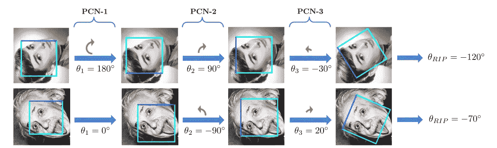

# 探索其他人脸检测方法(第三部分)——PCN

> 原文：<https://medium.com/analytics-vidhya/exploring-other-face-detection-approaches-part-3-pcn-395d3b07d62a?source=collection_archive---------24----------------------->

在这一系列的文章中，我们将探索不同于普通方法的各种其他人脸检测方法。在上一篇文章(第一部分和第二部分)中，我们讨论了关于 [RetinaFace](/analytics-vidhya/exploring-other-face-detection-approaches-part-1-retinaface-9b00f453fd15) 和 [SSH](/analytics-vidhya/exploring-other-face-detection-approaches-part-2-ssh-7c85179cd98d) 的问题。
在这一部分，我们将讨论 *PCN: Progressi* ve 校准网络。

我们将讨论四种不同类型的人脸检测架构。[视网膜面](/analytics-vidhya/exploring-other-face-detection-approaches-part-1-retinaface-9b00f453fd15)
2。 [SSH:单级无头人脸检测器](/analytics-vidhya/exploring-other-face-detection-approaches-part-2-ssh-7c85179cd98d)
3。 **PCN:渐进校准网络**
4。[微型人脸检测器](/analytics-vidhya/exploring-other-face-detection-approaches-part-4-tiny-face-684c8cba5b01)

# PCN:渐进式校准网络

旋转不变的人脸检测，即检测旋转的人脸，在非约束应用中有着广泛的需求，但由于人脸外观的巨大变化，它仍然是一项具有挑战性的任务。
为了解决这个问题，渐进校准网络(PCN)以由粗到细的方式执行旋转不变人脸检测。PCN 由三个阶段组成，检测人脸并逐步校准每个候选人脸的 RIP(平面旋转)方向。
PCN 首先校准面朝下朝上的候选人脸，将裂口角度范围从[-180，180]减半到[-90，90]。然后，旋转面进一步校准到垂直范围[-45，45]，再次减半 RIP。然后 PCN 为每个候选人脸做出最终决定，并预测精确的撕裂角度。这将在下面详细讨论。

## 体系结构

拟议框架

在一幅图像上，根据滑动窗口和图像金字塔原理获得所有候选人脸，并且每个候选窗口逐级通过检测器[这里是 3 级]。在 PCN 的每个阶段，检测器拒绝具有低置信度分数的人脸，回归剩余候选人脸的包围盒并校准 RIP。在每个阶段之后，NMS 用于合并高度重叠的候选项。

**PCN-1 第一阶段**

对于每个输入窗口 x，PCN-1 有三个目标，即人脸/无脸分类、包围盒回归和校准。
第*个目标*旨在对人脸和非人脸进行分类，通过 Softmax loss 实现:

其中，如果 x 是正面，y 等于 1，否则为 0，f 是分类分数。

第二个目标试图回归边界框，如下所示:

其中 t 和 t*代表预测的和真实的回归结果，S 是平滑的 L1 损失。边界框值包括:

其中 a、b 和 w 表示边界框左上角的坐标和宽度。不带(*)变量是预测值，带(*)的是实际值。

*第三个目标*以二元分类的方式预测人脸候选的粗略方向为:

其中 x 朝上时 y 为 1，x 朝下时 y 为 0[在 PCN-1 中]。g 是分类分数。

因此，总损失函数变为:

在从 PCN-1 获得新的边界框之后，根据预测的粗略裂口角度旋转更新的候选人脸。如果第三个物镜中的 *g* 大于或等于 0.5【意味着候选人面朝上】则不旋转，否则旋转 180 度。因此将范围从[-180，180]减小到[-90，90]。

**注意:**作为大多数人脸检测数据集，主要包含直立人脸，这将不适合训练 PCN 人脸检测器【因为它是旋转不变的】。因此，训练图像以不同的撕裂角度旋转，形成包含具有 360 度撕裂角度的人脸的新训练集。
采用三种训练数据:*正样本*为 IoU(w.r.t face)大于 0.7 的窗口，*负样本*为 IoU 小于 0.3，*疑似样本*为 IoU 在 0.4-0.7 之间。
正样本和负样本有助于人脸和非人脸分类的训练。阳性样本和可疑样本有助于包围盒的训练和校准。对于阳性和可疑样本，如果其撕裂角在[65，65]范围内，则定义为面朝上，如果在[180，115]∩[115，180 ]范围内，则定义为面朝下。裂口角度不在上述范围内的样本对校准训练没有帮助。

**PCN-2 第二阶段**

与 PCN-1 类似，它进一步区分人脸和非人脸，回归边界框，并为 RIP 精确校准人脸候选。唯一的区别是粗略的方向预测，它是裂角范围的三元分类，即[-90°，-45]，[-45，45]或[45，90]。根据预测的裂口角度进行旋转，如下所示:

其中 gi 是预测的三元取向分类分数，θ是候选人脸将被旋转的角度。在第二阶段之后，RIP 范围从[-90，90]减小到[-45，45]。

为了训练 PCN-2，训练图像在范围[-90，90]内均匀旋转，并通过训练的 PCN-1 过滤掉负样本。裂口角度范围[-90°，-60]，[-30，30]和[60，90]内的阳性和可疑样本对应于校准标签 0，1，2。裂口角度不在上述范围内的样本对校准训练没有帮助。

**PCN-3 第三阶段**

在第二阶段之后，所有候选人脸都被校准到垂直四分之一裂口角度范围，即[-45，45]。因此，PCN-3 可以容易地作出精确确定它是否是一张脸和回归包围盒的最终决定。由于范围较小，PCN-3 直接回归候选人脸的精确撕裂角度，而不是粗略方向。

裂土角可通过累积所有阶段的预测值获得，如下所示:

对于训练 PCN-3，训练图像在范围[-45，45]内旋转，并且使用训练的 PCN-2 过滤掉阴性样本。这里的校准是利用平滑 L1 损失的回归任务训练。

## 结论

我们了解了一种新的人脸检测器，它快速、准确，并且对各种不同类型的人脸方向都具有鲁棒性。

## 参考

代号:【https://github.com/MagicCharles/FaceKit 

论文:【https://arxiv.org/pdf/1804.06039.pdf】T4