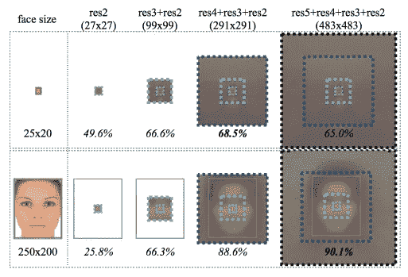
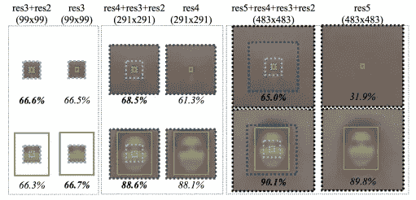
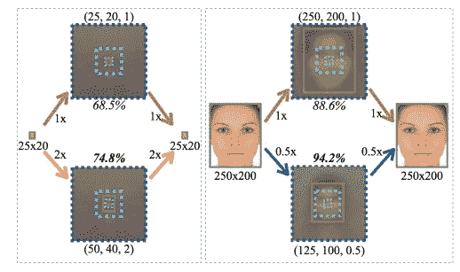
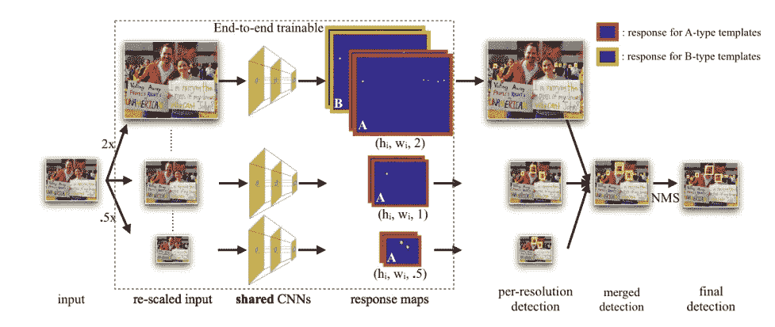

# 探索其他人脸检测方法(第四部分)——小脸

> 原文：<https://medium.com/analytics-vidhya/exploring-other-face-detection-approaches-part-4-tiny-face-684c8cba5b01?source=collection_archive---------7----------------------->

在这一系列的文章中，我们将探索不同于普通方法的各种其他人脸检测方法。在之前的文章中我们讨论了关于 [RetinaFace](/analytics-vidhya/exploring-other-face-detection-approaches-part-1-retinaface-9b00f453fd15) [、宋承宪](/analytics-vidhya/exploring-other-face-detection-approaches-part-2-ssh-7c85179cd98d)和 [PCN](/analytics-vidhya/exploring-other-face-detection-approaches-part-3-pcn-395d3b07d62a) 的内容。在这最后一部分，我们将讨论:微型人脸检测器。

我们将讨论四种不同类型的人脸检测架构。[视网膜面](/analytics-vidhya/exploring-other-face-detection-approaches-part-1-retinaface-9b00f453fd15)
2。 [SSH:单级无头人脸检测器](/analytics-vidhya/exploring-other-face-detection-approaches-part-2-ssh-7c85179cd98d)
3。 [PCN:渐进校准网络](/analytics-vidhya/exploring-other-face-detection-approaches-part-3-pcn-395d3b07d62a)
4。**微型人脸检测器**

# 寻找小脸

在物体检测方面已经做了大量的开发，但是检测更小的物体仍然是一个挑战。微小人脸检测器探索了问题的三个方面:尺度不变性、图像分辨率和上下文推理。

# 介绍

**尺度不变性:**尺度不变性是几乎所有对象检测系统的基本属性。但是在现实中，比例不变性对于具有有限分辨率的传感器不成立，例如检测 300 像素高的人脸与检测 3 像素高的人脸完全不同。
许多目标检测方法都是基于尺度归一化的分类器，例如在图像金字塔上运行的扫描窗口检测器或在合并的图像特征上运行的区域分类器。对于所有这些任务，总有一个问题是“模板的大小应该是多少？”。小模板可以检测小脸，但我们也希望大模板获得更准确的上下文信息。
因此，我们没有采用一刀切的方法，而是针对不同的音阶(和长宽比)训练单独的检测器音调。为了解决在测试时运行大量检测器的问题:以多任务方式训练多个特定规模的检测器，即使用在单个特征层级的多层上定义的特征。

**图像分辨率:**本文论证了现有的预训练目标检测网络是针对特征尺寸的目标的。为了扩展从这些网络微调到新尺寸对象的特征，我们只是在测试时通过插值和抽取来调整图像的大小。
虽然许多系统通过使用图像金字塔来使用多分辨率，但是对图像金字塔的较低层进行插值对于寻找目标尤其重要。

**上下文推理:**寻找小物体很有挑战性，因为几乎没有可以利用的上下文。因此，我们需要超越对象背景的图像证据。该论文称，从多层提取的卷积深度特征(也称为超列特征)对于捕捉大感受野中的高分辨率细节和低分辨率线索都是有效的。

简而言之，寻找小物体(这里是人脸)的方法利用了针对插值图像调整的特定尺度检测器。

# 深入探索上下文和解决方案

为了框定讨论，让我们问这个简单的问题:“找到固定尺寸(25x20)的小脸的最好方法是什么？”
在这个问题中，我们已经明确排除了尺度变化，通过这个问题，我们可以探究上下文和模板大小的作用。我们还应该问一个类似的问题:“找到固定大小(250x200)的大脸的最好方法是什么？”
固定尺寸对象检测被视为二元热图预测问题，其中像素位置(x，y)处的预测热图指定了以(x，y)为中心的固定尺寸检测的置信度。使用在 [ResNet](https://arxiv.org/abs/1512.03385) -50 上定义的全卷积网络( [FCN](https://towardsdatascience.com/review-fcn-semantic-segmentation-eb8c9b50d2d1) )训练热图。该分析研究了从 res-block 的最后一层提取的多尺度特征。

## **上下文**

在这里，从图中你可以看到，模拟额外的背景是有帮助的，特别是对于寻找较小的脸。对于较小的人脸和较大的人脸，向紧密拟合的人脸边界框添加上下文的改进几乎是 18.9%，但是对于较小的人脸(超过 300x300 像素)添加太多的额外上下文会损害结果。有趣的是，小的感受野更适合小脸，因为整张脸都是可见的。绿色框是实际的面边界框，而虚线框与不同图层的要素相关联(青色= res2，浅蓝色= res3，深蓝色= res4，黑色= res5)。

从这个图中，我们可以看到多层网络对于获得感受野的作用有多重要，尤其是对于小脸。小模板(图中第一行)在只有 res4 的情况下性能差 7%，在只有 res5 的情况下性能差 33%。相反，它对较大的物体没有太大的伤害，这表明较低层的较高分辨率对发现小物体非常有用。彩盒说明与上图相同。

## 解决

如果我们训练一个模板，它的大小故意不同于要检测的目标对象，会怎么样？可以使用中等大小的模板(50×40)通过将图像上采样 2 倍来找到较小的面部(25×20)。上图显示，这实际上将性能从 69%提升到了 75%。我们也可以通过运行一个(125x100)的模板，对图像进行 2 倍的下采样，来进行相反的操作，以找到大的人脸(250x200)。我们再次将性能从 89%提高到 94%。

这种性能提升背后的原因在于在 ImageNet 数据集上训练的预训练检测模型。因为 ImageNet 中大约 80%的训练示例包含 40 到 140 像素之间的中等大小的对象。因此，我们可以假设预训练的 ImageNet 模型(用于微调检测器)针对该范围内的对象进行了优化。

# 方法:规模特定的检测

我们可以利用多任务学习，以不同的分辨率对多个模板进行强力训练，并贪婪地选择最好的一个。我们用 t(h，w，s)来表示一个模板。这种模板被调整为以分辨率 s 检测大小(h/s，w/s)的对象。
为了创建特定模板的数据集，通过制作相似尺寸的聚类边界框来使用聚类:

d(b1，b2) = 1-J(b1，b2)

其中，b1 = (h1，w1)和 b2 = (h2，w2)是一对边界框形状，J 表示 Jaccard 相似性(并集上的交集(IoU))。
现在问题来了，对于一个特定的模板，哪种分辨率能使性能最大化。答案是，我们为每个值分辨率(一些固定数量的分辨率)训练多任务模型，并取每个对象大小的最大值。

这是模板解析分析。x 轴表示通过聚类得到的目标对象大小。左侧 Y 轴显示每个目标尺寸的 AP[平均精度](忽略大于 0.5 Jaccard 距离的对象)。从图中我们理解到的:对于寻找大脸(身高 140px 以上)，构建 0.5 分辨率的模板；对于较小的人脸(高度小于 40px)，以 2 倍的分辨率构建模板。对于介于两者之间的尺寸，以 1X 分辨率构建模板。右侧 Y 轴和灰色曲线显示了每个对象大小在 0.5 Jaccard 距离内的数据数量，表明更多的小脸被注释。

# 体系结构

从输入图像开始，我们首先创建一个粗略的图像金字塔(包括 2X 插值)。然后，我们将缩放后的输入输入到 CNN，以预测每个分辨率下的模板响应(用于检测和回归)。最后，在原始分辨率下应用非最大抑制(NMS)得到最终的检测结果。虚线框表示端到端可训练部分。我们在粗糙的图像金字塔(包括 2X 插值)上运行 A 型模板(针对 40-140 px 高的人脸进行了调整)，而只在 2X 插值图像上运行 B 型模板(针对低于 20px 高的人脸进行了调整)。类型 A 和类型 B 是二元多通道热图预测器，用于报告对象置信度。最好的结果是从 Resnet -101 接收的。请参考参考文献中给出的论文，以获得关于该架构的更详细的解释。

# 结论

我们了解了一种用于发现微小人脸的神奇人脸检测器，并了解了背景和分辨率在检测较小物体中的作用。

# 参考

代号:[https://www.cs.cmu.edu/~peiyunh/tiny/](https://www.cs.cmu.edu/~peiyunh/tiny/)

论文:[https://arxiv.org/pdf/1612.04402.pdf](https://arxiv.org/pdf/1612.04402.pdf)