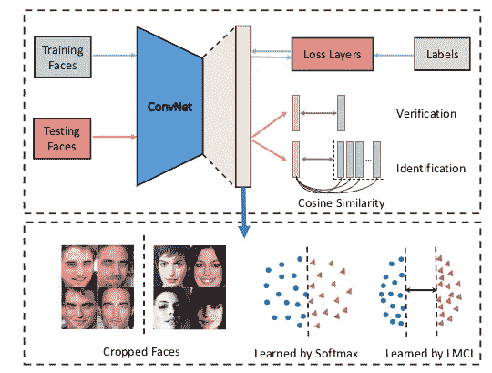
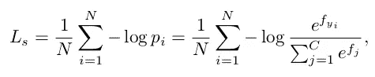
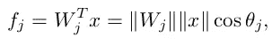
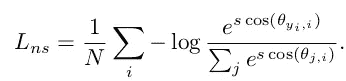
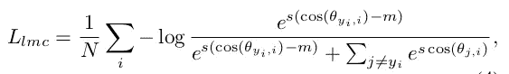
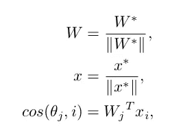
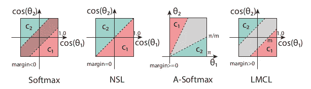
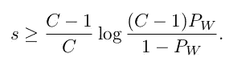
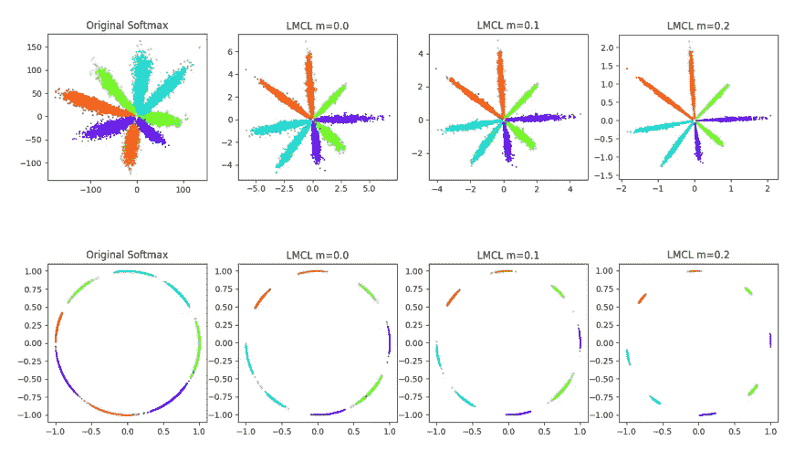

# 探索其他人脸识别方法(第一部分)——CosFace

> 原文：<https://medium.com/analytics-vidhya/exploring-other-face-recognition-approaches-part-1-cosface-4aed39afe7a8?source=collection_archive---------6----------------------->

在探索了标准的 MTCNN 或人脸级联之外的各种人脸检测方法后，在系列 4 篇文章( [1](/analytics-vidhya/exploring-other-face-detection-approaches-part-1-retinaface-9b00f453fd15) 、 [2](/analytics-vidhya/exploring-other-face-detection-approaches-part-2-ssh-7c85179cd98d) 、 [3](/analytics-vidhya/exploring-other-face-detection-approaches-part-3-pcn-395d3b07d62a) 、 [4](/analytics-vidhya/exploring-other-face-detection-approaches-part-4-tiny-face-684c8cba5b01) )中，让我们讨论一下基于人脸识别系统的下一步，即从人脸中提取特征，与数据库中的其他人脸进行比较。在这里，我们也不会探讨常见的模型，即使用三重损失的 [facenet](https://arxiv.org/abs/1503.03832) 和使用铰链损失的 [dlib 的基于 resnet](http://dlib.net/dnn_face_recognition_ex.cpp.html) 的人脸识别模型。在这一系列文章中，我们将探索除标准方法之外的其他方法来获得人脸特征向量。在第 1 部分中，我们将讨论 CosFace。

我们将讨论三种不同类型的人脸识别方法。CosFace
2。 [ArcFace](/analytics-vidhya/exploring-other-face-recognition-approaches-part-2-arcface-88cda1fdfeb8)
3。[梦:深度残差同变映射](/analytics-vidhya/exploring-other-face-recognition-approaches-part-3-dream-a5627ced45be)

# 介绍

大余量余弦损失(LMCL)被称为 CosFace，通过 L2 归一化特征和权重向量将传统的 softmax 损失重新表达为余弦损失，以消除径向变化，在此基础上引入余弦余量项，以进一步最大化角度空间中的决策余量。作为结果，我们获得了用于精确人脸验证的最小类内余量和最大类间余量。

提议的 CosFace 框架概述。在训练阶段，在不同类别之间以较大的差距学习有区别的人脸特征。在测试阶段，测试数据被输入到 CosFace 以提取人脸特征，这些特征随后被用于计算余弦相似性分数以执行人脸验证和识别。

# 方法

首先我们将讨论共面损失，然后讨论特征归一化对改善结果的影响，最后讨论余量对损失函数的影响。

## 大幅度余弦损失

softmax 损失通过最大化地面实况类的后验概率来区分不同类的要素。给定输入特征向量 x 及其标签 y，softmax 损失可表示为:

其中 p 表示 x 被正确分类的后验概率。n 是训练样本的数量，C 是类别的数量。f 被表示为具有权重向量 w 的全连接层的激活。为了简单起见，将 bias 保持为 0。因此，f 由下式给出:

其中，θ是 W 和 x 之间的角度。该公式表明，向量的范数和角度都对后验概率有贡献。

为了有效的特征学习，W 的范数必须是不变的，因此我们通过 L2 归一化来固定范数(W) = 1。由于在测试阶段我们使用余弦相似度来比较两个人脸特征向量，我们可以说特征向量的范数对评分函数不起任何作用。因此，在训练时，我们可以固定 norm(x)=s。因此，后验概率仅依赖于角度的余弦，因此，损失可以表示为:

因为我们已经将范数(x)固定为 s，所以得到的模型学习在角度空间中可分离的特征，该角度空间在这里被称为 Softmax Loss (NSL)的*归一化版本。*

但是 NSL 损失仅仅强调正确分类是不够的。为了解决这个问题，余弦余量被引入到损失函数中。
考虑二元类的例子，让θi 表示学习的特征向量和类 Ci 的权重向量之间的角度(i = 1，2)。对于 C 1，NSL 强制 cos(θ1 ) > cos(θ2 ),并且类似地对于 C2，以便来自不同类的特征被正确分类。为了开发一个大幅度分类器，我们还需要 cos(θ1)m>cos(θ2)和 cos(θ2)m>cos(θ1)，其中 m ≥ 0 是一个固定参数，用于控制余弦幅度。由于 cos(θi)m 低于 cos(θI)，因此分类的约束条件更加严格。因此，LMCL 的公式为:

服从于，

其中 N 是训练样本的数量，xi 特征向量具有相应的标签 yi，Wj 是权重向量，θj 是 Wj 和 xi 之间的角度。

两类情形下不同损失函数的决策裕度比较。虚线代表决策边界，灰色区域是决策边界。

**Softmax** 损失通过
范数(W1)cos(θ1) =范数(W2)cos(θ2)来定义判定边界，因此边界取决于权重向量的幅度和角度，因此判定余量在余弦空间中重叠。

**NSL** 将权重向量归一化为幅度 1，因此判决边界由下式给出:cos(θ1) = cos(θ2)。从上图可以看出，通过去除径向变异，可以很好的对 margin=0 的样本进行分类。但是它对噪声并不鲁棒。

**A-Softmax** 通过引入额外的余量来改善 Softmax 损失，使决策边界成为:
C1:cos(mθ1)≥cos(θ2)
C2:cos(mθ2)≥cos(θ1)
上图中的第三个图描绘了决策区域，其中灰色区域是决策余量。然而，A-Softmax 的裕量并不与所有θ值一致，随着θ减小，裕量变小，当θ=0 时，裕量完全消失。

**LMCL** 将余弦空间而不是角度空间中的决策余量定义为:
C 1:cos(θ1)≥cos(θ2)+m
C 2:cos(θ2)≥cos(θ1)+m
cos(θ1)最大化，而 cos(θ2)最小化，以便 C1(类似于 C2)执行大余量分类。上图的最后一个子图说明了余弦空间中 LMCL 的决策边界，其中我们可以
在角度余弦的生成分布中看到一个清晰的余量(√2m)。这表明 LMCL 比 NSL 更稳健。

## **特征归一化**

为了导出余弦损失的公式并去除径向变化，权重向量和特征向量都被归一化。结果，特征向量分布在超球面上，其中缩放参数 s[先前定义]控制半径的大小。

**为什么需要特征标准化？**
没有特征归一化的原始 softmax loss 隐式地学习特征向量的欧几里德范数(L2 范数)和
角度的余弦值。自适应地学习 L2 范数以最小化总损失，导致相对弱的余弦约束。相反，LMCL 要求整个特征向量集具有相同的 L2 范数，使得学习仅依赖于余弦值来发展辨别能力。来自相同类别的特征向量被聚集在一起，而来自不同类别的特征向量在超球面上被分开。

**参数‘s’的值应该是什么？** 给定归一化的学习特征向量 x 和单位权向量 W，类别总数为 c .假设学习特征向量分别位于超球面上，并以对应的权向量为中心。设 Pw 表示类中心的期望最小后验概率(即 W)，s 的下界:

基于这个界限，我们可以说，如果我们期望对于具有一定数量的类的分类的最优 Pw，则 s 应该被一致地扩大。期望的 s 应该更大以处理更多的类别，因为类别数量的增加增加了分类的难度。因此，需要具有大半径 s 的超球面来嵌入具有小的类内距离和大的类间距离的特征。

## 余弦边距' m '的效果

m 的最佳选择潜在地导致更有希望的高辨别人脸特征的学习。
合理选择较大的 m ∈ [0，C/(C1)){请参考参考文献中给出的论文，以理解 m 的这个范围}应该促进对高辨别特征的学习。因为所有的特征向量都根据相应类别的权重向量集中在一起。事实上，当 m 过大时，模型无法收敛，因为余弦约束
(即两类的 cosθ1m>cosθ2 或 cosθ2m>cosθ1)变得更严格，很难满足。此外，具有过大 m 的余弦约束迫使训练过程对噪声数据更加敏感。不断增加的 m 在某一点上开始降低整体性能，这是
无法收敛的原因。

具有 2D 特征的 8 个恒等式上不同损失函数的小实验。第一行将 2D 特征映射到欧几里得空间，而第二行将 2D 特征投影到角度空间。随着裕度项 m 的增加，该差距变得明显。

# 结论

我们了解了一种新的人脸识别损失函数，它在余弦空间中工作，并帮助模型学习非常有区别的特征。

# 参考

论文:[https://arxiv.org/pdf/1801.09414.pdf](https://arxiv.org/pdf/1801.09414.pdf)