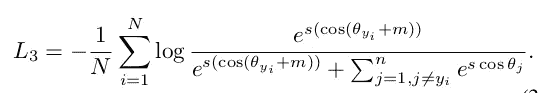

# 探索其他人脸识别方法(第 2 部分)ArcFace

> 原文：<https://medium.com/analytics-vidhya/exploring-other-face-recognition-approaches-part-2-arcface-88cda1fdfeb8?source=collection_archive---------4----------------------->

在这一系列的文章中，我们将探索不同于普通人脸的其他各种人脸识别方法。在上一篇文章
(第一部分)中，我们讨论了关于 [Cosface](/analytics-vidhya/exploring-other-face-recognition-approaches-part-1-cosface-4aed39afe7a8) 。
在这一部分，我们将讨论 *Arcface:深度人脸识别的附加角度余量损失*。

我们将讨论三种不同类型的人脸识别方法。 [CosFace](/analytics-vidhya/exploring-other-face-recognition-approaches-part-1-cosface-4aed39afe7a8)2。 **ArcFace**
3。[梦:深度残差同变映射](/analytics-vidhya/exploring-other-face-recognition-approaches-part-3-dream-a5627ced45be)

[来源](https://nrmedia.nyc3.cdn.digitaloceanspaces.com/2019/01/facial-recognition.jpg)

# 介绍

有两条主线研究训练 CNN 用于人脸识别，一条是使用 softmax 分类器训练多类分类器，另一条是学习嵌入，如三元组丢失。然而，两者都有其缺点:
对于 softmax 损失，添加越多的不同身份进行识别，参数的数量将增加越多。对于三元组丢失，大规模数据集的面三元组数量出现组合爆炸，导致大量迭代。

为了进一步提高人脸识别模型的描述能力和稳定训练过程，arcface 提出了一个附加的角度裕度损失。反余弦函数用于计算当前特征和目标权重之间的角度。ArcFace 通过角度和弧在归一化超球[人脸特征所在]中的精确对应，直接优化了[测地线距离](https://dsp.stackexchange.com/questions/54826/what-is-different-between-euclidean-distance-and-the-geodesic-distance/54827)余量。

# 方法

最广泛使用的分类损失，即 softmax 如下:

其中 x 表示第 I 个样本的特征向量，W 和 b 分别是权重和偏差。Softmax loss 没有显式地优化特征嵌入以加强类内样本的更高相似性和类间样本的多样性，这导致在大的类内外观变化(例如，姿势变化、年龄差距等)下深度人脸识别的性能差距。

在上面的 softmax 损耗中，为简单起见，我们将偏差固定为 0，然后将 logit 转换为:

其中θ是权重 W 和特征 x 之间的角度。使用 L2 范数将权重归一化为 1。特征也进行 L2 归一化并重新缩放到 s。归一化步骤有助于仅根据特征和权重之间的角度θ进行预测。学习嵌入分布在半径为 s 的超球面上，如下所示:

在权重和特征之间增加了附加的角度裕度损失 m，以增强类内紧密度和类间差异。由于提出的附加角裕度罚值等于归一化超球面中的测地距离裕度罚值，因此将其命名为 ArcFace。最终损失函数变为:

## 体系结构

**训练过程** :
1。在特征 x *i* 和权重 W 归一化之后，我们得到每个类的 cos θ *j* (logit)为(W*j)’*x*I*。
2。我们计算 arccosθ *yi* 并得到特征 x *i* 和地面真实权重 W *yi 之间的角度。*
3。我们在目标(地面真实)角度θ *yi* 上增加一个角度裕度罚分 m。
4。我们计算 cos(θ *yi* + m)并将所有 logits 乘以特征尺度 s
5。然后，logits 通过 softmax 函数，并对交叉熵损失做出贡献。

**伪代码:**

# 几何差异 B/W 球面、共面和弧面

附加角裕度具有更好的几何属性，因为角裕度与测地线距离具有精确的对应关系。

比较二分类情况下的分类边界。ArcFace 在整个区间内具有恒定的线性角裕度。相比之下，[球面](https://arxiv.org/pdf/1704.08063.pdf)和[共面](https://arxiv.org/pdf/1801.09414.pdf)只有非线性角裕度。

**注:**本文还介绍了对各种其他人脸识别架构和损失函数进行的最广泛的实验评估，这不在本文讨论范围内。请参考论文，看看他们的实验。

# 结论

我们了解了一种新的人脸识别损失函数，它在角度空间中工作，并帮助模型学习非常有区别的特征，给出线性角度余量。

# 参考

代号:[https://github.com/deepinsight/insightface](https://github.com/deepinsight/insightface)

论文:[https://arxiv.org/pdf/1801.07698.pdf](https://arxiv.org/pdf/1801.07698.pdf)