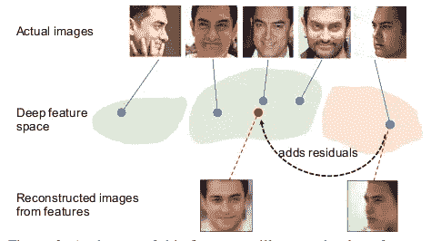
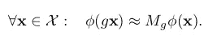
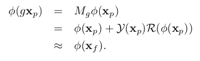
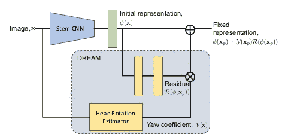
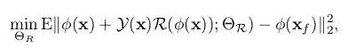
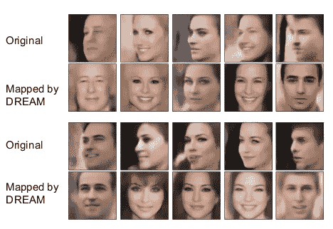

# 探索其他人脸识别方法(第三部分)——梦

> 原文：<https://medium.com/analytics-vidhya/exploring-other-face-recognition-approaches-part-3-dream-a5627ced45be?source=collection_archive---------6----------------------->

在这一系列的文章中，我们将探索不同于普通人脸的其他各种人脸识别方法。在之前的文章
(第一部分和第二部分)中，我们讨论了关于 [Cosface](/analytics-vidhya/exploring-other-face-recognition-approaches-part-1-cosface-4aed39afe7a8) 和 [Arcface](/analytics-vidhya/exploring-other-face-recognition-approaches-part-2-arcface-88cda1fdfeb8) 的问题。在最后一部分，我们将讨论:梦。

我们将讨论三种不同类型的人脸识别方法。 [CosFace](/analytics-vidhya/exploring-other-face-recognition-approaches-part-1-cosface-4aed39afe7a8)2。 [ArcFace](/analytics-vidhya/exploring-other-face-recognition-approaches-part-2-arcface-88cda1fdfeb8)
3。**梦:深度残差同变映射**

# 介绍

与正面人脸相比，许多人脸识别算法在处理侧面人脸时仍然表现不佳。一个主要原因是正面和侧面人脸的训练图像的数量非常不平衡，因为在数据集中正面人脸更多而侧面人脸很少。
在这里，我们假设正面和侧面人脸之间存在固有的映射，因此它们在深度学习空间中的差异可以通过等变映射来弥合。提出了一种新的深度残差等变映射(DREAM)块，它能够自适应地将残差添加到深度表示中，以将侧面人脸变换为有助于简化识别的规范姿态。

上图说明了属于同一主题的人脸的深度表示嵌入。给定任意姿态的输入图像，我们可以通过添加残差的映射函数将其特征映射到正面空间。
梦想街区的主要亮点有:
1。实现简单。可以通过将块拼接到基础网络来集成到现有的 CNN 架构中。它确实改变了人脸嵌入的原始维度，并且可以被端到端地训练。
2。重量轻。向基本模型添加少量参数和计算。
3。帮助 base network 进一步提高对侧面人脸的识别能力。

# 深度剩余等变映射

让我们首先讨论特征等方差，并从那里到梦想块。

## 特征等方差

已经观察到，深度神经网络中的大多数层随着输入以容易预测的方式改变。并且这种转换可以从数据中获知。
形式上，卷积神经网络可以看作是将一幅图像 x ∈ X 映射到一个向量φ(x) ∈ R *d* (d 是特征表示的维数)的函数φ。如果输入图像的变换 g 可以被转移到表示输出，则表示φ是与该变换 g 等变的。也就是说，当存在映射 M*g*:R*d*→R*d*使得

为了使映射函数 M *g* 适用于任何图像，该函数将捕获表示的内在几何属性。在这个问题中，变换 *g* 涉及从侧面到正面的 3D 几何变化。

## 梦想街区

让我们从定义问题陈述开始。
我们将 CNN 表示为函数φ，并且它从图像 x 映射的图像表示为φ(x)。我们称这个网络为 stem CNN 或 base network。假设给我们两种类型的人脸图像，即正面人脸图像，表示为 x_f，侧面人脸图像，表示为 x_p
我们想通过映射函数 M_g 得到侧面图像 x _ p 的变换表示，使得 M_g φ(x_p) ≈ φ(x_f)【上式】。为了便于将 M_g φ(x_p)合并到主干 CNN 中，我们将其公式化为原始轮廓特征φ(x_p)与残差
的和，残差由偏航系数 Y(x_p)加权的残差函数 R(φ(x_p)给出。

偏航系数有助于处理任意姿态的输入图像。
Y(x) ∈ [0，1]为比正面姿态偏离更多的面部提供更高的残差幅度。
**注意:**注意不考虑滚转角和俯仰角。滚动的影响将通过面部对齐来消除，而具有大俯仰角的面部图像是罕见的，并且有可能通过在我们的梦块中添加另一个分支来解决俯仰角。

**建筑**

主干 CNN 可以是任何现有的人脸识别模型。然后使用完全连接的层来提取初始表示φ(x)[面部识别特征向量]，该表示随后被梦块“固定”。梦想街区由两个分支组成:

1.  **残枝**

它生成残差 R(φ(x))。它有两个完全连接的层，用参数整流线性单元( [PReLU](https://www.machinecurve.com/index.php/2019/12/05/how-to-use-prelu-with-keras/#what-is-prelu) )作为激活函数。这个分支可以独立于主干学习。通过使用随机梯度下降最小化映射的轮廓特征和其对应的正面特征之间的欧几里德距离来训练它。

其中，θR 表示 R()的参数。对于 Y()分支，我们保持参数固定。

**2。头部旋转估计器**

第二个分支产生偏航系数 Y(x)。这个分支假设 21 个面部标志的输入。这一要求不会给 stem CNN 增加任何额外的负担，因为人脸对齐过程是许多人脸识别流水线的标准预处理步骤。
要了解更多细节，请参考参考文献中给出的论文。

深层特征的可视化。第一行和第三行显示了重建的轮廓面的原始特征。第二和第四行描绘了在通过梦块映射之后的重构特征。

# 结论

我们了解了一种提高侧面人脸识别性能的方法，这种方法无需对现有架构进行太多更改，也不会增加太多计算成本。

# 参考

代号:[http://mmlab.ie.cuhk.edu.hk/projects/DREAM/](http://mmlab.ie.cuhk.edu.hk/projects/DREAM/)

论文:[https://arxiv.org/abs/1803.00839](https://arxiv.org/abs/1803.00839)