# 探索外场员跳跃

> 原文：<https://medium.com/analytics-vidhya/exploring-outfielder-jump-6f4aedf74ff3?source=collection_archive---------18----------------------->

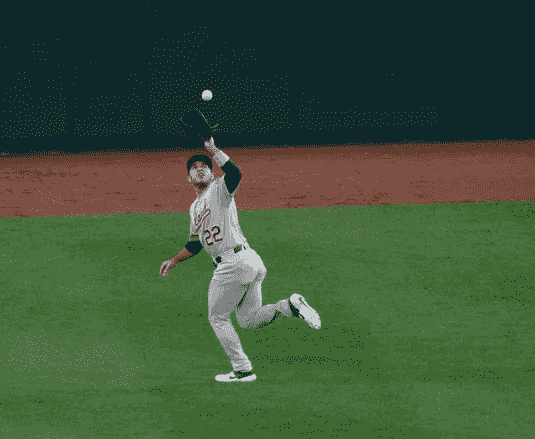

拉蒙·劳雷亚诺:[https://www.flickr.com/photos/keithallison/33706460648](https://www.flickr.com/photos/keithallison/33706460648)

外野手跟踪表现的哪一方面更有可能延续到下一年，他们对球的爆发还是他们的反应时间？是[瑞安·布劳恩](https://www.mlb.com/player/ryan-braun-460075)的快速反应时间还是[马克斯·开普勒](https://www.mlb.com/player/max-kepler-596146)的高效路线更好地反映了整体的防守表现？这些是我在过去几个月研究外野手跳跃数据时开始回答的一些问题。在外场手跳跃数据被添加到棒球专家的推特上后，我受到启发去了解更多。我使用统计编程语言 R 和棒球专家的数据库，着手确定外野手跳跃的哪个部分最“像技巧”，这最能预测外野手的跳跃本身，以及哪个方面与实际比赛最相关。

在我们开始之前，我们需要了解外野手跳跃术语及其工作原理。在 Baseball Savant 上，外野手跳跃是通过在 3 个阶段将节省的脚与联盟平均水平相加来测量的:反应，接触后的第一个 1.5 秒，爆发，接下来的 1.5 秒，以及前 3 秒的路线效率。它仅计算评级为两星或以上的游戏，或接球概率低于 90%的游戏。更多详情，请访问网站[此处](https://baseballsavant.mlb.com/jump)。

当我将数据加载到 R 中时，我做了一些修改，以便于学习。首先，我对我将在项目中使用的每个类别进行了标准化(z 评分),主要是将所有东西放在同一个尺度上，但不是任何尺度，一个更多人熟悉的尺度。罗纳德·阿库纳 Jr 的事实。在 2018 年爆发阶段节省了 0.4 英尺 vs 平均值，这可能不会像知道他的 z 得分(偏离平均值的标准差的量)为 0.622 那样引起共鸣。此外，我把依赖于音量的统计数据，如平均水平以上的[输出](http://m.mlb.com/glossary/statcast/outs-above-average)，放在每次播放的基础上，以防止播放量增加数据的不确定性。我所有代码的链接是这里的。

清理完数据，就开始工作，分析。我想测量的第一件事是外野手跳跃各方面的年度相关性，以及这种关系将如何长期持续下去。

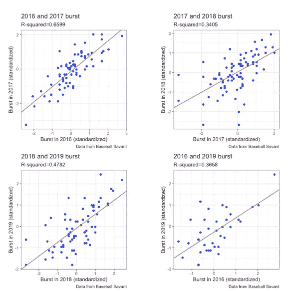

爆发的逐年相关性

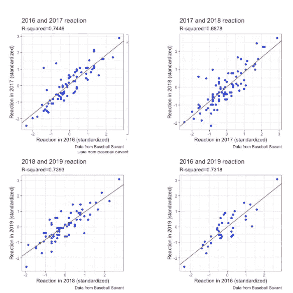

反应的年度相关性

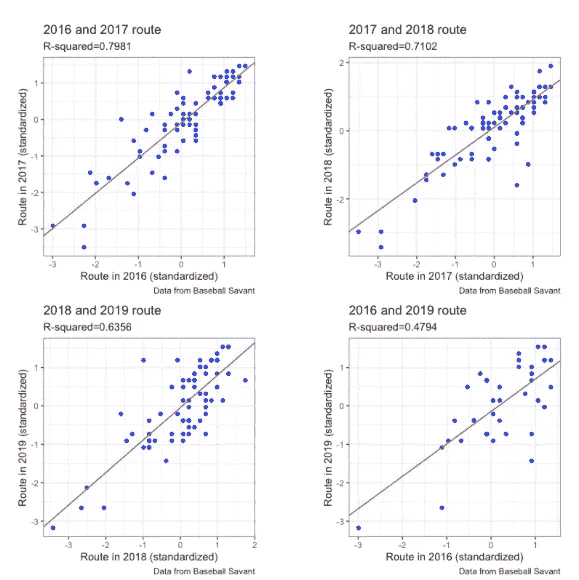

路线的年度相关性

突发平均 r(相关系数)= 0.701

突发平均 R 平方(模型可以解释多少方差)= 0.493

反应平均 r = 0.853

反应平均 R 平方= 0.724

路线平均 r = 0.847

路径平均 R 平方= 0.715

具有最高的相关性和最高的 R 平方值，反应似乎在年与年之间具有最大的持续性，并且最像是一种特定的技能。这个概念是有道理的，因为反应(和反应时间)被认为是一种技能，并且往往被认为是一种难以训练和提高的技能。与此同时，在一年一年的基础上，路线似乎也表现得像一种技能，但从更长的时间来看，它的高相关性并没有维持下去。虽然它仍然可能是一种技能，但它的理由没有反应那么充分。然而，爆裂似乎是三者中最不可预测的。虽然 R 和 R 平方值还不错，但与外野手起跳的其他两个阶段相比，它们还是很低。一个可能的解释是，随着球员年龄的增长，他们的速度和加速度受到影响。

在发现这些迷人的相关性后，我将注意力转向找出跳跃的哪个阶段最能代表跳跃本身。两个轴都以节省的英尺数与平均值(标准化)进行测量。

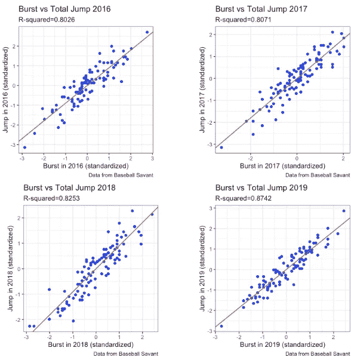

突发与总跳跃

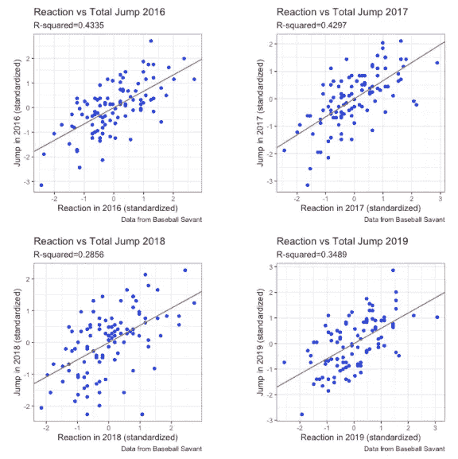

反应 vs 总跳跃

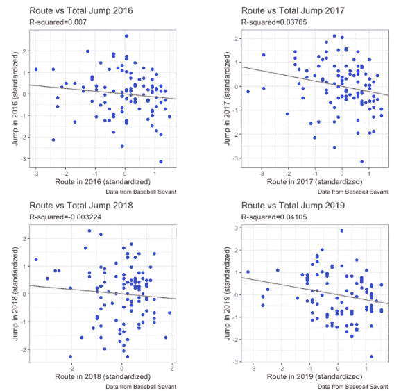

路线与总跳跃

突发平均 r = 0.91

突发平均 R 平方= 0.827

反应平均 r = 0.615

反应平均 R 平方= 0.374

路线平均 r = -0.164

路径平均 R 平方= 0.02

这一次，burst 具有最高的相关性，并且清楚地非常好地预测了整体跳跃。反应具有正的总体相关性，但是点更加分散并且离回归线更远。最后，route 实际上与 jump 成反比，这意味着假设，它会比 jump 本身更好地预测 jump 的反面。

接下来，我开始寻找跳跃的哪一个方面对实际行动最重要。我用 OAA 来代表一个外野手的能力，但我也把它放在每场比赛的基础上，并将其标准化。

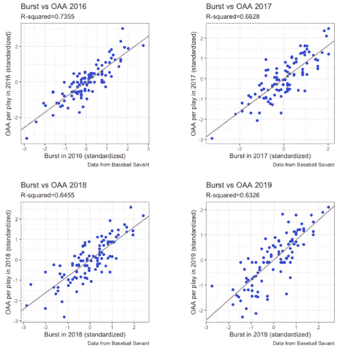

爆裂 vs OAA

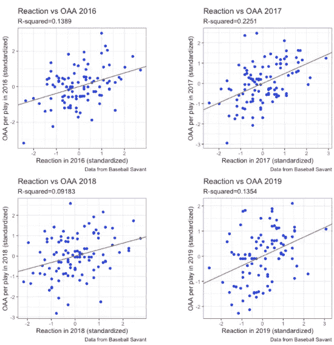

反应 vs OAA

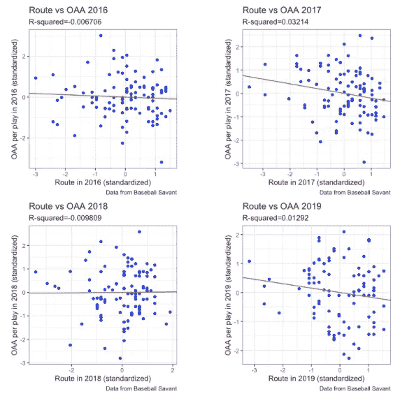

路线 vs OAA

突发平均 r = 0.82

突发平均 R 平方= 0.669

反应平均 r = 0.391

反应平均 R 平方= 0.148

路线平均 r = -0.101

路径平均 R 平方= 0.007

跳跃的各个方面与 OAA 的关系最终类似于它们与总跳跃的关系。爆裂，与一贯的高相关性，是一个外场手在某一年表现如何的一个很好的指标。同时，反应可能相当不准确，但它是比路线好得多的预测器。考虑到其极低的相关性、高标准误差和高 p 值，Route 永远不应该用于估计外野手的总产量。

在研究的这一点上，值得考虑我们的任何发现是否有意义。如果《跳跃》与制作这部剧或《OAA》没有很好的关联，这些发现都不会有用或相关。

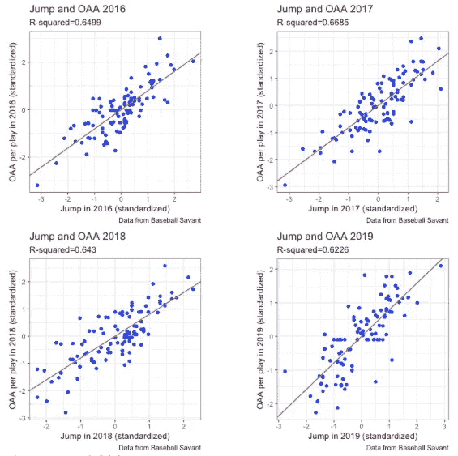

跳跃 vs OAA

平均 r = 0.806

平均 R 平方= 0.646

谢天谢地，对于我们的目的来说，跳跃是 OAA 的一个很好的指标。显然，Tom Tango 在建立他的模型方面做得很好，因为它在预测总体外场员表现方面的一致性是显著的。

从这项调查中，可以得出三个主要结论。首先，反应阶段的表现最像是一种确定的技能，路线相对紧随其后，突发落后于其他两个阶段。第二，在三个统计中，突发预测整体跳跃最好，反应紧随其后，而路线实际上具有轻微的负相关性。最后，所有三个统计项目 OAA 类似的方式，他们项目整体跳跃，爆裂是最好的，其次是反应，然后路线给出相反的指示。

这些发现可能对希望提高追踪能力的 MLB 玩家非常有用。首先，即使爆发不像反应和路线那样像一个可训练的技能，它仍然有足够的特征被认为是一个技能。此外，根据我们的发现，突发与 OAA 有着压倒性的正相关。记住这些概念，外野手应该专注于训练爆发阶段使用的肌肉，而不是在休赛期训练中的反应和路线阶段使用的本能。仅仅通过练习那些在比赛中转化为成功的东西，外场手就可以变得更有效率。

不仅球员可以发现这里介绍的知识很有用，而且前台可以在他们的球员评估和花名册建设过程中使用这些信息。分析部门可以使用这些数据的一种方式是识别那些 oaa 远远低于其爆发预测的球员。这些外野手可能都被低估了，并开始提高。

在发现这些可能回归均值的玩家时，团队可能会利用市场的低效率。符合这种描述的玩家有可能成为廉价的目标，提供巨大的投资回报。为了根据爆发来确定一个玩家的 OAA 表现差了多少，我创建了差异和平均差异指标。通过从标准化爆发中减去标准化的和基于速率的 OAA，就可以简单地计算出差异，而平均值是通过对几年来玩家的差异进行平均而得到的。下图展示了过去两年中平均差异最大的 10 名球员。

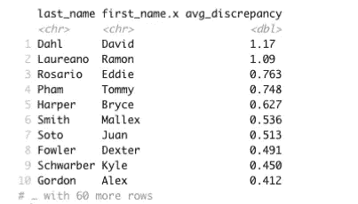

平均差异领先 2 年

显然，[拉蒙·劳里诺](https://www.mlb.com/player/ramon-laureano-657656)和[大卫·达尔](https://www.mlb.com/player/david-dahl-621311)在 2020 年的竞选中有着惊人的表现。人们可能会注意到，上面列表中的大多数球员不一定是我们认为的廉价目标，但他们中的大多数人，像 [Mallex Smith](https://www.mlb.com/player/mallex-smith-605480) 和 [Kyle Schwarber](https://www.mlb.com/player/kyle-schwarber-656941) ，以他们的跑动或击球而闻名，而不是他们的防守。所以，有可能他们的防守没有像其他技能一样得到认可。

展望未来，有几件额外的事情我很想在这项研究中完成，但还没有完成，我可以在以后添加到这个项目中。其中包括创建一个模型来从跳跃的三个方面预测 OAA，创建一个算法来根据他们的爆发，反应和路线确定球员的货币价值，以及实现一个机器学习模型来根据他们的跳跃统计数据预测金手套奖获得者。

这篇文章最初是作为演示文稿/幻灯片制作的，可以在[这里](https://docs.google.com/presentation/d/1e4zaAu5Utx542QStiKsXy6Qqw4aEMAWtsoQ6XH6WLrg/edit#slide=id.p)观看

—杰克·费德曼

[霍瑞斯·曼学校](http://horacemann.org)21 年

纽约州纽约市

给我发邮件到 Jake_federman@horacemann.org 或 Jakefed1@hotmail.com

所有数据更新截至 2019 年 9 月 14 日

所有数据来自[棒球专家](http://baseballsavant.mlb.com)

感谢编辑艾丹·雷斯尼克、麦克斯韦·雷斯尼克、奥利弗·斯泰因曼和理查德·戴蒙德，以及其他评论者库什·马尔霍特拉和瑞安·奥特曼

灵感来自推特[上的@ tango tiger](http://twitter.com)

关注我的 Twitter @federmanjake

版权所有