# 用对比主成分分析探索数据集中丰富的模式

> 原文：<https://medium.com/analytics-vidhya/exploring-patterns-enriched-in-a-dataset-with-contrastive-principal-component-analysis-9b0a7251c814?source=collection_archive---------17----------------------->

> “拷问数据，它会承认任何事情。”
> 
> *—罗纳德·科斯*

*大家好，*

我希望你一切都好。

*本博客将通过教程介绍* ***对比 PCA (cPCA*** *)的概念。*

*在深入研究 cPCA 的概念之前，我们应该熟悉 PCA 的概念。*

> ***什么是 PCA？***

*主成分分析，或称 PCA，是一种* ***降维*** *方法，通常用于降低大型数据集的维度，方法是将一个大型变量集转换为一个较小的变量集，该变量集仍包含大型数据集中的大部分信息。*

*有了定义就够了。让我们做些真正的工作吧！*

*我们来看一个示例用例*

***在本使用案例中，我们采用了 MNIST 数字数据集。***

****数字 MNIST*** *数据集是一个测试该算法的有趣数据集，因为它以一种易于可视化的形式(一张图片)包含了****28 x28****变量。当我们只选择两个主成分，并试图绘制结果时，会发生什么？**

*这里我们只取前两个标签，分别是 0 和 1。*

****准备数据集****

****现在让我们对刚刚准备好的数据使用 PCA 算法****

*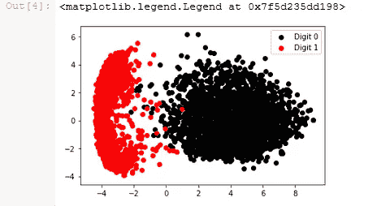*

**这是 PCA 输出的二维可视化**

**简单对！！**

**现在让我们结束这个话题，进入我们的主要话题* ***对比主成分分析(cPCA)****

> ****那么什么是 cPCA 呢？****

**对比主成分分析是一种无监督学习的工具，它可以有效地降低维度，从而实现可视化和探索性数据分析。这将 cPCA 从一大类监督学习方法中分离出来，监督学习方法的主要目标是在各种数据集之间进行分类或区分，例如线性判别分析(LDA)、PCA 等。这也将 cPCA 与整合多个数据集的方法区分开来，后者的目标是识别两个或更多数据集之间的相关模式，而不是每个单独数据集特有的模式。**

> ****为什么是 cPCA？****

*PCA 被设计成一次探索一个数据集。但是当要比较多个数据集或一个数据集中的多个条件时，当前的实践状态是分别对每个数据集执行 PCA，然后手动比较各种投影。*

**对比主成分分析(cPCA)旨在通过自动识别跨数据集表现出最有趣差异的投影来填补数据探索和可视化中的这一空白。cPCA 的主要优点是通用性和易用性。**

**理论部分说够了！**

*让我们用 cPCA 做一些实验。*

*在继续之前，您必须安装 cPCA 库。*

*您可以使用以下 pip 命令安装它。*

> **pip 安装对比**

## *现在你可以走了！！*

**所以，我们要做两个不同的实验。**

1.  **图像数据集上的 cPCA。**
2.  **小鼠蛋白质数据集上的 cPCA。**

> *让我们继续我们的第一个实验。*

# ****1。图像数据集上的 cPCA。****

## ****数据集使用:****

*   **MNIST 数字图像数据集。**
*   **草的图像。**

**这些草图片可以在这个* [***OneDrive 链接***](https://1drv.ms/f/s!AgLi37o1j88ahrJTLeycjuEoHpVhQw) *中找到，也可以使用 synset 'grass '从*[***ImageNet***](http://image-net.org/download)*中下载。(注意:将 IMAGE_PATH 替换为下载图像的路径)**

**作为一个相关示例，考虑由复杂背景上的手写数字组成的数据集，例如不同的草地图像。典型的无监督学习任务的目标可能是聚类数据，揭示图像中的不同数字。然而，如果我们对这些图像应用标准 PCA，我们发现顶部主成分不代表与手写数字相关的特征，而是反映与图像背景相关的特征的主要变化。**

*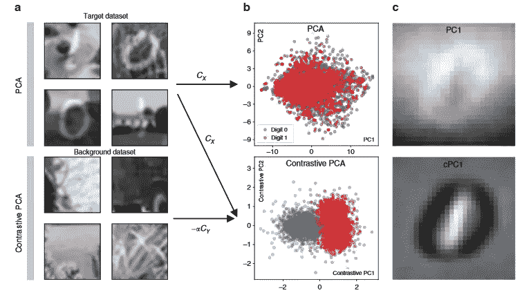*

**来源——*[*https://www.nature.com/articles/s41467-018-04608-8.pdf/*](https://www.nature.com/articles/s41467-018-04608-8.pdf/)*

*现在，让我们看看我们是如何使用 cPCA 得到这个结果的！*

# **装载 MNIST**

# **加载草地的自然图像**

# **通过叠加草的图像腐化 MNIST**

*由于我们没有已经被草图像污染的数字图像，我们已经手动拍摄了一些原始图像并将它们与草图像叠加。*

**为了创建 5000 个损坏的数字中的每一个，从草地图像中随机选择一个 28px 乘 28px 的区域叠加在数字的顶部。**

# **一些被破坏图像的例子**

*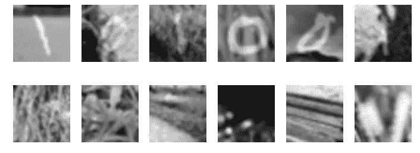*

**数字图像被草图像破坏**

# **腐败 MNIST 上的 PCA**

****受损数字图像的 PCA 结果。****

*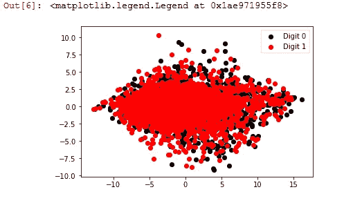*

**如我们所见，由于图像中的噪声，PCA 无法区分数字 0 和数字 1，这些图像是叠加在数字图像上的草图像。**

**现在让我们看看在这些相同的图像上使用 cPCA 会发生什么！！**

# **针对腐败 MNIST 的 cPCA**

****对受损数字图像进行 cPCA 的结果。****

*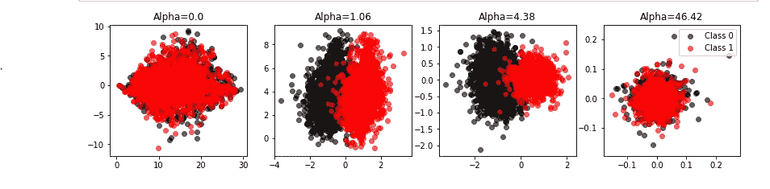*

**哇！**

*看，cPCA 是如何区分数字 0 和数字 1 的。*

*现在你们一定想知道什么是目标、背景和阿尔法？*

**让我想想，**

*T *目标是数字图像损坏的数据集。**

*B 该数据集作为模型的参考，因此它将知道草看起来是什么样的，并且它将草视为目标数据集中的噪声，并且模型将容易检测由草图像叠加的数字。*

*A *lpha 是 cPCA 中的超参数。α的每个值产生一个方向，在目标和背景方差之间有不同的折衷。通过改变 alpha 值，可以根据用户的需要对主成分进行聚类。**

# **PCA 与 cPCA 捕获的特征**

*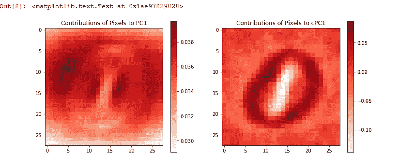*

*我们可以清楚地看到 cPCA 如何比 PCA 更好地工作。我们可以清楚地看到 cPCA 中的粗体和定义像素。*

# **使用 PCA 与 cPCA 进行去噪**

*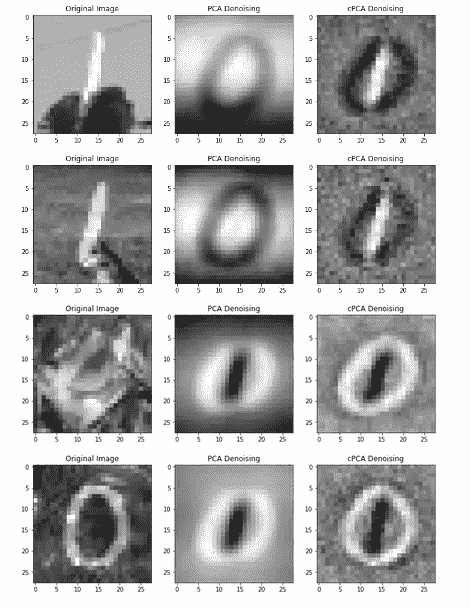*

**此外，cPCA 在去噪后给出了更好的结果，并有助于显示出所需的目标，即数字！！**

**所以，这都是关于图像的 cPCA。**

# **2。小鼠蛋白质数据集上的 cPCA。**

## **使用的数据集:**

*   **小鼠蛋白质数据集**

**你可以在这里找到需要的数据集(*[*https://github . com/abid labs/contrasting/tree/master/experiments/datasets*](https://github.com/abidlabs/contrastive/tree/master/experiments/datasets)*)**

# **加载数据集**

**分离目标和背景数据集:**

*   **目标由受到休克疗法刺激的小鼠组成。有些人患有唐氏综合症，有些人没有，但我们假设这个标签是我们事先不知道的**
*   **背景由未接受休克疗法刺激且未患有唐氏综合征的小鼠组成**

# **运行对比 PCA**

*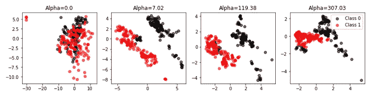*

**你可以看到 cPCA 比*更有助于获得适当的分离目标数据*

**PCA (Alpha = 0 )**

# **关于 Alpha 和 GUI 的具体值**

**让我们取α= 2**

*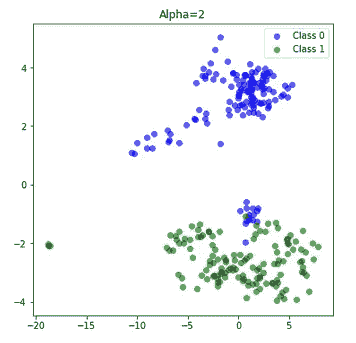*

**GUI 扫描的不同值，查看如何使用此类动画展示数据中的聚类的示例。**

*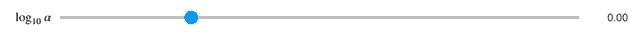**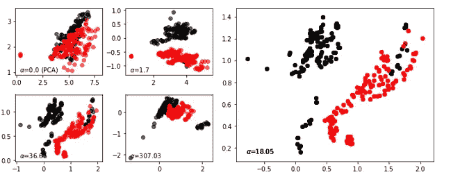*

**关于 cPCA 的更多实验，你可以访问这个 git hub 库**

> *[*https://github.com/abidlabs/contrastive*](https://github.com/abidlabs/contrastive)*

# **参考**

*   *[*https://www.nature.com/articles/s41467-018-04608-8.pdf/*](https://www.nature.com/articles/s41467-018-04608-8.pdf/)*

*那么，关于 cPCA 就这样了。*

*希望你们能从这篇博客中学到一些东西。*

*如果你喜欢这个帖子，请跟我来，只要你认为我值得，就按下那个按钮。如果你注意到思维方式、公式、动画或代码有任何错误，请告诉我。*

*再见！！*