# 探索强化学习和神经网络基础|交叉熵方法在 CartPole OpenAI 环境中的 Python 实现。

> 原文：<https://medium.com/analytics-vidhya/exploring-reinforcement-learning-neural-networks-basics-python-implementation-of-the-aaec0beee4c4?source=collection_archive---------12----------------------->

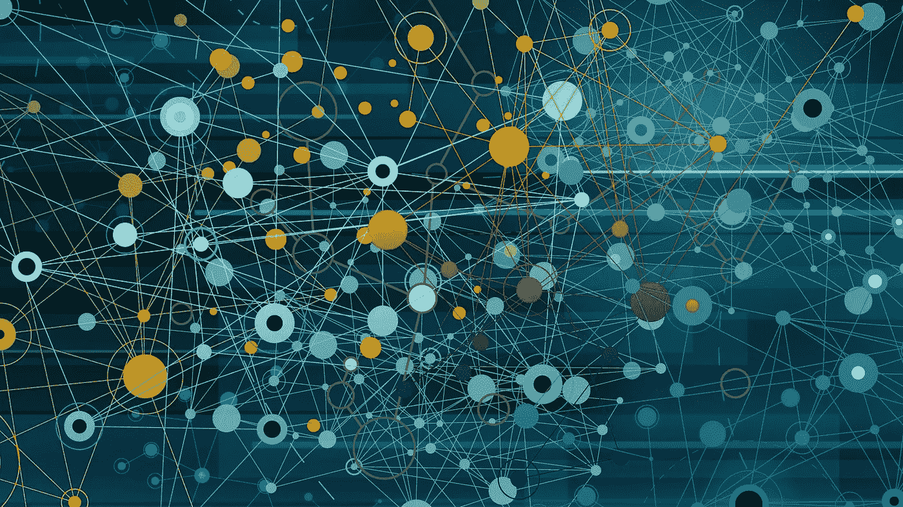

## 和往常一样，这个标题听起来很复杂，但绝对不是，相信我。

## 首先，什么是强化学习？

强化学习是一种机器学习方法，通过这种方法，智能程序，也称为**代理**在已知或未知的**环境**中采取**动作**，通过**反馈**不断适应和学习它们之前的动作。

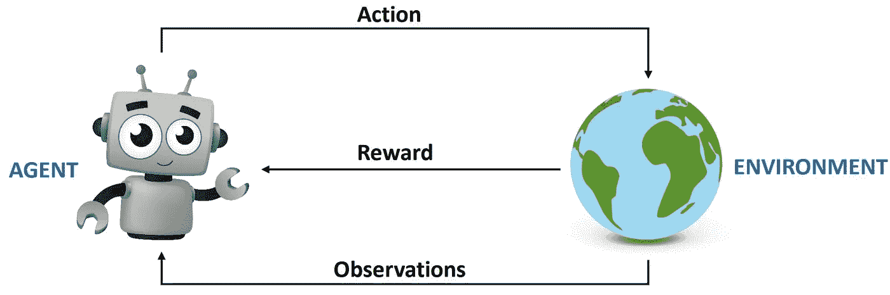

行动——奖励、观察

如上图所示，代理在环境中采取行动后收到的反馈是**奖励**和**观察**。

## 那么这些是什么，为什么我们需要它们？

强化学习的概念实际上是非常直观的，因为我们在日常生活中使用它，想想看，作为一个孩子，你会因为你的好行为/行为而受到奖励，因为你的坏行为而受到惩罚(或不受到奖励)，除非你喜欢被惩罚，否则你会自然而然地做更多你受到奖励的行为，而不是其他你受到惩罚的行为，这就是强化学习。

代理人采取行动，基于反馈(奖励和观察)，我们根据我们想要完成的目标来评估这些行动有多好，然后我们奖励或惩罚代理人，然后他一次又一次地重复，直到他学会每种情况或状态下的最佳行动。

我们定义了什么是奖励，现在观察是环境提供给代理的信息片段，观察可以是代理的位置，速度..简单到一串数字，复杂到包含来自几台相机的彩色图像的几个多维张量👐。

代理以迭代的方式作用于环境以进行改进，强化学习中的迭代被称为**集**，因此集简单地说就是模拟的长度，在该长度结束时，系统以终止状态结束。例如，如果我们愿意教一个代理人下棋，一集可能会在其中一个玩家输掉游戏时结束，或者可能会持续一段时间…无论何时一集结束，游戏都会回到初始状态。

**总结** : 智能体在与环境互动的同时，以回报最大化为目标。

> ***思想*** *:监督学习，特别是深度学习在过去十年里在结果和受欢迎程度方面取得了巨大的进步，这种进步是由 ImageNet 这样的大型标记数据集推动的，强化学习中的等价物将是一个大型和多样化的环境集合，这不是今天的情况，现有的开源环境没有足够的多样性，只是因为环境很难设置。*

# 如果我们不了解马尔可夫过程或马尔可夫链的概念，我们将一事无成

马尔可夫过程广泛应用于不同的工程领域，因此阅读它不仅在强化学习方面对你有益。

想象你有一个系统，你不能影响，你只能观察，你观察到的被称为状态，系统可以在状态之间切换。系统中所有可能的状态被称为状态空间，在马尔可夫过程中，我们要求这个空间是有限的，但它可能非常大，以补偿这种限制，你的观察形成一个状态序列或一个链(这就是为什么它也被称为马尔可夫链)，这个链序列被称为历史。

要称一个系统为马尔可夫过程，它需要满足马尔可夫性质，一个非常简单的性质:状态(t+1)必须只依赖于状态(t)。这使得每个状态可以独立描述系统的未来。

## 转换矩阵

假设我们有一个有 N 个状态的系统，这个系统符合马尔可夫性质。然后我们可以创建一个如下所示的转换矩阵:

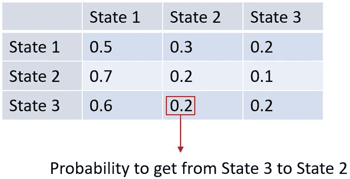

行 **i** 和列 **j** 中的每个单元包含系统从状态 **i** 到状态 **j** 的概率。

下面是马尔可夫过程的另一种表示法(也广泛用于有限状态机表示法) :

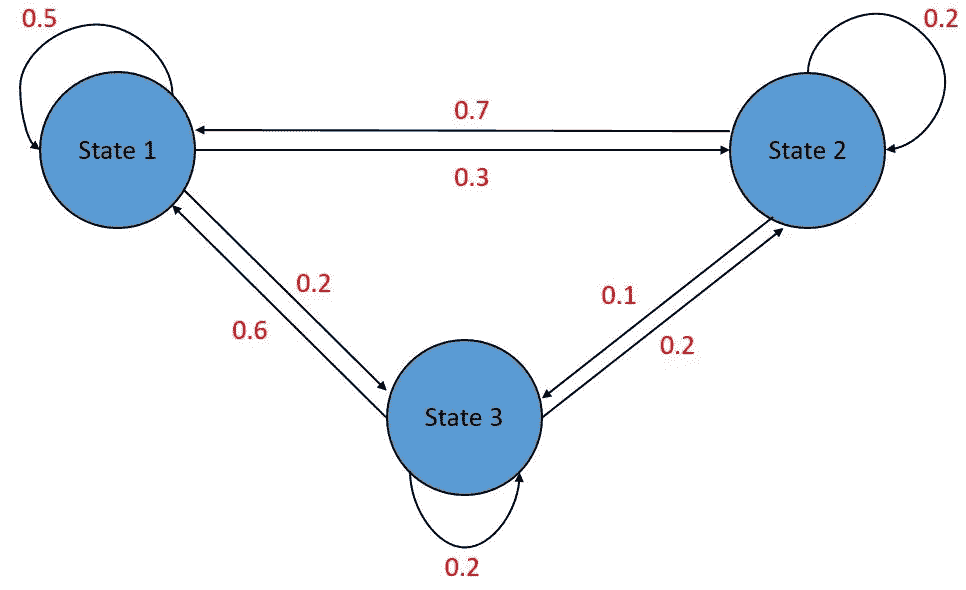

现在，让我们结合第一部分和刚刚看到的内容:

我们处于一种状态，我们观察(获得观察)，然后我们采取行动，而对于我们采取的行动，我们要么得到奖励，要么受到惩罚😐或者只是没有得到足够的回报，这意味着我们本可以做得更好。

## 马尔可夫奖励过程

我们之前提到了奖励，以及它们在学习过程中的重要性，现在我们将深入探讨更多细节。

首先，我们需要为我们从一个状态到另一个状态的转换添加另一个值，这将是相关的奖励。

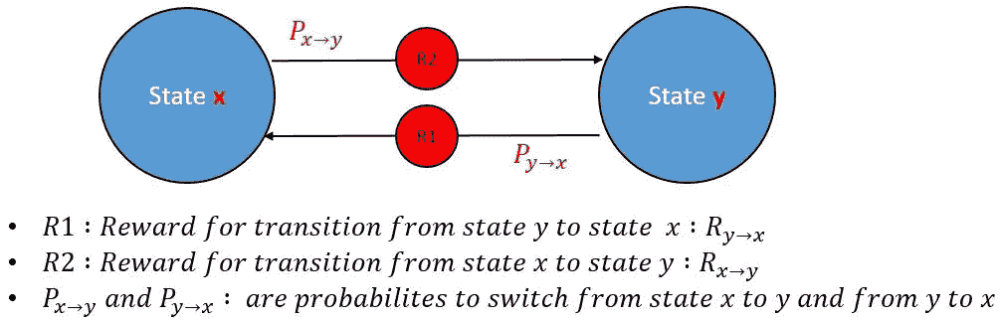

**总结:**我们观察到马尔可夫过程中的状态转移链，这仍然是马尔可夫奖励过程的情况，但是对于每个转移，我们都有这个额外的量“奖励”，所以现在，我们所有的观察都有一个奖励值附加到系统的每个转移上。

## **预期收益**

如前所述，代理人的目标是最大化其累积回报，为了用数学方法形式化这一点，我们引入了*预期回报*，它基本上是未来回报的总和。

返回时间 **t** :

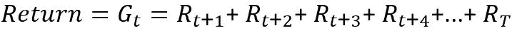

t 是最后一个时间步长，

所以回到我们之前提到的“插曲”的概念，T 将是插曲的持续时间。

有一些代理人-环境的相互作用不会自然地分裂成一段一段的，相反，它们会无限制地持续下去。

所以我们有阶段性任务和持续性任务。持续的任务，因为它们是无限持续的，它们使我们对每个时间 T 的收益的定义变得有问题，仅仅因为我们最后的时间步长 T 现在等于无穷大。

为了解决这个问题，我们在预期回报等式*、*中加入一个贴现因子ɣ*、【gamma】、*，这是一个从[0 到 1]的数字。那么什么是ɣ，它意味着什么？

## 贴现预期回报:

回报等式变为:

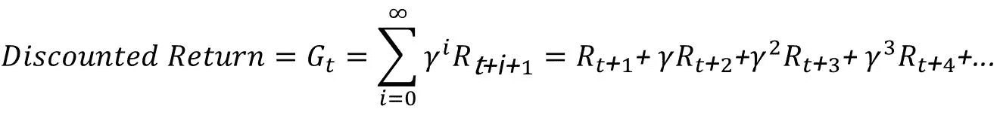

贴现回报的这一定义意味着我们的代理人将更关心眼前的回报而不是未来的回报，因为未来的回报将被更大程度地贴现。

有了贴现因子ɣ，即使 t 时刻的收益是无穷多项之和，收益本身实际上也是有限的。(0≤ɣ<1)

# Reinforcement learning methods

There are multiple techniques to implement a reinforcement learning algorithm, the one I’m going to cover on this article is called the **交叉熵方法。**

## 为什么是交叉熵方法？

嗯，因为它简单而且非常直观，而且它还允许我们再次使用进化算法(遗传算法在我的上一篇文章[链接](/@HamzaELHANBALI/genetic-algorithm-learning-from-nature-to-solve-complexe-optimization-problems-8744ae7bffed)中有涉及)。

## 它是如何工作的？

代理人在与环境互动时，要么得到奖励，要么受到惩罚，目标是通过采取正确的行动来最大化奖励。

我们要做的是将问题转化为监督学习问题，其中观察构成特征(输入数据),动作构成标签。

## 人工神经网络

你可以把神经网络想象成一个黑匣子，它把特征作为输入，把预测作为输出。

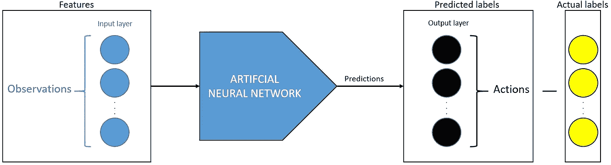

然后，我们将这些预测与实际*(期望)**(或所谓的标签)*输出进行比较，预测输出和实际输出之间的差异就是误差*(目的是让预测输出=期望输出)。*

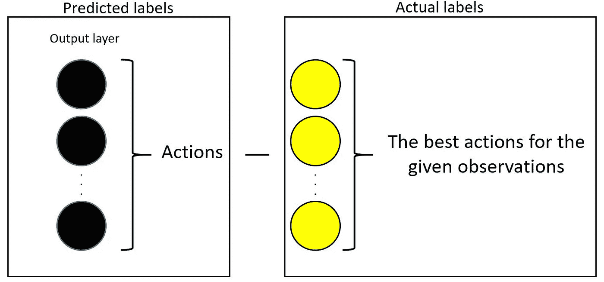

基于该误差，我们通过“反向传播”来调整神经网络的权重。[反向传播清楚地解释了](https://www.youtube.com/watch?v=Ilg3gGewQ5U&t)

这就是神经网络的训练方式。训练过程是调整权重以获得更好的预测。权重是可学习的参数。

**总结:**我们通过神经网络输入观察值，首先随机初始化权重，这也意味着神经网络在开始时会给我们不好的结果，当通过反向传播调整权重时，预测会得到改善。

## 让我们看看黑盒里面

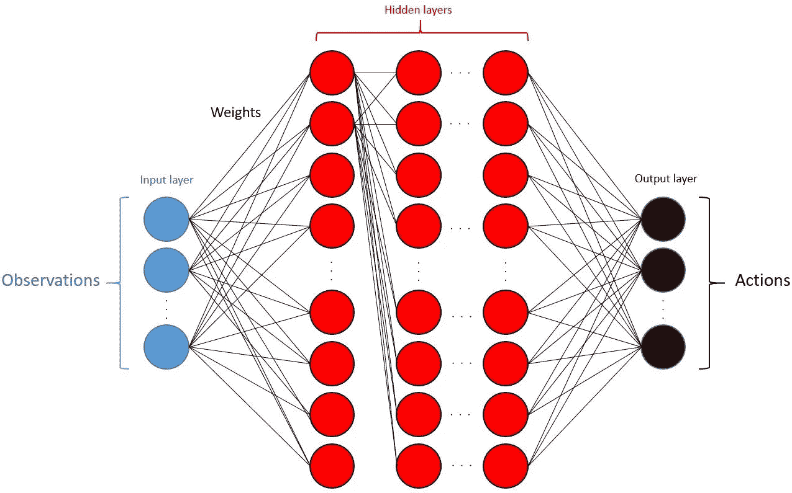

神经元(红色)也称为节点或单元，实际上是称为激活函数的非线性函数，其背后的目的是将非线性引入神经元的输出，因为真实世界的数据或至少大部分数据是非线性的。

## 在神经元内部

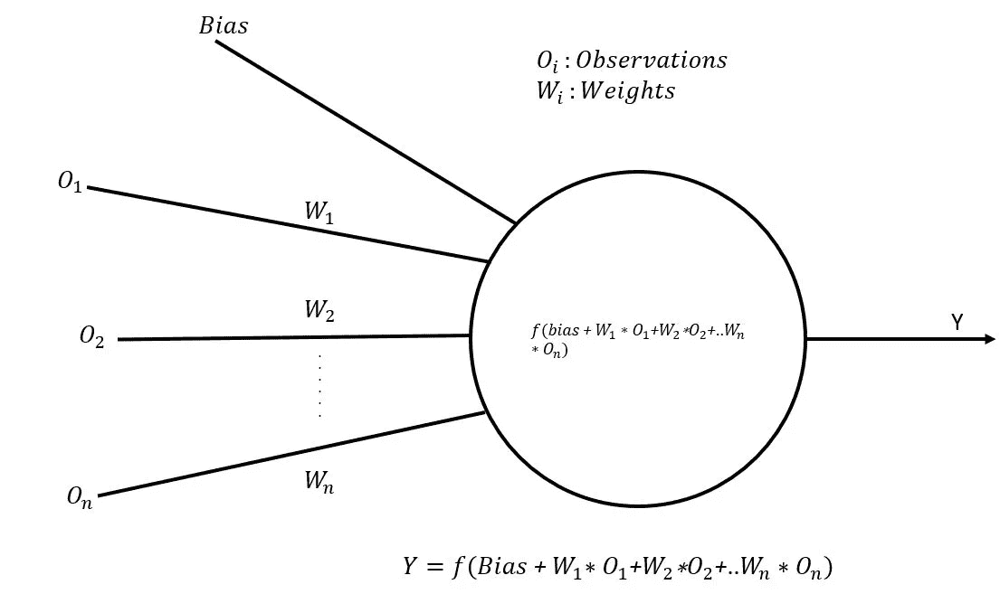

一些最著名和最常用的激活函数是 Sigmoid、ReLu、Tanh 和 Softmax。[激活功能解释。](https://www.youtube.com/watch?v=9vB5nzrL4hY)

> **偏置项:****偏置项**用于像 y 截距一样调整最终输出矩阵。例如，在经典方程 y = mx + c 中，如果 c = 0，那么直线将总是通过 0。添加**偏差项**为我们的**神经网络**模型提供了更多的灵活性和更好的泛化能力。(定义取自 Stackoverflow)。

# 用 Python 实现交叉熵方法

我们的环境:

> 一根杆子通过一个非驱动关节连接到一辆小车上，小车沿着一条无摩擦的轨道移动。通过对推车施加+1 或-1 的力来控制该系统。钟摆开始直立，目标是防止它翻倒。杆保持直立的每个时间步长提供+1 的奖励。当柱子偏离垂直方向超过 15 度，或者手推车偏离中心超过 2.4 个单位时，该集结束。
> 
> 链接:[https://gym.openai.com/envs/CartPole-v1/](https://gym.openai.com/envs/CartPole-v1/)

[https://gym.openai.com/videos/2019-10-21-MQT 8 QJ 1 mwo/cart pole-v1/original . MP4](https://gym.openai.com/videos/2019-10-21--mqt8Qj1mwo/CartPole-v1/original.mp4)

## 我之前提到过我们将使用一种进化算法，让我们来讨论一下吧！

我说过我们需要数据(特征、标签)来训练神经网络，我还说过强化学习并不直接与数据相关，而是与环境互动，并在反复做这件事的同时努力改进。

我是不是很矛盾？不😄我们使用进化算法，在强化学习问题中的监督学习，不是很棒吗😁？

我们要做的实际上是通过运行许多集来收集数据(尽可能多，以从神经网络获得最佳结果)。

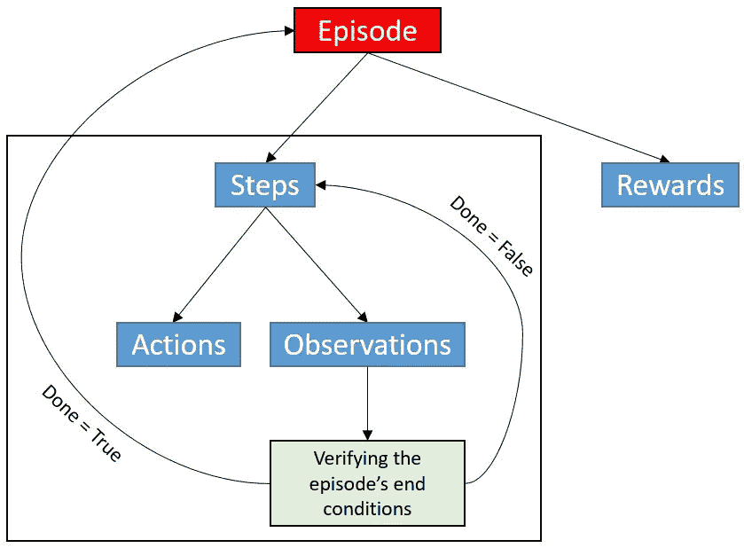

对于每一集，我们可能有不同数量的步骤(只要没有达到该集的结束条件，我们就会采取步骤)，由于环境的随机性和代理选择采取行动的方式，一些集会比其他集更好(就奖励而言)。

我们分批保存这些剧集。*(我们更关心剧集的步骤和奖励，而不是剧集本身)。*

批次可以被想象成储存剧集的盒子。

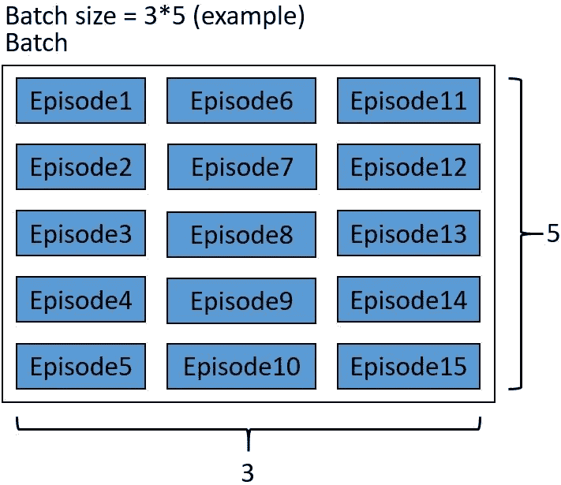

## 自然选择部分

交叉熵方法的核心是扔掉不好的剧集，对更好的进行训练，那么我们如何找到更好的呢？

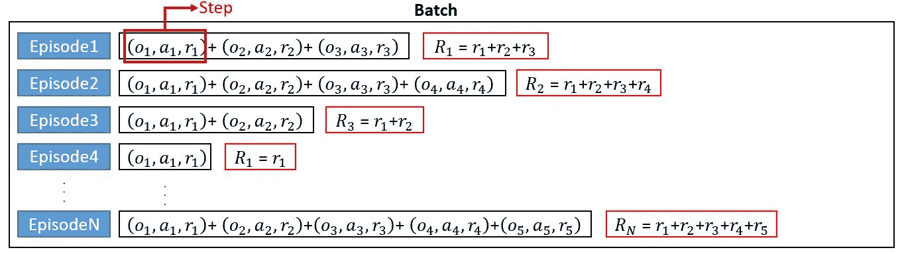

我们计算每集的总奖励，并决定奖励界限，哪些集我们保留，哪些集扔掉，我使用了所有奖励的第 70 个百分点，这意味着我只保留了比其他 70%做得更好的 30%。[百分位数](https://www.youtube.com/watch?v=mDJvDRvvDXo&t=41s)

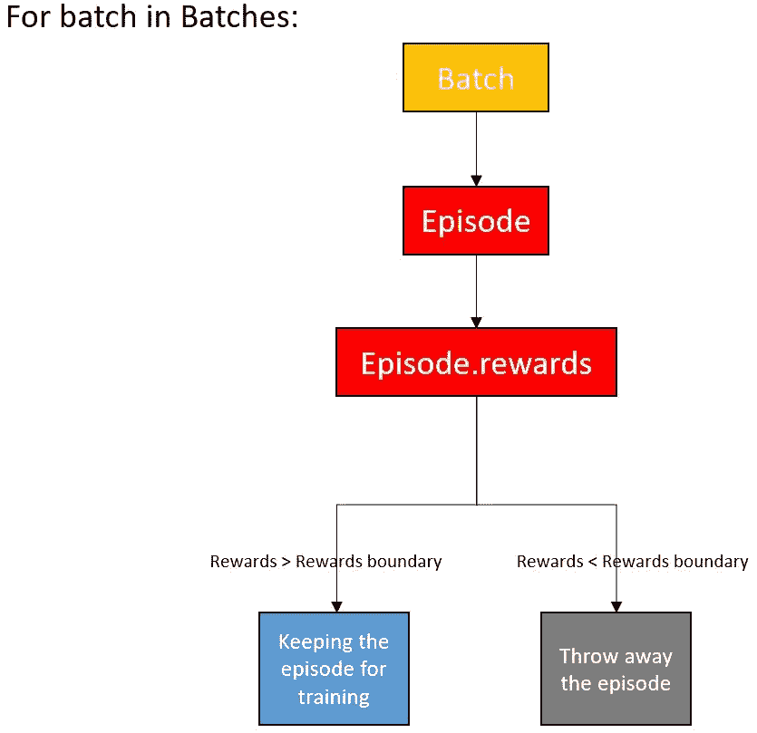

我们在剩下的精英剧集上训练神经网络，这个过程一直重复，直到我们对结果满意为止。

神经网络学习重复导致更大奖励的动作，并且由于神经网络变得更好，奖励边界也不断变得越来越高。

这就是关于交叉熵方法的全部内容，如果你已经做到了，恭喜你💪。

## 我们的神经网络架构

没什么特别的。它将单个观察向量作为输入，并输出要执行的动作。

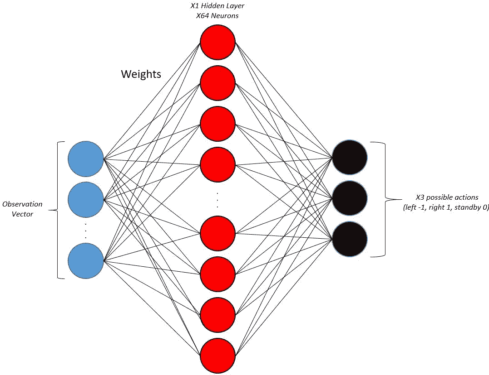

> **一个常见问题:**为什么有 64 个神经元，为什么只有一个隐藏层而不是更多？实际上，关于我们如何选择这两个参数(隐藏层的 Nb，每层中神经元的 Nb)有很多争论，没有最好的方法，但我喜欢的方法是尝试不同的架构，直到我得到满意的结果，记住这样一个事实，你添加的层和节点越多，需要的计算和内存就越多。

## Softmax &交叉熵损失函数

我提到过 Softmax 是最常用的激活功能之一，我将简要介绍它的使用时间和作用。

**何时使用:**

当我们旨在建立多类分类器时，在神经网络中使用 Softmax。(我们有 3 个可能的动作要执行，对于有 3 个类的神经网络，这使得我们的问题成为多类分类问题)。

**它的作用:**

首先，这是 Softmax 激活函数的公式:

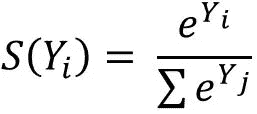

它将一个实数向量作为输入，输出一个概率分布。

我们可以这样看

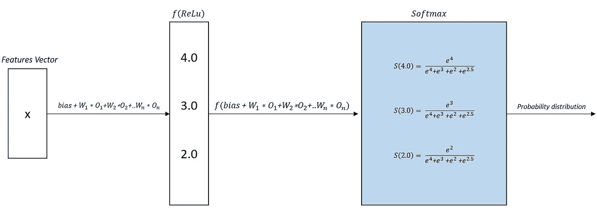

或者这边

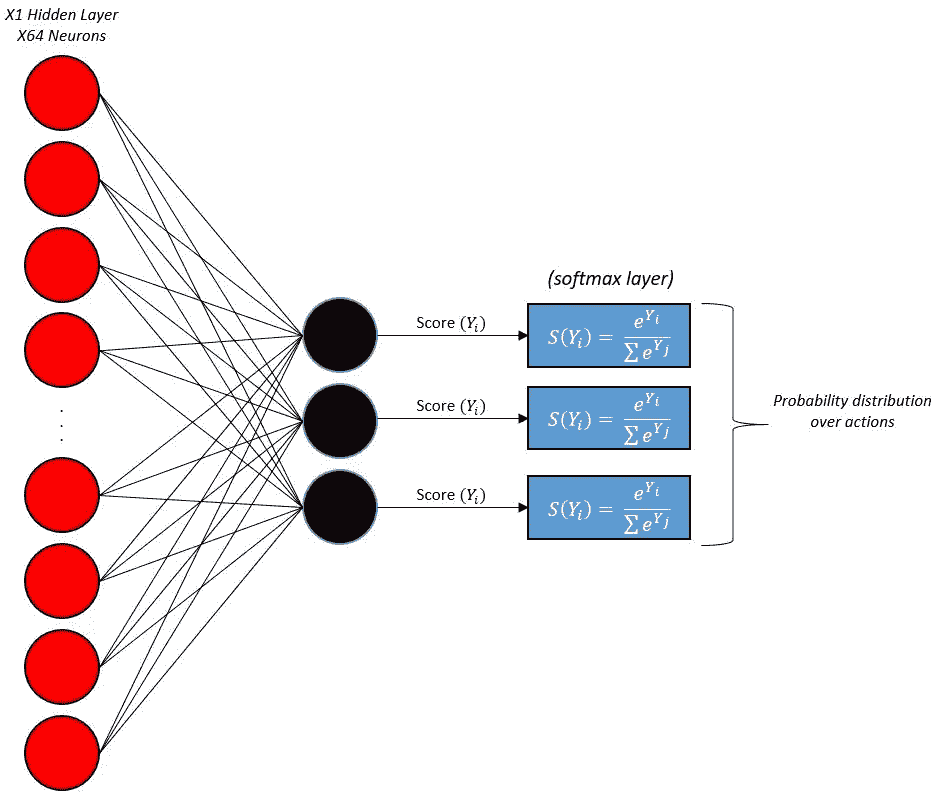

这就是 Softmax 的全部内容。

# 交叉熵损失函数

通常，softmax 与所谓的交叉熵损失相结合，所以让我们再次看看它做什么和如何做。

**它的作用和方式:**

它测量输出是概率的分类模型的性能。我们的预测越准确，损失就越低。

数学公式:

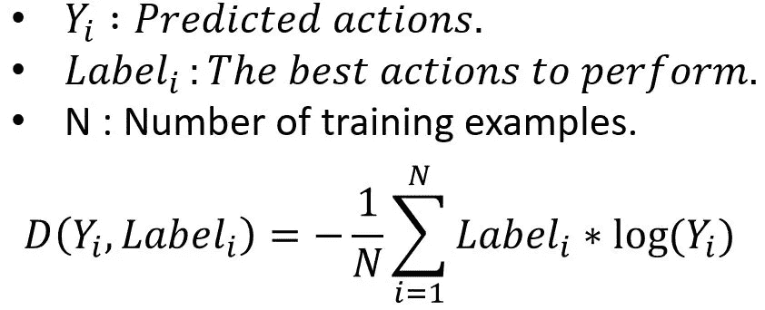

**例如:**

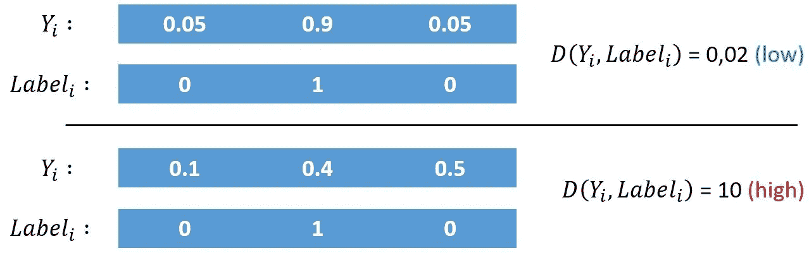

然后基于损失值，通过反向传播来调整权重。

这就是关于交叉熵损失函数的全部内容。

# 代码和演示

**使用两种不同神经网络架构的演示:**

【Github 库】为 Python 代码:[https://github.com/HamzaELHANBALI/DeepReinforcemnetLearning](https://github.com/HamzaELHANBALI/DeepReinforcemnetLearning)

一如既往，我希望这对你有用，并能启发你用它做其他事情。

下一期《✋.邮报》再见