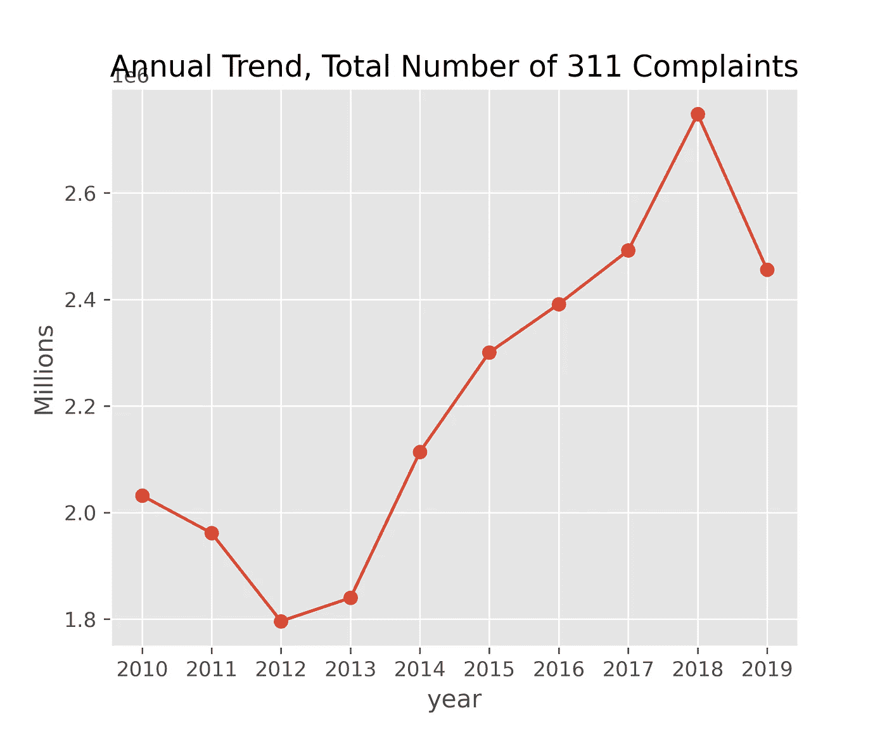
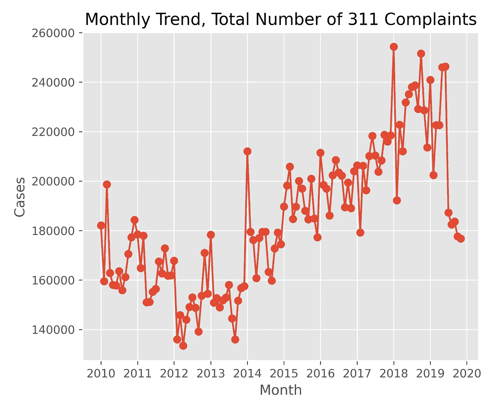
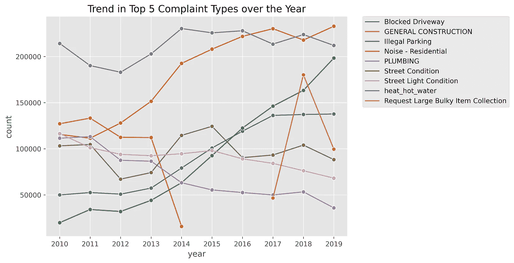
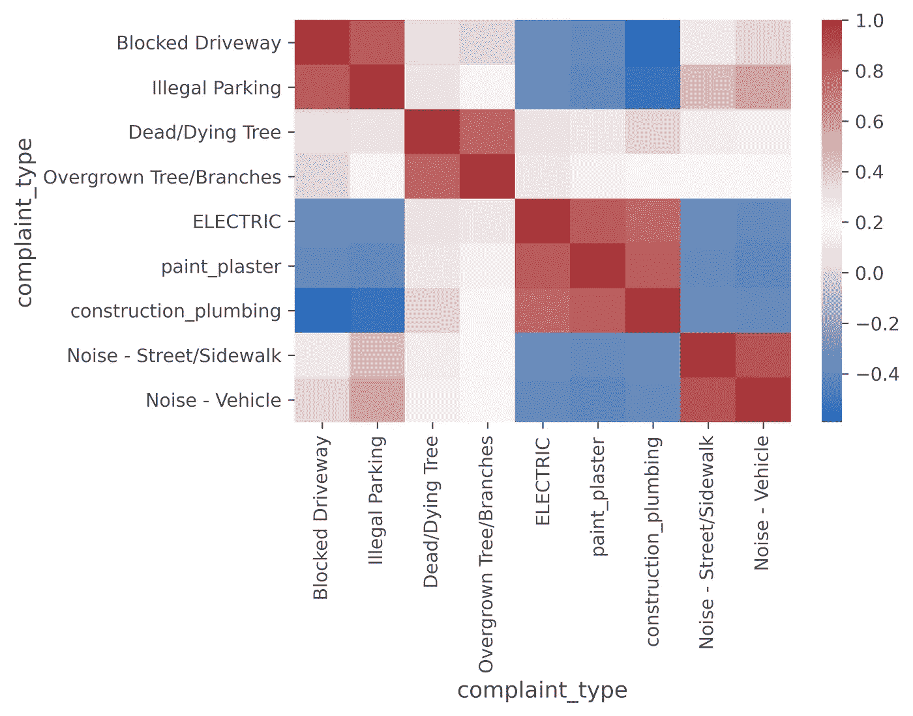
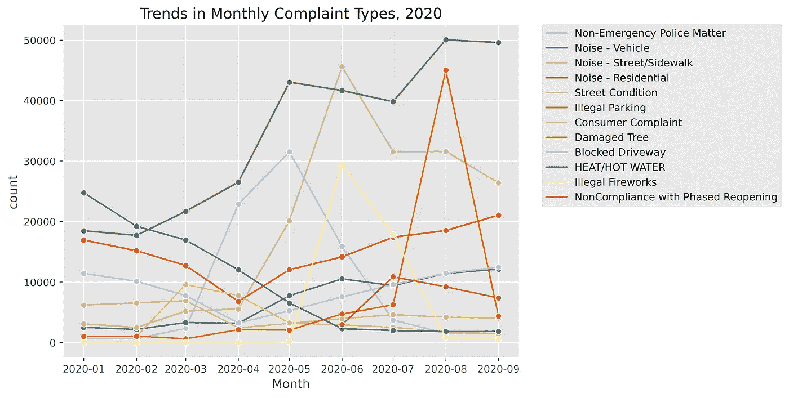
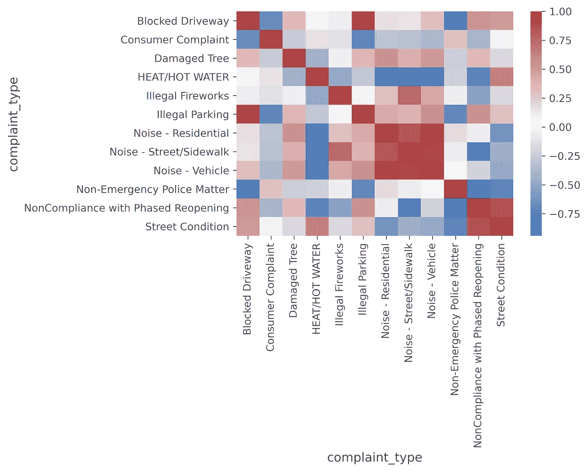
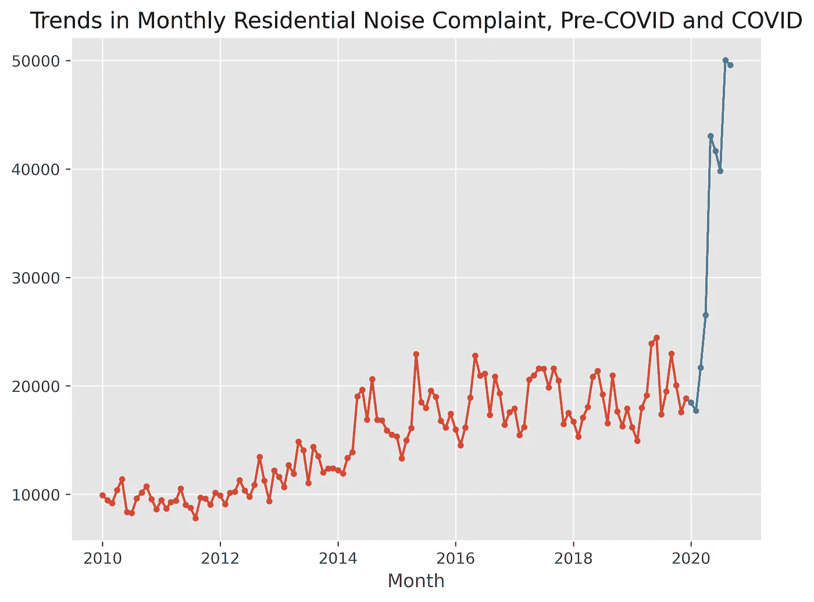
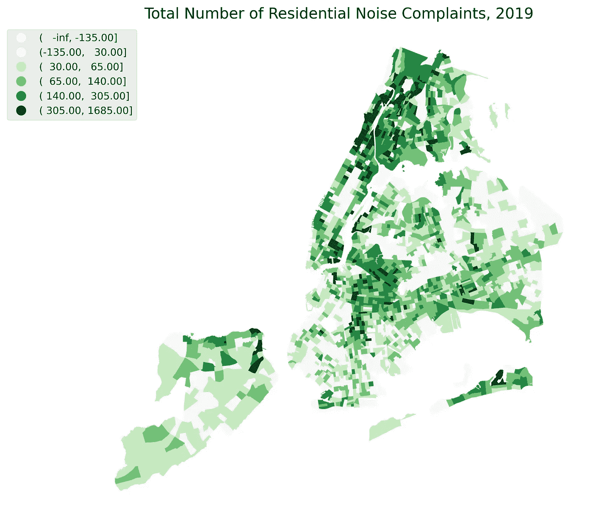
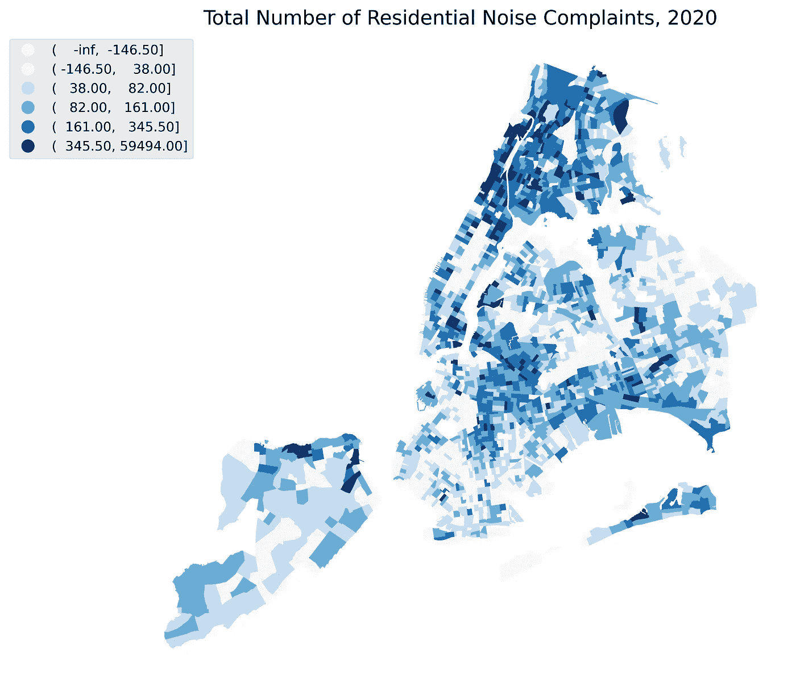

# 使用 Python 探索 311 请求中的住宅噪音投诉趋势

> 原文：<https://medium.com/analytics-vidhya/exploring-residential-noise-complaint-trends-in-311-requests-with-python-cc3209dd0dfb?source=collection_archive---------11----------------------->

由[伊森·拜克](https://unsplash.com/@ethanbykerk?utm_source=medium&utm_medium=referral)在 [Unsplash](https://unsplash.com?utm_source=medium&utm_medium=referral) 上拍摄的照片

在这篇文章中，我将使用 Python 来探索 NYC 311 数据集。该数据集可从纽约市 OpenData 网站获得，其中包含从 2020 年 1 月 1 日至今的所有 311 个请求。鉴于对这个帖子的兴趣，我将调查 2020 年 10 月 1 日之前提出的所有请求。所有数据集都是通过 API 查询获取的。

在探索的过程中，我会问一些问题:

1.  纽约市索赔总数的年度和月度趋势是什么？
2.  有哪些重要的索赔类型？
3.  不同类型的索赔是否相关？2020 年前？在疫情期间？
4.  某些特定的投诉类型，如`Residential Noise`在空间上是如何分布的？

我将通过推荐对这个数据集的进一步工作来结束这篇文章。

1.  **纽约市索赔总数的年度和月度趋势如何？**

让我们从统计每年的请求数量开始。自 2012 年以来，纽约市的年度索赔数量稳步攀升，而自 2010 年以来，这一数字曾连续两年下降。这一数字在 2018 年达到顶峰，每年为 2，747，951 人，2019 年有所下降。过去十年的平均每日请求从 2012 年的 4921 次到 2018 年的 7528 次不等。

月图有助于分解年度趋势，并认识到一些周期性。总的来说，每月的索赔数量在上升，但是我们看到，在每一年中，每个月的请求数量会季节性地上升和下降。同样明显的是，在 2019 年下半年，311 项请求的数量大幅下降。

总的来说，在过去的十年里，纽约人提出的索赔越来越多。

2.**在过去十年中，有哪些重要的索赔类型？**

多年来，311 已经接受了 100 多种类型的索赔，但其中一些是相互包容的，而另一些则在某些时候不再使用。如果某个索赔类型在过去十年中的任何一年中位列最多索赔的前五名，我们将该索赔类型定义为重大索赔。然后我们算出它们这些年的趋势。有些投诉类型相互重复，我们将其归纳为一种投诉类型。例如`Heat`、`HEAT/HOT WATER`为`heat_hot_water`、`Plaster - Paint`、`PLASTER/PAINT`为`plaster_paint`。

以下是过去十年中主要投诉类型的趋势:

我们有几个发现:

*   `Heat and/or Hot Water`十年来不断做大。
*   `Residential Noise`大幅攀升。
*   `Illegal Parking`和`Blocked Driveway`好像是同时增加的。

再说，`General Construction`2014 年逐渐闹翻；`Plumbing`下降相当缓慢；`Street Condition`有一些起伏；`Request Large Bulky Item Collection`2017 年出来略低于 5 万，2018 年增加到 3 倍以上，2019 年回落到 10 万左右。

**3。不同类型的索赔是否相关？2020 年前？在疫情期间？**

首先，我们希望完成对 2010 年 1 月 1 日至 2020 年 1 月 1 日期间提交的投诉的研究。同样，我们需要选择一些重要的索赔类型，我们希望重新安排重复的类型。我还删除了一些不经常用于分类的投诉类型。我以下面的关联矩阵可视化结束:

从图表中，我们看到四组正相关的投诉类型:

*   `Blocked Driveway`和`Illegal Parking`:显然`Illegal Parking`会诱发`Blocked Driveway`。
*   `Dying Tree`和`Overgrown Tree/Branches`:也许它们的相关性可以用某些天气事件来解释。
*   `ELECTRIC`、`paint_plaster`和`construction_plumbing`:他们之间的关联对我来说并不明显。
*   `Street Noise`和`Vehicle Noise`。

接下来我们研究 2020 年 10 月 1 日之前提交的投诉。像我们在上一部分所做的那样清理数据集，我们可以先看一下 2020 年的重要类型。请注意，自 6 月以来,`Non-compliance with Phased Opening`成为一个主要的投诉。

一些有趣的事情:

*   八月份我们在`Damaged Trees`上看到了很多 311 投诉。记得热带风暴伊萨亚斯在 8 月 4 日袭击了纽约地区。根据《纽约时报》的这篇文章，“超过 250 万用户断电，至少一人死亡。”
*   五月和六月，对`Illegal Fireworks`的抱怨激增。非法燃放烟花通常发生在 6 月下旬，此时 7 月 4 日越来越近。然而，随着纽约人正在经历的动荡，对烟花的抱怨来得更快。这是纽约时报的另一篇关于今年 T3 暴涨的文章。

我们还得到了以下相关矩阵的可视化:

`Illegal Parking`仍然与`Blocked Driveway`有很好的相关性，但是顺从类型之间的相关性模式也有所改变:

*   `Residential Noise`、`Street Noise`、`Vehicle Noise`相关性更强。
*   `Non-compliance with Phased Opening`和`Street Condition`表现出相关性。

**4。某些特定的抱怨类型，比如说，** `**Residential Noise**` **，是如何在疫情时间中进行空间分布的？**

在我们研究`Residential Noise`的空间分布之前，我们可能会对它在 2020 年的趋势与其历史记录相比如何感兴趣。

自 5 月以来，`Residential Noise`上的投诉量飙升，几乎达到 2019 年月度投诉量的两倍。6 月和 7 月，这一数字下降了几千，而 8 月这一数字跃升至 50，000 以上，并在 9 月保持不变。可以有把握地得出结论，2020 年的趋势是**而不是**自 2012 年以来持续增长趋势的一部分。

现在我们可以查看 2019 年和 2020 年`Residential Noise`投诉的空间分布情况。

为了创建每个普查区域内投诉数量的 choropleth，我们首先在指定的时间范围内查询`Residential Noise`类别中的所有请求，并使用经度和纬度列将它们编译到 geopandas 数据帧中。然后，我们在 geopandas 数据框架和纽约市人口普查区域 shapefile 之间执行空间连接，计算点的数量，即落入每个区域的投诉实例。纽约市开放数据网站上也有人口普查的信息。

我选择的创建 choropleth 的分类方案是`boxplot`。我选择这一个是因为它可以告诉异常值，即投诉数量极高的地方。`boxplot`方案将数据分为以下几类:

*   低于最小值(异常值)
*   最低至 25%
*   25%到 50%(中间值)
*   50%(中位数)到 75%
*   最大 75%
*   高于最大值(异常值)

在我们的案例中，第一个类别捕获的值低于最低线是没有意义的，因为在一个区域内没有负的投诉数量。然而，我们要注意最后一个类别，最大值之上的*，它用最暗的绿色标记了拥有大量索赔的区域。*

以下是 2020 年`Residential Noise`债权的空间分布:

就这两种植物显示的空间模式而言，它们非常相似。2019 年停留在一个类别的地块在 2020 年大多停留在同一类别，尽管划分每个类别的确切数量已经发生了变化。2019 年，纽约市辖区的年度投诉中值为 65 起，2020 年前十个月为 82 起。这进一步表明`Residential Noise`在《疫情时报》越来越糟糕。

可以对这类投诉进行更多的分析:

*   噪音可能不总是坏邻居的结果；也许这栋建筑很旧了。调查噪音投诉的空间分布与具有特定特征的建筑物的空间分布之间是否存在任何相关性。
*   也许一些社区人口密集，因此产生更多的索赔。调查一些特定街区的人口密度。
*   除了空间性，投诉在一天内的分布情况如何？