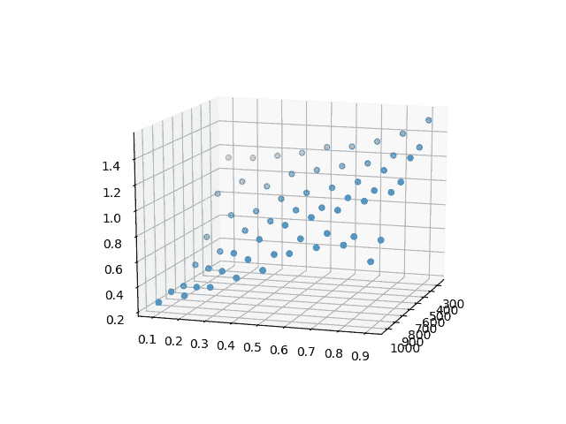

# 用 PyTorch 探索 RNNs。

> 原文：<https://medium.com/analytics-vidhya/exploring-rnns-with-pytorch-2ed769239c38?source=collection_archive---------14----------------------->

当人们开始使用 RNNs 时，他们探索的第一个应用是文本生成。这真的是一项既有教育意义又有趣的任务，训练一些网络按照特定作者的风格生成文本。

在这篇小文章中，我将探索几个 rnn，任务是生成类似尼采的文本。

# 最简单的 RNN 与 PyTorch。

让我们按照 nice [教程](http://www.wildml.com/2015/09/recurrent-neural-networks-tutorial-part-1-introduction-to-rnns/)创建第一个最简单的 RNN。我将建立一个基于字符的网络，这样它将为给定的序列产生下一个字符。基本思路是用 *n 个*字符产生*第 n+1 个*字符。对于初始训练，我将使用重叠的字符序列，因此第一个输入是一组字符，比如 0-10，第二个输入是一组 1-11，依此类推。这给学习带来了很多冗余，因为网络试图预测下一个字符。

代码:

> *vocab_size* 是训练文本中的一些唯一字符
> 
> *n_fac* 是序列的长度
> 
> *n_hidden* 是网络中最后一层的输入尺寸

有关文本准备和培训的完整代码，请参见[https://github . com/pvva/simple-rnn-analyses/blob/master/rn n1 . py](https://github.com/pvva/simple-rnn-analyses/blob/master/rnn1.py)。

这个网络的结果并不像人们所期望的那样。话是对的，但是不断重复。

> 序言假设真理在主体的主体，主体的主体，主体的主体，主体的主体

这是由于第一网络中梯度爆炸的可能性和正则化的缺乏而由 RNN 本身的性质造成的。幸运的是，这些问题是可以解决的，但是在开始解决它们之前，让我们稍微改进一下网络。

正如您所注意到的，网络不会在调用之间保持隐藏状态，每次都会将其重置为零。使用下面的代码可以很容易地修复它。

# 有点先进的 RNN 与 PyTorch。

在这个网络中，我将解决两个问题:学习冗余和正则化的缺失。

为了克服学习冗余，我将输入不重叠的序列，如 0-10，11-20 等等。为了克服过度拟合，由于缺乏正则化，我将使用辍学 LSTM 网络。要了解更多关于 LSTM 的信息，请参考一篇非常好的[帖子](https://colah.github.io/posts/2015-08-Understanding-LSTMs/)。

请注意，我不只是从网络中提取最后一个字符，而是提取整个输出，以便随时间进行适当的反向传播(BPTT)。令人惊讶的是，这种方法立即给出了更合适的结果。

> 前言假设真理是一个女人——它作为继承和灵魂状态的方面，因为它与科学精神一样，开始成为大众的欲望，当精神的当前沉思已经在世界上被牺牲了，这个过程是一个宗教和世界的光，它一直是灵魂的沉思——理性的荣誉和禁欲主义者可能很容易的命运和关于

文本看起来已经很不错了，这使得该网络成为探索某些超参数的绝佳场所，这些超参数包括 LSTM 的图层数、最后一个隐藏图层的输入大小和下降值。

首先，让我们看看不同层数的损耗，从 1 到 4。但是，如果 LSTM 只有一个图层，则不会使用辍学，因为它适用于除最后一个图层以外的所有图层。

> *损失:[0.7939222455024719，0.8113330602645874，0.8978474140167236，0.921573729515076]*

很明显，随着层数的增加，网络的复杂性会增加，因此损耗也会增加。由于使用 1 层没有意义，因此在分析其他参数时，使用 LSTM 的 2 层。

在进行分析之前，我有两个假设:

*   隐藏层生长减少了损失，因为它能够捕获更多的参数
*   辍学增长增加了损失，因为它需要更多的运行来推广

绘制最终损失值。x 和 Y 轴分别是隐藏层输入大小和辍学率。

正如预期的那样，最低损失是隐藏层输入大小为 1024，丢失率为 0.1。

这是一个样本文本，由经过“最佳”参数训练的网络生成。

> 假设真理是一个女人——为什么它应该是真理？" 17.关于他的好名声。120 =塞利吉斯特和索伦由于理智和道德的摇摆不定，因此，即使是他自己也不确信什么时候有可能把每一堵墙中的顾客普遍地分配给一种行动，以使人们认识到，那些属于理性的人的柏拉图式的起源现在是一个微妙的意志的磨工

只是为了比较，这是隐藏层输入大小 256 和辍学率 0.9 的文本。

> 假设真理是一个女人，同样的，同样的状态，同样的坚强，同样的坚强，同样的灵魂，同样的坚强，同样的坚强，同样的牺牲，同样的坚强，同样的感情，同样的良心，同样的力量，同样的力量 所以相同和相同的相同和相同的立场相同的状态

捕捉的参数越少(最终隐藏层输入大小)，输入中的“噪声”越多(高辍学率)，输出就越像垃圾，但如果参数合适，感觉就像尼采:)

完整的源代码可以在[https://github.com/pvva/simple-rnn-analyses](https://github.com/pvva/simple-rnn-analyses)获得