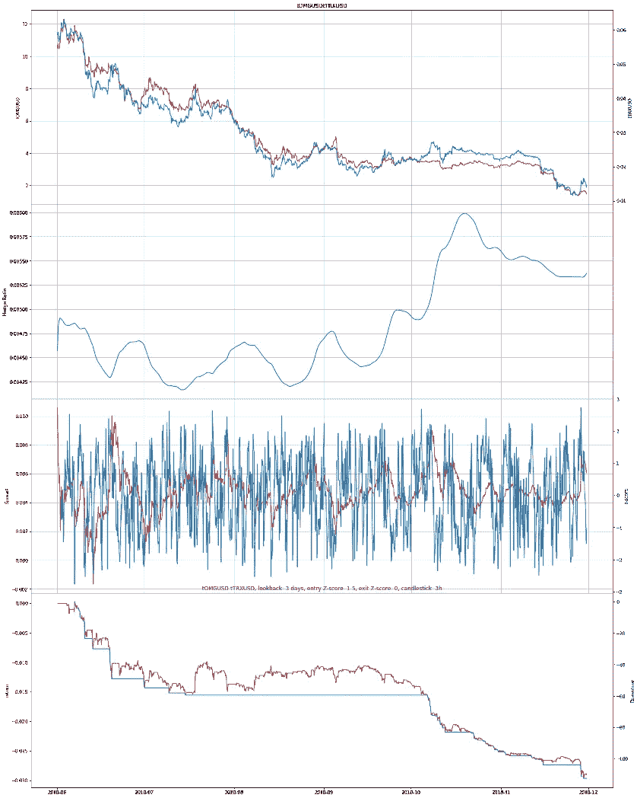

# 探索加密货币中的统计套利

> 原文：<https://medium.com/analytics-vidhya/exploring-statistical-arbitrage-in-cryptocurrency-924ad6bf2a57?source=collection_archive---------11----------------------->

# 介绍

统计套利是量化金融领域最常见的策略之一。因此，我决定在去年夏天着手一个项目，以了解这一策略，并最终将其应用于加密货币市场。

加密市场具有高度相关性和高度波动性，这对于押注两种相关证券趋同的量化策略来说非常有利。但通过修复回溯测试中的漏洞，并了解更多关于统计套利的基本知识，我得出了一个结论:将这种策略应用于加密货币市场并不容易。在大多数主要的加密交易所，交易费用都很高，而且订单簿的深度使其不可能在不造成太多滑点的情况下接受大量订单。接下来，我将深入研究交易逻辑、发现和未来计划。

# 交易逻辑

利用网上资源[1]，我开始了解什么是配对交易。我在网上找到几篇文章，给了我一个如何开始的模型。

## 过滤过程(寻找配对进行交易)

1.  由于加密领域缺乏规则，我首先缩小了我要操作的交易所的范围，以确保订单簿深度是合法的。
2.  然后，我选择每天交易量至少为 100 万美元的硬币，以确保流动性。
3.  筛选潜在的配对

(1)使用[皮尔森相关性](https://docs.scipy.org/doc/scipy-0.14.0/reference/generated/scipy.stats.pearsonr.html)的相关性

(2)协整采用[恩格尔-格兰杰两步协整检验](http://www.statsmodels.org/dev/generated/statsmodels.tsa.stattools.coint.html)

(3)平稳性使用 [ADF 测试](https://machinelearningmastery.com/time-series-data-stationary-python/)

## 交易步骤

1.  使用卡尔曼滤波回归计算每对的套期保值比率。
2.  使用以下等式计算价差

```
spread = y - hedge ratio * x
```

3.使用以下公式计算 z 值

```
(current spread - average of spread over past x days) / std of spread over x days
```

这里，x 是回望期。我们用半衰期来计算。关于这方面的更多信息，请查看脚注中的链接。

4.定义任意进场 z 值和出场 z 值。

当 z 值穿过上方进场 z 值时，做空；用 z-score 平仓返回退出 z-score 当 z 值穿过较低的 z 值时，做多；用 z 值平仓返回 z 值退出。

# 履行

为了获取数据，我决定从 Bitfinex 中调出所有的 XYZ/美元交易对。Bitfinex 是少数几个有实际交易量的交易所之一。由于密码行业缺乏监管，在不太知名的交易所，洗白交易和其他非法活动猖獗。因此，选择正确的交易所是至关重要的一步。我选择美元作为基础货币，因为其他货币对，如基于 BTC 的交易对，总的交易量要低得多。

在进行相关性测试后，我对这些数据进行了协整检验。对于这一步，我使用了 [Engle-Granger 两步协整检验方法](http://www.statsmodels.org/dev/generated/statsmodels.tsa.stattools.coint.html)。由于如果选择不同的因变量，这种方法会产生不同的结果，我决定计算所有对的协整，然后选择 XYZ/美元和美元/XYZ 的协整 p 值都为< 0.01 的对。

对所有蜡烛线规模进行协整检验，得出这些对作为协整对:

```
[(‘tLTCUSD’,‘tIOTUSD’),(‘tEOSUSD’,‘tNEOUSD’),(‘tEOSUSD’,‘tTRXUSD’,(‘tIOTUSD’,‘tNEOUSD’),(‘tNEOUSD’,‘tOMGUSD’),(‘tEOSUSD’,‘tIOTUSD’),(‘tIOTUSD’,‘tOMGUSD’),(‘tLTCUSD’,‘tEOSUSD’),(‘tLTCUSD’,‘tNEOUSD’),(‘tOMGUSD’,‘tTRXUSD’),(‘tDSHUSD’,‘tXMRUSD’)]
```

然后，我通过对价差运行 ADF 测试来进一步细化结果，以发现两对之间的价差是否是稳定的。

结果图请参见**附录 A** 。在其中，你会发现价格、对冲比率、价差和每个协整对的 z 值的图表。

有趣的是，ADF 检验显示了与协整检验相同的模式，即使用的数据点越多(烛台频率越高。例如，从使用 1D 烛台到 6h 烛台)，越多的线对通过 ADF 固定测试。我已经在**附录 B** 中编译了结果。请参见**附录 C** 了解使用不同烛台的图表对比。

# 回溯测试

没有佣金的结果都相当有希望，但一旦增加佣金，夏普比率都下降到负值。这里有一个这样的例子:



图一。价格对比；对冲比率；传播与 z 分数；返回与 OMGUSD/TRXUSD 的缩编

从分布图(图 1 的第三部分)可以判断。)，这是一个平稳的传播。由于巨大的交易费用(我使用 0.2%进行回溯测试，但根据交易所的不同可能会更低)，我所有的样本内回溯测试都没有产生任何有效的结果。我试着交替输入 z 值、输出 z 值、回看时间来计算 z 值。然而，这对结果没有帮助，所有的结果都类似于上面的图。有时测试会产生一对正夏普比率，但很少会超过 1。

# 结论

尽管整个加密市场似乎在同步运行，但利用这一事实的统计套利策略并不容易设计出来。假设在高交易费用的环境下，使用卡尔曼滤波器的统计套利策略在密码市场中表现不佳。这种特殊的策略要想成功，还需要进一步的研究。

重要的是要分析市场的本质，并相应地缩小策略的范围。高频策略可能不适合高交易佣金和低交易量的市场。可以进一步优化卡尔曼滤波器的参数，但需要对该主题有更深入的数学理解，以了解哪些其他状态空间模型可以用于该用例。沿着道路，应尝试两个方向:

*   将这种策略与其他技术结合起来，如使用机器学习，为交易逻辑增加另一层过滤器。
*   把这个策略运用到传统市场，比如期货市场和股票市场。
*   检查其他状态空间模型，尝试作为统计套利策略。

[1]启示:[卡尔曼滤波技术与中国期货市场的统计套利](https://blog.quantinsti.com/kalman-filter-techniques-statistical-arbitrage-china-futures-market-python/)，[基于统计套利的高频动态对交易采用两阶段相关和协整方法](http://www.ccsenet.org/journal/index.php/ijef/article/view/33007)

[2]100 万美元实际上还是太低了，不足以操作一个有利可图的配对交易策略，但是密码市场对任何更高的交易来说都太小了，所以我选择了 100 万美元。