# 探索 Tableau 使用良好的乘坐和天气数据

> 原文：<https://medium.com/analytics-vidhya/exploring-tableau-using-nice-rides-and-weather-data-10783569ece2?source=collection_archive---------1----------------------->

Nice Ride Minnesota 是一项自行车共享服务，在明尼阿波利斯有 3000 多辆自行车和 400 多个站点。这些自行车比其他出行方式更快。他们可以在乘车结束时方便地在附近的任何尼斯乘车站下车。单程票价为 2 美元，24 小时内不限时 30 分钟的一日通票票价为 6 美元，年费为 75 美元。

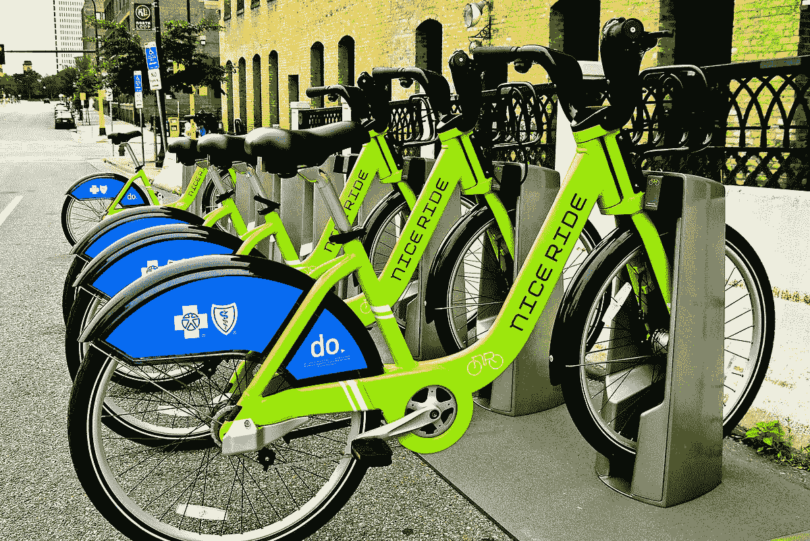

我决定探索 2017 赛季的自行车历史数据，看看数据是否显示出任何有趣的趋势或模式。2017 年的数据集可通过以下链接免费获取。

 [## 2017 年明尼苏达骑行愉快

### 2017 年尼斯骑行 MN 的自行车共享行程和站点数据

www.kaggle.com](https://www.kaggle.com/brendanhasz/nice-ride-mn-2017) 

我还在上面的链接中找到了天气数据集，这让我的工作变得更容易，因为我想分析天气变化如何影响乘客量。我使用的 Tableau Public 是一个数据可视化软件，在这里可以免费获得。

 [## 下载 Tableau Public

### 通过自动手机和平板电脑布局，在几秒钟内构建移动友好的仪表板。使用新的布局，或者…

public.tableau.com](https://public.tableau.com/en-us/s/download) 

**了解数据的带宽**

Nice ride 数据集包含大约 460，000 条记录。

它只包含几个字段

*   开始日期——开始游乐设备的日期
*   起点站—游乐设备开始运行的车站
*   起点站编号—起点站序列号
*   结束日期——结束游乐设备的日期
*   终点站——游乐设备终止的车站
*   终点桩号—终点桩号序列号
*   帐户类型—指示用户是“会员”还是“临时”骑手
*   总持续时间(秒)—游乐设备运行的总时间(秒)

使用 Tableau 中的计算字段，以秒为单位的总持续时间可以转换为分钟，如下所示

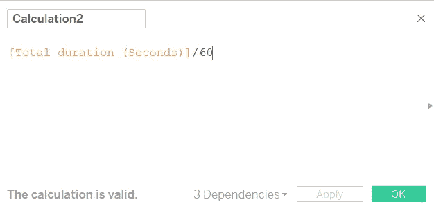

**链接文件和改变数据类型**

我首先在 Tableau 工作区中连接了“2017 年美好骑行历史”数据库，然后将天气数据加入其中。因为日期字段在两个数据库中是通用的，所以我决定使用日期作为“键”来连接它们。在旅行历史数据库中有两种日期——“开始日期”和“结束日期”；我们并不真的需要他们两个。因此，我只考虑了与分析相关的“结束日期”。“结束日期”是“日期时间”格式，而天气数据中的“日期”字段是数据格式。如果两个不同数据类型的字段连接在一起，Tableau 将引发错误。因此，我将结束日期字段的格式从“datetime”更改为“date ”,并使用关键字“date”连接两个数据库。

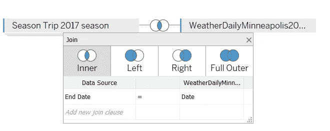

在“日期”键上连接两个数据库

下面是连接表的屏幕截图

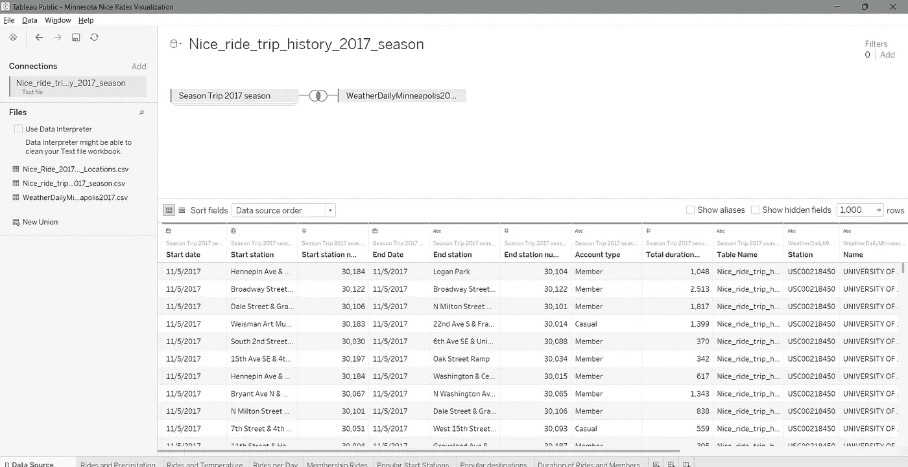

**数据可视化和挖掘趋势**

我探索了数据中的几个趋势，例如最高温度如何影响乘车次数，一周中的哪一天我们看到最多的乘车次数，临时乘车者和通勤者乘车的持续时间，等等。我将所有的分析整合到一个仪表盘中，可以在这里查看。

1.  乘坐和降水

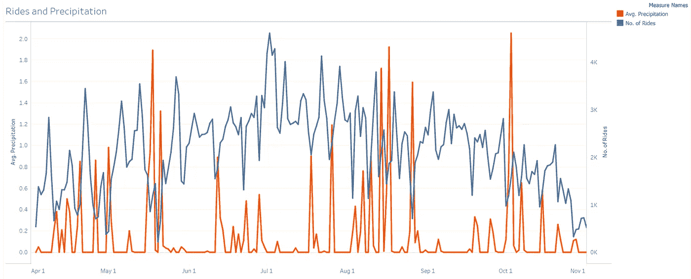

2.乘坐和温度

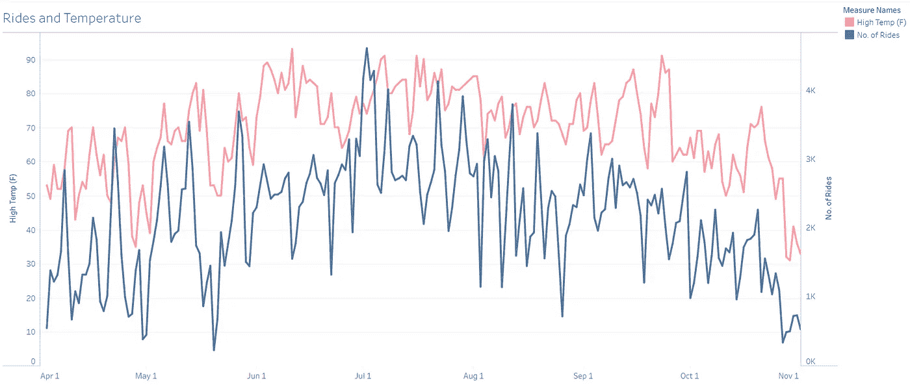

3.每天乘车次数

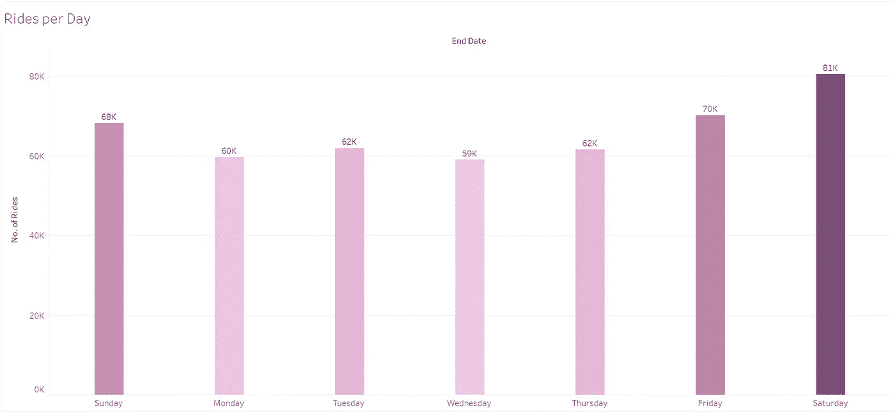

4.会员乘车

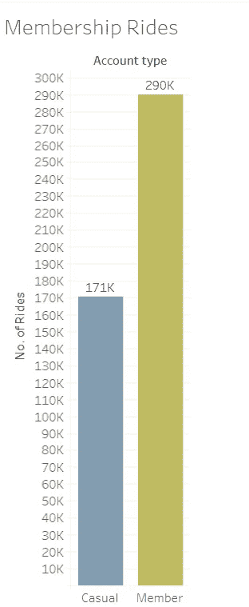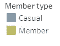

5.热门起点站

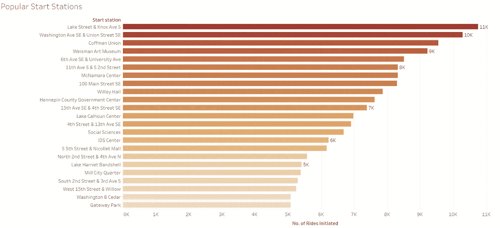

6.热门目的地

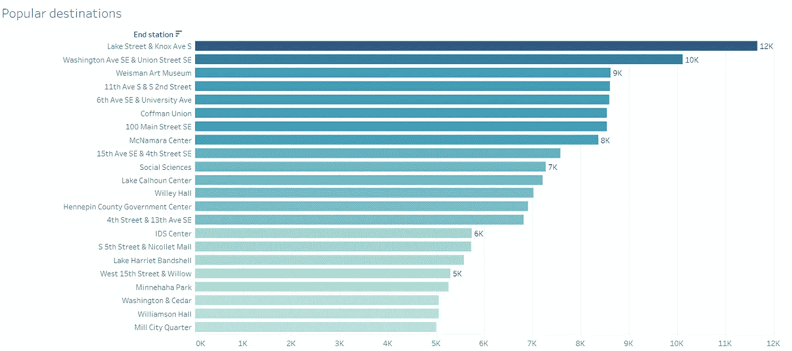

7.游乐设施和成员的持续时间

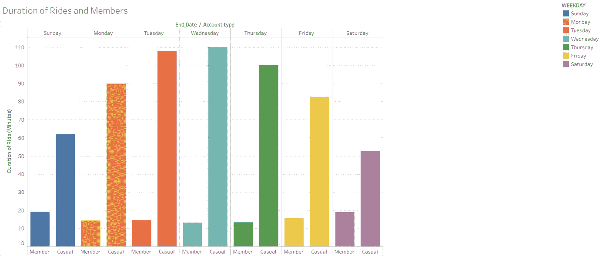

**有趣的发现**

现在让我们来看看这些可视化告诉我们什么故事。前两个双轴图表显示，降雨量(雨天)越高，这些天的乘客量越低。此外，最高气温会影响气温突破天花板的日子里的乘车次数。

我猜想周末的某一天将会是大多数游乐设施发生的时间。而且我发现周六恰好是那一天也不奇怪！

在 2017 赛季期间休闲骑手和会员的骑行次数中，似乎会员的骑行次数最多。

大约有 11，000 次乘车似乎是从莱克街&诺克斯大道南站开始的，12，000 次乘车似乎也在那里终止；使它成为最受欢迎的乘车站。我的解释是，大多数乘坐尼斯之旅的成员都住在那个地区，因此，大多数乘坐者都是往返于家和工作地点的通勤者。在明尼苏达大学地区，像科夫曼纪念馆、麦克纳马拉中心、社会科学和威利大厅这样的地方似乎很受欢迎。

就休闲骑手和会员的平均骑行时间而言，数据显示休闲骑手倾向于骑行更长时间。我的猜测是，休闲骑手倾向于花很多时间探索地方，因此，导致更长时间的骑行。

**结论**

在这篇文章中，我们使用 Tableau 并结合两个公开可用的数据集，发现了一些关于明尼阿波利斯市 Nice Rides 乘客量的有趣见解。Tableau 使得数据分析速度极快，结果也相当有见地。

感谢阅读！