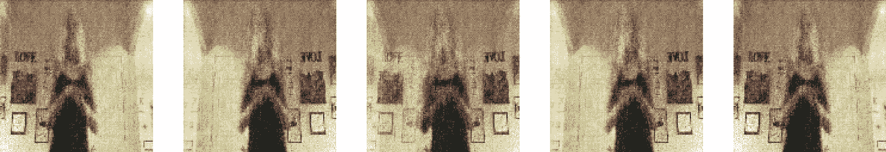

# 探索 Deepfake 检测挑战

> 原文：<https://medium.com/analytics-vidhya/exploring-the-deepfake-detection-challenge-e926488791f5?source=collection_archive---------8----------------------->

## 第 1 部分:视频帧的 GAN

你已经看过了詹妮弗·劳伦斯和史蒂夫·巴斯米的混音版本，以及乔丹·皮尔和 T2 的配音版本。也许你已经看过[最近的一集《国务卿夫人》](https://www.youtube.com/watch?v=9e7zUIBEjCg)，该集围绕着一个总统骗局展开。

今年秋天早些时候，脸书(与微软/人工智能合作伙伴)宣布了一项挑战将深度伪造视频与原创视频分开。Google [也发布了一个 deepfake 数据集](https://ai.googleblog.com/2019/09/contributing-data-to-deepfake-detection.html)，但是他们要求联系研究顾问，所以我没有继续。好的谷歌！

# deepfakes 的威胁模型是什么？

对 2020 年选举中 deepfakes 的担忧类似于“数字珍珠港”的警告，它说服了政治家们关注网络安全。对一些人来说，这是有用的。不幸的是，它忽略了深度造假和错误信息的当前受害者，而是专注于某一天即将到来的重大事件。最常见的 deepfakes 是针对女性的粗制滥造的视频。围绕 deepfakes 推出惊悚小说对这一点没什么作用:

 [## 编辑“深度造假”视频的不是男性政客，而是变成色情内容的女性

### 今天早上，鲍里斯·约翰逊的一段视频被上传到推特上。保守党领袖认真地投入到…

www.prospectmagazine.co.uk](https://www.prospectmagazine.co.uk/politics/its-not-male-politicians-who-edited-deepfake-videos-target-its-women-turned-into-pornography) 

另一方面，模因和主要媒体报道传播了意识。
民主党全国委员会主席在今年的 DefCon 上做了一个很深的赝品来展示[！](https://twitter.com/donie/status/1160198586514063366?lang=en)

我们公开分享的 deepfakes 关注的是政客和演员，他们更真实，因为我们有很多他们的参考视频。他们可能会利用*和*相似的脸型和身材*的熟练印象派画家*来兜售这种错觉。为了 [Deepfake 圆桌](https://www.youtube.com/watch?v=l_6Tumd8EQI&feature=youtu.be)(好感人！)他们请来了专业人士汤姆克鲁斯和乔什·汤普森，尽管他们在剪辑时会在脸上涂脂抹粉。所以不是交钥匙的事情。

如果你的造假没有说服力，另一种可能性是扭曲视频或录制屏幕——就像在虚构的国务卿夫人视频中看到的那样，或者沙龙最近报道的真实存在但也是伪造的特朗普视频(他们的文章不完全适合工作，但你可以谷歌一下)。

# 挑战中有哪些类型的视频？

我想我不能分享这些视频，所以我会描述一下。

组织者雇用了几名 gig 工作人员来记录他们回答问题的情况，这些问题包括技术、家庭作业、在家工作、“被冒犯”和僵尸。从不同的样本来看，似乎演员们被要求从不同的角度进行记录，室内和室外，有时在尴尬的灯光下，至少有一次是用移动的摄像机。

我观看的训练集视频包括不同性别、年龄、种族、发型和体型的演员。有穿耳洞的演员，成人背带，自拍杆。数据集自述说:

> 在这个预览数据集中，性别和种族的大致分布是 74%女性和 26%男性；以及 68%的白种人、20%的非裔美国人、9%的东亚人和 3%的南亚人

我可以看到脸书或 YouTube 用这个来标记普通视频上传中的变脸或深度伪造。我不确定这是不是将会发生的深层虚假战争。但是让我们深入研究一下:

# 我的工作计划

以下是我构建通用 DeepFake 分类器的计划:

1.  从一个视频中提取帧；使用 GAN 生成新帧，在此过程中创建一个良好的伪帧鉴别器
2.  只从视频中提取人脸；使用 GAN 生成新的帧
    **这花费了足够的精力，步骤 1 和 2 将是博客文章；敬请关注以后的帖子！**
3.  在一个演员和一个场景上训练分类器，比较原始和伪造人脸；使用像素注意力图来确认我们关注的是人脸(不幸的是，这并不能告诉我们哪张脸是“假的”)
4.  用多个演员的原脸和假脸构建一个分类器。避免把任何场景放在只有原创或只有虚假的背景中，因为会有对场景的偏见。对训练中未使用的场景和演员进行评估。
5.  使用 OpenCV 中的面部标志——我不确定我可能会在这里使用什么，但我想搜索真品和赝品之间的差异。

# 甘第一回合:全帧

OpenCV 使得从视频中获取帧变得很容易！
CoLab 可以安装到您的 Google Drive 上，整夜工作，无需重启，也不会忘记您的输出！([参见肖恩·普莱泽的可乐布戏法](https://colab.research.google.com/github/shawwn/colab-tricks/blob/master/ngrok-tricks.ipynb))

在多次失败后，我使用了[这个 Kaggle GAN 代码](https://www.kaggle.com/greg115/face-generator-dcgan-celebrities/notebook)，坚持代码原来的 128x128 尺寸，提取了 200 帧。在 Google CoLab 上的 30 个时代内，一个阴影开始出现(在后来的运行中，结果不是那么直接):

训练包括随机的左/右翻转，所以整体形象发生了变化。
我们经历了大约 100 个时期的尴尬着色阶段，损失测量值上下跳动。

早期时代

大约在公元 155 年，我们走出隧道，我可以看到一个镜像版本(我们右边的相框)和对面方方正正的回声。

公元 155 年

到了第 242 纪元，生成的帧更加清晰——我们可以阅读墙上的爱情海报。输出包括原始帧、镜像帧和对称帧。

纪元 242 年

主要缺失的细节是脸部。200 多个时代后，脸部填充得更多，但分辨率仍然很低。

# GAN 第二轮:用 OpenCV 隔离人脸

我试着用 OpenCV 提取一个以主体面部为中心的正方形(360x360px)。我们无法在每一帧中检测到人脸(例如，如果主体的手从人脸和相机之间穿过)，并且不是每个检测都是正确的。但在这个视频中，我们通常会得到正确的帧裁剪:

通过 Deepfake 检测挑战的原始股票视频作物。由模特摆姿势。

这种方法的优点:OpenCV 在寻找和集中主体面部方面做得很好。我们不需要检测 deepfake 的每一个帧；我们只需要一些可疑的帧来标记它。缺点:通过使用 OpenCV，我们冒着逆向工程 OpenCV 的中心人脸概念的风险，而不是提取真实人脸的特征。一个坚定的 deepfaker 可以在帧中插入人脸来混淆检测算法。

在一些错误的开始之后，GAN 能够生成一些可识别的面孔

纪元 264…训练进行到一半

公元 401 年…我们在这里看到一张假面

随着时间的推移，我意识到 GAN 不仅试图复制人脸，还试图复制 OpenCV 错误识别的房间的其他部分。结果这覆盖了三分之一的帧，影响了发生器的所有输出。我手动删除这些，并重新启动笔记本电脑。

# 甘第三轮:更人性化

马上，我对生成的面孔感觉好多了:

边缘，只有 50 个时代

231 个纪元…我觉得除此之外没有更好的改进了

# 包装甘斯

说到底，我没有生成一个令人信服的副本或高分辨率副本来匹配原件，所以你可能会想这是否成功。事实很复杂——如果我们想让计算机视觉检测出人不能检测的深度假货，我们不能指望它的视觉和我们的一样。

我想在我的下一篇文章中制作一个分类器，如果它不能区分原始帧和伪帧，我会重用这个 OpenCV 代码来关注人脸。