# 探索年龄和性别对冠状病毒恢复的影响

> 原文：<https://medium.com/analytics-vidhya/exploring-the-impact-of-age-and-gender-on-recovery-from-corona-virus-2c105d3c4483?source=collection_archive---------19----------------------->

# 来自数据的流行见解

一组冠状病毒的数据被发布在 kaggle 上。你可以从[这里](https://www.kaggle.com/kimjihoo/coronavirusdataset/)下载。

```
df_patient = pd.read_csv(“//Users//maheshsai//Desktop//patient.csv”)df_patient.head()
```

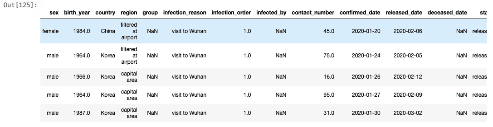

这个数据集中记录了许多有用的信息。我主要关注性别和年龄的作用。

作为预处理的一部分，出生日期中的 NA 值用零填充。

数据集中直接提到了性别。年龄从出生日期开始计算。为了观察年龄的影响，最好将年龄分组，也就是说，如果年龄是 25 岁，那么将其归入 20-29 岁年龄组。这样做的代码是

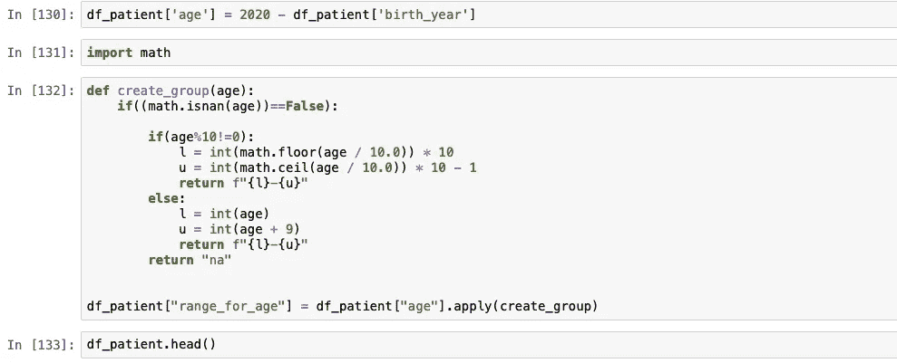

我们已经在数据集中确认了日期、发布日期和死亡日期。所以，让我们从数据中挖掘信息。

我计算了观察结果所需的时间，即自感染后死亡的时间和自感染后恢复的时间。

> 观察到的最长恢复时间为 32 天。
> 
> 此外，观察到的最长死亡时间为 8 天。

当这个数据集发布时，大多数人被发现是孤立的。只有少数人死亡和康复。

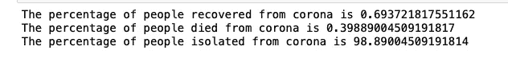

现在来看看不同年龄组的独立案例

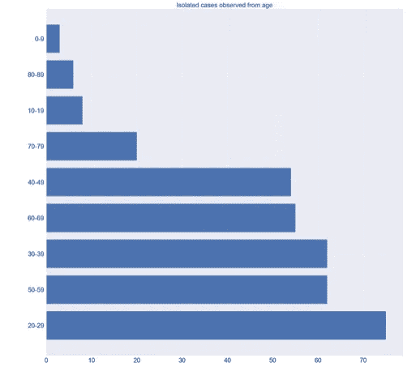

> 20 至 29 岁的人大多处于隔离状态(接受治疗)

让我们也分析一下性别和年龄组的数据

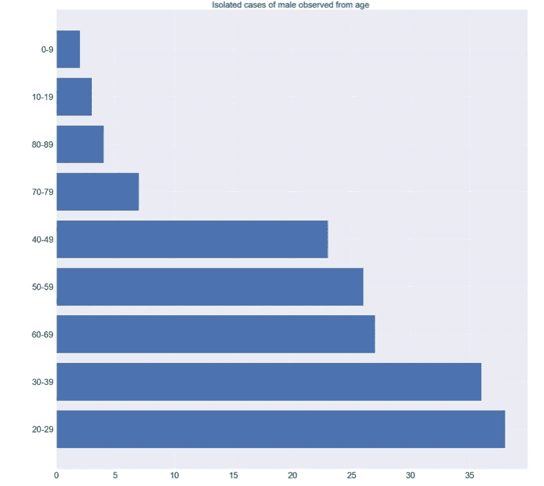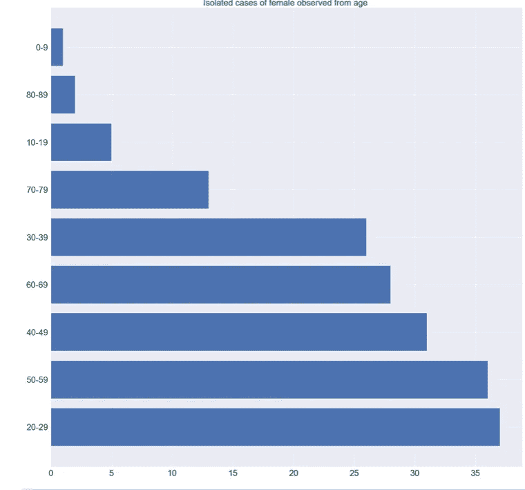

> 20 至 29 岁的男性和女性大多处于隔离状态

同样，我们将看看死亡案例

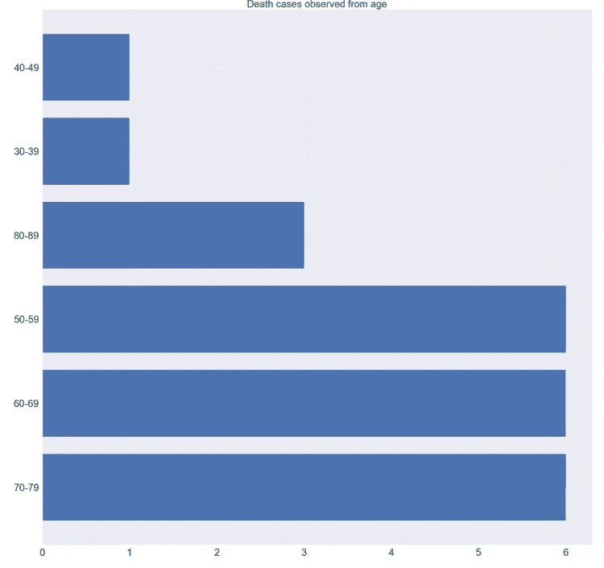

> 大多数年龄在 50 到 80 岁之间的人都死了。一些消息来源称，原因可能是免疫力较低。

让我们也分析一下性别和年龄组的数据

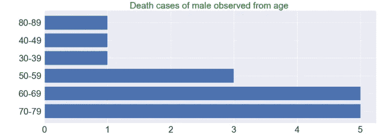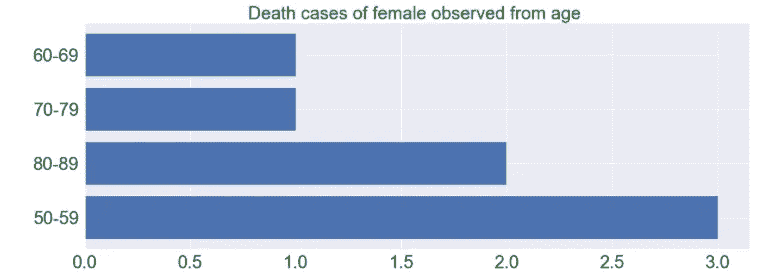

数据的另一个有趣属性是受影响的原因。让我们看看原因和受影响人数之间的关系

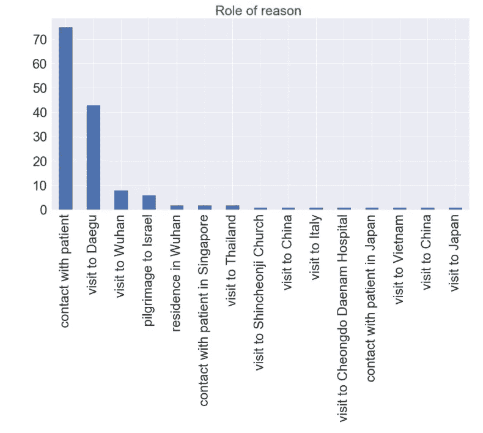

> 受感染的主要原因是与受感染的人接触。所以请注意这一点。

最后，我们将通过查看相关矩阵得出结论

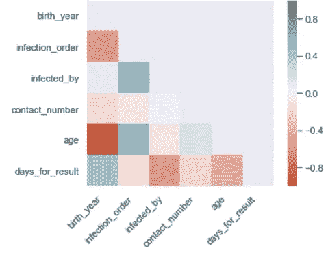

> 出生年份与结果的日期关系更大，即年龄在康复或死亡中起关键作用。

# 结论

虽然这个数据集只适用于一个国家——韩国，而且有很多不足之处，但是这个数据的出现让我们可以得到以前没有答案的问题的答案。我们试图回答诸如**“谁被感染了？”、“这些人是怎么被感染的？”、“疗程需要多长时间？”。**你可以在这里访问我在[用过的代码。为了提供更好的服务，我也发了一个帖子来预测第二天将会收到的病例数量，并且也证明了病毒不会通过空气传播。你可以在这里阅读](https://github.com/maheshsai252/corona-2)。

感谢阅读..)