# 探索加拿大多伦多的街区。

> 原文：<https://medium.com/analytics-vidhya/exploring-the-neighborhoods-in-toronto-canada-925ff4ffbf71?source=collection_archive---------19----------------------->

**简介**

作为 IBM 数据科学专业计划 Capstone 项目的一部分，我在真实数据集上工作，以体验数据科学家在现实生活中的经历。这个项目的主要目标是定义一个商业问题，在网上寻找数据，并使用 Foursquare 位置数据来比较多伦多的不同社区，以找出哪个社区适合开办新的餐馆业务。在这个项目中，我们将遵循一步一步的方法来获得结果。

**问题描述**

考虑这样一种情况，一个人想开一家新的印度餐馆。这个人是印度裔加拿大人，住在加拿大人口最稠密的城市多伦多。所以他心里有些怀疑开餐馆是不是个好主意。如果他应该在哪个街区开他的新餐馆是个好主意，这样对他来说应该有利可图。

**好处**

有不同的人将从这个项目中受益。

想在附近开一家新餐馆的商人。

想搬到拥有丰富印度餐馆和文化的街区的印度人。

数据分析师/数据科学家，使用统计和探索性数据分析来分析社区。

**数据采集**

我出于不同的目的从不同的来源收集数据。

1.加拿大邮政编码列表:-

我从维基百科上找到了加拿大各街区的邮政编码。

链接—[https://en . Wikipedia . org/wiki/List _ of _ postal _ codes _ of _ Canada:_ M](https://en.wikipedia.org/wiki/List_of_postal_codes_of_Canada:_M)

2.地理坐标:-

我使用了一个 CVS 文件，其中包含了加拿大邻近地区的经度和纬度。

我们可以使用 geocoder 来达到同样的目的，但是它有时并不持久。所以我选择 CVS 文件，而不是使用 geocoder。

简历链接—[http://cocl.us/Geospatial_data](https://cocl.us/Geospatial_data)

3.获取场地的详细信息:

我使用 Foursquare API 获取场馆的详细信息和位置。

我用场地等级作为门槛。最后使用叶子可视化。

来自 four square API([https://developer.foursquare.com/docs](https://developer.foursquare.com/docs))，

我为每个地点检索了以下内容:

a)名称:场地名称。

b)类别:API 定义的类别类型。

c)纬度:场地的纬度值。

d)经度:场地的经度值。

e)喜欢:喜欢场所，即用户喜欢餐馆。

f)评级:对场馆的评级。

g)提示:用户给出的提示。

**数据清理**

**清理邮政编码数据**

数据框将由三列组成:邮政编码、区和街区

仅处理具有指定区的单元格。忽略没有分配**行政区的单元格。**

一个邮政编码区可以有多个邻居。例如，在维基百科页面的表格中，你会注意到 **M5A** 被列出了两次，并且有两个邻居: **Harbourfront** 和 **Regent Park** 。这两行将合并成一行，相邻行用逗号分隔，如上表中的**行 11** 所示。

如果像元有一个区，但没有分配**邻域，那么邻域将与区相同。**

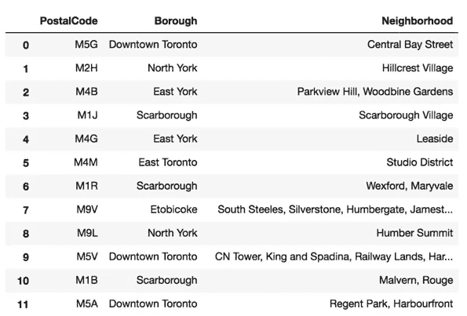

加拿大邮政编码数据框架。

**添加地理坐标**

为此，我将使用一个 CVS 文件，其中包含加拿大邻近地区的经度和纬度。

csv 链接—[http://cocl.us/Geospatial_data](https://cocl.us/Geospatial_data)

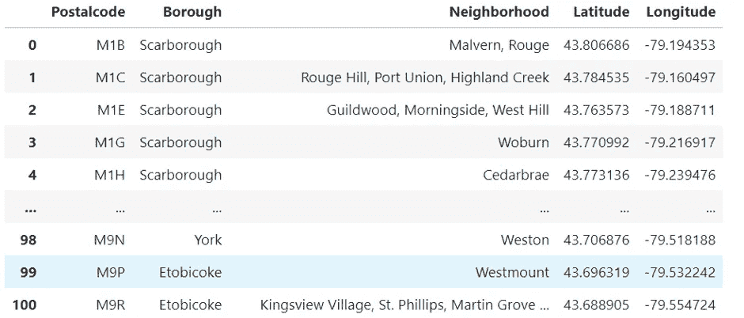

邻近地区的纬度和经度

现在，我们将只与包含多伦多的行政区合作

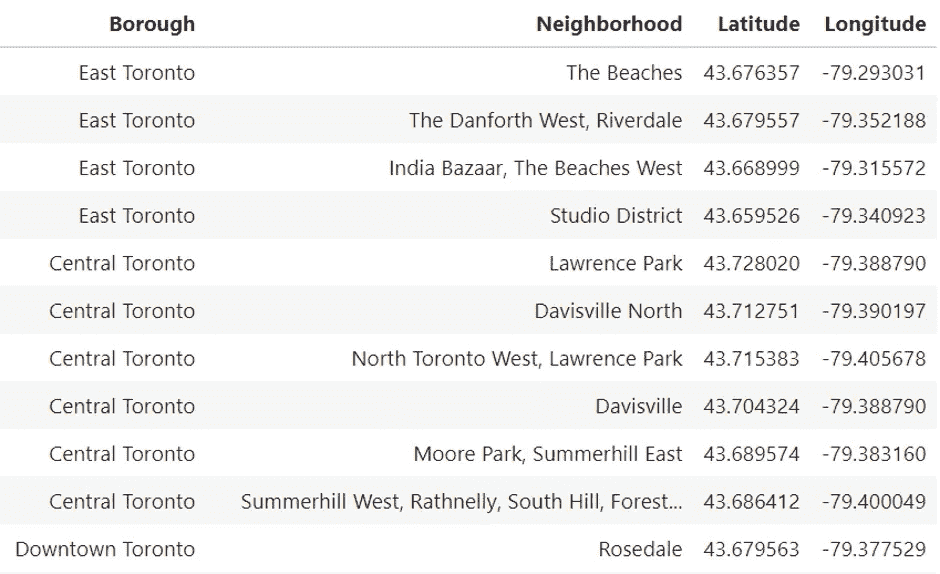

仅包含多伦多行政区的数据帧

多伦多的印度餐馆

现在把多伦多所有的印度餐馆都找出来

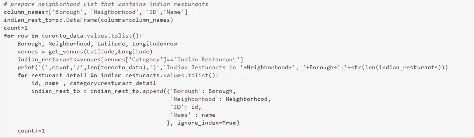

代码片段

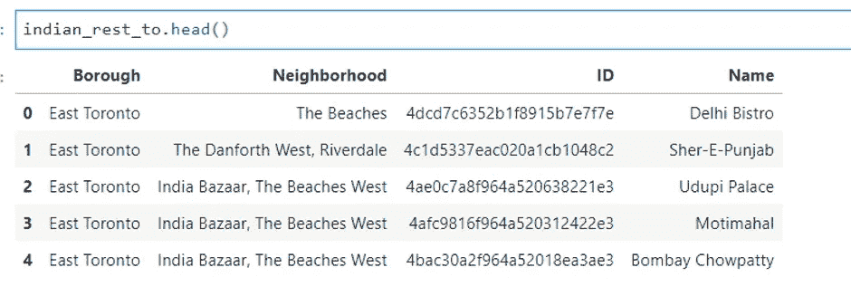

多伦多的印度餐馆

**探索性分析**

让我们分析一下每个区有多少家印度餐馆。

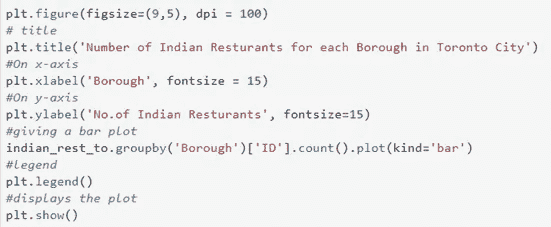

代码片段

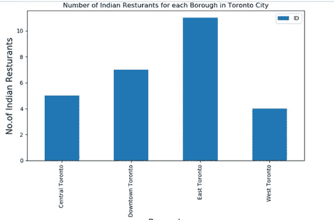

多伦多每个区的印度餐馆数量。

让我们也分析一下每个街区有多少家印度餐馆。

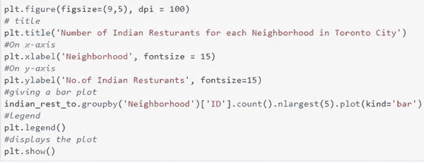

代码片段

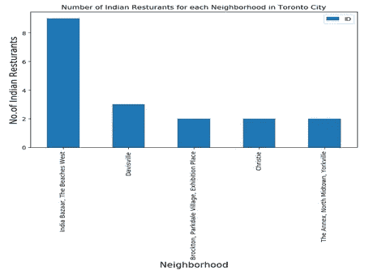

*图~多伦多各街区的印度餐馆数量*

**使用 Foursquare API 获取餐厅的评分、喜欢和提示**

使用 Foursquare API 获取餐厅的评级、喜欢和提示

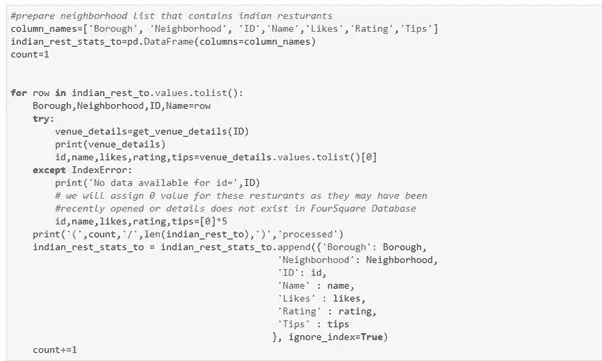

代码片段

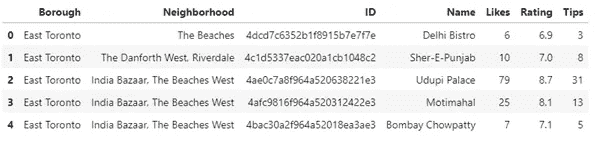

*数据框~餐厅的评分、小费和喜好*

**平均评级**

获取特定社区中餐馆的平均评级

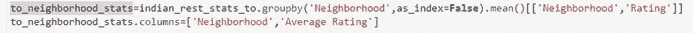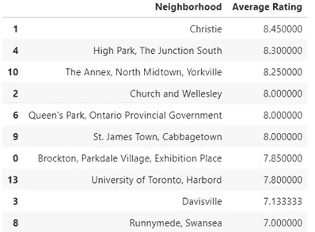

*数据框餐厅平均评分*

现在我们有了最佳餐厅的名单，

**结论**

以下是开印度餐馆的最佳街区

克里斯蒂，高公园，南路口，附件，北中城，约克维尔，教堂和韦尔斯利，女王公园，安大略省政府，圣詹姆斯镇，白菜镇。

**限制**

1.结果很大程度上取决于餐馆的评级。

2.评级准确度高度依赖于 Foursquare API。

我的 GitHub 存储库:-

 [## siddhrajm/加拿大多伦多的印度餐馆

### 在这个资源库中，我们将探索多伦多的街区，以便在多伦多开设一家印度餐馆。…

github.com](https://github.com/siddhrajm/Indian-Restaurants-in-Toronto-Canada)